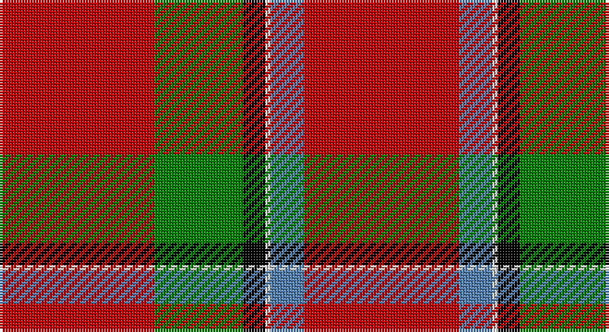

This page is one **sett** — a single exact thread-count. It belongs to the [tartan](/setts/r28g16k4w1t6r28/)
(the same proportion at any scale), whose colour order is pattern [RBWKGR](/stripes/rbwkgr/).

Part of the [Sinclair](/tartans/sinclair/) tartan — the named design grouping this sett with its other cloths.

Sourced from weddslist.  It is a [6 stripe tartan](/stripes/stripes6/).

Original link http://www.weddslist.com/cgi-bin/tartans/pg.pl?source=sts

## Also known as

This cloth is also recorded under:

- Sinclair Green
- Sinclair, Green

## Thread count
R/56 G32 K8 LN2 B12 R/56

One full sett is **220 threads**.

## Palette

Palette: <strong>Tartan Register</strong> <small style="color:#888">(2 of 5 colours)</small>
<table><thead><tr><th>Colour</th><th>Threads</th><th>Shade</th><th>Base</th><th>OKLCh</th></tr></thead><tbody><tr><td>R/</td><td style="text-align:right;font-variant-numeric:tabular-nums">56</td><td><code style="background-color:#C00000;">#C00000</code> <small style="color:#888">#C00000</small></td><td>R <code style="background-color:#CC0000;">#CC0000</code></td><td><small style="color:#888">oklch(50.7% 0.208 29.2)</small></td></tr><tr><td>G</td><td style="text-align:right;font-variant-numeric:tabular-nums">32</td><td><code style="background-color:#008000;">#008000</code> <small style="color:#888">#008000</small></td><td>G <code style="background-color:#006100;">#006100</code></td><td><small style="color:#888">oklch(52.0% 0.177 142.5)</small></td></tr><tr><td>K</td><td style="text-align:right;font-variant-numeric:tabular-nums">8</td><td><code style="background-color:#000000;">#000000</code> <small style="color:#888">#000000</small></td><td>K <code style="background-color:#000000;">#000000</code></td><td><small style="color:#888">oklch(0.0% 0.000 0.0)</small></td></tr><tr><td>LN</td><td style="text-align:right;font-variant-numeric:tabular-nums">2</td><td><code style="background-color:#E0E0E0;">#E0E0E0</code> <small style="color:#888">#E0E0E0</small></td><td>W <code style="background-color:#F7F7F7;">#F7F7F7</code></td><td><small style="color:#888">oklch(90.7% 0.000 89.9)</small></td></tr><tr><td>B</td><td style="text-align:right;font-variant-numeric:tabular-nums">12</td><td><code style="background-color:#5480B0;">#5480B0</code> <small style="color:#888">#5480B0</small></td><td>B <code style="background-color:#2A418A;">#2A418A</code></td><td><small style="color:#888">oklch(58.8% 0.089 251.5)</small></td></tr><tr><td>R/</td><td style="text-align:right;font-variant-numeric:tabular-nums">56</td><td><code style="background-color:#C00000;">#C00000</code> <small style="color:#888">#C00000</small></td><td>R <code style="background-color:#CC0000;">#CC0000</code></td><td><small style="color:#888">oklch(50.7% 0.208 29.2)</small></td></tr></tbody></table>

# Sample pattern

## Compared to the master

This cloth is one sett of its design; the master sett (the exemplar the design is anchored on) is below for comparison.

<figure style="margin:0"><figcaption style="color:#888;font-size:smaller">this sett</figcaption></figure>
<figure style="margin:0"><figcaption style="color:#888;font-size:smaller"><a href="/setts/r28g16k4w1db6r28/">master sett →</a></figcaption></figure>

## Nearest tartans

The nearest existing variants by ΔTartan distance, with this tartan at the top so the swatches line up against it.

ΔTartan

Tartan

Sett

—

<a href="/ttd/edit/#slug=r28g16k4w1t6r28~x2">Sinclair</a> <a class="nn-out" href="/variants/s6/r28g16k4w1t6r28~x2/" title="open its dictionary page">↗</a>

0.45

<a href="/ttd/edit/#slug=r28g16k4w1db6r28~x2&amp;base=r28g16k4w1t6r28~x2">Sinclair (Logan)</a> <a class="nn-out" href="/variants/s6/r28g16k4w1db6r28~x2/" title="open its dictionary page">↗</a>

0.86

<a href="/ttd/edit/#slug=g15k10r30dp2r20w1~x2&amp;base=r28g16k4w1t6r28~x2">Kinnaird (Name)</a> <a class="nn-out" href="/variants/s6/g15k10r30dp2r20w1~x2/" title="open its dictionary page">↗</a>

0.91

<a href="/ttd/edit/#slug=r28dg16k4lr1b6r28~x2&amp;base=r28g16k4w1t6r28~x2">Sinclair Dress</a> <a class="nn-out" href="/variants/s6/r28dg16k4lr1b6r28~x2/" title="open its dictionary page">↗</a>

0.91

<a href="/ttd/edit/#slug=r28dg16k4lr1b6r28&amp;base=r28g16k4w1t6r28~x2">Sinclair Dress</a> <a class="nn-out" href="/variants/s6/r28dg16k4lr1b6r28/" title="open its dictionary page">↗</a>

0.94

<a href="/ttd/edit/#slug=r36t8w1k5g20r18~x4&amp;base=r28g16k4w1t6r28~x2">Sinclair</a> <a class="nn-out" href="/variants/s6/r36t8w1k5g20r18~x4/" title="open its dictionary page">↗</a>

1.05

<a href="/ttd/edit/#slug=r30g12k5w2t6r30&amp;base=r28g16k4w1t6r28~x2">Sinclair</a> <a class="nn-out" href="/variants/s6/r30g12k5w2t6r30/" title="open its dictionary page">↗</a>

1.30

<a href="/ttd/edit/#slug=k1r18dg12r2dg12r18w1~x2&amp;base=r28g16k4w1t6r28~x2">MacKinnon #4</a> <a class="nn-out" href="/variants/s7/k1r18dg12r2dg12r18w1~x2/" title="open its dictionary page">↗</a>

1.30

<a href="/ttd/edit/#slug=r30dg12k5lr2b6r30~x2&amp;base=r28g16k4w1t6r28~x2">Sinclair</a> <a class="nn-out" href="/variants/s6/r30dg12k5lr2b6r30~x2/" title="open its dictionary page">↗</a>

1.30

<a href="/ttd/edit/#slug=r30dg12k5lr2b6r30&amp;base=r28g16k4w1t6r28~x2">Sinclair</a> <a class="nn-out" href="/variants/s6/r30dg12k5lr2b6r30/" title="open its dictionary page">↗</a>

1.31

<a href="/ttd/edit/#slug=r60k2w3dg20r10dg20~x2&amp;base=r28g16k4w1t6r28~x2">Greig (Personal)</a> <a class="nn-out" href="/variants/s6/r60k2w3dg20r10dg20~x2/" title="open its dictionary page">↗</a>

## Neighbour map

Every grey dot is one of 14360 variants placed by the first two principal components of the ΔTartan feature space (44% of its variance). Red is this tartan; blue dots are its nearest — click one to open its page.

<svg viewBox="0 0 640 380" role="img" style="max-width:100%;height:auto;border:1px solid #e0e0e0;border-radius:4px;display:block" xmlns="http://www.w3.org/2000/svg"><image href="/nn/cloud.v1.png" width="640" height="380"/><a href="/variants/s6/r28g16k4w1db6r28~x2/"><circle cx="414.6" cy="156.7" r="4" fill="#3465a4"><title>Sinclair (Logan)</title></circle></a><a href="/variants/s6/g15k10r30dp2r20w1~x2/"><circle cx="396.3" cy="162.0" r="4" fill="#3465a4"><title>Kinnaird (Name)</title></circle></a><a href="/variants/s6/r28dg16k4lr1b6r28~x2/"><circle cx="422.9" cy="165.9" r="4" fill="#3465a4"><title>Sinclair Dress</title></circle></a><a href="/variants/s6/r28dg16k4lr1b6r28/"><circle cx="422.9" cy="165.9" r="4" fill="#3465a4"><title>Sinclair Dress</title></circle></a><a href="/variants/s6/r36t8w1k5g20r18~x4/"><circle cx="378.8" cy="147.7" r="4" fill="#3465a4"><title>Sinclair</title></circle></a><a href="/variants/s6/r30g12k5w2t6r30/"><circle cx="399.3" cy="169.7" r="4" fill="#3465a4"><title>Sinclair</title></circle></a><a href="/variants/s7/k1r18dg12r2dg12r18w1~x2/"><circle cx="372.7" cy="180.0" r="4" fill="#3465a4"><title>MacKinnon #4</title></circle></a><a href="/variants/s6/r30dg12k5lr2b6r30~x2/"><circle cx="418.5" cy="183.1" r="4" fill="#3465a4"><title>Sinclair</title></circle></a><a href="/variants/s6/r30dg12k5lr2b6r30/"><circle cx="418.5" cy="183.1" r="4" fill="#3465a4"><title>Sinclair</title></circle></a><a href="/variants/s6/r60k2w3dg20r10dg20~x2/"><circle cx="418.3" cy="151.3" r="4" fill="#3465a4"><title>Greig (Personal)</title></circle></a><circle cx="402.5" cy="152.1" r="5" fill="#c00000"/></svg>

ID: /variants/s6/r28g16k4w1t6r28~x2/
