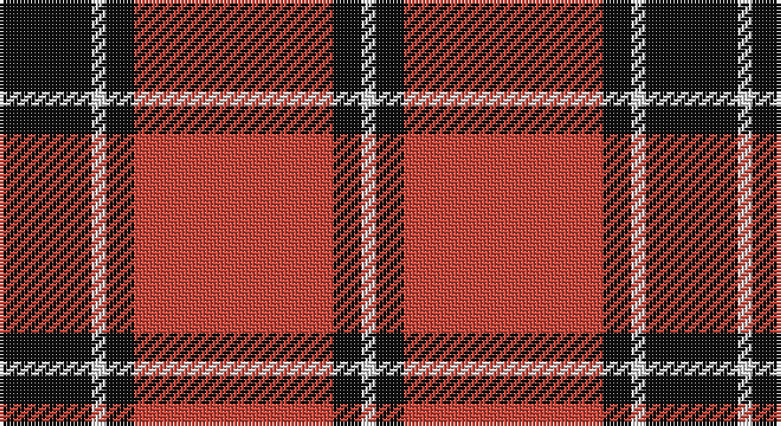

This page is one **sett** — a single exact thread-count. It belongs to the [tartan](/setts/r28k4w2k13/)
(the same proportion at any scale), whose colour order is pattern [KWKRKW](/stripes/kwkrkw/).

Part of the [Dunbar](/tartans/dunbar/) tartan — the named design grouping this sett with its other cloths.

Sourced from register-of-tartans.  It is a [6 stripe tartan](/stripes/stripes6/).

Original link https://www.tartanregister.gov.uk/tartanDetails.aspx?ref=1016

## Also known as

This cloth is also recorded under:

- Dunbar #2
- Dunbar Ancient
- Dunbar Plaid
- Dunbar, Plaid

## Register references

External register numbers recorded for this tartan.

- Scottish Register of Tartans: [1016](https://www.tartanregister.gov.uk/tartanDetails.aspx?ref=1016)
- Scottish Tartans Authority (ITI): 1236
- Scottish Tartans World Register: 1236

## Thread count
K/26 LN4 K8 R56 K8 LN/4

One full sett is **182 threads**.

## Palette

Palette: <strong>Tartan Register</strong> <small style="color:#888">(2 of 3 colours)</small>
<table><thead><tr><th>Colour</th><th>Threads</th><th>Shade</th><th>Base</th><th>OKLCh</th></tr></thead><tbody><tr><td>K/</td><td style="text-align:right;font-variant-numeric:tabular-nums">26</td><td><code style="background-color:#101010;">#101010</code> <small style="color:#888">#101010</small></td><td>K <code style="background-color:#000000;">#000000</code></td><td><small style="color:#888">oklch(17.3% 0.000 89.9)</small></td></tr><tr><td>LN</td><td style="text-align:right;font-variant-numeric:tabular-nums">4</td><td><code style="background-color:#E0E0E0;">#E0E0E0</code> <small style="color:#888">#E0E0E0</small></td><td>W <code style="background-color:#F7F7F7;">#F7F7F7</code></td><td><small style="color:#888">oklch(90.7% 0.000 89.9)</small></td></tr><tr><td>K</td><td style="text-align:right;font-variant-numeric:tabular-nums">8</td><td><code style="background-color:#101010;">#101010</code> <small style="color:#888">#101010</small></td><td>K <code style="background-color:#000000;">#000000</code></td><td><small style="color:#888">oklch(17.3% 0.000 89.9)</small></td></tr><tr><td>R</td><td style="text-align:right;font-variant-numeric:tabular-nums">56</td><td><code style="background-color:#CC4438;">#CC4438</code> <small style="color:#888">#CC4438</small></td><td>R <code style="background-color:#CC0000;">#CC0000</code></td><td><small style="color:#888">oklch(57.7% 0.174 28.7)</small></td></tr><tr><td>K</td><td style="text-align:right;font-variant-numeric:tabular-nums">8</td><td><code style="background-color:#101010;">#101010</code> <small style="color:#888">#101010</small></td><td>K <code style="background-color:#000000;">#000000</code></td><td><small style="color:#888">oklch(17.3% 0.000 89.9)</small></td></tr><tr><td>LN/</td><td style="text-align:right;font-variant-numeric:tabular-nums">4</td><td><code style="background-color:#E0E0E0;">#E0E0E0</code> <small style="color:#888">#E0E0E0</small></td><td>W <code style="background-color:#F7F7F7;">#F7F7F7</code></td><td><small style="color:#888">oklch(90.7% 0.000 89.9)</small></td></tr></tbody></table>

# Sample pattern

## Nearest tartans

The nearest existing variants by ΔTartan distance, with this tartan at the top so the swatches line up against it.

ΔTartan

Tartan

Sett

—

<a href="/ttd/edit/#slug=r28k4w2k13~x2">Dunbar Ancient</a> <a class="nn-out" href="/variants/s6/r28k4w2k13~x2/" title="open its dictionary page">↗</a>

0.80

<a href="/ttd/edit/#slug=k4r33k24w3k4r3~x2&amp;base=r28k4w2k13~x2">Monmouth College</a> <a class="nn-out" href="/variants/s6/k4r33k24w3k4r3~x2/" title="open its dictionary page">↗</a>

0.90

<a href="/ttd/edit/#slug=k3r2k30r28k2r2w3~x2&amp;base=r28k4w2k13~x2">Cunningham #2</a> <a class="nn-out" href="/variants/s7/k3r2k30r28k2r2w3~x2/" title="open its dictionary page">↗</a>

0.97

<a href="/ttd/edit/#slug=k16r2k2r12w1~x2&amp;base=r28k4w2k13~x2">MacIver</a> <a class="nn-out" href="/variants/s5/k16r2k2r12w1~x2/" title="open its dictionary page">↗</a>

1.15

<a href="/ttd/edit/#slug=w6k2w2k31r41k2r2k4~x2&amp;base=r28k4w2k13~x2">University of Nebraska Alumni Association</a> <a class="nn-out" href="/variants/s8/w6k2w2k31r41k2r2k4~x2/" title="open its dictionary page">↗</a>

1.16

<a href="/ttd/edit/#slug=r20k2r2k15w1~x2&amp;base=r28k4w2k13~x2">Masai Shuka 15 (Artefact)</a> <a class="nn-out" href="/variants/s5/r20k2r2k15w1~x2/" title="open its dictionary page">↗</a>

1.18

<a href="/ttd/edit/#slug=k4r26k4w2k13ly4~x2&amp;base=r28k4w2k13~x2">Dunbar #2</a> <a class="nn-out" href="/variants/s6/k4r26k4w2k13ly4~x2/" title="open its dictionary page">↗</a>

1.19

<a href="/ttd/edit/#slug=k2r16k8ly1k8r2~x4&amp;base=r28k4w2k13~x2">Brodie (Clan)</a> <a class="nn-out" href="/variants/s6/k2r16k8ly1k8r2~x4/" title="open its dictionary page">↗</a>

1.19

<a href="/ttd/edit/#slug=r5m2r30k28w2k4~x2&amp;base=r28k4w2k13~x2">Ramsay Red Clan Tartan</a> <a class="nn-out" href="/variants/s6/r5m2r30k28w2k4~x2/" title="open its dictionary page">↗</a>

1.20

<a href="/ttd/edit/#slug=do44lr3do4lb3do4lr44~x2&amp;base=r28k4w2k13~x2">Wcwm 1166-2</a> <a class="nn-out" href="/variants/s6/do44lr3do4lb3do4lr44~x2/" title="open its dictionary page">↗</a>

1.23

<a href="/ttd/edit/#slug=r42k2w2k18w2k5~x2&amp;base=r28k4w2k13~x2">Forget Family (Red)</a> <a class="nn-out" href="/variants/s6/r42k2w2k18w2k5~x2/" title="open its dictionary page">↗</a>

## Neighbour map

Every grey dot is one of 14360 variants placed by the first two principal components of the ΔTartan feature space (44% of its variance). Red is this tartan; blue dots are its nearest — click one to open its page.

<svg viewBox="0 0 640 380" role="img" style="max-width:100%;height:auto;border:1px solid #e0e0e0;border-radius:4px;display:block" xmlns="http://www.w3.org/2000/svg"><image href="/nn/cloud.v1.png" width="640" height="380"/><a href="/variants/s6/k4r33k24w3k4r3~x2/"><circle cx="334.4" cy="194.5" r="4" fill="#3465a4"><title>Monmouth College</title></circle></a><a href="/variants/s7/k3r2k30r28k2r2w3~x2/"><circle cx="349.9" cy="167.6" r="4" fill="#3465a4"><title>Cunningham #2</title></circle></a><a href="/variants/s5/k16r2k2r12w1~x2/"><circle cx="359.3" cy="196.1" r="4" fill="#3465a4"><title>MacIver</title></circle></a><a href="/variants/s8/w6k2w2k31r41k2r2k4~x2/"><circle cx="334.7" cy="138.2" r="4" fill="#3465a4"><title>University of Nebraska Alumni Association</title></circle></a><a href="/variants/s5/r20k2r2k15w1~x2/"><circle cx="385.2" cy="184.7" r="4" fill="#3465a4"><title>Masai Shuka 15 (Artefact)</title></circle></a><a href="/variants/s6/k4r26k4w2k13ly4~x2/"><circle cx="280.3" cy="166.4" r="4" fill="#3465a4"><title>Dunbar #2</title></circle></a><a href="/variants/s6/k2r16k8ly1k8r2~x4/"><circle cx="340.2" cy="199.5" r="4" fill="#3465a4"><title>Brodie (Clan)</title></circle></a><a href="/variants/s6/r5m2r30k28w2k4~x2/"><circle cx="324.6" cy="169.5" r="4" fill="#3465a4"><title>Ramsay Red Clan Tartan</title></circle></a><a href="/variants/s6/do44lr3do4lb3do4lr44~x2/"><circle cx="345.3" cy="179.5" r="4" fill="#3465a4"><title>Wcwm 1166-2</title></circle></a><a href="/variants/s6/r42k2w2k18w2k5~x2/"><circle cx="400.0" cy="151.5" r="4" fill="#3465a4"><title>Forget Family (Red)</title></circle></a><circle cx="333.3" cy="177.6" r="5" fill="#c00000"/></svg>

ID: /variants/s6/r28k4w2k13~x2/
