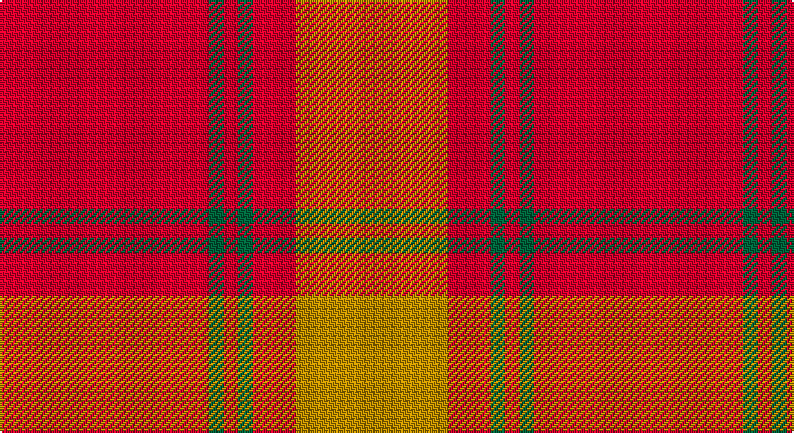

This page is one **sett** — a single exact thread-count. It belongs to the [tartan](/setts/r29g2r2g2r6lo21/)
(the same proportion at any scale), whose colour order is pattern [RGRGRY](/stripes/rgrgry/).

Sourced from tartans-authority.  It is a [6 stripe tartan](/stripes/stripes6/).

Original link http://www.tartansauthority.com/tartan-ferret/display/6812/

## Register references

External register numbers recorded for this tartan.

- Scottish Tartans Authority (ITI): 6812

## Thread count
R/116 G8 R8 G8 R24 DY/84

One full sett is **296 threads**.

## Palette

Palette: <strong>Tartan Register</strong> <small style="color:#888">(2 of 3 colours)</small>
<table><thead><tr><th>Colour</th><th>Threads</th><th>Shade</th><th>Base</th><th>OKLCh</th></tr></thead><tbody><tr><td>R/</td><td style="text-align:right;font-variant-numeric:tabular-nums">116</td><td><code style="background-color:#D0002C;">#D0002C</code> <small style="color:#888">#D0002C</small></td><td>R <code style="background-color:#CC0000;">#CC0000</code></td><td><small style="color:#888">oklch(54.1% 0.218 22.6)</small></td></tr><tr><td>G</td><td style="text-align:right;font-variant-numeric:tabular-nums">8</td><td><code style="background-color:#00643C;">#00643C</code> <small style="color:#888">#00643C</small></td><td>G <code style="background-color:#006100;">#006100</code></td><td><small style="color:#888">oklch(44.3% 0.104 157.7)</small></td></tr><tr><td>R</td><td style="text-align:right;font-variant-numeric:tabular-nums">8</td><td><code style="background-color:#D0002C;">#D0002C</code> <small style="color:#888">#D0002C</small></td><td>R <code style="background-color:#CC0000;">#CC0000</code></td><td><small style="color:#888">oklch(54.1% 0.218 22.6)</small></td></tr><tr><td>G</td><td style="text-align:right;font-variant-numeric:tabular-nums">8</td><td><code style="background-color:#00643C;">#00643C</code> <small style="color:#888">#00643C</small></td><td>G <code style="background-color:#006100;">#006100</code></td><td><small style="color:#888">oklch(44.3% 0.104 157.7)</small></td></tr><tr><td>R</td><td style="text-align:right;font-variant-numeric:tabular-nums">24</td><td><code style="background-color:#D0002C;">#D0002C</code> <small style="color:#888">#D0002C</small></td><td>R <code style="background-color:#CC0000;">#CC0000</code></td><td><small style="color:#888">oklch(54.1% 0.218 22.6)</small></td></tr><tr><td>DY/</td><td style="text-align:right;font-variant-numeric:tabular-nums">84</td><td><code style="background-color:#BC8C00;">#BC8C00</code> <small style="color:#888">#BC8C00</small></td><td>Y <code style="background-color:#F2BF00;">#F2BF00</code></td><td><small style="color:#888">oklch(66.8% 0.137 84.1)</small></td></tr></tbody></table>

# Sample pattern

## Nearest tartans

The nearest existing variants by ΔTartan distance, with this tartan at the top so the swatches line up against it.

ΔTartan

Tartan

Sett

—

<a href="/ttd/edit/#slug=r29g2r2g2r6lo21~x4">Maguire, Black (Name)</a> <a class="nn-out" href="/variants/s6/r29g2r2g2r6lo21~x4/" title="open its dictionary page">↗</a>

1.46

<a href="/ttd/edit/#slug=r58n12r5y28r7lo5~x2&amp;base=r29g2r2g2r6lo21~x4">Cairn O'Mount (Personal)</a> <a class="nn-out" href="/variants/s6/r58n12r5y28r7lo5~x2/" title="open its dictionary page">↗</a>

1.79

<a href="/ttd/edit/#slug=r37o9r3g9o3~x2&amp;base=r29g2r2g2r6lo21~x4">Glen Shee</a> <a class="nn-out" href="/variants/s5/r37o9r3g9o3~x2/" title="open its dictionary page">↗</a>

1.81

<a href="/ttd/edit/#slug=r3o10r3o4r20lb1~x4&amp;base=r29g2r2g2r6lo21~x4">Monica</a> <a class="nn-out" href="/variants/s6/r3o10r3o4r20lb1~x4/" title="open its dictionary page">↗</a>

1.85

<a href="/ttd/edit/#slug=r1dy7o25dy7r1~x2&amp;base=r29g2r2g2r6lo21~x4">Unnamed Brown (Teddy Bear)</a> <a class="nn-out" href="/variants/s5/r1dy7o25dy7r1~x2/" title="open its dictionary page">↗</a>

1.86

<a href="/ttd/edit/#slug=r24g5r3g9r3db1~x4&amp;base=r29g2r2g2r6lo21~x4">MacKintosh, Red</a> <a class="nn-out" href="/variants/s6/r24g5r3g9r3db1~x4/" title="open its dictionary page">↗</a>

1.86

<a href="/ttd/edit/#slug=r2g6r2g6r16ly1~x4&amp;base=r29g2r2g2r6lo21~x4">Cameron (Clan)</a> <a class="nn-out" href="/variants/s6/r2g6r2g6r16ly1~x4/" title="open its dictionary page">↗</a>

1.86

<a href="/ttd/edit/#slug=g4o4g13o13g4o36lo4~x2&amp;base=r29g2r2g2r6lo21~x4">Wolfe (Name)</a> <a class="nn-out" href="/variants/s7/g4o4g13o13g4o36lo4~x2/" title="open its dictionary page">↗</a>

1.93

<a href="/ttd/edit/#slug=m37dy9m3g9dy3~x2&amp;base=r29g2r2g2r6lo21~x4">Glen Shee Trade Tartan</a> <a class="nn-out" href="/variants/s5/m37dy9m3g9dy3~x2/" title="open its dictionary page">↗</a>

1.94

<a href="/ttd/edit/#slug=r16db6r2g6r2db1~x2&amp;base=r29g2r2g2r6lo21~x4">MacKintosh, Plaid</a> <a class="nn-out" href="/variants/s6/r16db6r2g6r2db1~x2/" title="open its dictionary page">↗</a>

1.95

<a href="/ttd/edit/#slug=r30y3db5y21r3y21db2~x2&amp;base=r29g2r2g2r6lo21~x4">Scottish Piping Soc. of London (Corp</a> <a class="nn-out" href="/variants/s7/r30y3db5y21r3y21db2~x2/" title="open its dictionary page">↗</a>

## Neighbour map

Every grey dot is one of 14360 variants placed by the first two principal components of the ΔTartan feature space (44% of its variance). Red is this tartan; blue dots are its nearest — click one to open its page.

<svg viewBox="0 0 640 380" role="img" style="max-width:100%;height:auto;border:1px solid #e0e0e0;border-radius:4px;display:block" xmlns="http://www.w3.org/2000/svg"><image href="/nn/cloud.v1.png" width="640" height="380"/><a href="/variants/s6/r58n12r5y28r7lo5~x2/"><circle cx="426.8" cy="215.9" r="4" fill="#3465a4"><title>Cairn O'Mount (Personal)</title></circle></a><a href="/variants/s5/r37o9r3g9o3~x2/"><circle cx="487.3" cy="240.2" r="4" fill="#3465a4"><title>Glen Shee</title></circle></a><a href="/variants/s6/r3o10r3o4r20lb1~x4/"><circle cx="460.8" cy="199.5" r="4" fill="#3465a4"><title>Monica</title></circle></a><a href="/variants/s5/r1dy7o25dy7r1~x2/"><circle cx="474.1" cy="200.6" r="4" fill="#3465a4"><title>Unnamed Brown (Teddy Bear)</title></circle></a><a href="/variants/s6/r24g5r3g9r3db1~x4/"><circle cx="488.5" cy="184.0" r="4" fill="#3465a4"><title>MacKintosh, Red</title></circle></a><a href="/variants/s6/r2g6r2g6r16ly1~x4/"><circle cx="420.6" cy="202.7" r="4" fill="#3465a4"><title>Cameron (Clan)</title></circle></a><a href="/variants/s7/g4o4g13o13g4o36lo4~x2/"><circle cx="446.9" cy="215.3" r="4" fill="#3465a4"><title>Wolfe (Name)</title></circle></a><a href="/variants/s5/m37dy9m3g9dy3~x2/"><circle cx="494.1" cy="241.8" r="4" fill="#3465a4"><title>Glen Shee Trade Tartan</title></circle></a><a href="/variants/s6/r16db6r2g6r2db1~x2/"><circle cx="401.6" cy="202.3" r="4" fill="#3465a4"><title>MacKintosh, Plaid</title></circle></a><a href="/variants/s7/r30y3db5y21r3y21db2~x2/"><circle cx="389.5" cy="219.5" r="4" fill="#3465a4"><title>Scottish Piping Soc. of London (Corp</title></circle></a><circle cx="452.8" cy="206.5" r="5" fill="#c00000"/></svg>

ID: /variants/s6/r29g2r2g2r6lo21~x4/
