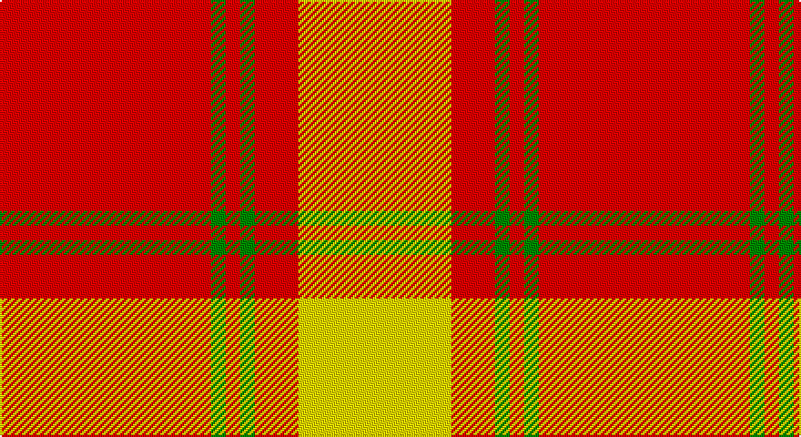

This page is one **sett** — a single exact thread-count. It belongs to the [tartan](/setts/r29g2r2g2r6ly21/)
(the same proportion at any scale), whose colour order is pattern [RGRGRY](/stripes/rgrgry/).

Sourced from register-of-tartans.  It is a [6 stripe tartan](/stripes/stripes6/).

Original link https://www.tartanregister.gov.uk/tartanDetails.aspx?ref=2785

## Register references

External register numbers recorded for this tartan.

- Scottish Register of Tartans: [2785](https://www.tartanregister.gov.uk/tartanDetails.aspx?ref=2785)
- Scottish Tartans Authority (ITI): 6812

## Thread count
R/116 G8 R8 G8 R24 Y/84

One full sett is **296 threads**.

## Palette

Palette: <strong>Tartan Register</strong>
<table><thead><tr><th>Colour</th><th>Threads</th><th>Shade</th><th>Base</th><th>OKLCh</th></tr></thead><tbody><tr><td>R/</td><td style="text-align:right;font-variant-numeric:tabular-nums">116</td><td><code style="background-color:#FF0000;">#FF0000</code> <small style="color:#888">#FF0000</small></td><td>R <code style="background-color:#CC0000;">#CC0000</code></td><td><small style="color:#888">oklch(62.8% 0.258 29.2)</small></td></tr><tr><td>G</td><td style="text-align:right;font-variant-numeric:tabular-nums">8</td><td><code style="background-color:#008B00;">#008B00</code> <small style="color:#888">#008B00</small></td><td>G <code style="background-color:#006100;">#006100</code></td><td><small style="color:#888">oklch(55.2% 0.188 142.5)</small></td></tr><tr><td>R</td><td style="text-align:right;font-variant-numeric:tabular-nums">8</td><td><code style="background-color:#FF0000;">#FF0000</code> <small style="color:#888">#FF0000</small></td><td>R <code style="background-color:#CC0000;">#CC0000</code></td><td><small style="color:#888">oklch(62.8% 0.258 29.2)</small></td></tr><tr><td>G</td><td style="text-align:right;font-variant-numeric:tabular-nums">8</td><td><code style="background-color:#008B00;">#008B00</code> <small style="color:#888">#008B00</small></td><td>G <code style="background-color:#006100;">#006100</code></td><td><small style="color:#888">oklch(55.2% 0.188 142.5)</small></td></tr><tr><td>R</td><td style="text-align:right;font-variant-numeric:tabular-nums">24</td><td><code style="background-color:#FF0000;">#FF0000</code> <small style="color:#888">#FF0000</small></td><td>R <code style="background-color:#CC0000;">#CC0000</code></td><td><small style="color:#888">oklch(62.8% 0.258 29.2)</small></td></tr><tr><td>Y/</td><td style="text-align:right;font-variant-numeric:tabular-nums">84</td><td><code style="background-color:#FFE600;">#FFE600</code> <small style="color:#888">#FFE600</small></td><td>Y <code style="background-color:#F2BF00;">#F2BF00</code></td><td><small style="color:#888">oklch(91.7% 0.192 101.4)</small></td></tr></tbody></table>

# Sample pattern

## Nearest tartans

The nearest existing variants by ΔTartan distance, with this tartan at the top so the swatches line up against it.

ΔTartan

Tartan

Sett

—

<a href="/ttd/edit/#slug=r29g2r2g2r6ly21~x4">Maguire, Black</a> <a class="nn-out" href="/variants/s6/r29g2r2g2r6ly21~x4/" title="open its dictionary page">↗</a>

1.37

<a href="/ttd/edit/#slug=ly8k3ly4k2r30ly6~x2&amp;base=r29g2r2g2r6ly21~x4">Masai Shuka 16 (Artefact)</a> <a class="nn-out" href="/variants/s6/ly8k3ly4k2r30ly6~x2/" title="open its dictionary page">↗</a>

1.71

<a href="/ttd/edit/#slug=r18ly3r18ly30k4~x2&amp;base=r29g2r2g2r6ly21~x4">Shire of Hornwood (USA)</a> <a class="nn-out" href="/variants/s5/r18ly3r18ly30k4~x2/" title="open its dictionary page">↗</a>

1.78

<a href="/ttd/edit/#slug=db4ly1r12ly2r2ly12r1ly4~x4&amp;base=r29g2r2g2r6ly21~x4">Glassary #3</a> <a class="nn-out" href="/variants/s8/db4ly1r12ly2r2ly12r1ly4~x4/" title="open its dictionary page">↗</a>

1.84

<a href="/ttd/edit/#slug=r6ly2r18ly3r4ly12r3ly10r2~x2&amp;base=r29g2r2g2r6ly21~x4">MacMillan Dress Clan Tartan</a> <a class="nn-out" href="/variants/s9/r6ly2r18ly3r4ly12r3ly10r2~x2/" title="open its dictionary page">↗</a>

1.86

<a href="/ttd/edit/#slug=r3ly1r12ly2r3ly8r2ly8r1~x2&amp;base=r29g2r2g2r6ly21~x4">MacMillan</a> <a class="nn-out" href="/variants/s9/r3ly1r12ly2r3ly8r2ly8r1~x2/" title="open its dictionary page">↗</a>

1.96

<a href="/ttd/edit/#slug=g1ly1g1w1g10r20ly1~x4&amp;base=r29g2r2g2r6ly21~x4">Maver (Buckie)</a> <a class="nn-out" href="/variants/s7/g1ly1g1w1g10r20ly1~x4/" title="open its dictionary page">↗</a>

2.12

<a href="/ttd/edit/#slug=r38w9r3do9w3~x2&amp;base=r29g2r2g2r6ly21~x4">Loch Morar Trade Tartan</a> <a class="nn-out" href="/variants/s5/r38w9r3do9w3~x2/" title="open its dictionary page">↗</a>

2.12

<a href="/ttd/edit/#slug=r4w8r3w2r3w2r21g2r2g4~x2&amp;base=r29g2r2g2r6ly21~x4">Queen Alexandra</a> <a class="nn-out" href="/variants/s10/r4w8r3w2r3w2r21g2r2g4~x2/" title="open its dictionary page">↗</a>

2.23

<a href="/ttd/edit/#slug=r38w9r3dr9w3~x2&amp;base=r29g2r2g2r6ly21~x4">Loch Morar</a> <a class="nn-out" href="/variants/s5/r38w9r3dr9w3~x2/" title="open its dictionary page">↗</a>

2.23

<a href="/ttd/edit/#slug=r8ri3r28w32ri3w4~x2&amp;base=r29g2r2g2r6ly21~x4">Ailsa, Red V2 (Dance)</a> <a class="nn-out" href="/variants/s6/r8ri3r28w32ri3w4~x2/" title="open its dictionary page">↗</a>

## Neighbour map

Every grey dot is one of 14360 variants placed by the first two principal components of the ΔTartan feature space (44% of its variance). Red is this tartan; blue dots are its nearest — click one to open its page.

<svg viewBox="0 0 640 380" role="img" style="max-width:100%;height:auto;border:1px solid #e0e0e0;border-radius:4px;display:block" xmlns="http://www.w3.org/2000/svg"><image href="/nn/cloud.v1.png" width="640" height="380"/><a href="/variants/s6/ly8k3ly4k2r30ly6~x2/"><circle cx="360.4" cy="163.2" r="4" fill="#3465a4"><title>Masai Shuka 16 (Artefact)</title></circle></a><a href="/variants/s5/r18ly3r18ly30k4~x2/"><circle cx="282.7" cy="204.7" r="4" fill="#3465a4"><title>Shire of Hornwood (USA)</title></circle></a><a href="/variants/s8/db4ly1r12ly2r2ly12r1ly4~x4/"><circle cx="296.7" cy="172.1" r="4" fill="#3465a4"><title>Glassary #3</title></circle></a><a href="/variants/s9/r6ly2r18ly3r4ly12r3ly10r2~x2/"><circle cx="363.0" cy="210.7" r="4" fill="#3465a4"><title>MacMillan Dress Clan Tartan</title></circle></a><a href="/variants/s9/r3ly1r12ly2r3ly8r2ly8r1~x2/"><circle cx="357.7" cy="196.7" r="4" fill="#3465a4"><title>MacMillan</title></circle></a><a href="/variants/s7/g1ly1g1w1g10r20ly1~x4/"><circle cx="368.0" cy="118.1" r="4" fill="#3465a4"><title>Maver (Buckie)</title></circle></a><a href="/variants/s5/r38w9r3do9w3~x2/"><circle cx="412.9" cy="182.7" r="4" fill="#3465a4"><title>Loch Morar Trade Tartan</title></circle></a><a href="/variants/s10/r4w8r3w2r3w2r21g2r2g4~x2/"><circle cx="381.1" cy="158.4" r="4" fill="#3465a4"><title>Queen Alexandra</title></circle></a><a href="/variants/s5/r38w9r3dr9w3~x2/"><circle cx="411.1" cy="183.0" r="4" fill="#3465a4"><title>Loch Morar</title></circle></a><a href="/variants/s6/r8ri3r28w32ri3w4~x2/"><circle cx="291.5" cy="179.9" r="4" fill="#3465a4"><title>Ailsa, Red V2 (Dance)</title></circle></a><circle cx="381.0" cy="162.2" r="5" fill="#c00000"/></svg>

ID: /variants/s6/r29g2r2g2r6ly21~x4/
