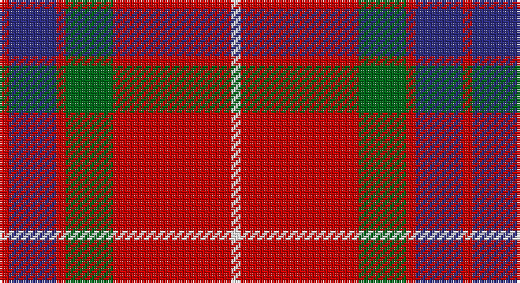

This page is one **sett** — a single exact thread-count. It belongs to the [tartan](/setts/r2db10r2g10r25w2/)
(the same proportion at any scale), whose colour order is pattern [RBRGRW](/stripes/rbrgrw/).

Part of the [Grant of Lurg](/tartans/grant-of-lurg/) tartan — the named design grouping this sett with its other cloths.

Sourced from register-of-tartans.  It is a [6 stripe tartan](/stripes/stripes6/).

Original link https://www.tartanregister.gov.uk/tartanDetails.aspx?ref=1507

## Also known as

This cloth is also recorded under:

- Grant of Lurg Artifact

2 attestations — the source records this cloth was collapsed from (oldest owns this page)

<ul>
<li>01/01/1750 — Grant of Lurg (register-of-tartans, <a href="https://www.tartanregister.gov.uk/tartanDetails.aspx?ref=1507">record</a>)</li>
<li>pre 1750 — Grant of Lurg (Clan) (tartans-authority, <a href="http://www.tartansauthority.com/tartan-ferret/display/527/">record</a>)</li>
</ul>

## Register references

External register numbers recorded for this tartan.

- Scottish Register of Tartans: [1507](https://www.tartanregister.gov.uk/tartanDetails.aspx?ref=1507)
- Scottish Tartans Authority (ITI): 527
- Scottish Tartans World Register: 527

## Thread count
R/4 DB20 R4 G20 R50 W/4

One full sett is **196 threads**.

## Palette

Palette: <strong>Tartan Register</strong>
<table><thead><tr><th>Colour</th><th>Threads</th><th>Shade</th><th>Base</th><th>OKLCh</th></tr></thead><tbody><tr><td>R/</td><td style="text-align:right;font-variant-numeric:tabular-nums">4</td><td><code style="background-color:#C80000;">#C80000</code> <small style="color:#888">#C80000</small></td><td>R <code style="background-color:#CC0000;">#CC0000</code></td><td><small style="color:#888">oklch(52.3% 0.215 29.2)</small></td></tr><tr><td>DB</td><td style="text-align:right;font-variant-numeric:tabular-nums">20</td><td><code style="background-color:#2C2C80;">#2C2C80</code> <small style="color:#888">#2C2C80</small></td><td>B <code style="background-color:#2A418A;">#2A418A</code></td><td><small style="color:#888">oklch(35.0% 0.138 276.6)</small></td></tr><tr><td>R</td><td style="text-align:right;font-variant-numeric:tabular-nums">4</td><td><code style="background-color:#C80000;">#C80000</code> <small style="color:#888">#C80000</small></td><td>R <code style="background-color:#CC0000;">#CC0000</code></td><td><small style="color:#888">oklch(52.3% 0.215 29.2)</small></td></tr><tr><td>G</td><td style="text-align:right;font-variant-numeric:tabular-nums">20</td><td><code style="background-color:#006818;">#006818</code> <small style="color:#888">#006818</small></td><td>G <code style="background-color:#006100;">#006100</code></td><td><small style="color:#888">oklch(45.0% 0.142 145.0)</small></td></tr><tr><td>R</td><td style="text-align:right;font-variant-numeric:tabular-nums">50</td><td><code style="background-color:#C80000;">#C80000</code> <small style="color:#888">#C80000</small></td><td>R <code style="background-color:#CC0000;">#CC0000</code></td><td><small style="color:#888">oklch(52.3% 0.215 29.2)</small></td></tr><tr><td>W/</td><td style="text-align:right;font-variant-numeric:tabular-nums">4</td><td><code style="background-color:#F8F8F8;">#F8F8F8</code> <small style="color:#888">#F8F8F8</small></td><td>W <code style="background-color:#F7F7F7;">#F7F7F7</code></td><td><small style="color:#888">oklch(97.9% 0.000 89.9)</small></td></tr></tbody></table>

# Sample pattern

## Nearest tartans

The nearest existing variants by ΔTartan distance, with this tartan at the top so the swatches line up against it.

ΔTartan

Tartan

Sett

—

<a href="/ttd/edit/#slug=r2db10r2g10r25w2~x2">Grant of Lurg</a> <a class="nn-out" href="/variants/s6/r2db10r2g10r25w2~x2/" title="open its dictionary page">↗</a>

0.77

<a href="/ttd/edit/#slug=r12dp2lb1dp2r3dg8r3dp1&amp;base=r2db10r2g10r25w2~x2">Chisholm</a> <a class="nn-out" href="/variants/s8/r12dp2lb1dp2r3dg8r3dp1/" title="open its dictionary page">↗</a>

0.78

<a href="/ttd/edit/#slug=r1db6r1dg6r12w1~x2&amp;base=r2db10r2g10r25w2~x2">Fraser Red Clan Tartan</a> <a class="nn-out" href="/variants/s6/r1db6r1dg6r12w1~x2/" title="open its dictionary page">↗</a>

0.86

<a href="/ttd/edit/#slug=r12b2w1b2r3g8r3b1~x4&amp;base=r2db10r2g10r25w2~x2">Chisholm, The</a> <a class="nn-out" href="/variants/s8/r12b2w1b2r3g8r3b1~x4/" title="open its dictionary page">↗</a>

0.89

<a href="/ttd/edit/#slug=r5w2r28k12dg16r3~x2&amp;base=r2db10r2g10r25w2~x2">MacKintosh #4</a> <a class="nn-out" href="/variants/s6/r5w2r28k12dg16r3~x2/" title="open its dictionary page">↗</a>

0.91

<a href="/ttd/edit/#slug=r12db2w1db2r3g8r3db1~x2&amp;base=r2db10r2g10r25w2~x2">Chisholm, The</a> <a class="nn-out" href="/variants/s8/r12db2w1db2r3g8r3db1~x2/" title="open its dictionary page">↗</a>

0.93

<a href="/ttd/edit/#slug=r4k2r24k6db6dg16r3~x2&amp;base=r2db10r2g10r25w2~x2">MacDuff #4</a> <a class="nn-out" href="/variants/s7/r4k2r24k6db6dg16r3~x2/" title="open its dictionary page">↗</a>

0.94

<a href="/ttd/edit/#slug=r1db6r1dg6r12lb1&amp;base=r2db10r2g10r25w2~x2">Fraser VS</a> <a class="nn-out" href="/variants/s6/r1db6r1dg6r12lb1/" title="open its dictionary page">↗</a>

0.95

<a href="/ttd/edit/#slug=r100k15g48db5r7db16~x2&amp;base=r2db10r2g10r25w2~x2">Plummer (Personal)</a> <a class="nn-out" href="/variants/s6/r100k15g48db5r7db16~x2/" title="open its dictionary page">↗</a>

0.98

<a href="/ttd/edit/#slug=r28db12r3dg20t2dg2r7~x2&amp;base=r2db10r2g10r25w2~x2">Carrick (Strathmore) District Tartan</a> <a class="nn-out" href="/variants/s7/r28db12r3dg20t2dg2r7~x2/" title="open its dictionary page">↗</a>

1.02

<a href="/ttd/edit/#slug=r107k9r5db41r5g51r14&amp;base=r2db10r2g10r25w2~x2">Buccleuch</a> <a class="nn-out" href="/variants/s7/r107k9r5db41r5g51r14/" title="open its dictionary page">↗</a>

## Neighbour map

Every grey dot is one of 14360 variants placed by the first two principal components of the ΔTartan feature space (44% of its variance). Red is this tartan; blue dots are its nearest — click one to open its page.

<svg viewBox="0 0 640 380" role="img" style="max-width:100%;height:auto;border:1px solid #e0e0e0;border-radius:4px;display:block" xmlns="http://www.w3.org/2000/svg"><image href="/nn/cloud.v1.png" width="640" height="380"/><a href="/variants/s8/r12dp2lb1dp2r3dg8r3dp1/"><circle cx="329.1" cy="178.7" r="4" fill="#3465a4"><title>Chisholm</title></circle></a><a href="/variants/s6/r1db6r1dg6r12w1~x2/"><circle cx="292.6" cy="189.0" r="4" fill="#3465a4"><title>Fraser Red Clan Tartan</title></circle></a><a href="/variants/s8/r12b2w1b2r3g8r3b1~x4/"><circle cx="320.2" cy="176.8" r="4" fill="#3465a4"><title>Chisholm, The</title></circle></a><a href="/variants/s6/r5w2r28k12dg16r3~x2/"><circle cx="300.2" cy="181.9" r="4" fill="#3465a4"><title>MacKintosh #4</title></circle></a><a href="/variants/s8/r12db2w1db2r3g8r3db1~x2/"><circle cx="323.2" cy="178.7" r="4" fill="#3465a4"><title>Chisholm, The</title></circle></a><a href="/variants/s7/r4k2r24k6db6dg16r3~x2/"><circle cx="278.1" cy="183.7" r="4" fill="#3465a4"><title>MacDuff #4</title></circle></a><a href="/variants/s6/r1db6r1dg6r12lb1/"><circle cx="280.6" cy="185.4" r="4" fill="#3465a4"><title>Fraser VS</title></circle></a><a href="/variants/s6/r100k15g48db5r7db16~x2/"><circle cx="355.2" cy="163.9" r="4" fill="#3465a4"><title>Plummer (Personal)</title></circle></a><a href="/variants/s7/r28db12r3dg20t2dg2r7~x2/"><circle cx="308.1" cy="185.9" r="4" fill="#3465a4"><title>Carrick (Strathmore) District Tartan</title></circle></a><a href="/variants/s7/r107k9r5db41r5g51r14/"><circle cx="351.1" cy="153.9" r="4" fill="#3465a4"><title>Buccleuch</title></circle></a><circle cx="327.2" cy="179.7" r="5" fill="#c00000"/></svg>

ID: /variants/s6/r2db10r2g10r25w2~x2/
