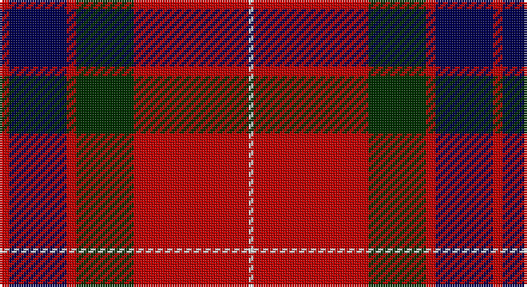

This page is one **sett** — a single exact thread-count. It belongs to the [tartan](/setts/r2db12r2dg12r24w1/)
(the same proportion at any scale), whose colour order is pattern [RBRGRW](/stripes/rbrgrw/).

Sourced from weddslist.  It is a [6 stripe tartan](/stripes/stripes6/).

Original link http://www.weddslist.com/cgi-bin/tartans/pg.pl?source=sts

## Thread count
R/4 DB24 R4 DG24 R48 LN/2

One full sett is **206 threads**.

## Palette

Palette: <strong>Tartan Dictionary</strong> <small style="color:#888">(1 of 4 colours)</small>
<table><thead><tr><th>Colour</th><th>Threads</th><th>Shade</th><th>Base</th><th>OKLCh</th></tr></thead><tbody><tr><td>R/</td><td style="text-align:right;font-variant-numeric:tabular-nums">4</td><td><code style="background-color:#C00000;">#C00000</code> <small style="color:#888">#C00000</small></td><td>R <code style="background-color:#CC0000;">#CC0000</code></td><td><small style="color:#888">oklch(50.7% 0.208 29.2)</small></td></tr><tr><td>DB</td><td style="text-align:right;font-variant-numeric:tabular-nums">24</td><td><code style="background-color:#000050;">#000050</code> <small style="color:#888">#000050</small></td><td>B <code style="background-color:#2A418A;">#2A418A</code></td><td><small style="color:#888">oklch(19.5% 0.135 264.1)</small></td></tr><tr><td>R</td><td style="text-align:right;font-variant-numeric:tabular-nums">4</td><td><code style="background-color:#C00000;">#C00000</code> <small style="color:#888">#C00000</small></td><td>R <code style="background-color:#CC0000;">#CC0000</code></td><td><small style="color:#888">oklch(50.7% 0.208 29.2)</small></td></tr><tr><td>DG</td><td style="text-align:right;font-variant-numeric:tabular-nums">24</td><td><code style="background-color:#003000;">#003000</code> <small style="color:#888">#003000</small></td><td>G <code style="background-color:#006100;">#006100</code></td><td><small style="color:#888">oklch(26.8% 0.091 142.5)</small></td></tr><tr><td>R</td><td style="text-align:right;font-variant-numeric:tabular-nums">48</td><td><code style="background-color:#C00000;">#C00000</code> <small style="color:#888">#C00000</small></td><td>R <code style="background-color:#CC0000;">#CC0000</code></td><td><small style="color:#888">oklch(50.7% 0.208 29.2)</small></td></tr><tr><td>LN/</td><td style="text-align:right;font-variant-numeric:tabular-nums">2</td><td><code style="background-color:#E0E0E0;">#E0E0E0</code> <small style="color:#888">#E0E0E0</small></td><td>W <code style="background-color:#F7F7F7;">#F7F7F7</code></td><td><small style="color:#888">oklch(90.7% 0.000 89.9)</small></td></tr></tbody></table>

# Sample pattern

## Nearest tartans

The nearest existing variants by ΔTartan distance, with this tartan at the top so the swatches line up against it.

ΔTartan

Tartan

Sett

—

<a href="/ttd/edit/#slug=r2db12r2dg12r24w1~x2">Fraser</a> <a class="nn-out" href="/variants/s6/r2db12r2dg12r24w1~x2/" title="open its dictionary page">↗</a>

0.85

<a href="/ttd/edit/#slug=lb3dg15db18r30db1r2~x2&amp;base=r2db12r2dg12r24w1~x2">Ruthven</a> <a class="nn-out" href="/variants/s6/lb3dg15db18r30db1r2~x2/" title="open its dictionary page">↗</a>

0.90

<a href="/ttd/edit/#slug=r2db12r2g12r24w1~x2&amp;base=r2db12r2dg12r24w1~x2">Fraser (1745)</a> <a class="nn-out" href="/variants/s6/r2db12r2g12r24w1~x2/" title="open its dictionary page">↗</a>

1.00

<a href="/ttd/edit/#slug=lr3dg15db18r30dg1r2~x2&amp;base=r2db12r2dg12r24w1~x2">Ruthven</a> <a class="nn-out" href="/variants/s6/lr3dg15db18r30dg1r2~x2/" title="open its dictionary page">↗</a>

1.11

<a href="/ttd/edit/#slug=r6dg16r4db12r16lb1r2~x2&amp;base=r2db12r2dg12r24w1~x2">MacQuarrie LO</a> <a class="nn-out" href="/variants/s7/r6dg16r4db12r16lb1r2~x2/" title="open its dictionary page">↗</a>

1.13

<a href="/ttd/edit/#slug=r1db6r1dg6r12lb1&amp;base=r2db12r2dg12r24w1~x2">Fraser VS</a> <a class="nn-out" href="/variants/s6/r1db6r1dg6r12lb1/" title="open its dictionary page">↗</a>

1.13

<a href="/ttd/edit/#slug=r25k7r3g13y1k2~x4&amp;base=r2db12r2dg12r24w1~x2">MacPhail</a> <a class="nn-out" href="/variants/s6/r25k7r3g13y1k2~x4/" title="open its dictionary page">↗</a>

1.14

<a href="/ttd/edit/#slug=r25k7r3g13t1k2~x4&amp;base=r2db12r2dg12r24w1~x2">MacPhail</a> <a class="nn-out" href="/variants/s6/r25k7r3g13t1k2~x4/" title="open its dictionary page">↗</a>

1.16

<a href="/ttd/edit/#slug=r107k9r5db41r5g51r14&amp;base=r2db12r2dg12r24w1~x2">Buccleuch</a> <a class="nn-out" href="/variants/s7/r107k9r5db41r5g51r14/" title="open its dictionary page">↗</a>

1.17

<a href="/ttd/edit/#slug=r28db12r3dg20t2dg2r7~x2&amp;base=r2db12r2dg12r24w1~x2">Carrick (Strathmore) District Tartan</a> <a class="nn-out" href="/variants/s7/r28db12r3dg20t2dg2r7~x2/" title="open its dictionary page">↗</a>

1.18

<a href="/ttd/edit/#slug=lo4k17r1k4r2k4r33w3~x2&amp;base=r2db12r2dg12r24w1~x2">Mens Bigi</a> <a class="nn-out" href="/variants/s8/lo4k17r1k4r2k4r33w3~x2/" title="open its dictionary page">↗</a>

## Neighbour map

Every grey dot is one of 14360 variants placed by the first two principal components of the ΔTartan feature space (44% of its variance). Red is this tartan; blue dots are its nearest — click one to open its page.

<svg viewBox="0 0 640 380" role="img" style="max-width:100%;height:auto;border:1px solid #e0e0e0;border-radius:4px;display:block" xmlns="http://www.w3.org/2000/svg"><image href="/nn/cloud.v1.png" width="640" height="380"/><a href="/variants/s6/lb3dg15db18r30db1r2~x2/"><circle cx="282.2" cy="151.1" r="4" fill="#3465a4"><title>Ruthven</title></circle></a><a href="/variants/s6/r2db12r2g12r24w1~x2/"><circle cx="332.4" cy="163.8" r="4" fill="#3465a4"><title>Fraser (1745)</title></circle></a><a href="/variants/s6/lr3dg15db18r30dg1r2~x2/"><circle cx="300.3" cy="163.6" r="4" fill="#3465a4"><title>Ruthven</title></circle></a><a href="/variants/s7/r6dg16r4db12r16lb1r2~x2/"><circle cx="267.5" cy="187.0" r="4" fill="#3465a4"><title>MacQuarrie LO</title></circle></a><a href="/variants/s6/r1db6r1dg6r12lb1/"><circle cx="280.6" cy="185.4" r="4" fill="#3465a4"><title>Fraser VS</title></circle></a><a href="/variants/s6/r25k7r3g13y1k2~x4/"><circle cx="350.5" cy="158.7" r="4" fill="#3465a4"><title>MacPhail</title></circle></a><a href="/variants/s6/r25k7r3g13t1k2~x4/"><circle cx="324.7" cy="148.4" r="4" fill="#3465a4"><title>MacPhail</title></circle></a><a href="/variants/s7/r107k9r5db41r5g51r14/"><circle cx="351.1" cy="153.9" r="4" fill="#3465a4"><title>Buccleuch</title></circle></a><a href="/variants/s7/r28db12r3dg20t2dg2r7~x2/"><circle cx="308.1" cy="185.9" r="4" fill="#3465a4"><title>Carrick (Strathmore) District Tartan</title></circle></a><a href="/variants/s8/lo4k17r1k4r2k4r33w3~x2/"><circle cx="363.9" cy="123.0" r="4" fill="#3465a4"><title>Mens Bigi</title></circle></a><circle cx="321.0" cy="162.2" r="5" fill="#c00000"/></svg>

ID: /variants/s6/r2db12r2dg12r24w1~x2/
