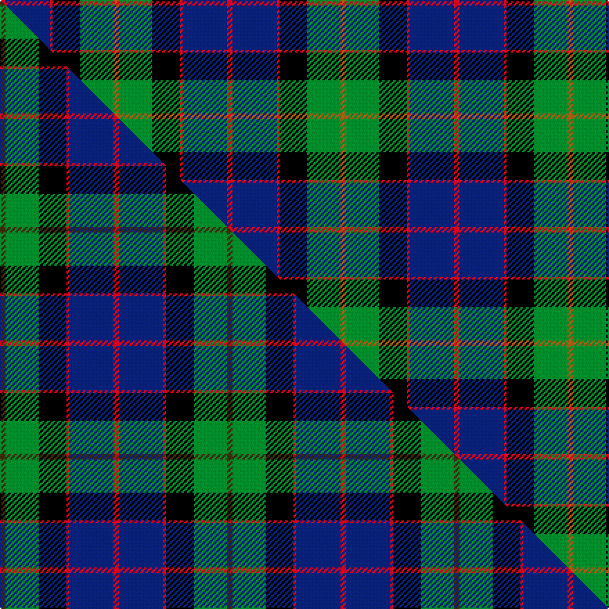

This is one **variant** — a specific cloth: this exact thread count and colourway, with its own
provenance below. It is one weaving of the [sett](/setts/r2db16r1k10g12o2/) (the scale-free proportion — the
same cloth at any scale or shade), whose colour order is pattern [RBRKGR](/stripes/rbrkgr/).

Part of the [MacWilliam](/tartans/m/ma/macwilliam/) tartan — the named design grouping this sett with its other cloths.

Sourced from weddslist.  It is a [6 stripe tartan](/stripes/stripes6/).

Original link [http://www.weddslist.com/cgi-bin/tartans/pg.pl?source=sts](http://www.weddslist.com/cgi-bin/tartans/pg.pl?source=sts)

Dataset <small>— provenance for this record, inherited from the source manifest</small>

<dl class="dataset-prov">
<dt>source</dt><dd><a href="/sources/weddslist/">Weddslist</a></dd>
<dt>data captured from</dt><dd><a href="https://github.com/thetartan/tartan-database/blob/master/data/weddslist/data.csv">https://github.com/thetartan/tartan-database/blob/master/data/weddslist/data.csv</a></dd>
<dt>data date</dt><dd>2016-11-17 <small>(dataset default)</small></dd>
<dt>licence</dt><dd><a href="https://creativecommons.org/licenses/by-nc-nd/4.0/">CC BY-NC-ND 4.0</a></dd>
</dl>

Capture chain <small>— the hands this data passed through, oldest first; each capture carries its own licence</small>

<ol class="capture-chain">
<li><a href="https://www.weddslist.com/tartans/">Weddslist</a> <small>the living privately compiled reference</small></li>
<li><a href="https://github.com/thetartan/tartan-database">thetartan/tartan-database</a> <small>2016-2017</small> · <a href="https://creativecommons.org/licenses/by-nc-nd/4.0/">CC BY-NC-ND 4.0</a> <small>Levko Kravets's frozen compilation — the capture we vendored, and where its CC licence text came from</small></li>
<li>this dictionary <small>captured 2026-06-10 · commit 5bf86c7566</small> <small>each re-capture is a git commit to data/sources</small></li>
</ol>

## Thread count
R/4 DB32 R2 K20 G24 O/4

One full sett is **164 threads**.

## Palette
<table><thead><tr><th>Colour</th><th>Shade</th><th>OKLCh</th></tr></thead><tbody><tr><td>DB</td><td><code style="background-color:#082077;">#082077</code> <small style="color:#888">#082077</small></td><td><small style="color:#888">oklch(30.0% 0.149 265.1)</small></td></tr><tr><td>G</td><td><code style="background-color:#008B2A;">#008B2A</code> <small style="color:#888">#008B2A</small></td><td><small style="color:#888">oklch(55.4% 0.170 145.9)</small></td></tr><tr><td>K</td><td><code style="background-color:#000000;">#000000</code> <small style="color:#888">#000000</small></td><td><small style="color:#888">oklch(0.0% 0.000 0.0)</small></td></tr><tr><td>O</td><td><code style="background-color:#A65C11;">#A65C11</code> <small style="color:#888">#A65C11</small></td><td><small style="color:#888">oklch(55.0% 0.125 58.3)</small></td></tr><tr><td>R</td><td><code style="background-color:#D60020;">#D60020</code> <small style="color:#888">#D60020</small></td><td><small style="color:#888">oklch(55.2% 0.224 25.5)</small></td></tr></tbody></table>

# Sample pattern

## Compared to the master

This cloth is one sett of its design; the master sett (the exemplar the design is anchored on) is below for comparison.

Its **ΔTartan distance** from the master is **0.30** — the same measure the nearest-tartans table ranks by (0 is identical; a re-scale of the same cloth is near 0, a recolour or a different proportion further).

<figure class="master-compare" style="margin:0">

this sett
master sett ★

<figcaption style="color:#888;font-size:smaller">One weave of this sett against the <a href="/setts/dy2g12k10r1db16r2/">master sett ★</a>, split on the diagonal: a shared proportion runs seamlessly across it with only the shades shifting; a different proportion breaks on it.</figcaption>
</figure>

## Nearest tartan variants

The nearest existing variants by ΔTartan distance, with this cloth at the top so the swatches line up against it.

ΔTartan

Threads

Variant

Sett

—

164

<a href="/variants/s6/r2db16r1k10g12o2~x2/">MacWilliam</a>

<a href="/ttd/edit/#slug=dy2g12k10r1db16r2~x2&amp;base=r2db16r1k10g12o2~x2" title="compare in the TTD">0.30</a>

164

<a href="/variants/s6/dy2g12k10r1db16r2~x2/">MacWilliam Clan Tartan</a>

<a href="/ttd/edit/#slug=dy2g12k10r1t16r2~x4&amp;base=r2db16r1k10g12o2~x2" title="compare in the TTD">0.42</a>

328

<a href="/variants/s6/dy2g12k10r1t16r2~x4/">MacWilliam (Clan)</a>

<a href="/ttd/edit/#slug=r1g14k14r2db14lb1~x2&amp;base=r2db16r1k10g12o2~x2" title="compare in the TTD">0.97</a>

180

<a href="/variants/s6/r1g14k14r2db14lb1~x2/">Wilson's No.221</a>

<a href="/ttd/edit/#slug=db31g2k20y2dg24~x2~g2408144-dg1806142&amp;base=r2db16r1k10g12o2~x2" title="compare in the TTD">1.24</a>

206

<a href="/variants/s5/db31g2k20y2dg24~x2~g2408144-dg1806142/">Landels (Personal)</a>

<a href="/ttd/edit/#slug=db19k8lb1g10o3~x2&amp;base=r2db16r1k10g12o2~x2" title="compare in the TTD">1.31</a>

120

<a href="/variants/s5/db19k8lb1g10o3~x2/">Unidentified #50</a>

<a href="/ttd/edit/#slug=y4g22r3k17r3db37w3~x2&amp;base=r2db16r1k10g12o2~x2" title="compare in the TTD">1.39</a>

342

<a href="/variants/s7/y4g22r3k17r3db37w3~x2/">Souza Nery</a>

<a href="/ttd/edit/#slug=dr4k2db24k20g20lo3~x2&amp;base=r2db16r1k10g12o2~x2" title="compare in the TTD">1.63</a>

278

<a href="/variants/s6/dr4k2db24k20g20lo3~x2/">Loudoun's Highlanders</a>

<a href="/ttd/edit/#slug=k2g12k12r1db12w2~x2&amp;base=r2db16r1k10g12o2~x2" title="compare in the TTD">1.83</a>

156

<a href="/variants/s6/k2g12k12r1db12w2~x2/">Russell Clan Tartan</a>

<a href="/ttd/edit/#slug=k2g12k12r1db12w2&amp;base=r2db16r1k10g12o2~x2" title="compare in the TTD">1.83</a>

78

<a href="/variants/s6/k2g12k12r1db12w2/">Mitchell</a>

<a href="/ttd/edit/#slug=g17y2k14r2db9r2db10~x2&amp;base=r2db16r1k10g12o2~x2" title="compare in the TTD">1.86</a>

170

<a href="/variants/s7/g17y2k14r2db9r2db10~x2/">MacDonald (Flora.. )</a>

## Neighbour map

Every grey dot is one of 13621 variants placed by the first two principal components of the ΔTartan feature space (42% of its variance). Red is this tartan; blue dots are its nearest — click one to open its page.

<svg viewBox="0 0 640 380" role="img" style="max-width:100%;height:auto;border:1px solid #e0e0e0;border-radius:4px;display:block" xmlns="http://www.w3.org/2000/svg"><image href="/nn/cloud.v1.png" width="640" height="380"/><a href="/variants/s6/dy2g12k10r1db16r2~x2/"><circle cx="156.4" cy="169.4" r="4" fill="#3465a4"><title>MacWilliam Clan Tartan</title></circle></a><a href="/variants/s6/dy2g12k10r1t16r2~x4/"><circle cx="149.0" cy="171.4" r="4" fill="#3465a4"><title>MacWilliam (Clan)</title></circle></a><a href="/variants/s6/r1g14k14r2db14lb1~x2/"><circle cx="125.4" cy="171.5" r="4" fill="#3465a4"><title>Wilson's No.221</title></circle></a><a href="/variants/s5/db31g2k20y2dg24~x2~g2408144-dg1806142/"><circle cx="193.4" cy="191.8" r="4" fill="#3465a4"><title>Landels (Personal)</title></circle></a><a href="/variants/s5/db19k8lb1g10o3~x2/"><circle cx="212.0" cy="176.8" r="4" fill="#3465a4"><title>Unidentified #50</title></circle></a><a href="/variants/s7/y4g22r3k17r3db37w3~x2/"><circle cx="143.5" cy="142.8" r="4" fill="#3465a4"><title>Souza Nery</title></circle></a><a href="/variants/s6/dr4k2db24k20g20lo3~x2/"><circle cx="129.2" cy="186.0" r="4" fill="#3465a4"><title>Loudoun's Highlanders</title></circle></a><a href="/variants/s6/k2g12k12r1db12w2~x2/"><circle cx="121.5" cy="180.7" r="4" fill="#3465a4"><title>Russell Clan Tartan</title></circle></a><a href="/variants/s6/k2g12k12r1db12w2/"><circle cx="121.5" cy="180.7" r="4" fill="#3465a4"><title>Mitchell</title></circle></a><a href="/variants/s7/g17y2k14r2db9r2db10~x2/"><circle cx="111.3" cy="194.7" r="4" fill="#3465a4"><title>MacDonald (Flora.. )</title></circle></a><circle cx="153.5" cy="168.2" r="5" fill="#c00000"/><text x="320" y="376" text-anchor="middle" font-size="11" fill="#999">ground</text><text x="11" y="190" text-anchor="middle" font-size="11" fill="#999" transform="rotate(-90 11 190)">complexity</text></svg>

ID: /variants/s6/r2db16r1k10g12o2~x2/
