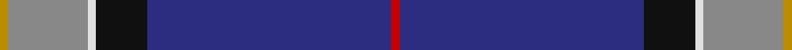
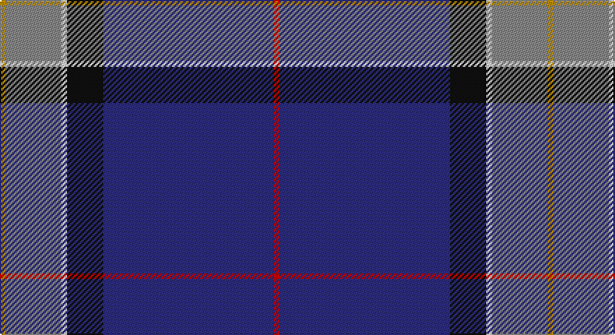

This page is one **sett** — a single exact thread-count. It belongs to the [tartan](/setts/r2db61k13w2o20lo2/)
(the same proportion at any scale), whose colour order is pattern [RBKWRY](/stripes/rbkwry/).

Part of the [Lloyd of Astargus](/tartans/lloyd-of-astargus/) tartan — the named design grouping this sett with its other cloths.

Sourced from register-of-tartans.  It is a [6 stripe tartan](/stripes/stripes6/).

Original link https://www.tartanregister.gov.uk/tartanDetails.aspx?ref=2139

## Also known as

This cloth is also recorded under:

- LLoyd of Astargus

2 attestations — the source records this cloth was collapsed from (oldest owns this page)

<ul>
<li>01/01/2001 — Lloyd of Astargus (register-of-tartans, <a href="https://www.tartanregister.gov.uk/tartanDetails.aspx?ref=2139">record</a>)</li>
<li>2001 — Lloyd of Astargus (Name) (tartans-authority, <a href="http://www.tartansauthority.com/tartan-ferret/display/5771/">record</a>)</li>
</ul>

## Register references

External register numbers recorded for this tartan.

- Scottish Register of Tartans: [2139](https://www.tartanregister.gov.uk/tartanDetails.aspx?ref=2139)
- Scottish Tartans Authority (ITI): 5771

## Thread count
DY/4 N40 LN4 K26 DB122 R/4

One full sett is **392 threads**.

## Palette

Palette: <strong>Tartan Register</strong>
<table><thead><tr><th>Colour</th><th>Threads</th><th>Shade</th><th>Base</th><th>OKLCh</th></tr></thead><tbody><tr><td>DY/</td><td style="text-align:right;font-variant-numeric:tabular-nums">4</td><td><code style="background-color:#BC8C00;">#BC8C00</code> <small style="color:#888">#BC8C00</small></td><td>Y <code style="background-color:#F2BF00;">#F2BF00</code></td><td><small style="color:#888">oklch(66.8% 0.137 84.1)</small></td></tr><tr><td>N</td><td style="text-align:right;font-variant-numeric:tabular-nums">40</td><td><code style="background-color:#888888;">#888888</code> <small style="color:#888">#888888</small></td><td>R <code style="background-color:#CC0000;">#CC0000</code></td><td><small style="color:#888">oklch(62.7% 0.000 89.9)</small></td></tr><tr><td>LN</td><td style="text-align:right;font-variant-numeric:tabular-nums">4</td><td><code style="background-color:#E0E0E0;">#E0E0E0</code> <small style="color:#888">#E0E0E0</small></td><td>W <code style="background-color:#F7F7F7;">#F7F7F7</code></td><td><small style="color:#888">oklch(90.7% 0.000 89.9)</small></td></tr><tr><td>K</td><td style="text-align:right;font-variant-numeric:tabular-nums">26</td><td><code style="background-color:#101010;">#101010</code> <small style="color:#888">#101010</small></td><td>K <code style="background-color:#000000;">#000000</code></td><td><small style="color:#888">oklch(17.3% 0.000 89.9)</small></td></tr><tr><td>DB</td><td style="text-align:right;font-variant-numeric:tabular-nums">122</td><td><code style="background-color:#2C2C80;">#2C2C80</code> <small style="color:#888">#2C2C80</small></td><td>B <code style="background-color:#2A418A;">#2A418A</code></td><td><small style="color:#888">oklch(35.0% 0.138 276.6)</small></td></tr><tr><td>R/</td><td style="text-align:right;font-variant-numeric:tabular-nums">4</td><td><code style="background-color:#C80000;">#C80000</code> <small style="color:#888">#C80000</small></td><td>R <code style="background-color:#CC0000;">#CC0000</code></td><td><small style="color:#888">oklch(52.3% 0.215 29.2)</small></td></tr></tbody></table>

# Sample pattern

## Nearest tartans

The nearest existing variants by ΔTartan distance, with this tartan at the top so the swatches line up against it.

ΔTartan

Tartan

Sett

—

<a href="/ttd/edit/#slug=r2db61k13w2o20lo2~x2">Lloyd of Astargus</a> <a class="nn-out" href="/variants/s6/r2db61k13w2o20lo2~x2/" title="open its dictionary page">↗</a>

1.13

<a href="/ttd/edit/#slug=r2w1r5g5lo1g10db40ly2~x2&amp;base=r2db61k13w2o20lo2~x2">St. Andrew Quebec City (Corporate)</a> <a class="nn-out" href="/variants/s8/r2w1r5g5lo1g10db40ly2~x2/" title="open its dictionary page">↗</a>

1.18

<a href="/ttd/edit/#slug=t23w3k10r2db45ly1~x2&amp;base=r2db61k13w2o20lo2~x2">Kirkcaldy</a> <a class="nn-out" href="/variants/s6/t23w3k10r2db45ly1~x2/" title="open its dictionary page">↗</a>

1.23

<a href="/ttd/edit/#slug=t23w3k10r2dt45ly1~x2&amp;base=r2db61k13w2o20lo2~x2">Kirkcaldy Name Tartan</a> <a class="nn-out" href="/variants/s6/t23w3k10r2dt45ly1~x2/" title="open its dictionary page">↗</a>

1.24

<a href="/ttd/edit/#slug=k8ly2dp6ly2k36db84w7&amp;base=r2db61k13w2o20lo2~x2">Grahame Laurie Band (Corporate)</a> <a class="nn-out" href="/variants/s7/k8ly2dp6ly2k36db84w7/" title="open its dictionary page">↗</a>

1.26

<a href="/ttd/edit/#slug=db36k8g3r3g6k1lo2~x2&amp;base=r2db61k13w2o20lo2~x2">MacLaurin of Broich (Clan)</a> <a class="nn-out" href="/variants/s7/db36k8g3r3g6k1lo2~x2/" title="open its dictionary page">↗</a>

1.31

<a href="/ttd/edit/#slug=p5g8k5db32w2r2~x2&amp;base=r2db61k13w2o20lo2~x2">Marion (Personal)</a> <a class="nn-out" href="/variants/s6/p5g8k5db32w2r2~x2/" title="open its dictionary page">↗</a>

1.35

<a href="/ttd/edit/#slug=w3db3k1t16k1db8r3db24ly3~x2&amp;base=r2db61k13w2o20lo2~x2">MacCormick Festive</a> <a class="nn-out" href="/variants/s9/w3db3k1t16k1db8r3db24ly3~x2/" title="open its dictionary page">↗</a>

1.35

<a href="/ttd/edit/#slug=w2db45g9r1n9ri1~x2&amp;base=r2db61k13w2o20lo2~x2">Wilton (Name)</a> <a class="nn-out" href="/variants/s6/w2db45g9r1n9ri1~x2/" title="open its dictionary page">↗</a>

1.36

<a href="/ttd/edit/#slug=db67w1lo6r5dg25db3k5~x2&amp;base=r2db61k13w2o20lo2~x2">Guide Dogs (Corporate)</a> <a class="nn-out" href="/variants/s7/db67w1lo6r5dg25db3k5~x2/" title="open its dictionary page">↗</a>

1.36

<a href="/ttd/edit/#slug=db18w2db2r3db21k28ly1k1g2~x2&amp;base=r2db61k13w2o20lo2~x2">St Andrew's College</a> <a class="nn-out" href="/variants/s9/db18w2db2r3db21k28ly1k1g2~x2/" title="open its dictionary page">↗</a>

## Neighbour map

Every grey dot is one of 14360 variants placed by the first two principal components of the ΔTartan feature space (44% of its variance). Red is this tartan; blue dots are its nearest — click one to open its page.

<svg viewBox="0 0 640 380" role="img" style="max-width:100%;height:auto;border:1px solid #e0e0e0;border-radius:4px;display:block" xmlns="http://www.w3.org/2000/svg"><image href="/nn/cloud.v1.png" width="640" height="380"/><a href="/variants/s8/r2w1r5g5lo1g10db40ly2~x2/"><circle cx="380.5" cy="89.1" r="4" fill="#3465a4"><title>St. Andrew Quebec City (Corporate)</title></circle></a><a href="/variants/s6/t23w3k10r2db45ly1~x2/"><circle cx="325.6" cy="117.3" r="4" fill="#3465a4"><title>Kirkcaldy</title></circle></a><a href="/variants/s6/t23w3k10r2dt45ly1~x2/"><circle cx="331.8" cy="121.2" r="4" fill="#3465a4"><title>Kirkcaldy Name Tartan</title></circle></a><a href="/variants/s7/k8ly2dp6ly2k36db84w7/"><circle cx="386.6" cy="118.4" r="4" fill="#3465a4"><title>Grahame Laurie Band (Corporate)</title></circle></a><a href="/variants/s7/db36k8g3r3g6k1lo2~x2/"><circle cx="399.5" cy="132.9" r="4" fill="#3465a4"><title>MacLaurin of Broich (Clan)</title></circle></a><a href="/variants/s6/p5g8k5db32w2r2~x2/"><circle cx="318.0" cy="153.2" r="4" fill="#3465a4"><title>Marion (Personal)</title></circle></a><a href="/variants/s9/w3db3k1t16k1db8r3db24ly3~x2/"><circle cx="297.1" cy="115.1" r="4" fill="#3465a4"><title>MacCormick Festive</title></circle></a><a href="/variants/s6/w2db45g9r1n9ri1~x2/"><circle cx="453.9" cy="121.7" r="4" fill="#3465a4"><title>Wilton (Name)</title></circle></a><a href="/variants/s7/db67w1lo6r5dg25db3k5~x2/"><circle cx="430.4" cy="113.5" r="4" fill="#3465a4"><title>Guide Dogs (Corporate)</title></circle></a><a href="/variants/s9/db18w2db2r3db21k28ly1k1g2~x2/"><circle cx="321.6" cy="121.3" r="4" fill="#3465a4"><title>St Andrew's College</title></circle></a><circle cx="370.8" cy="125.8" r="5" fill="#c00000"/></svg>

ID: /variants/s6/r2db61k13w2o20lo2~x2/
