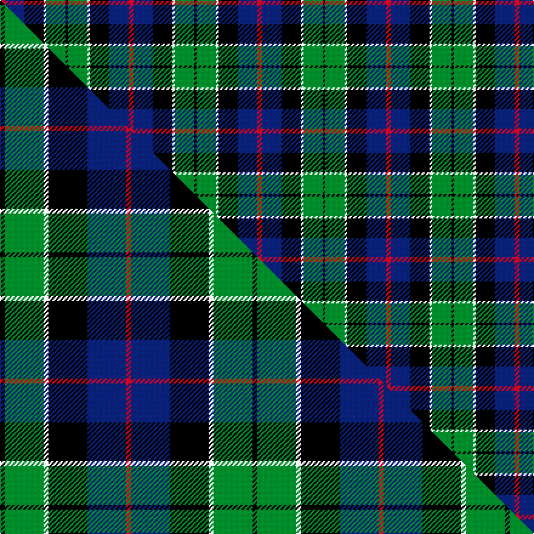

This page is one **sett** — a single exact thread-count. It belongs to the [tartan](/setts/r2db8k8w1g8k1/)
(the same proportion at any scale), whose colour order is pattern [KGWKBR](/stripes/kgwkbr/).

Part of the [Leslie Hunting](/tartans/leslie-hunting/) tartan — the named design grouping this sett with its other cloths.

Sourced from weddslist.  It is a [6 stripe tartan](/stripes/stripes6/).

Original link http://www.weddslist.com/cgi-bin/tartans/pg.pl?source=sts

## Provenance

Earliest known date: 1810-15 Said to have been worn by George 14th Earl of Rothes who died in 1841. This sett is shown by Smibert (1850) and by W & A Smith (1850) but without the definition of 'Hunting'. This sett is very similar to Duncan, the difference lies in the broad black present in the Leslie Hunting which is green in the Duncan

3 attestations — the source records this cloth was collapsed from (oldest owns this page)

<ul>
<li>undated — Leslie, hunting (weddslist, <a href="http://www.weddslist.com/cgi-bin/tartans/pg.pl?source=sts">record</a>) </li>
<li>undated — Leslie Hunting (weddslist, <a href="http://www.weddslist.com/cgi-bin/tartans/pg.pl?source=tinsel">record</a>) </li>
<li>undated — Leslie Hunting Clan Tartan (house-of-tartan, <a href="http://www.house-of-tartan.scotland.net/house/TartanViewjs.asp?colr=Def&tnam=1113">record</a>) </li>
</ul>

## Thread count
R/4 DB16 K16 W2 G16 K/2

One full sett is **106 threads**.

## Palette
<table><thead><tr><th>Colour</th><th>Shade</th><th>OKLCh</th></tr></thead><tbody><tr><td>DB</td><td><code style="background-color:#082077;">#082077</code> <small style="color:#888">#082077</small></td><td><small style="color:#888">oklch(30.0% 0.149 265.1)</small></td></tr><tr><td>G</td><td><code style="background-color:#008B2A;">#008B2A</code> <small style="color:#888">#008B2A</small></td><td><small style="color:#888">oklch(55.4% 0.170 145.9)</small></td></tr><tr><td>K</td><td><code style="background-color:#000000;">#000000</code> <small style="color:#888">#000000</small></td><td><small style="color:#888">oklch(0.0% 0.000 0.0)</small></td></tr><tr><td>W</td><td><code style="background-color:#F7F7F7;">#F7F7F7</code> <small style="color:#888">#F7F7F7</small></td><td><small style="color:#888">oklch(97.6% 0.000 89.9)</small></td></tr><tr><td>R</td><td><code style="background-color:#D60020;">#D60020</code> <small style="color:#888">#D60020</small></td><td><small style="color:#888">oklch(55.2% 0.224 25.5)</small></td></tr></tbody></table>

# Sample pattern

## Compared to the master

This cloth is one sett of its design; the master sett (the exemplar the design is anchored on) is below for comparison.

Its **ΔTartan distance** from the master is **0.05** — the same measure the nearest-tartans table ranks by (0 is identical; a re-scale of the same cloth is near 0, a recolour or a different proportion further).

<figure class="master-compare" style="margin:0">

this sett
master sett ★

<figcaption style="color:#888;font-size:smaller">One weave of this sett against the <a href="/setts/k1g8w1k8db8r1/">master sett ★</a>, split on the diagonal: a shared proportion runs seamlessly across it with only the shades shifting; a different proportion breaks on it.</figcaption>
</figure>

## Nearest tartan variants

The nearest existing variants by ΔTartan distance, with this cloth at the top so the swatches line up against it.

ΔTartan

Threads

Variant

Sett

—

106

<a href="/variants/s6/r2db8k8w1g8k1~x2/">Leslie, hunting</a>

<a href="/ttd/edit/#slug=r2db8k8w1g8k1&amp;base=r2db8k8w1g8k1~x2" title="compare in the TTD">0.00</a>

53

<a href="/variants/s6/r2db8k8w1g8k1/">Leslie Hunting</a>

<a href="/ttd/edit/#slug=k1g8w1k8db8r1~x4&amp;base=r2db8k8w1g8k1~x2" title="compare in the TTD">0.05</a>

208

<a href="/variants/s6/k1g8w1k8db8r1~x4/">Leslie Hunting</a>

<a href="/ttd/edit/#slug=k1g8w1k8db8r1~x4~db1004274&amp;base=r2db8k8w1g8k1~x2" title="compare in the TTD">0.10</a>

208

<a href="/variants/s6/k1g8w1k8db8r1~x4~db1004274/">Syme</a>

<a href="/ttd/edit/#slug=k1dg8w1k8w1db8r1~x4&amp;base=r2db8k8w1g8k1~x2" title="compare in the TTD">0.44</a>

216

<a href="/variants/s7/k1dg8w1k8w1db8r1~x4/">Caie (2013)</a>

<a href="/ttd/edit/#slug=k2g11y1k8db9r2~x4&amp;base=r2db8k8w1g8k1~x2" title="compare in the TTD">0.56</a>

248

<a href="/variants/s6/k2g11y1k8db9r2~x4/">Forsyth</a>

<a href="/ttd/edit/#slug=dr1k1g6k6db6lr1~x4&amp;base=r2db8k8w1g8k1~x2" title="compare in the TTD">0.94</a>

160

<a href="/variants/s6/dr1k1g6k6db6lr1~x4/">Gaines Center for the Humanities</a>

<a href="/ttd/edit/#slug=k4g16k14y3db16r4~x2&amp;base=r2db8k8w1g8k1~x2" title="compare in the TTD">1.00</a>

212

<a href="/variants/s6/k4g16k14y3db16r4~x2/">Birse</a>

<a href="/ttd/edit/#slug=k4dg16k14ly3t16r4~x2&amp;base=r2db8k8w1g8k1~x2" title="compare in the TTD">1.00</a>

212

<a href="/variants/s6/k4dg16k14ly3t16r4~x2/">Birse</a>

<a href="/ttd/edit/#slug=y1k1g9k9db8w1~x4&amp;base=r2db8k8w1g8k1~x2" title="compare in the TTD">1.03</a>

224

<a href="/variants/s6/y1k1g9k9db8w1~x4/">MacNeil 4</a>

<a href="/ttd/edit/#slug=r2db23k14g16k2w2~x2&amp;base=r2db8k8w1g8k1~x2" title="compare in the TTD">1.08</a>

228

<a href="/variants/s6/r2db23k14g16k2w2~x2/">MacPhail Hunting</a>

## Neighbour map

Every grey dot is one of 13620 variants placed by the first two principal components of the ΔTartan feature space (42% of its variance). Red is this tartan; blue dots are its nearest — click one to open its page.

<svg viewBox="0 0 640 380" role="img" style="max-width:100%;height:auto;border:1px solid #e0e0e0;border-radius:4px;display:block" xmlns="http://www.w3.org/2000/svg"><image href="/nn/cloud.v1.png" width="640" height="380"/><a href="/variants/s6/r2db8k8w1g8k1/"><circle cx="95.6" cy="198.7" r="4" fill="#3465a4"><title>Leslie Hunting</title></circle></a><a href="/variants/s6/k1g8w1k8db8r1~x4/"><circle cx="109.3" cy="193.7" r="4" fill="#3465a4"><title>Leslie Hunting</title></circle></a><a href="/variants/s6/k1g8w1k8db8r1~x4~db1004274/"><circle cx="111.9" cy="193.4" r="4" fill="#3465a4"><title>Syme</title></circle></a><a href="/variants/s7/k1dg8w1k8w1db8r1~x4/"><circle cx="116.3" cy="182.1" r="4" fill="#3465a4"><title>Caie (2013)</title></circle></a><a href="/variants/s6/k2g11y1k8db9r2~x4/"><circle cx="118.8" cy="189.9" r="4" fill="#3465a4"><title>Forsyth</title></circle></a><a href="/variants/s6/dr1k1g6k6db6lr1~x4/"><circle cx="99.9" cy="212.9" r="4" fill="#3465a4"><title>Gaines Center for the Humanities</title></circle></a><a href="/variants/s6/k4g16k14y3db16r4~x2/"><circle cx="78.8" cy="226.5" r="4" fill="#3465a4"><title>Birse</title></circle></a><a href="/variants/s6/k4dg16k14ly3t16r4~x2/"><circle cx="77.4" cy="226.2" r="4" fill="#3465a4"><title>Birse</title></circle></a><a href="/variants/s6/y1k1g9k9db8w1~x4/"><circle cx="121.0" cy="189.8" r="4" fill="#3465a4"><title>MacNeil 4</title></circle></a><a href="/variants/s6/r2db23k14g16k2w2~x2/"><circle cx="152.7" cy="176.0" r="4" fill="#3465a4"><title>MacPhail Hunting</title></circle></a><circle cx="95.6" cy="198.7" r="5" fill="#c00000"/><text x="320" y="376" text-anchor="middle" font-size="11" fill="#999">ground</text><text x="11" y="190" text-anchor="middle" font-size="11" fill="#999" transform="rotate(-90 11 190)">complexity</text></svg>

ID: /variants/s6/r2db8k8w1g8k1~x2/
