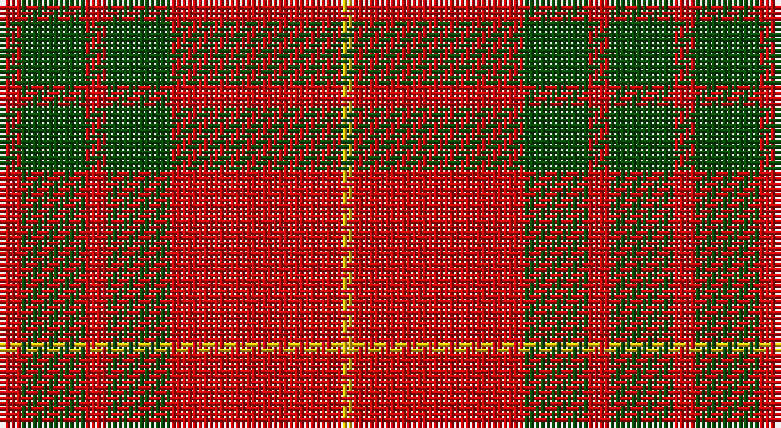

This page is one **sett** — a single exact thread-count. It belongs to the [tartan](/setts/r2dg6r2dg6r16ly1/)
(the same proportion at any scale), whose colour order is pattern [RGRGRY](/stripes/rgrgry/).

Part of the [Cameron](/tartans/cameron/) tartan — the named design grouping this sett with its other cloths.

Sourced from weddslist.  It is a [6 stripe tartan](/stripes/stripes6/).

Original link http://www.weddslist.com/cgi-bin/tartans/pg.pl?source=rb

## Also known as

This cloth is also recorded under:

- Cameron Ancient
- Cameron Old
- Cameron, Ancient

3 attestations — the source records this cloth was collapsed from (oldest owns this page)

<ul>
<li>undated — Cameron (weddslist, <a href="http://www.weddslist.com/cgi-bin/tartans/pg.pl?source=rb">record</a>)</li>
<li>undated — Cameron (weddslist, <a href="http://www.weddslist.com/cgi-bin/tartans/pg.pl?source=tinsel">record</a>)</li>
<li>undated — Cameron (weddslist, <a href="http://www.weddslist.com/cgi-bin/tartans/pg.pl?source=x">record</a>)</li>
</ul>

## Thread count
R/4 G12 R4 G12 R32 Y/2

One full sett is **126 threads**.

## Palette

Palette: <strong>Tartan Register</strong> <small style="color:#888">(2 of 3 colours)</small>
<table><thead><tr><th>Colour</th><th>Threads</th><th>Shade</th><th>Base</th><th>OKLCh</th></tr></thead><tbody><tr><td>R/</td><td style="text-align:right;font-variant-numeric:tabular-nums">4</td><td><code style="background-color:#C80000;">#C80000</code> <small style="color:#888">#C80000</small></td><td>R <code style="background-color:#CC0000;">#CC0000</code></td><td><small style="color:#888">oklch(52.3% 0.215 29.2)</small></td></tr><tr><td>G</td><td style="text-align:right;font-variant-numeric:tabular-nums">12</td><td><code style="background-color:#004C00;">#004C00</code> <small style="color:#888">#004C00</small></td><td>G <code style="background-color:#006100;">#006100</code></td><td><small style="color:#888">oklch(36.1% 0.123 142.5)</small></td></tr><tr><td>R</td><td style="text-align:right;font-variant-numeric:tabular-nums">4</td><td><code style="background-color:#C80000;">#C80000</code> <small style="color:#888">#C80000</small></td><td>R <code style="background-color:#CC0000;">#CC0000</code></td><td><small style="color:#888">oklch(52.3% 0.215 29.2)</small></td></tr><tr><td>G</td><td style="text-align:right;font-variant-numeric:tabular-nums">12</td><td><code style="background-color:#004C00;">#004C00</code> <small style="color:#888">#004C00</small></td><td>G <code style="background-color:#006100;">#006100</code></td><td><small style="color:#888">oklch(36.1% 0.123 142.5)</small></td></tr><tr><td>R</td><td style="text-align:right;font-variant-numeric:tabular-nums">32</td><td><code style="background-color:#C80000;">#C80000</code> <small style="color:#888">#C80000</small></td><td>R <code style="background-color:#CC0000;">#CC0000</code></td><td><small style="color:#888">oklch(52.3% 0.215 29.2)</small></td></tr><tr><td>Y/</td><td style="text-align:right;font-variant-numeric:tabular-nums">2</td><td><code style="background-color:#FFC800;">#FFC800</code> <small style="color:#888">#FFC800</small></td><td>Y <code style="background-color:#F2BF00;">#F2BF00</code></td><td><small style="color:#888">oklch(85.7% 0.175 88.5)</small></td></tr></tbody></table>

# Sample pattern

## Compared to the master

This cloth is one sett of its design; the master sett (the exemplar the design is anchored on) is below for comparison.

<figure style="margin:0"><figcaption style="color:#888;font-size:smaller">this sett</figcaption></figure>
<figure style="margin:0"><figcaption style="color:#888;font-size:smaller"><a href="/setts/r58ly3r6g16r12g16r6/">master sett →</a></figcaption></figure>

## Nearest tartans

The nearest existing variants by ΔTartan distance, with this tartan at the top so the swatches line up against it.

ΔTartan

Tartan

Sett

—

<a href="/ttd/edit/#slug=r2dg6r2dg6r16ly1~x2">Cameron</a> <a class="nn-out" href="/variants/s6/r2dg6r2dg6r16ly1~x2/" title="open its dictionary page">↗</a>

0.37

<a href="/ttd/edit/#slug=r6lb2r30dg12r3dg12r3&amp;base=r2dg6r2dg6r16ly1~x2">Crawford</a> <a class="nn-out" href="/variants/s7/r6lb2r30dg12r3dg12r3/" title="open its dictionary page">↗</a>

0.45

<a href="/ttd/edit/#slug=r2g6r2g6r16ly1~x4&amp;base=r2dg6r2dg6r16ly1~x2">Cameron (Clan)</a> <a class="nn-out" href="/variants/s6/r2g6r2g6r16ly1~x4/" title="open its dictionary page">↗</a>

0.50

<a href="/ttd/edit/#slug=r1dg6r1dg6r15ly1~x2&amp;base=r2dg6r2dg6r16ly1~x2">Cameron Clan D</a> <a class="nn-out" href="/variants/s6/r1dg6r1dg6r15ly1~x2/" title="open its dictionary page">↗</a>

0.65

<a href="/ttd/edit/#slug=r2g6r2g6r16ly1~x2&amp;base=r2dg6r2dg6r16ly1~x2">Cameron</a> <a class="nn-out" href="/variants/s6/r2g6r2g6r16ly1~x2/" title="open its dictionary page">↗</a>

0.68

<a href="/ttd/edit/#slug=r4g14r5k6r24g2r4~x2&amp;base=r2dg6r2dg6r16ly1~x2">Auld Lang Syne (red) Tartan</a> <a class="nn-out" href="/variants/s7/r4g14r5k6r24g2r4~x2/" title="open its dictionary page">↗</a>

0.89

<a href="/ttd/edit/#slug=r22db5r2g11r3db1~x2&amp;base=r2dg6r2dg6r16ly1~x2">MacKintosh 1</a> <a class="nn-out" href="/variants/s6/r22db5r2g11r3db1~x2/" title="open its dictionary page">↗</a>

0.94

<a href="/ttd/edit/#slug=r68db18r9g34r9db3~x2&amp;base=r2dg6r2dg6r16ly1~x2">MacKintosh 3</a> <a class="nn-out" href="/variants/s6/r68db18r9g34r9db3~x2/" title="open its dictionary page">↗</a>

0.97

<a href="/ttd/edit/#slug=r16dg1r1dg1r4dg12&amp;base=r2dg6r2dg6r16ly1~x2">MacQuarrie</a> <a class="nn-out" href="/variants/s6/r16dg1r1dg1r4dg12/" title="open its dictionary page">↗</a>

0.99

<a href="/ttd/edit/#slug=r6w2r30g12r3g12r3~x2&amp;base=r2dg6r2dg6r16ly1~x2">Crawford</a> <a class="nn-out" href="/variants/s7/r6w2r30g12r3g12r3~x2/" title="open its dictionary page">↗</a>

1.02

<a href="/ttd/edit/#slug=r1g10r1db4r18g1~x4&amp;base=r2dg6r2dg6r16ly1~x2">Robertson 6</a> <a class="nn-out" href="/variants/s6/r1g10r1db4r18g1~x4/" title="open its dictionary page">↗</a>

## Neighbour map

Every grey dot is one of 14360 variants placed by the first two principal components of the ΔTartan feature space (44% of its variance). Red is this tartan; blue dots are its nearest — click one to open its page.

<svg viewBox="0 0 640 380" role="img" style="max-width:100%;height:auto;border:1px solid #e0e0e0;border-radius:4px;display:block" xmlns="http://www.w3.org/2000/svg"><image href="/nn/cloud.v1.png" width="640" height="380"/><a href="/variants/s7/r6lb2r30dg12r3dg12r3/"><circle cx="416.0" cy="194.0" r="4" fill="#3465a4"><title>Crawford</title></circle></a><a href="/variants/s6/r2g6r2g6r16ly1~x4/"><circle cx="420.6" cy="202.7" r="4" fill="#3465a4"><title>Cameron (Clan)</title></circle></a><a href="/variants/s6/r1dg6r1dg6r15ly1~x2/"><circle cx="393.3" cy="195.9" r="4" fill="#3465a4"><title>Cameron Clan D</title></circle></a><a href="/variants/s6/r2g6r2g6r16ly1~x2/"><circle cx="415.5" cy="201.3" r="4" fill="#3465a4"><title>Cameron</title></circle></a><a href="/variants/s7/r4g14r5k6r24g2r4~x2/"><circle cx="393.5" cy="206.4" r="4" fill="#3465a4"><title>Auld Lang Syne (red) Tartan</title></circle></a><a href="/variants/s6/r22db5r2g11r3db1~x2/"><circle cx="423.8" cy="185.6" r="4" fill="#3465a4"><title>MacKintosh 1</title></circle></a><a href="/variants/s6/r68db18r9g34r9db3~x2/"><circle cx="417.9" cy="188.3" r="4" fill="#3465a4"><title>MacKintosh 3</title></circle></a><a href="/variants/s6/r16dg1r1dg1r4dg12/"><circle cx="450.8" cy="213.4" r="4" fill="#3465a4"><title>MacQuarrie</title></circle></a><a href="/variants/s7/r6w2r30g12r3g12r3~x2/"><circle cx="409.9" cy="198.6" r="4" fill="#3465a4"><title>Crawford</title></circle></a><a href="/variants/s6/r1g10r1db4r18g1~x4/"><circle cx="396.6" cy="186.7" r="4" fill="#3465a4"><title>Robertson 6</title></circle></a><circle cx="413.4" cy="199.1" r="5" fill="#c00000"/></svg>

ID: /variants/s6/r2dg6r2dg6r16ly1~x2/
