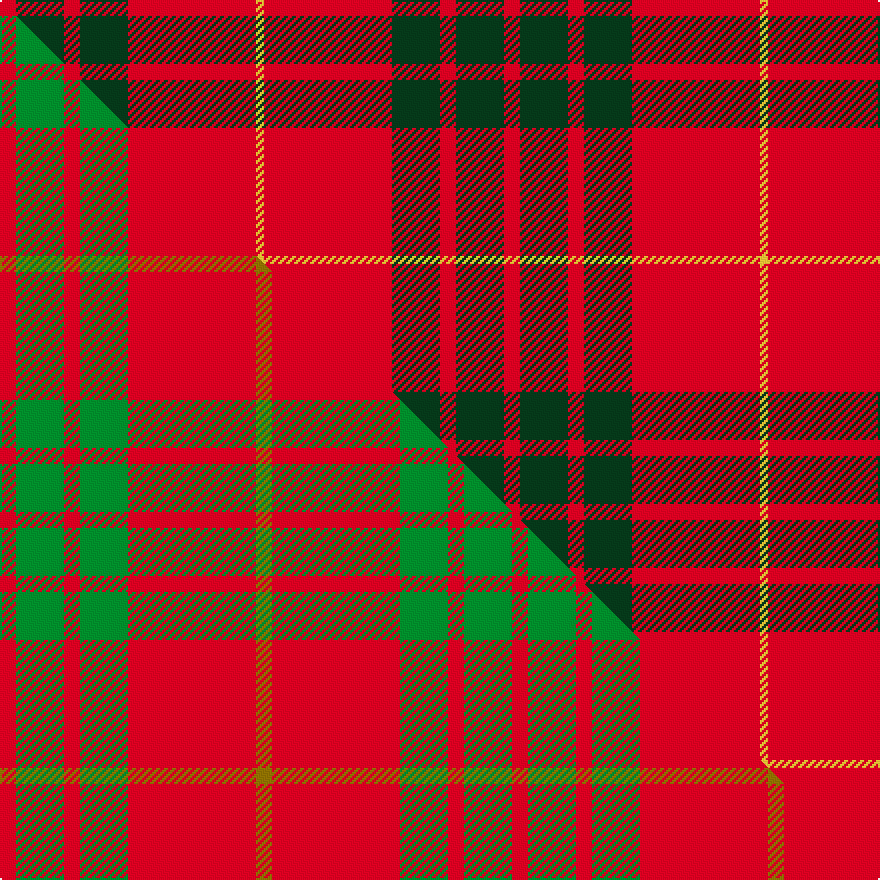

This is one **variant** — a specific cloth: this exact thread count and colourway, with its own
provenance below. It is one weaving of the [sett](/setts/r2dg6r2dg6r16ly1/) (the scale-free proportion — the
same cloth at any scale or shade), whose colour order is pattern [RGRGRY](/stripes/rgrgry/).

Part of the [Cameron](/tartans/cameron-4/) tartan — the named design grouping this sett with its other cloths.

Sourced from tartans-authority.  It is a [6 stripe tartan](/stripes/stripes6/).

Original link [https://www.tartanregister.gov.uk/tartanDetails.aspx?ref=1538](https://www.tartanregister.gov.uk/tartanDetails.aspx?ref=1538)

Dataset <small>— provenance for this record, inherited from the source manifest</small>

<dl class="dataset-prov">
<dt>source</dt><dd><a href="/sources/tartans-authority/">Scottish Tartans Authority</a></dd>
<dt>data captured from</dt><dd><a href="https://github.com/thetartan/tartan-database/blob/master/data/tartans-authority/data.csv">https://github.com/thetartan/tartan-database/blob/master/data/tartans-authority/data.csv</a></dd>
<dt>data date</dt><dd>1842 <small>(this record)</small></dd>
<dt>licence</dt><dd><a href="https://creativecommons.org/licenses/by-nc-nd/4.0/">CC BY-NC-ND 4.0</a></dd>
</dl>

Capture chain <small>— the hands this data passed through, oldest first; each capture carries its own licence</small>

<ol class="capture-chain">
<li><a href="https://www.tartansauthority.com/">Scottish Tartans Authority</a> <small>the heritage body's archive — its tartan-ferret record browser is retired (links repaired to the SRT, above)</small></li>
<li><a href="https://github.com/thetartan/tartan-database">thetartan/tartan-database</a> <small>2016-2017</small> · <a href="https://creativecommons.org/licenses/by-nc-nd/4.0/">CC BY-NC-ND 4.0</a> <small>Levko Kravets's frozen compilation — the capture we vendored, and where its CC licence text came from</small></li>
<li>this dictionary <small>captured 2026-06-10 · commit 5bf86c7566</small> <small>each re-capture is a git commit to data/sources</small></li>
</ol>

## Register references

External register numbers recorded for this tartan.

- Scottish Tartans Authority (ITI): 1538

## Thread count
R/8 DG24 R8 DG24 R64 LY/4

One full sett is **252 threads**.

## Palette
<table><thead><tr><th>Colour</th><th>Shade</th><th>OKLCh</th></tr></thead><tbody><tr><td>DG</td><td><code style="background-color:#053819;">#053819</code> <small style="color:#888">#053819</small></td><td><small style="color:#888">oklch(30.0% 0.075 151.3)</small></td></tr><tr><td>R</td><td><code style="background-color:#D60020;">#D60020</code> <small style="color:#888">#D60020</small></td><td><small style="color:#888">oklch(55.2% 0.224 25.5)</small></td></tr><tr><td>LY</td><td><code style="background-color:#DCBC32;">#DCBC32</code> <small style="color:#888">#DCBC32</small></td><td><small style="color:#888">oklch(80.0% 0.150 95.2)</small></td></tr></tbody></table>

# Sample pattern

## Compared to the master

This cloth is one sett of its design; the master sett (the exemplar the design is anchored on) is below for comparison.

Its **ΔTartan distance** from the master is **0.57** — the same measure the nearest-tartans table ranks by (0 is identical; a re-scale of the same cloth is near 0, a recolour or a different proportion further).

<figure class="master-compare" style="margin:0">

this sett
master sett ★

<figcaption style="color:#888;font-size:smaller">One weave of this sett against the <a href="/setts/r1g3r1g3r8y1/">master sett ★</a>, split on the diagonal: a shared proportion runs seamlessly across it with only the shades shifting; a different proportion breaks on it.</figcaption>
</figure>

## Nearest tartan variants

The nearest existing variants by ΔTartan distance, with this cloth at the top so the swatches line up against it.

ΔTartan

Threads

Variant

Sett

—

252

<a href="/variants/s6/r2dg6r2dg6r16ly1~x4/">Cameron (Clan)</a>

<a href="/ttd/edit/#slug=r2g6r2g6r16y1~x2&amp;base=r2dg6r2dg6r16ly1~x4" title="compare in the TTD">0.16</a>

126

<a href="/variants/s6/r2g6r2g6r16y1~x2/">Cameron Clan Tartan</a>

<a href="/ttd/edit/#slug=r1g6r1g6r15y1~x2&amp;base=r2dg6r2dg6r16ly1~x4" title="compare in the TTD">0.34</a>

116

<a href="/variants/s6/r1g6r1g6r15y1~x2/">Cameron Clan D</a>

<a href="/ttd/edit/#slug=r1g3r1g3r8y1~x8&amp;base=r2dg6r2dg6r16ly1~x4" title="compare in the TTD">0.57</a>

256

<a href="/variants/s6/r1g3r1g3r8y1~x8/">Cameron</a>

<a href="/ttd/edit/#slug=r1g10r1db4r18g1~x4&amp;base=r2dg6r2dg6r16ly1~x4" title="compare in the TTD">0.95</a>

272

<a href="/variants/s6/r1g10r1db4r18g1~x4/">Robertson 6</a>

<a href="/ttd/edit/#slug=r2g20r2db8r36g1~x2&amp;base=r2dg6r2dg6r16ly1~x4" title="compare in the TTD">0.97</a>

270

<a href="/variants/s6/r2g20r2db8r36g1~x2/">Robertson</a>

<a href="/ttd/edit/#slug=w11r40g13r5g12r5~x2&amp;base=r2dg6r2dg6r16ly1~x4" title="compare in the TTD">0.98</a>

312

<a href="/variants/s6/w11r40g13r5g12r5~x2/">Makhtoum Regimental Tartan</a>

<a href="/ttd/edit/#slug=r29dg2r2dg2r6ly21~x4&amp;base=r2dg6r2dg6r16ly1~x4" title="compare in the TTD">0.99</a>

296

<a href="/variants/s6/r29dg2r2dg2r6ly21~x4/">Maguire, Black (Name)</a>

<a href="/ttd/edit/#slug=r29g2r2g2r6dy21~x4&amp;base=r2dg6r2dg6r16ly1~x4" title="compare in the TTD">0.99</a>

296

<a href="/variants/s6/r29g2r2g2r6dy21~x4/">Maguire Clan Family Tartan</a>

<a href="/ttd/edit/#slug=r24g5r3g9r3db1~x4&amp;base=r2dg6r2dg6r16ly1~x4" title="compare in the TTD">1.00</a>

260

<a href="/variants/s6/r24g5r3g9r3db1~x4/">MacKintosh, Red</a>

<a href="/ttd/edit/#slug=r58y3r6g16r12g16r6&amp;base=r2dg6r2dg6r16ly1~x4" title="compare in the TTD">1.44</a>

170

<a href="/variants/s7/r58y3r6g16r12g16r6/">Cameron Ancient</a>

## Neighbour map

Every grey dot is one of 13621 variants placed by the first two principal components of the ΔTartan feature space (42% of its variance). Red is this tartan; blue dots are its nearest — click one to open its page.

<svg viewBox="0 0 640 380" role="img" style="max-width:100%;height:auto;border:1px solid #e0e0e0;border-radius:4px;display:block" xmlns="http://www.w3.org/2000/svg"><image href="/nn/cloud.v1.png" width="640" height="380"/><a href="/variants/s6/r2g6r2g6r16y1~x2/"><circle cx="431.0" cy="206.5" r="4" fill="#3465a4"><title>Cameron Clan Tartan</title></circle></a><a href="/variants/s6/r1g6r1g6r15y1~x2/"><circle cx="412.7" cy="205.0" r="4" fill="#3465a4"><title>Cameron Clan D</title></circle></a><a href="/variants/s6/r1g3r1g3r8y1~x8/"><circle cx="396.6" cy="238.5" r="4" fill="#3465a4"><title>Cameron</title></circle></a><a href="/variants/s6/r1g10r1db4r18g1~x4/"><circle cx="385.0" cy="182.9" r="4" fill="#3465a4"><title>Robertson 6</title></circle></a><a href="/variants/s6/r2g20r2db8r36g1~x2/"><circle cx="411.9" cy="155.2" r="4" fill="#3465a4"><title>Robertson</title></circle></a><a href="/variants/s6/w11r40g13r5g12r5~x2/"><circle cx="334.9" cy="227.2" r="4" fill="#3465a4"><title>Makhtoum Regimental Tartan</title></circle></a><a href="/variants/s6/r29dg2r2dg2r6ly21~x4/"><circle cx="406.8" cy="192.5" r="4" fill="#3465a4"><title>Maguire, Black (Name)</title></circle></a><a href="/variants/s6/r29g2r2g2r6dy21~x4/"><circle cx="419.1" cy="164.0" r="4" fill="#3465a4"><title>Maguire Clan Family Tartan</title></circle></a><a href="/variants/s6/r24g5r3g9r3db1~x4/"><circle cx="477.6" cy="177.6" r="4" fill="#3465a4"><title>MacKintosh, Red</title></circle></a><a href="/variants/s7/r58y3r6g16r12g16r6/"><circle cx="500.5" cy="180.2" r="4" fill="#3465a4"><title>Cameron Ancient</title></circle></a><circle cx="408.3" cy="194.8" r="5" fill="#c00000"/><text x="320" y="376" text-anchor="middle" font-size="11" fill="#999">ground</text><text x="11" y="190" text-anchor="middle" font-size="11" fill="#999" transform="rotate(-90 11 190)">complexity</text></svg>

ID: /variants/s6/r2dg6r2dg6r16ly1~x4/
