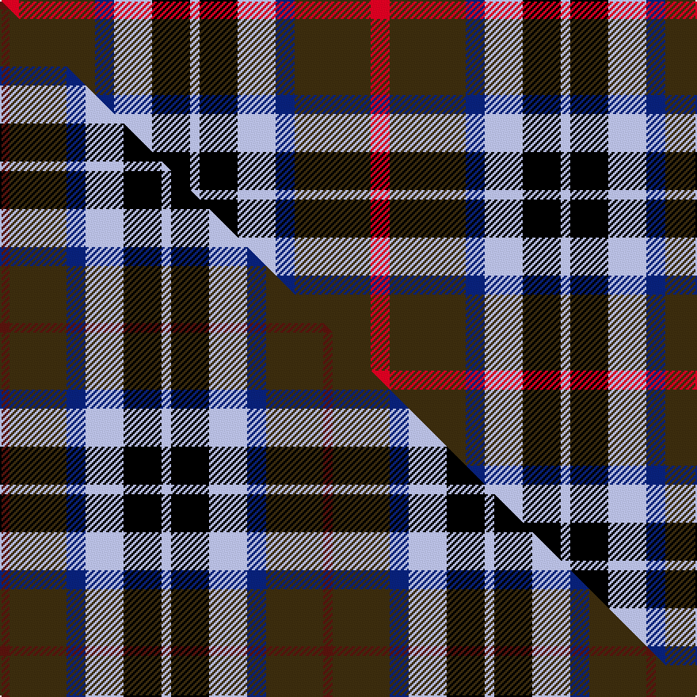

This is one **variant** — a specific cloth: this exact thread count and colourway, with its own
provenance below. It is one weaving of the [sett](/tartans/t/th/thompson-s-fancy/) (the scale-free proportion — the
same cloth at any scale or shade), whose colour order is pattern [RGBWKW](/stripes/rgbwkw/).

Part of the [Thompson's Fancy](/tartans/t/th/thompson-s-fancy/) tartan — the named design grouping this sett with its other cloths.

Sourced from house-of-tartan.  It is a [6 stripe tartan](/stripes/stripes6/).

Original link [http://www.house-of-tartan.scotland.net/house/TartanViewjs.asp?colr=Def&tnam=286](http://www.house-of-tartan.scotland.net/house/TartanViewjs.asp?colr=Def&tnam=286)

## Provenance

Earliest known date: pre 2003 Designed for his own use.

Dataset <small>— provenance for this record, inherited from the source manifest</small>

<dl class="dataset-prov">
<dt>source</dt><dd><a href="/sources/house-of-tartan/">House of Tartan</a></dd>
<dt>data captured from</dt><dd><a href="https://github.com/thetartan/tartan-database/blob/master/data/house-of-tartan/data.csv">https://github.com/thetartan/tartan-database/blob/master/data/house-of-tartan/data.csv</a></dd>
<dt>data date</dt><dd>pre 2003 <small>(this record)</small></dd>
<dt>licence</dt><dd><a href="https://creativecommons.org/licenses/by-nc-nd/4.0/">CC BY-NC-ND 4.0</a></dd>
</dl>

Capture chain <small>— the hands this data passed through, oldest first; each capture carries its own licence</small>

<ol class="capture-chain">
<li><a href="http://www.house-of-tartan.scotland.net/">House of Tartan</a> <small>the weaver/retailer's database — the site is now offline; the URL is kept as the ultimate source's identity</small></li>
<li><a href="https://github.com/thetartan/tartan-database">thetartan/tartan-database</a> <small>2016-2017</small> · <a href="https://creativecommons.org/licenses/by-nc-nd/4.0/">CC BY-NC-ND 4.0</a> <small>Levko Kravets's frozen compilation — the capture we vendored, and where its CC licence text came from</small></li>
<li>this dictionary <small>captured 2026-06-10 · commit 5bf86c7566</small> <small>each re-capture is a git commit to data/sources</small></li>
</ol>

## Thread count
R/12 DY48 DB12 LB24 K24 LB/6

One full sett is **234 threads**.

## Palette
<table><thead><tr><th>Colour</th><th>Shade</th><th>OKLCh</th></tr></thead><tbody><tr><td>LB</td><td><code style="background-color:#B5BBDE;">#B5BBDE</code> <small style="color:#888">#B5BBDE</small></td><td><small style="color:#888">oklch(79.9% 0.050 277.6)</small></td></tr><tr><td>DB</td><td><code style="background-color:#082077;">#082077</code> <small style="color:#888">#082077</small></td><td><small style="color:#888">oklch(30.0% 0.149 265.1)</small></td></tr><tr><td>K</td><td><code style="background-color:#000000;">#000000</code> <small style="color:#888">#000000</small></td><td><small style="color:#888">oklch(0.0% 0.000 0.0)</small></td></tr><tr><td>R</td><td><code style="background-color:#D60020;">#D60020</code> <small style="color:#888">#D60020</small></td><td><small style="color:#888">oklch(55.2% 0.224 25.5)</small></td></tr><tr><td>DY</td><td><code style="background-color:#3A2B0D;">#3A2B0D</code> <small style="color:#888">#3A2B0D</small></td><td><small style="color:#888">oklch(30.0% 0.049 82.0)</small></td></tr></tbody></table>

# Sample pattern

## Compared to the master

This cloth is one sett of its design; the master sett (the exemplar the design is anchored on) is below for comparison.

Its **ΔTartan distance** from the master is **0.37** — the same measure the nearest-tartans table ranks by (0 is identical; a re-scale of the same cloth is near 0, a recolour or a different proportion further).

<figure class="master-compare" style="margin:0">

this sett
master sett ★

<figcaption style="color:#888;font-size:smaller">One weave of this sett against the <a href="/setts/dr1dy6db2lb4k4lb1/">master sett ★</a>, split on the diagonal: a shared proportion runs seamlessly across it with only the shades shifting; a different proportion breaks on it.</figcaption>
</figure>

## Nearest tartan variants

The nearest existing variants by ΔTartan distance, with this cloth at the top so the swatches line up against it.

ΔTartan

Threads

Variant

Sett

—

234

<a href="/variants/s6/r2dy8db2lb4k4lb1~x6/">Thompson's Fancy Personal Tartan</a>

<a href="/ttd/edit/#slug=dr1dy6db2lb4k4lb1~x6&amp;base=r2dy8db2lb4k4lb1~x6" title="compare in the TTD">0.37</a>

204

<a href="/variants/s6/dr1dy6db2lb4k4lb1~x6/">Thompson's Fancy (Fashion)</a>

<a href="/ttd/edit/#slug=r2o8db2lb4k4lb1~x6&amp;base=r2dy8db2lb4k4lb1~x6" title="compare in the TTD">1.40</a>

234

<a href="/variants/s6/r2o8db2lb4k4lb1~x6/">Thom(p)son's, Fancy</a>

<a href="/ttd/edit/#slug=o3k17dt11o2oi20w2~x2~dt1600000-oi2500000&amp;base=r2dy8db2lb4k4lb1~x6" title="compare in the TTD">2.18</a>

210

<a href="/variants/s6/o3k17dt11o2oi20w2~x2~dt1600000-oi2500000/">Commonwealth Games Council (Corp.)</a>

<a href="/ttd/edit/#slug=r4n25k6w12k11y3~x2&amp;base=r2dy8db2lb4k4lb1~x6" title="compare in the TTD">2.24</a>

230

<a href="/variants/s6/r4n25k6w12k11y3~x2/">Thomson Dress (Grey) (Fashion)</a>

<a href="/ttd/edit/#slug=dp9k7g5r4g7k1y1~x2&amp;base=r2dy8db2lb4k4lb1~x6" title="compare in the TTD">2.34</a>

116

<a href="/variants/s7/dp9k7g5r4g7k1y1~x2/">MacLaren #2</a>

<a href="/ttd/edit/#slug=k4lb3g13dp12w2~x2&amp;base=r2dy8db2lb4k4lb1~x6" title="compare in the TTD">2.37</a>

124

<a href="/variants/s5/k4lb3g13dp12w2~x2/">Wilson's No 148</a>

<a href="/ttd/edit/#slug=db6g27db3k19dp27w3~x2&amp;base=r2dy8db2lb4k4lb1~x6" title="compare in the TTD">2.39</a>

322

<a href="/variants/s6/db6g27db3k19dp27w3~x2/">Gold Brothers</a>

<a href="/ttd/edit/#slug=r12n3g5db16y2g2~x2~n1604274-db0805267&amp;base=r2dy8db2lb4k4lb1~x6" title="compare in the TTD">2.41</a>

132

<a href="/variants/s6/r12dbi3g5db16y2g2~x2~dbi1604274-db0805267/">Dunbog, Primary School</a>

<a href="/ttd/edit/#slug=k4lb3g12dp13y2~x2&amp;base=r2dy8db2lb4k4lb1~x6" title="compare in the TTD">2.42</a>

124

<a href="/variants/s5/k4lb3g12dp13y2~x2/">Wilson's, No 176</a>

<a href="/ttd/edit/#slug=dp6k3dp21k23w3g24r3~x2&amp;base=r2dy8db2lb4k4lb1~x6" title="compare in the TTD">2.48</a>

314

<a href="/variants/s7/dp6k3dp21k23w3g24r3~x2/">Colquhoun #3</a>

## Neighbour map

Every grey dot is one of 13656 variants placed by the first two principal components of the ΔTartan feature space (42% of its variance). Red is this tartan; blue dots are its nearest — click one to open its page. The map is a flat projection of a many-dimensional space — [how to read it](/posts/neighbourhood-maps/).

<svg viewBox="0 0 640 380" role="img" style="max-width:100%;height:auto;border:1px solid #e0e0e0;border-radius:4px;display:block" xmlns="http://www.w3.org/2000/svg"><image href="/nn/cloud.v1.png" width="640" height="380"/><a href="/variants/s6/dr1dy6db2lb4k4lb1~x6/"><circle cx="90.7" cy="226.3" r="4" fill="#3465a4"><title>Thompson's Fancy (Fashion)</title></circle></a><a href="/variants/s6/r2o8db2lb4k4lb1~x6/"><circle cx="122.1" cy="206.5" r="4" fill="#3465a4"><title>Thom(p)son's, Fancy</title></circle></a><a href="/variants/s6/o3k17dt11o2oi20w2~x2~dt1600000-oi2500000/"><circle cx="128.5" cy="180.3" r="4" fill="#3465a4"><title>Commonwealth Games Council (Corp.)</title></circle></a><a href="/variants/s6/r4n25k6w12k11y3~x2/"><circle cx="124.8" cy="188.7" r="4" fill="#3465a4"><title>Thomson Dress (Grey) (Fashion)</title></circle></a><a href="/variants/s7/dp9k7g5r4g7k1y1~x2/"><circle cx="105.1" cy="203.1" r="4" fill="#3465a4"><title>MacLaren #2</title></circle></a><a href="/variants/s5/k4lb3g13dp12w2~x2/"><circle cx="134.1" cy="223.7" r="4" fill="#3465a4"><title>Wilson's No 148</title></circle></a><a href="/variants/s6/db6g27db3k19dp27w3~x2/"><circle cx="113.9" cy="197.6" r="4" fill="#3465a4"><title>Gold Brothers</title></circle></a><a href="/variants/s6/r12dbi3g5db16y2g2~x2~dbi1604274-db0805267/"><circle cx="180.6" cy="205.4" r="4" fill="#3465a4"><title>Dunbog, Primary School</title></circle></a><a href="/variants/s5/k4lb3g12dp13y2~x2/"><circle cx="137.2" cy="220.3" r="4" fill="#3465a4"><title>Wilson's, No 176</title></circle></a><a href="/variants/s7/dp6k3dp21k23w3g24r3~x2/"><circle cx="115.0" cy="186.3" r="4" fill="#3465a4"><title>Colquhoun #3</title></circle></a><circle cx="120.8" cy="208.0" r="5" fill="#c00000"/><text x="320" y="376" text-anchor="middle" font-size="11" fill="#999">ground</text><text x="11" y="190" text-anchor="middle" font-size="11" fill="#999" transform="rotate(-90 11 190)">complexity</text></svg>

ID: /variants/s6/r2dy8db2lb4k4lb1~x6/
