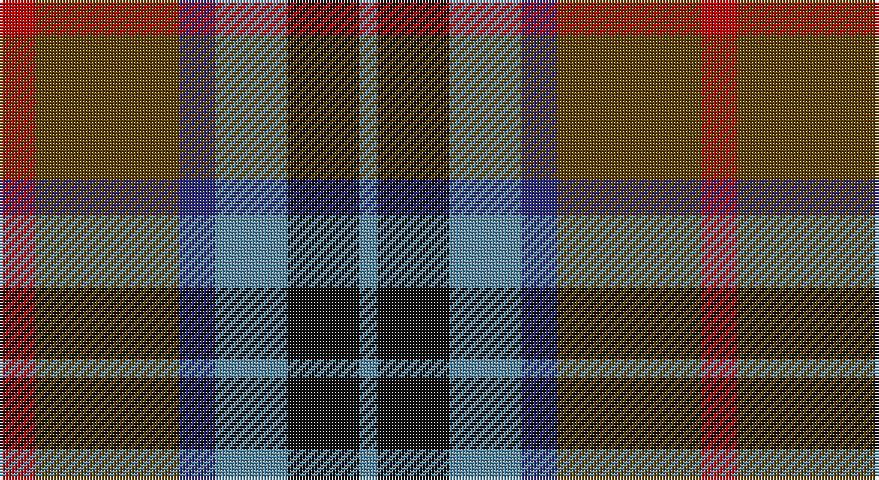

This page is one **sett** — a single exact thread-count. It belongs to the [tartan](/setts/r2dy8db2t4k4t1/)
(the same proportion at any scale), whose colour order is pattern [BKBBGR](/stripes/bkbbgr/).

Part of the [Thompson's Fancy](/tartans/thompson-s-fancy/) tartan — the named design grouping this sett with its other cloths.

Sourced from house-of-tartan.  It is a [6 stripe tartan](/stripes/stripes6/).

Original link http://www.house-of-tartan.scotland.net/house/TartanViewjs.asp?colr=Def&tnam=286

## Provenance

Earliest known date: pre 2003 Designed for his own use.

## Also known as

This cloth is also recorded under:

- Thompson's Fancy Personal

## Thread count
R/12 T48 DB12 B24 K24 B/6

One full sett is **234 threads**.

## Palette

Palette: <strong>Tartan Register</strong>
<table><thead><tr><th>Colour</th><th>Threads</th><th>Shade</th><th>Base</th><th>OKLCh</th></tr></thead><tbody><tr><td>R/</td><td style="text-align:right;font-variant-numeric:tabular-nums">12</td><td><code style="background-color:#C80000;">#C80000</code> <small style="color:#888">#C80000</small></td><td>R <code style="background-color:#CC0000;">#CC0000</code></td><td><small style="color:#888">oklch(52.3% 0.215 29.2)</small></td></tr><tr><td>T</td><td style="text-align:right;font-variant-numeric:tabular-nums">48</td><td><code style="background-color:#604000;">#604000</code> <small style="color:#888">#604000</small></td><td>G <code style="background-color:#006100;">#006100</code></td><td><small style="color:#888">oklch(39.8% 0.083 76.8)</small></td></tr><tr><td>DB</td><td style="text-align:right;font-variant-numeric:tabular-nums">12</td><td><code style="background-color:#2C2C80;">#2C2C80</code> <small style="color:#888">#2C2C80</small></td><td>B <code style="background-color:#2A418A;">#2A418A</code></td><td><small style="color:#888">oklch(35.0% 0.138 276.6)</small></td></tr><tr><td>B</td><td style="text-align:right;font-variant-numeric:tabular-nums">24</td><td><code style="background-color:#5C8CA8;">#5C8CA8</code> <small style="color:#888">#5C8CA8</small></td><td>B <code style="background-color:#2A418A;">#2A418A</code></td><td><small style="color:#888">oklch(61.7% 0.067 235.0)</small></td></tr><tr><td>K</td><td style="text-align:right;font-variant-numeric:tabular-nums">24</td><td><code style="background-color:#101010;">#101010</code> <small style="color:#888">#101010</small></td><td>K <code style="background-color:#000000;">#000000</code></td><td><small style="color:#888">oklch(17.3% 0.000 89.9)</small></td></tr><tr><td>B/</td><td style="text-align:right;font-variant-numeric:tabular-nums">6</td><td><code style="background-color:#5C8CA8;">#5C8CA8</code> <small style="color:#888">#5C8CA8</small></td><td>B <code style="background-color:#2A418A;">#2A418A</code></td><td><small style="color:#888">oklch(61.7% 0.067 235.0)</small></td></tr></tbody></table>

# Sample pattern

## Compared to the master

This cloth is one sett of its design; the master sett (the exemplar the design is anchored on) is below for comparison.

<figure style="margin:0"><figcaption style="color:#888;font-size:smaller">this sett</figcaption></figure>
<figure style="margin:0"><figcaption style="color:#888;font-size:smaller"><a href="/setts/r1dy6db2lb4k4lb1/">master sett →</a></figcaption></figure>

## Nearest tartans

The nearest existing variants by ΔTartan distance, with this tartan at the top so the swatches line up against it.

ΔTartan

Tartan

Sett

—

<a href="/ttd/edit/#slug=r2dy8db2t4k4t1~x6">Thompson's Fancy Personal Tartan</a> <a class="nn-out" href="/variants/s6/r2dy8db2t4k4t1~x6/" title="open its dictionary page">↗</a>

0.76

<a href="/ttd/edit/#slug=r10db6g24dbi24r6ly3&amp;base=r2dy8db2t4k4t1~x6">Canine All Dogs (Fashion)</a> <a class="nn-out" href="/variants/s6/r10db6g24dbi24r6ly3/" title="open its dictionary page">↗</a>

0.93

<a href="/ttd/edit/#slug=dp9k7dg5r4dg7k1ly1~x2&amp;base=r2dy8db2t4k4t1~x6">MacLaren #2</a> <a class="nn-out" href="/variants/s7/dp9k7dg5r4dg7k1ly1~x2/" title="open its dictionary page">↗</a>

0.93

<a href="/ttd/edit/#slug=g3db12w1dg12r12dg2~x2&amp;base=r2dy8db2t4k4t1~x6">Patterson, John (Personal)</a> <a class="nn-out" href="/variants/s6/g3db12w1dg12r12dg2~x2/" title="open its dictionary page">↗</a>

1.00

<a href="/ttd/edit/#slug=m6y2db12k2y12m9k2lo2~x2&amp;base=r2dy8db2t4k4t1~x6">Orkney</a> <a class="nn-out" href="/variants/s8/m6y2db12k2y12m9k2lo2~x2/" title="open its dictionary page">↗</a>

1.00

<a href="/ttd/edit/#slug=r2lo8db2y4k4y1~x6&amp;base=r2dy8db2t4k4t1~x6">Thompson (J.C.'s Fancy) (Personal)</a> <a class="nn-out" href="/variants/s6/r2lo8db2y4k4y1~x6/" title="open its dictionary page">↗</a>

1.06

<a href="/ttd/edit/#slug=r2o8db2t4k4t1~x6&amp;base=r2dy8db2t4k4t1~x6">Thom(p)son's, Fancy</a> <a class="nn-out" href="/variants/s6/r2o8db2t4k4t1~x6/" title="open its dictionary page">↗</a>

1.07

<a href="/ttd/edit/#slug=dgi3db12w1dg12r12dg2~x2&amp;base=r2dy8db2t4k4t1~x6">Patterson, John (Personal)</a> <a class="nn-out" href="/variants/s6/dgi3db12w1dg12r12dg2~x2/" title="open its dictionary page">↗</a>

1.07

<a href="/ttd/edit/#slug=db9r24dg24k24db24ly2db9&amp;base=r2dy8db2t4k4t1~x6">Dundas</a> <a class="nn-out" href="/variants/s7/db9r24dg24k24db24ly2db9/" title="open its dictionary page">↗</a>

1.10

<a href="/ttd/edit/#slug=k4b21dy10y4k20r6b3~x2&amp;base=r2dy8db2t4k4t1~x6">Swankie (Personal)</a> <a class="nn-out" href="/variants/s7/k4b21dy10y4k20r6b3~x2/" title="open its dictionary page">↗</a>

1.10

<a href="/ttd/edit/#slug=dp27db4k27g27lo4~x2&amp;base=r2dy8db2t4k4t1~x6">Selkirk (Personal)</a> <a class="nn-out" href="/variants/s5/dp27db4k27g27lo4~x2/" title="open its dictionary page">↗</a>

## Neighbour map

Every grey dot is one of 14360 variants placed by the first two principal components of the ΔTartan feature space (44% of its variance). Red is this tartan; blue dots are its nearest — click one to open its page.

<svg viewBox="0 0 640 380" role="img" style="max-width:100%;height:auto;border:1px solid #e0e0e0;border-radius:4px;display:block" xmlns="http://www.w3.org/2000/svg"><image href="/nn/cloud.v1.png" width="640" height="380"/><a href="/variants/s6/r10db6g24dbi24r6ly3/"><circle cx="141.9" cy="215.2" r="4" fill="#3465a4"><title>Canine All Dogs (Fashion)</title></circle></a><a href="/variants/s7/dp9k7dg5r4dg7k1ly1~x2/"><circle cx="143.5" cy="222.2" r="4" fill="#3465a4"><title>MacLaren #2</title></circle></a><a href="/variants/s6/g3db12w1dg12r12dg2~x2/"><circle cx="168.9" cy="200.8" r="4" fill="#3465a4"><title>Patterson, John (Personal)</title></circle></a><a href="/variants/s8/m6y2db12k2y12m9k2lo2~x2/"><circle cx="141.2" cy="218.7" r="4" fill="#3465a4"><title>Orkney</title></circle></a><a href="/variants/s6/r2lo8db2y4k4y1~x6/"><circle cx="143.6" cy="213.0" r="4" fill="#3465a4"><title>Thompson (J.C.'s Fancy) (Personal)</title></circle></a><a href="/variants/s6/r2o8db2t4k4t1~x6/"><circle cx="135.0" cy="212.1" r="4" fill="#3465a4"><title>Thom(p)son's, Fancy</title></circle></a><a href="/variants/s6/dgi3db12w1dg12r12dg2~x2/"><circle cx="162.9" cy="196.7" r="4" fill="#3465a4"><title>Patterson, John (Personal)</title></circle></a><a href="/variants/s7/db9r24dg24k24db24ly2db9/"><circle cx="148.0" cy="216.1" r="4" fill="#3465a4"><title>Dundas</title></circle></a><a href="/variants/s7/k4b21dy10y4k20r6b3~x2/"><circle cx="147.2" cy="214.6" r="4" fill="#3465a4"><title>Swankie (Personal)</title></circle></a><a href="/variants/s5/dp27db4k27g27lo4~x2/"><circle cx="136.0" cy="244.5" r="4" fill="#3465a4"><title>Selkirk (Personal)</title></circle></a><circle cx="163.1" cy="226.4" r="5" fill="#c00000"/></svg>

ID: /variants/s6/r2dy8db2t4k4t1~x6/
