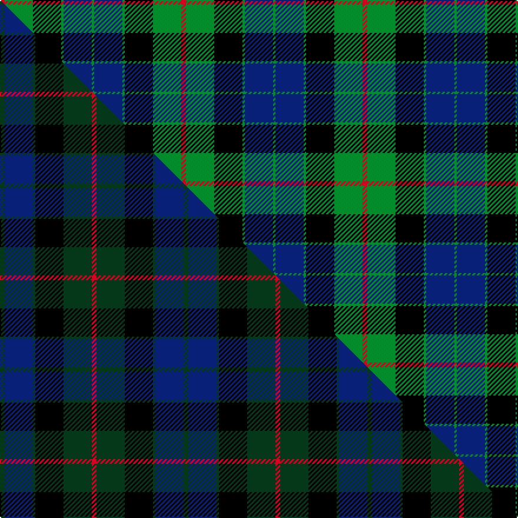

This page is one **sett** — a single exact thread-count. It belongs to the [tartan](/setts/r2g12k12g1db12g1/)
(the same proportion at any scale), whose colour order is pattern [GBGKGR](/stripes/gbgkgr/).

Part of the [Gunn](/tartans/gunn-2/) tartan — the named design grouping this sett with its other cloths.

Sourced from weddslist.  It is a [6 stripe tartan](/stripes/stripes6/).

Original link http://www.weddslist.com/cgi-bin/tartans/pg.pl?source=sts

## Provenance

Earliest known date: c.1810-15 The Cockburn collection, housed in the Mitchell library in Glasgow, contains some of the oldest actual specimens of clan tartans in existance today. James Logan recorded the sett in his book 'The Scottish Gael' in 1831. The central blue stripes are often reproduced in black or very dark blue, giving the impression of four equally toned stripes.

2 attestations — the source records this cloth was collapsed from (oldest owns this page)

<ul>
<li>undated — Gunn (weddslist, <a href="http://www.weddslist.com/cgi-bin/tartans/pg.pl?source=sts">record</a>) </li>
<li>undated — Gunn Clan Tartan (house-of-tartan, <a href="http://www.house-of-tartan.scotland.net/house/TartanViewjs.asp?colr=Def&tnam=708">record</a>) </li>
</ul>

Dataset <small>— provenance for this record, inherited from the source manifest</small>

<dl class="dataset-prov">
<dt>source</dt><dd><a href="/sources/weddslist/">Weddslist</a></dd>
<dt>data captured from</dt><dd><a href="https://github.com/thetartan/tartan-database/blob/master/data/weddslist/data.csv">https://github.com/thetartan/tartan-database/blob/master/data/weddslist/data.csv</a></dd>
<dt>data date</dt><dd>2016-11-17 <small>(dataset default)</small></dd>
<dt>licence</dt><dd><a href="https://creativecommons.org/licenses/by-nc-nd/4.0/">CC BY-NC-ND 4.0</a></dd>
</dl>

Capture chain <small>— the hands this data passed through, oldest first; each capture carries its own licence</small>

<ol class="capture-chain">
<li><a href="https://www.weddslist.com/tartans/">Weddslist</a> <small>the living privately compiled reference</small></li>
<li><a href="https://github.com/thetartan/tartan-database">thetartan/tartan-database</a> <small>2016-2017</small> · <a href="https://creativecommons.org/licenses/by-nc-nd/4.0/">CC BY-NC-ND 4.0</a> <small>Levko Kravets's frozen compilation — the capture we vendored, and where its CC licence text came from</small></li>
<li>this dictionary <small>captured 2026-06-10 · commit 5bf86c7566</small> <small>each re-capture is a git commit to data/sources</small></li>
</ol>

## Thread count
R/4 G24 K24 G2 DB24 G/2

One full sett is **154 threads**.

## Palette
<table><thead><tr><th>Colour</th><th>Shade</th><th>OKLCh</th></tr></thead><tbody><tr><td>DB</td><td><code style="background-color:#082077;">#082077</code> <small style="color:#888">#082077</small></td><td><small style="color:#888">oklch(30.0% 0.149 265.1)</small></td></tr><tr><td>G</td><td><code style="background-color:#008B2A;">#008B2A</code> <small style="color:#888">#008B2A</small></td><td><small style="color:#888">oklch(55.4% 0.170 145.9)</small></td></tr><tr><td>K</td><td><code style="background-color:#000000;">#000000</code> <small style="color:#888">#000000</small></td><td><small style="color:#888">oklch(0.0% 0.000 0.0)</small></td></tr><tr><td>R</td><td><code style="background-color:#D60020;">#D60020</code> <small style="color:#888">#D60020</small></td><td><small style="color:#888">oklch(55.2% 0.224 25.5)</small></td></tr></tbody></table>

# Sample pattern

## Compared to the master

This cloth is one sett of its design; the master sett (the exemplar the design is anchored on) is below for comparison.

Its **ΔTartan distance** from the master is **0.22** — the same measure the nearest-tartans table ranks by (0 is identical; a re-scale of the same cloth is near 0, a recolour or a different proportion further).

<figure class="master-compare" style="margin:0">

this sett
master sett ★

<figcaption style="color:#888;font-size:smaller">One weave of this sett against the <a href="/setts/dg2db12dg1k12dg12r2/">master sett ★</a>, split on the diagonal: a shared proportion runs seamlessly across it with only the shades shifting; a different proportion breaks on it.</figcaption>
</figure>

## Nearest tartan variants

The nearest existing variants by ΔTartan distance, with this cloth at the top so the swatches line up against it.

ΔTartan

Threads

Variant

Sett

—

154

<a href="/variants/s6/r2g12k12g1db12g1~x2/">Gunn</a>

<a href="/ttd/edit/#slug=r2g12k12g1db12g2&amp;base=r2g12k12g1db12g1~x2" title="compare in the TTD">0.07</a>

78

<a href="/variants/s6/r2g12k12g1db12g2/">Gunn</a>

<a href="/ttd/edit/#slug=r2g12k12g1db12g2~x2&amp;base=r2g12k12g1db12g1~x2" title="compare in the TTD">0.07</a>

156

<a href="/variants/s6/r2g12k12g1db12g2~x2/">Gunn</a>

<a href="/ttd/edit/#slug=k2g10k9db9r1k1db2~x2&amp;base=r2g12k12g1db12g1~x2" title="compare in the TTD">1.39</a>

128

<a href="/variants/s7/k2g10k9db9r1k1db2~x2/">Reid and Taylor</a>

<a href="/ttd/edit/#slug=db6k2db18k18g18k3r2~x2&amp;base=r2g12k12g1db12g1~x2" title="compare in the TTD">1.63</a>

252

<a href="/variants/s7/db6k2db18k18g18k3r2~x2/">Renfrew</a>

<a href="/ttd/edit/#slug=r4k4db24k24g24k2r3~x2&amp;base=r2g12k12g1db12g1~x2" title="compare in the TTD">1.72</a>

326

<a href="/variants/s7/r4k4db24k24g24k2r3~x2/">Black Watch</a>

<a href="/ttd/edit/#slug=k7g22k22db6r2db15r2~x2&amp;base=r2g12k12g1db12g1~x2" title="compare in the TTD">1.79</a>

286

<a href="/variants/s7/k7g22k22db6r2db15r2~x2/">National Galleries of Scotland</a>

<a href="/ttd/edit/#slug=db2g1db16r1k12g16r1g2~x2&amp;base=r2g12k12g1db12g1~x2" title="compare in the TTD">1.80</a>

196

<a href="/variants/s8/db2g1db16r1k12g16r1g2~x2/">Lochaber District</a>

<a href="/ttd/edit/#slug=db4r1db18k20g18r1g4~x2&amp;base=r2g12k12g1db12g1~x2" title="compare in the TTD">1.83</a>

248

<a href="/variants/s7/db4r1db18k20g18r1g4~x2/">Blair (Name)</a>

<a href="/ttd/edit/#slug=dg4r1dg18k20db18r1db4~x2~dg1806142-r2109032-db1406275&amp;base=r2g12k12g1db12g1~x2" title="compare in the TTD">1.83</a>

248

<a href="/variants/s7/dg4r1dg18k20db18r1db4~x2~dg1806142-r2109032-db1406275/">Blair</a>

<a href="/ttd/edit/#slug=r3k2db25k28g25k2r3~x2&amp;base=r2g12k12g1db12g1~x2" title="compare in the TTD">1.88</a>

340

<a href="/variants/s7/r3k2db25k28g25k2r3~x2/">Coarse Kilt</a>

## Neighbour map

Every grey dot is one of 13620 variants placed by the first two principal components of the ΔTartan feature space (42% of its variance). Red is this tartan; blue dots are its nearest — click one to open its page.

<svg viewBox="0 0 640 380" role="img" style="max-width:100%;height:auto;border:1px solid #e0e0e0;border-radius:4px;display:block" xmlns="http://www.w3.org/2000/svg"><image href="/nn/cloud.v1.png" width="640" height="380"/><a href="/variants/s6/r2g12k12g1db12g2/"><circle cx="161.9" cy="198.1" r="4" fill="#3465a4"><title>Gunn</title></circle></a><a href="/variants/s6/r2g12k12g1db12g2~x2/"><circle cx="161.9" cy="198.1" r="4" fill="#3465a4"><title>Gunn</title></circle></a><a href="/variants/s7/k2g10k9db9r1k1db2~x2/"><circle cx="155.8" cy="193.1" r="4" fill="#3465a4"><title>Reid and Taylor</title></circle></a><a href="/variants/s7/db6k2db18k18g18k3r2~x2/"><circle cx="155.4" cy="200.1" r="4" fill="#3465a4"><title>Renfrew</title></circle></a><a href="/variants/s7/r4k4db24k24g24k2r3~x2/"><circle cx="151.5" cy="179.5" r="4" fill="#3465a4"><title>Black Watch</title></circle></a><a href="/variants/s7/k7g22k22db6r2db15r2~x2/"><circle cx="157.7" cy="192.5" r="4" fill="#3465a4"><title>National Galleries of Scotland</title></circle></a><a href="/variants/s8/db2g1db16r1k12g16r1g2~x2/"><circle cx="189.3" cy="154.9" r="4" fill="#3465a4"><title>Lochaber District</title></circle></a><a href="/variants/s7/db4r1db18k20g18r1g4~x2/"><circle cx="176.7" cy="165.9" r="4" fill="#3465a4"><title>Blair (Name)</title></circle></a><a href="/variants/s7/dg4r1dg18k20db18r1db4~x2~dg1806142-r2109032-db1406275/"><circle cx="196.4" cy="170.2" r="4" fill="#3465a4"><title>Blair</title></circle></a><a href="/variants/s7/r3k2db25k28g25k2r3~x2/"><circle cx="167.5" cy="167.4" r="4" fill="#3465a4"><title>Coarse Kilt</title></circle></a><circle cx="160.0" cy="194.2" r="5" fill="#c00000"/><text x="320" y="376" text-anchor="middle" font-size="11" fill="#999">ground</text><text x="11" y="190" text-anchor="middle" font-size="11" fill="#999" transform="rotate(-90 11 190)">complexity</text></svg>

ID: /variants/s6/r2g12k12g1db12g1~x2/
