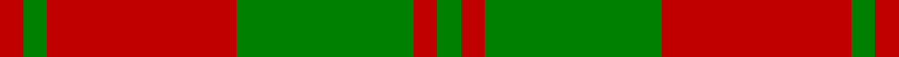

This is one **variant** — a specific cloth: this exact thread count and colourway, with its own
provenance below. It is one weaving of the [sett](/setts/r2g2r16g15r2g2/) (the scale-free proportion — the
same cloth at any scale or shade), whose colour order is pattern [GRGRGR](/stripes/grgrgr/).

Part of the [Unidentified NW Highlands](/tartans/u/un/unidentified-nw-highlands/) tartan — the named design grouping this sett with its other cloths.

Sourced from register-of-tartans.  It is a [6 stripe tartan](/stripes/stripes6/).

Original link [https://www.tartanregister.gov.uk/tartanDetails.aspx?ref=4335](https://www.tartanregister.gov.uk/tartanDetails.aspx?ref=4335)

2 attestations — the source records this cloth was collapsed from (oldest owns this page)

<ul>
<li>undated — Unidentified NW Highlands (register-of-tartans, <a href="https://www.tartanregister.gov.uk/tartanDetails.aspx?ref=4335">record</a>)  <em>J Telfer Dunbar collection, found in the Scottish Tartans Society archive.</em></li>
<li>undated — Unidentified, NW Highlands (weddslist, <a href="http://www.weddslist.com/cgi-bin/tartans/pg.pl?source=sts">record</a>) </li>
</ul>

Dataset <small>— provenance for this record, inherited from the source manifest</small>

<dl class="dataset-prov">
<dt>source</dt><dd><a href="/sources/register-of-tartans/">Scottish Register of Tartans</a></dd>
<dt>data captured from</dt><dd><a href="https://github.com/thetartan/tartan-database/blob/master/data/register-of-tartans/data.csv">https://github.com/thetartan/tartan-database/blob/master/data/register-of-tartans/data.csv</a></dd>
<dt>data date</dt><dd>2017-01-06 <small>(dataset default)</small></dd>
<dt>licence</dt><dd><a href="https://www.tartanregister.gov.uk/copyright">Crown copyright</a></dd>
</dl>

Capture chain <small>— the hands this data passed through, oldest first; each capture carries its own licence</small>

<ol class="capture-chain">
<li><a href="https://www.tartanregister.gov.uk/">Scottish Register of Tartans</a> · <a href="https://www.tartanregister.gov.uk/copyright">Crown copyright</a> <small>the living register — still published by National Records of Scotland</small></li>
<li><a href="https://github.com/thetartan/tartan-database">thetartan/tartan-database</a> <small>2016-2017</small> · <a href="https://creativecommons.org/licenses/by-nc-nd/4.0/">CC BY-NC-ND 4.0</a> <small>Levko Kravets's frozen compilation — the capture we vendored, and where its CC licence text came from</small></li>
<li>this dictionary <small>captured 2026-06-10 · commit 5bf86c7566</small> <small>each re-capture is a git commit to data/sources</small></li>
</ol>

## Register references

External register numbers recorded for this tartan.

- Scottish Register of Tartans: [4335](https://www.tartanregister.gov.uk/tartanDetails.aspx?ref=4335)
- Scottish Tartans World Register: 900

## Thread count
R/4 G4 R32 G30 R4 G/4

One full sett is **148 threads**.

## Palette
<table><thead><tr><th>Colour</th><th>Shade</th><th>OKLCh</th></tr></thead><tbody><tr><td>G</td><td><code style="background-color:#008B2A;">#008B2A</code> <small style="color:#888">#008B2A</small></td><td><small style="color:#888">oklch(55.4% 0.170 145.9)</small></td></tr><tr><td>R</td><td><code style="background-color:#D60020;">#D60020</code> <small style="color:#888">#D60020</small></td><td><small style="color:#888">oklch(55.2% 0.224 25.5)</small></td></tr></tbody></table>

# Sample pattern

## Nearest tartan variants

The nearest existing variants by ΔTartan distance, with this cloth at the top so the swatches line up against it.

ΔTartan

Threads

Variant

Sett

—

148

<a href="/variants/s6/r2g2r16g15r2g2~x2/">Unidentified NW Highlands</a>

<a href="/ttd/edit/#slug=g6r1g24r28g1r4~x2&amp;base=r2g2r16g15r2g2~x2" title="compare in the TTD">0.60</a>

236

<a href="/variants/s6/g6r1g24r28g1r4~x2/">Erskine (Green &amp; Red) Clan Tartan</a>

<a href="/ttd/edit/#slug=dg6r1dg24r28dg1r4~x2&amp;base=r2g2r16g15r2g2~x2" title="compare in the TTD">0.67</a>

236

<a href="/variants/s6/dg6r1dg24r28dg1r4~x2/">Erskine (Vestiarium Scoticum)</a>

<a href="/ttd/edit/#slug=r16g1r1g1r4g12~x4&amp;base=r2g2r16g15r2g2~x2" title="compare in the TTD">0.77</a>

168

<a href="/variants/s6/r16g1r1g1r4g12~x4/">MacQuarrie #5</a>

<a href="/ttd/edit/#slug=r16g1r1g1r4g12&amp;base=r2g2r16g15r2g2~x2" title="compare in the TTD">0.77</a>

42

<a href="/variants/s6/r16g1r1g1r4g12/">MacQuarrie</a>

<a href="/ttd/edit/#slug=r16g1r1g1r4g12~x2&amp;base=r2g2r16g15r2g2~x2" title="compare in the TTD">0.77</a>

84

<a href="/variants/s6/r16g1r1g1r4g12~x2/">MacQuarie</a>

<a href="/ttd/edit/#slug=r16dg1r1dg1r4dg12~x2&amp;base=r2g2r16g15r2g2~x2" title="compare in the TTD">0.81</a>

84

<a href="/variants/s6/r16dg1r1dg1r4dg12~x2/">MacQuarrie Clan Tartan</a>

<a href="/ttd/edit/#slug=r1g14r1g1r14g1w1~x2&amp;base=r2g2r16g15r2g2~x2" title="compare in the TTD">0.92</a>

128

<a href="/variants/s7/r1g14r1g1r14g1w1~x2/">MacKintosh Fragment</a>

<a href="/ttd/edit/#slug=db9r6g2r6g18r6g2&amp;base=r2g2r16g15r2g2~x2" title="compare in the TTD">1.58</a>

87

<a href="/variants/s7/db9r6g2r6g18r6g2/">Skene D</a>

<a href="/ttd/edit/#slug=db9r6g2r6g18r6g2~x2&amp;base=r2g2r16g15r2g2~x2" title="compare in the TTD">1.58</a>

174

<a href="/variants/s7/db9r6g2r6g18r6g2~x2/">Skene D</a>

<a href="/ttd/edit/#slug=g8r2g9r16g1~x2&amp;base=r2g2r16g15r2g2~x2" title="compare in the TTD">1.59</a>

126

<a href="/variants/s5/g8r2g9r16g1~x2/">MacGregor of Glen Straye Htg Clan Tartan</a>

## Neighbour map

Every grey dot is one of 13621 variants placed by the first two principal components of the ΔTartan feature space (42% of its variance). Red is this tartan; blue dots are its nearest — click one to open its page. The map is a flat projection of a many-dimensional space — [how to read it](/posts/neighbourhood-maps/).

<svg viewBox="0 0 640 380" role="img" style="max-width:100%;height:auto;border:1px solid #e0e0e0;border-radius:4px;display:block" xmlns="http://www.w3.org/2000/svg"><image href="/nn/cloud.v1.png" width="640" height="380"/><a href="/variants/s6/g6r1g24r28g1r4~x2/"><circle cx="432.3" cy="193.8" r="4" fill="#3465a4"><title>Erskine (Green &amp; Red) Clan Tartan</title></circle></a><a href="/variants/s6/dg6r1dg24r28dg1r4~x2/"><circle cx="421.6" cy="184.7" r="4" fill="#3465a4"><title>Erskine (Vestiarium Scoticum)</title></circle></a><a href="/variants/s6/r16g1r1g1r4g12~x4/"><circle cx="451.4" cy="210.9" r="4" fill="#3465a4"><title>MacQuarrie #5</title></circle></a><a href="/variants/s6/r16g1r1g1r4g12/"><circle cx="451.4" cy="210.9" r="4" fill="#3465a4"><title>MacQuarrie</title></circle></a><a href="/variants/s6/r16g1r1g1r4g12~x2/"><circle cx="451.4" cy="210.9" r="4" fill="#3465a4"><title>MacQuarie</title></circle></a><a href="/variants/s6/r16dg1r1dg1r4dg12~x2/"><circle cx="439.9" cy="202.5" r="4" fill="#3465a4"><title>MacQuarrie Clan Tartan</title></circle></a><a href="/variants/s7/r1g14r1g1r14g1w1~x2/"><circle cx="370.2" cy="184.2" r="4" fill="#3465a4"><title>MacKintosh Fragment</title></circle></a><a href="/variants/s7/db9r6g2r6g18r6g2/"><circle cx="263.9" cy="237.8" r="4" fill="#3465a4"><title>Skene D</title></circle></a><a href="/variants/s7/db9r6g2r6g18r6g2~x2/"><circle cx="263.9" cy="237.8" r="4" fill="#3465a4"><title>Skene D</title></circle></a><a href="/variants/s5/g8r2g9r16g1~x2/"><circle cx="396.0" cy="245.4" r="4" fill="#3465a4"><title>MacGregor of Glen Straye Htg Clan Tartan</title></circle></a><circle cx="389.8" cy="243.9" r="5" fill="#c00000"/><text x="320" y="376" text-anchor="middle" font-size="11" fill="#999">ground</text><text x="11" y="190" text-anchor="middle" font-size="11" fill="#999" transform="rotate(-90 11 190)">complexity</text></svg>

ID: /variants/s6/r2g2r16g15r2g2~x2/
