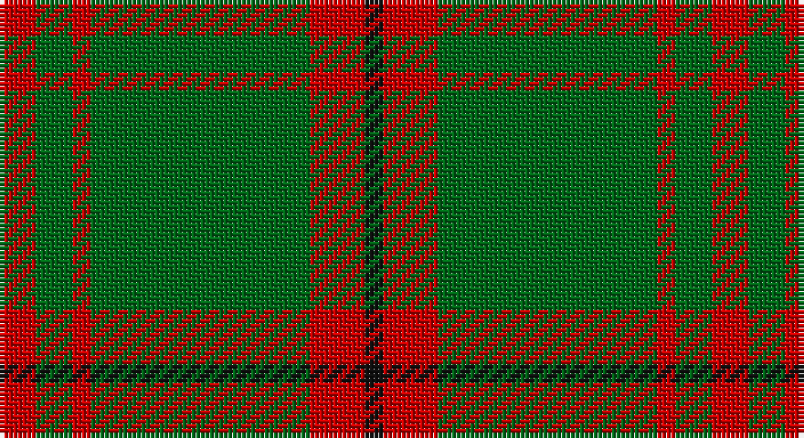

This page is one **sett** — a single exact thread-count. It belongs to the [tartan](/setts/r2g2r1g12r3k1/)
(the same proportion at any scale), whose colour order is pattern [KRGRGR](/stripes/krgrgr/).

Part of the [Connell](/tartans/connell/) tartan — the named design grouping this sett with its other cloths.

Sourced from tartans-authority.  It is a [6 stripe tartan](/stripes/stripes6/).

Original link http://www.tartansauthority.com/tartan-ferret/display/3066/

## Register references

External register numbers recorded for this tartan.

- Scottish Tartans Authority (ITI): 3066

## Thread count
R/8 G8 R4 G48 R12 K/4

One full sett is **156 threads**.

## Palette

Palette: <strong>Tartan Register</strong>
<table><thead><tr><th>Colour</th><th>Threads</th><th>Shade</th><th>Base</th><th>OKLCh</th></tr></thead><tbody><tr><td>R/</td><td style="text-align:right;font-variant-numeric:tabular-nums">8</td><td><code style="background-color:#C80000;">#C80000</code> <small style="color:#888">#C80000</small></td><td>R <code style="background-color:#CC0000;">#CC0000</code></td><td><small style="color:#888">oklch(52.3% 0.215 29.2)</small></td></tr><tr><td>G</td><td style="text-align:right;font-variant-numeric:tabular-nums">8</td><td><code style="background-color:#006818;">#006818</code> <small style="color:#888">#006818</small></td><td>G <code style="background-color:#006100;">#006100</code></td><td><small style="color:#888">oklch(45.0% 0.142 145.0)</small></td></tr><tr><td>R</td><td style="text-align:right;font-variant-numeric:tabular-nums">4</td><td><code style="background-color:#C80000;">#C80000</code> <small style="color:#888">#C80000</small></td><td>R <code style="background-color:#CC0000;">#CC0000</code></td><td><small style="color:#888">oklch(52.3% 0.215 29.2)</small></td></tr><tr><td>G</td><td style="text-align:right;font-variant-numeric:tabular-nums">48</td><td><code style="background-color:#006818;">#006818</code> <small style="color:#888">#006818</small></td><td>G <code style="background-color:#006100;">#006100</code></td><td><small style="color:#888">oklch(45.0% 0.142 145.0)</small></td></tr><tr><td>R</td><td style="text-align:right;font-variant-numeric:tabular-nums">12</td><td><code style="background-color:#C80000;">#C80000</code> <small style="color:#888">#C80000</small></td><td>R <code style="background-color:#CC0000;">#CC0000</code></td><td><small style="color:#888">oklch(52.3% 0.215 29.2)</small></td></tr><tr><td>K/</td><td style="text-align:right;font-variant-numeric:tabular-nums">4</td><td><code style="background-color:#101010;">#101010</code> <small style="color:#888">#101010</small></td><td>K <code style="background-color:#000000;">#000000</code></td><td><small style="color:#888">oklch(17.3% 0.000 89.9)</small></td></tr></tbody></table>

# Sample pattern

## Compared to the master

This cloth is one sett of its design; the master sett (the exemplar the design is anchored on) is below for comparison.

<figure style="margin:0"><figcaption style="color:#888;font-size:smaller">this sett</figcaption></figure>
<figure style="margin:0"><figcaption style="color:#888;font-size:smaller"><a href="/setts/r3g12r1g2r2g2r1g12r3k1/">master sett →</a></figcaption></figure>

## Nearest tartans

The nearest existing variants by ΔTartan distance, with this tartan at the top so the swatches line up against it.

ΔTartan

Tartan

Sett

—

<a href="/ttd/edit/#slug=r2g2r1g12r3k1~x4">Connell (Personal?)</a> <a class="nn-out" href="/variants/s6/r2g2r1g12r3k1~x4/" title="open its dictionary page">↗</a>

1.03

<a href="/ttd/edit/#slug=g9ri4g1ri4g15r4g1~x4&amp;base=r2g2r1g12r3k1~x4">Logan #4</a> <a class="nn-out" href="/variants/s7/g9ri4g1ri4g15r4g1~x4/" title="open its dictionary page">↗</a>

1.16

<a href="/ttd/edit/#slug=g3r16g4k6g28r2g3~x2&amp;base=r2g2r1g12r3k1~x4">Maxwell Htg (Clan)</a> <a class="nn-out" href="/variants/s7/g3r16g4k6g28r2g3~x2/" title="open its dictionary page">↗</a>

1.17

<a href="/ttd/edit/#slug=dg10o1dg1o1lr2dg1o1~x4&amp;base=r2g2r1g12r3k1~x4">Green Watch</a> <a class="nn-out" href="/variants/s7/dg10o1dg1o1lr2dg1o1~x4/" title="open its dictionary page">↗</a>

1.22

<a href="/ttd/edit/#slug=lo1dg11k6dg3lo1dg1lo1~x4&amp;base=r2g2r1g12r3k1~x4">Angle, Green (Fashion)</a> <a class="nn-out" href="/variants/s7/lo1dg11k6dg3lo1dg1lo1~x4/" title="open its dictionary page">↗</a>

1.24

<a href="/ttd/edit/#slug=dg37o9dg3r9o3~x2&amp;base=r2g2r1g12r3k1~x4">Glen Trool</a> <a class="nn-out" href="/variants/s5/dg37o9dg3r9o3~x2/" title="open its dictionary page">↗</a>

1.24

<a href="/ttd/edit/#slug=g10r4g1r4g15ri4g1~x4&amp;base=r2g2r1g12r3k1~x4">Logan</a> <a class="nn-out" href="/variants/s7/g10r4g1r4g15ri4g1~x4/" title="open its dictionary page">↗</a>

1.25

<a href="/ttd/edit/#slug=g34m4g4m4g4m12g20w5~x2&amp;base=r2g2r1g12r3k1~x4">Leeds, University of (Dance)</a> <a class="nn-out" href="/variants/s8/g34m4g4m4g4m12g20w5~x2/" title="open its dictionary page">↗</a>

1.28

<a href="/ttd/edit/#slug=r3g12r1g2r2g2r1g12r3k1~x4&amp;base=r2g2r1g12r3k1~x4">Connell (Dalgliesh) (Personal)</a> <a class="nn-out" href="/variants/s10/r3g12r1g2r2g2r1g12r3k1~x4/" title="open its dictionary page">↗</a>

1.36

<a href="/ttd/edit/#slug=g24r4g3k14g5r2g10~x2&amp;base=r2g2r1g12r3k1~x4">Northcroft (Personal)</a> <a class="nn-out" href="/variants/s7/g24r4g3k14g5r2g10~x2/" title="open its dictionary page">↗</a>

1.42

<a href="/ttd/edit/#slug=m2g1m1g10w1~x4&amp;base=r2g2r1g12r3k1~x4">Welsh National District Tartan</a> <a class="nn-out" href="/variants/s5/m2g1m1g10w1~x4/" title="open its dictionary page">↗</a>

## Neighbour map

Every grey dot is one of 14360 variants placed by the first two principal components of the ΔTartan feature space (44% of its variance). Red is this tartan; blue dots are its nearest — click one to open its page.

<svg viewBox="0 0 640 380" role="img" style="max-width:100%;height:auto;border:1px solid #e0e0e0;border-radius:4px;display:block" xmlns="http://www.w3.org/2000/svg"><image href="/nn/cloud.v1.png" width="640" height="380"/><a href="/variants/s7/g9ri4g1ri4g15r4g1~x4/"><circle cx="427.7" cy="217.7" r="4" fill="#3465a4"><title>Logan #4</title></circle></a><a href="/variants/s7/g3r16g4k6g28r2g3~x2/"><circle cx="419.5" cy="223.7" r="4" fill="#3465a4"><title>Maxwell Htg (Clan)</title></circle></a><a href="/variants/s7/dg10o1dg1o1lr2dg1o1~x4/"><circle cx="458.6" cy="214.8" r="4" fill="#3465a4"><title>Green Watch</title></circle></a><a href="/variants/s7/lo1dg11k6dg3lo1dg1lo1~x4/"><circle cx="396.3" cy="226.6" r="4" fill="#3465a4"><title>Angle, Green (Fashion)</title></circle></a><a href="/variants/s5/dg37o9dg3r9o3~x2/"><circle cx="441.0" cy="239.0" r="4" fill="#3465a4"><title>Glen Trool</title></circle></a><a href="/variants/s7/g10r4g1r4g15ri4g1~x4/"><circle cx="444.0" cy="223.5" r="4" fill="#3465a4"><title>Logan</title></circle></a><a href="/variants/s8/g34m4g4m4g4m12g20w5~x2/"><circle cx="429.5" cy="226.9" r="4" fill="#3465a4"><title>Leeds, University of (Dance)</title></circle></a><a href="/variants/s10/r3g12r1g2r2g2r1g12r3k1~x4/"><circle cx="474.2" cy="206.7" r="4" fill="#3465a4"><title>Connell (Dalgliesh) (Personal)</title></circle></a><a href="/variants/s7/g24r4g3k14g5r2g10~x2/"><circle cx="417.4" cy="240.0" r="4" fill="#3465a4"><title>Northcroft (Personal)</title></circle></a><a href="/variants/s5/m2g1m1g10w1~x4/"><circle cx="478.5" cy="228.8" r="4" fill="#3465a4"><title>Welsh National District Tartan</title></circle></a><circle cx="444.9" cy="218.2" r="5" fill="#c00000"/></svg>

ID: /variants/s6/r2g2r1g12r3k1~x4/
