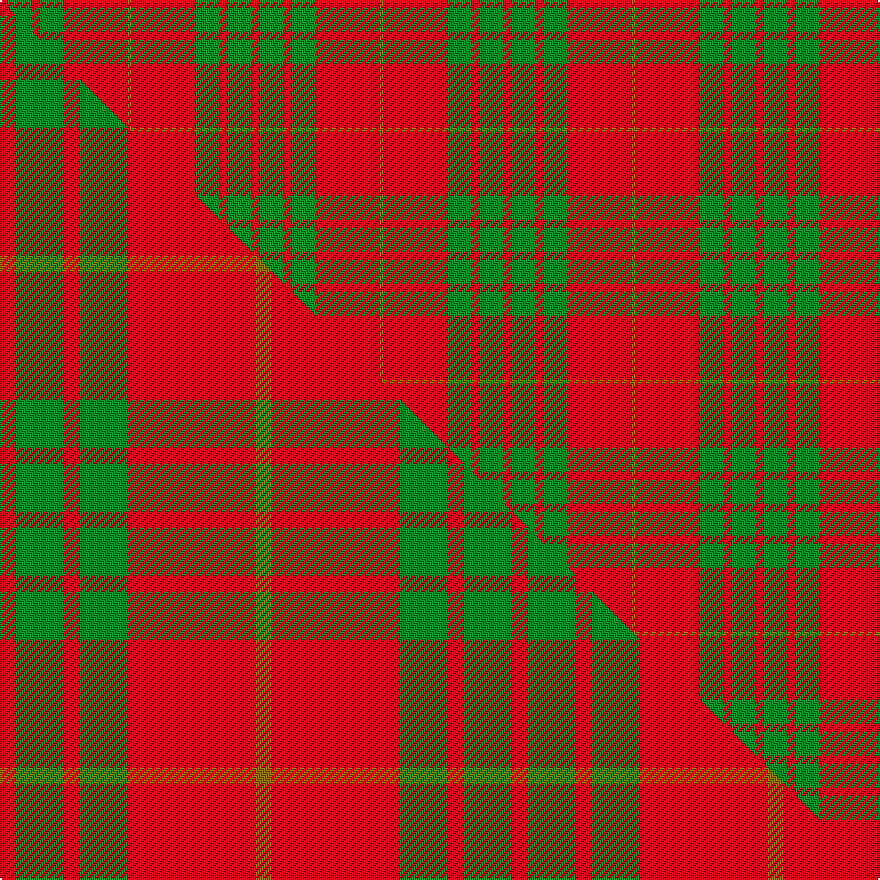

This page is one **sett** — a single exact thread-count. It belongs to the [tartan](/setts/r2g6r2g6r16y1/)
(the same proportion at any scale), whose colour order is pattern [GRGRGR](/stripes/grgrgr/).

Part of the [Cameron](/tartans/cameron/) tartan — the named design grouping this sett with its other cloths.

Sourced from weddslist.  It is a [6 stripe tartan](/stripes/stripes6/).

Original link http://www.weddslist.com/cgi-bin/tartans/pg.pl?source=rb

## Provenance

Earliest known date: 1842 First illustrated in the 'Vestiarium Scoticum' this sett is known as the Cameron Clan tartan. It may be derived from the tartan worn by the MacFees who also had a close association with Lochaber. The sett was recorded by Lord Lyon in the Public Register of All Arms and Bearings in 1947.

5 attestations — the source records this cloth was collapsed from (oldest owns this page)

<ul>
<li>undated — Cameron (weddslist, <a href="http://www.weddslist.com/cgi-bin/tartans/pg.pl?source=rb">record</a>) </li>
<li>undated — Cameron (weddslist, <a href="http://www.weddslist.com/cgi-bin/tartans/pg.pl?source=sts">record</a>) </li>
<li>undated — Cameron (weddslist, <a href="http://www.weddslist.com/cgi-bin/tartans/pg.pl?source=tinsel">record</a>) </li>
<li>undated — Cameron (weddslist, <a href="http://www.weddslist.com/cgi-bin/tartans/pg.pl?source=x">record</a>) </li>
<li>undated — Cameron Clan Tartan (house-of-tartan, <a href="http://www.house-of-tartan.scotland.net/house/TartanViewjs.asp?colr=Def&tnam=1538">record</a>) </li>
</ul>

## Thread count
R/4 G12 R4 G12 R32 Y/2

One full sett is **126 threads**.

## Palette
<table><thead><tr><th>Colour</th><th>Shade</th><th>OKLCh</th></tr></thead><tbody><tr><td>G</td><td><code style="background-color:#008B2A;">#008B2A</code> <small style="color:#888">#008B2A</small></td><td><small style="color:#888">oklch(55.4% 0.170 145.9)</small></td></tr><tr><td>R</td><td><code style="background-color:#D60020;">#D60020</code> <small style="color:#888">#D60020</small></td><td><small style="color:#888">oklch(55.2% 0.224 25.5)</small></td></tr><tr><td>Y</td><td><code style="background-color:#8B6E00;">#8B6E00</code> <small style="color:#888">#8B6E00</small></td><td><small style="color:#888">oklch(55.1% 0.113 90.4)</small></td></tr></tbody></table>

# Sample pattern

## Compared to the master

This cloth is one sett of its design; the master sett (the exemplar the design is anchored on) is below for comparison.

Its **ΔTartan distance** from the master is **1.11** — the same measure the nearest-tartans table ranks by (0 is identical; a re-scale of the same cloth is near 0, a recolour or a different proportion further).

<figure class="master-compare" style="margin:0">

this sett
master sett ★

<figcaption style="color:#888;font-size:smaller">One weave of this sett against the <a href="/setts/r1g3r1g3r8y1/">master sett ★</a>, split on the diagonal: a shared proportion runs seamlessly across it with only the shades shifting; a different proportion breaks on it.</figcaption>
</figure>

## Nearest tartan variants

The nearest existing variants by ΔTartan distance, with this cloth at the top so the swatches line up against it.

ΔTartan

Threads

Variant

Sett

—

126

<a href="/variants/s6/r2g6r2g6r16y1~x2/">Cameron</a>

<a href="/ttd/edit/#slug=r2dg6r2dg6r16ly1~x4&amp;base=r2g6r2g6r16y1~x2" title="compare in the TTD">0.00</a>

252

<a href="/variants/s6/r2dg6r2dg6r16ly1~x4/">Cameron (Clan)</a>

<a href="/ttd/edit/#slug=r1g6r1g6r15y1~x2&amp;base=r2g6r2g6r16y1~x2" title="compare in the TTD">0.23</a>

116

<a href="/variants/s6/r1g6r1g6r15y1~x2/">Cameron Clan D</a>

<a href="/ttd/edit/#slug=r1g3r1g3r8y1~x8&amp;base=r2g6r2g6r16y1~x2" title="compare in the TTD">0.49</a>

256

<a href="/variants/s6/r1g3r1g3r8y1~x8/">Cameron</a>

<a href="/ttd/edit/#slug=r1g10r1db4r18g1~x4&amp;base=r2g6r2g6r16y1~x2" title="compare in the TTD">0.94</a>

272

<a href="/variants/s6/r1g10r1db4r18g1~x4/">Robertson 6</a>

<a href="/ttd/edit/#slug=r24g5r3g9r3db1~x4&amp;base=r2g6r2g6r16y1~x2" title="compare in the TTD">0.99</a>

260

<a href="/variants/s6/r24g5r3g9r3db1~x4/">MacKintosh, Red</a>

<a href="/ttd/edit/#slug=r29dg2r2dg2r6ly21~x4&amp;base=r2g6r2g6r16y1~x2" title="compare in the TTD">0.99</a>

296

<a href="/variants/s6/r29dg2r2dg2r6ly21~x4/">Maguire, Black (Name)</a>

<a href="/ttd/edit/#slug=r58y3r6g16r12g16r6&amp;base=r2g6r2g6r16y1~x2" title="compare in the TTD">1.43</a>

170

<a href="/variants/s7/r58y3r6g16r12g16r6/">Cameron Ancient</a>

<a href="/ttd/edit/#slug=r16g1r1g1r4g12~x4&amp;base=r2g6r2g6r16y1~x2" title="compare in the TTD">1.64</a>

168

<a href="/variants/s6/r16g1r1g1r4g12~x4/">MacQuarrie #5</a>

<a href="/ttd/edit/#slug=r16g1r1g1r4g12&amp;base=r2g6r2g6r16y1~x2" title="compare in the TTD">1.64</a>

42

<a href="/variants/s6/r16g1r1g1r4g12/">MacQuarrie</a>

<a href="/ttd/edit/#slug=r16g1r1g1r4g12~x2&amp;base=r2g6r2g6r16y1~x2" title="compare in the TTD">1.64</a>

84

<a href="/variants/s6/r16g1r1g1r4g12~x2/">MacQuarie</a>

## Neighbour map

Every grey dot is one of 13620 variants placed by the first two principal components of the ΔTartan feature space (42% of its variance). Red is this tartan; blue dots are its nearest — click one to open its page.

<svg viewBox="0 0 640 380" role="img" style="max-width:100%;height:auto;border:1px solid #e0e0e0;border-radius:4px;display:block" xmlns="http://www.w3.org/2000/svg"><image href="/nn/cloud.v1.png" width="640" height="380"/><a href="/variants/s6/r2dg6r2dg6r16ly1~x4/"><circle cx="408.2" cy="194.4" r="4" fill="#3465a4"><title>Cameron (Clan)</title></circle></a><a href="/variants/s6/r1g6r1g6r15y1~x2/"><circle cx="412.5" cy="204.6" r="4" fill="#3465a4"><title>Cameron Clan D</title></circle></a><a href="/variants/s6/r1g3r1g3r8y1~x8/"><circle cx="396.4" cy="238.0" r="4" fill="#3465a4"><title>Cameron</title></circle></a><a href="/variants/s6/r1g10r1db4r18g1~x4/"><circle cx="385.0" cy="182.5" r="4" fill="#3465a4"><title>Robertson 6</title></circle></a><a href="/variants/s6/r24g5r3g9r3db1~x4/"><circle cx="477.5" cy="177.3" r="4" fill="#3465a4"><title>MacKintosh, Red</title></circle></a><a href="/variants/s6/r29dg2r2dg2r6ly21~x4/"><circle cx="406.6" cy="192.0" r="4" fill="#3465a4"><title>Maguire, Black (Name)</title></circle></a><a href="/variants/s7/r58y3r6g16r12g16r6/"><circle cx="500.4" cy="179.9" r="4" fill="#3465a4"><title>Cameron Ancient</title></circle></a><a href="/variants/s6/r16g1r1g1r4g12~x4/"><circle cx="451.2" cy="210.5" r="4" fill="#3465a4"><title>MacQuarrie #5</title></circle></a><a href="/variants/s6/r16g1r1g1r4g12/"><circle cx="451.2" cy="210.5" r="4" fill="#3465a4"><title>MacQuarrie</title></circle></a><a href="/variants/s6/r16g1r1g1r4g12~x2/"><circle cx="451.2" cy="210.5" r="4" fill="#3465a4"><title>MacQuarie</title></circle></a><circle cx="430.9" cy="206.1" r="5" fill="#c00000"/><text x="320" y="376" text-anchor="middle" font-size="11" fill="#999">ground</text><text x="11" y="190" text-anchor="middle" font-size="11" fill="#999" transform="rotate(-90 11 190)">complexity</text></svg>

ID: /variants/s6/r2g6r2g6r16y1~x2/
