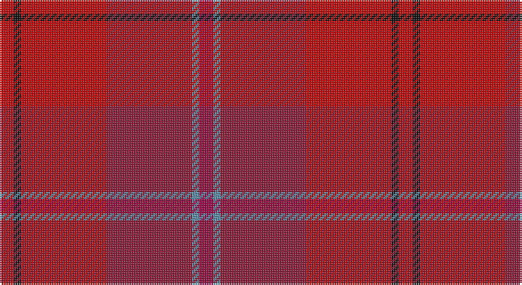

This page is one **sett** — a single exact thread-count. It belongs to the [tartan](/setts/r2k1r12ri12t1m2/)
(the same proportion at any scale), whose colour order is pattern [RBRRKR](/stripes/rbrrkr/).

Sourced from tartans-authority.  It is a [6 stripe tartan](/stripes/stripes6/).

Original link http://www.tartansauthority.com/tartan-ferret/display/4001/

## Register references

External register numbers recorded for this tartan.

- Scottish Tartans Authority (ITI): 4001

## Thread count
R/8 K4 R48 DR48 B4 Ra/8

One full sett is **224 threads**.

## Palette

Palette: <strong>Tartan Register</strong>
<table><thead><tr><th>Colour</th><th>Threads</th><th>Shade</th><th>Base</th><th>OKLCh</th></tr></thead><tbody><tr><td>R/</td><td style="text-align:right;font-variant-numeric:tabular-nums">8</td><td><code style="background-color:#C80000;">#C80000</code> <small style="color:#888">#C80000</small></td><td>R <code style="background-color:#CC0000;">#CC0000</code></td><td><small style="color:#888">oklch(52.3% 0.215 29.2)</small></td></tr><tr><td>K</td><td style="text-align:right;font-variant-numeric:tabular-nums">4</td><td><code style="background-color:#101010;">#101010</code> <small style="color:#888">#101010</small></td><td>K <code style="background-color:#000000;">#000000</code></td><td><small style="color:#888">oklch(17.3% 0.000 89.9)</small></td></tr><tr><td>R</td><td style="text-align:right;font-variant-numeric:tabular-nums">48</td><td><code style="background-color:#C80000;">#C80000</code> <small style="color:#888">#C80000</small></td><td>R <code style="background-color:#CC0000;">#CC0000</code></td><td><small style="color:#888">oklch(52.3% 0.215 29.2)</small></td></tr><tr><td>DR</td><td style="text-align:right;font-variant-numeric:tabular-nums">48</td><td><code style="background-color:#901C38;">#901C38</code> <small style="color:#888">#901C38</small></td><td>R <code style="background-color:#CC0000;">#CC0000</code></td><td><small style="color:#888">oklch(43.2% 0.150 13.1)</small></td></tr><tr><td>B</td><td style="text-align:right;font-variant-numeric:tabular-nums">4</td><td><code style="background-color:#5C8CA8;">#5C8CA8</code> <small style="color:#888">#5C8CA8</small></td><td>B <code style="background-color:#2A418A;">#2A418A</code></td><td><small style="color:#888">oklch(61.7% 0.067 235.0)</small></td></tr><tr><td>Ra/</td><td style="text-align:right;font-variant-numeric:tabular-nums">8</td><td><code style="background-color:#A00048;">#A00048</code> <small style="color:#888">#A00048</small></td><td>R <code style="background-color:#CC0000;">#CC0000</code></td><td><small style="color:#888">oklch(45.4% 0.182 5.3)</small></td></tr></tbody></table>

# Sample pattern

## Nearest tartans

The nearest existing variants by ΔTartan distance, with this tartan at the top so the swatches line up against it.

ΔTartan

Tartan

Sett

—

<a href="/ttd/edit/#slug=r2k1r12ri12t1m2~x4">Grelloch (Fashion)</a> <a class="nn-out" href="/variants/s6/r2k1r12ri12t1m2~x4/" title="open its dictionary page">↗</a>

1.12

<a href="/variants/s10/r2k1r12ri12t1m2~x4/">Grelloch</a>

1.51

<a href="/ttd/edit/#slug=r24g2t1g1m24~x4&amp;base=r2k1r12ri12t1m2~x4">MacNab (Smith)</a> <a class="nn-out" href="/variants/s5/r24g2t1g1m24~x4/" title="open its dictionary page">↗</a>

1.53

<a href="/ttd/edit/#slug=r24g2t1g1ri24~x2&amp;base=r2k1r12ri12t1m2~x4">MacNab 4</a> <a class="nn-out" href="/variants/s5/r24g2t1g1ri24~x2/" title="open its dictionary page">↗</a>

1.66

<a href="/ttd/edit/#slug=ri3r18rii6ri15r4ri3r4ri7w2~x2&amp;base=r2k1r12ri12t1m2~x4">Tune Hotels (Corporate)</a> <a class="nn-out" href="/variants/s9/ri3r18rii6ri15r4ri3r4ri7w2~x2/" title="open its dictionary page">↗</a>

2.21

<a href="/ttd/edit/#slug=riii2r2ri2r2rii6r1~x8&amp;base=r2k1r12ri12t1m2~x4">Youth on The Horizon (Fashion)</a> <a class="nn-out" href="/variants/s6/riii2r2ri2r2rii6r1~x8/" title="open its dictionary page">↗</a>

2.28

<a href="/ttd/edit/#slug=r3ri18rii6r15ri4r3ri4r7w2~x2&amp;base=r2k1r12ri12t1m2~x4">Tune Hotels</a> <a class="nn-out" href="/variants/s9/r3ri18rii6r15ri4r3ri4r7w2~x2/" title="open its dictionary page">↗</a>

2.39

<a href="/ttd/edit/#slug=r3dy2r26dy4do6dy29do2lo3~x2&amp;base=r2k1r12ri12t1m2~x4">Hyland Day (Personal)</a> <a class="nn-out" href="/variants/s8/r3dy2r26dy4do6dy29do2lo3~x2/" title="open its dictionary page">↗</a>

2.44

<a href="/ttd/edit/#slug=dr24dg1b1dg2r24~x2&amp;base=r2k1r12ri12t1m2~x4">MacNab WI 1</a> <a class="nn-out" href="/variants/s5/dr24dg1b1dg2r24~x2/" title="open its dictionary page">↗</a>

2.45

<a href="/ttd/edit/#slug=r3ri18rii6r15ri4r3ri4r7k2~x2&amp;base=r2k1r12ri12t1m2~x4">Tune Hotels Corporate Tartan</a> <a class="nn-out" href="/variants/s9/r3ri18rii6r15ri4r3ri4r7k2~x2/" title="open its dictionary page">↗</a>

2.48

<a href="/ttd/edit/#slug=g1dr10r10g1~x6&amp;base=r2k1r12ri12t1m2~x4">Stirling of Keir (Clan)</a> <a class="nn-out" href="/variants/s4/g1dr10r10g1~x6/" title="open its dictionary page">↗</a>

## Neighbour map

Every grey dot is one of 14360 variants placed by the first two principal components of the ΔTartan feature space (44% of its variance). Red is this tartan; blue dots are its nearest — click one to open its page.

<svg viewBox="0 0 640 380" role="img" style="max-width:100%;height:auto;border:1px solid #e0e0e0;border-radius:4px;display:block" xmlns="http://www.w3.org/2000/svg"><image href="/nn/cloud.v1.png" width="640" height="380"/><a href="/variants/s10/r2k1r12ri12t1m2~x4/"><circle cx="394.0" cy="206.6" r="4" fill="#3465a4"><title>Grelloch</title></circle></a><a href="/variants/s5/r24g2t1g1m24~x4/"><circle cx="474.0" cy="218.4" r="4" fill="#3465a4"><title>MacNab (Smith)</title></circle></a><a href="/variants/s5/r24g2t1g1ri24~x2/"><circle cx="472.0" cy="220.0" r="4" fill="#3465a4"><title>MacNab 4</title></circle></a><a href="/variants/s9/ri3r18rii6ri15r4ri3r4ri7w2~x2/"><circle cx="389.8" cy="248.7" r="4" fill="#3465a4"><title>Tune Hotels (Corporate)</title></circle></a><a href="/variants/s6/riii2r2ri2r2rii6r1~x8/"><circle cx="302.4" cy="281.1" r="4" fill="#3465a4"><title>Youth on The Horizon (Fashion)</title></circle></a><a href="/variants/s9/r3ri18rii6r15ri4r3ri4r7w2~x2/"><circle cx="347.9" cy="222.7" r="4" fill="#3465a4"><title>Tune Hotels</title></circle></a><a href="/variants/s8/r3dy2r26dy4do6dy29do2lo3~x2/"><circle cx="341.7" cy="198.9" r="4" fill="#3465a4"><title>Hyland Day (Personal)</title></circle></a><a href="/variants/s5/dr24dg1b1dg2r24~x2/"><circle cx="447.5" cy="214.8" r="4" fill="#3465a4"><title>MacNab WI 1</title></circle></a><a href="/variants/s9/r3ri18rii6r15ri4r3ri4r7k2~x2/"><circle cx="339.9" cy="220.0" r="4" fill="#3465a4"><title>Tune Hotels Corporate Tartan</title></circle></a><a href="/variants/s4/g1dr10r10g1~x6/"><circle cx="453.0" cy="314.9" r="4" fill="#3465a4"><title>Stirling of Keir (Clan)</title></circle></a><circle cx="409.2" cy="226.9" r="5" fill="#c00000"/></svg>

ID: /variants/s6/r2k1r12ri12t1m2~x4/
