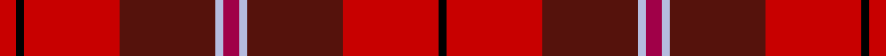

This page is one **sett** — a single exact thread-count. It belongs to the [tartan](/setts/r2lb1dr12ri12k1ri2/)
(the same proportion at any scale), whose colour order is pattern [KRBWRWBRKR](/stripes/krbwrwbrkr/).

Sourced from register-of-tartans.  It is a [10 stripe tartan](/stripes/stripes10/).

Original link https://www.tartanregister.gov.uk/tartanDetails.aspx?ref=1536

2 attestations — the source records this cloth was collapsed from (oldest owns this page)

<ul>
<li>01/01/1951 — Grelloch (register-of-tartans, <a href="https://www.tartanregister.gov.uk/tartanDetails.aspx?ref=1536">record</a>)  <em>A theatrical invention by Molly MacEwan for Clan Bracken which featured in the play 'The Highland Fair' presented at the Edinburgh Festival in 1951. As a rule, only tartans which have been woven are included in this Register but exceptions are made here and there for such items of interest as this.</em></li>
<li>1951 — Grelloch (Fashion) (tartans-authority, <a href="https://www.tartanregister.gov.uk/tartanDetails.aspx?ref=4001">record</a>)  <em>A theatrical invention by Molly MacEwan for Clan Bracken which featured in the play 'The Highland Fair' presented at the Highland Festival in 1951.</em></li>
</ul>

Dataset <small>— provenance for this record, inherited from the source manifest</small>

<dl class="dataset-prov">
<dt>source</dt><dd><a href="/sources/register-of-tartans/">Scottish Register of Tartans</a></dd>
<dt>data captured from</dt><dd><a href="https://github.com/thetartan/tartan-database/blob/master/data/register-of-tartans/data.csv">https://github.com/thetartan/tartan-database/blob/master/data/register-of-tartans/data.csv</a></dd>
<dt>data date</dt><dd>1951 <small>(this record)</small></dd>
<dt>licence</dt><dd><a href="https://www.tartanregister.gov.uk/copyright">Crown copyright</a></dd>
</dl>

Capture chain <small>— the hands this data passed through, oldest first; each capture carries its own licence</small>

<ol class="capture-chain">
<li><a href="https://www.tartanregister.gov.uk/">Scottish Register of Tartans</a> · <a href="https://www.tartanregister.gov.uk/copyright">Crown copyright</a> <small>the living register — still published by National Records of Scotland</small></li>
<li><a href="https://github.com/thetartan/tartan-database">thetartan/tartan-database</a> <small>2016-2017</small> · <a href="https://creativecommons.org/licenses/by-nc-nd/4.0/">CC BY-NC-ND 4.0</a> <small>Levko Kravets's frozen compilation — the capture we vendored, and where its CC licence text came from</small></li>
<li>this dictionary <small>captured 2026-06-10 · commit 5bf86c7566</small> <small>each re-capture is a git commit to data/sources</small></li>
</ol>

## Register references

External register numbers recorded for this tartan.

- Scottish Register of Tartans: [1536](https://www.tartanregister.gov.uk/tartanDetails.aspx?ref=1536)
- Scottish Tartans Authority (ITI): 4001

## Thread count
Ri/8 K4 Ri48 DR48 LB4 R8 LB4 DR48 Ri48 K/4

One full sett is **436 threads**.

## Palette
<table><thead><tr><th>Colour</th><th>Shade</th><th>OKLCh</th></tr></thead><tbody><tr><td>LB</td><td><code style="background-color:#B5BBDE;">#B5BBDE</code> <small style="color:#888">#B5BBDE</small></td><td><small style="color:#888">oklch(79.9% 0.050 277.6)</small></td></tr><tr><td>DR</td><td><code style="background-color:#55120C;">#55120C</code> <small style="color:#888">#55120C</small></td><td><small style="color:#888">oklch(30.0% 0.099 29.3)</small></td></tr><tr><td>K</td><td><code style="background-color:#000000;">#000000</code> <small style="color:#888">#000000</small></td><td><small style="color:#888">oklch(0.0% 0.000 0.0)</small></td></tr><tr><td>R</td><td><code style="background-color:#A00048;">#A00048</code> <small style="color:#888">#A00048</small></td><td><small style="color:#888">oklch(45.4% 0.182 5.3)</small></td></tr><tr><td>R</td><td><code style="background-color:#C80000;">#C80000</code> <small style="color:#888">#C80000</small></td><td><small style="color:#888">oklch(52.3% 0.215 29.2)</small></td></tr></tbody></table>

# Sample pattern

## Nearest tartan variants

The nearest existing variants by ΔTartan distance, with this cloth at the top so the swatches line up against it.

ΔTartan

Threads

Variant

Sett

—

436

<a href="/variants/s6/r2lb1dr12ri12k1ri2~x4~r1807008-ri2109032/">Grelloch</a>

<a href="/ttd/edit/#slug=y6r30n2k3n30g3n2r25w6~x2&amp;base=r2lb1dr12ri12k1ri2~x4~r1807008-ri2109032" title="compare in the TTD">3.56</a>

404

<a href="/variants/s9/y6r30n2k3n30g3n2r25w6~x2/">Virginia Military Institute, New Market</a>

<a href="/ttd/edit/#slug=lr6o5k2y18r28w2~x2&amp;base=r2lb1dr12ri12k1ri2~x4~r1807008-ri2109032" title="compare in the TTD">3.61</a>

228

<a href="/variants/s6/lr6o5k2y18r28w2~x2/">Dundhuin</a>

<a href="/ttd/edit/#slug=dy6r30n2k3n30g3n2r25w6~x2&amp;base=r2lb1dr12ri12k1ri2~x4~r1807008-ri2109032" title="compare in the TTD">3.64</a>

404

<a href="/variants/s9/dy6r30n2k3n30g3n2r25w6~x2/">Virginia Military Institute, New Market</a>

<a href="/ttd/edit/#slug=r46k3y6db8r6k3y46&amp;base=r2lb1dr12ri12k1ri2~x4~r1807008-ri2109032" title="compare in the TTD">3.72</a>

144

<a href="/variants/s7/r46k3y6db8r6k3y46/">Scrymgeour</a>

<a href="/ttd/edit/#slug=r15k1y2db3r2k1y15~x6&amp;base=r2lb1dr12ri12k1ri2~x4~r1807008-ri2109032" title="compare in the TTD">3.72</a>

288

<a href="/variants/s7/r15k1y2db3r2k1y15~x6/">Scrymgeour</a>

<a href="/ttd/edit/#slug=r15k1y2db3r2k1y15~x3&amp;base=r2lb1dr12ri12k1ri2~x4~r1807008-ri2109032" title="compare in the TTD">3.72</a>

144

<a href="/variants/s7/r15k1y2db3r2k1y15~x3/">Scrymgeour</a>

<a href="/ttd/edit/#slug=lr11r4y2k4y2r4y12r20lb2~x2&amp;base=r2lb1dr12ri12k1ri2~x4~r1807008-ri2109032" title="compare in the TTD">3.76</a>

218

<a href="/variants/s9/lr11r4y2k4y2r4y12r20lb2~x2/">Australia Dress</a>

<a href="/ttd/edit/#slug=dy15k1r2db3dy2k1r15~x4&amp;base=r2lb1dr12ri12k1ri2~x4~r1807008-ri2109032" title="compare in the TTD">3.81</a>

192

<a href="/variants/s7/dy15k1r2db3dy2k1r15~x4/">Scrymgeour Family Tartan</a>

## Neighbour map

Every grey dot is one of 13620 variants placed by the first two principal components of the ΔTartan feature space (42% of its variance). Red is this tartan; blue dots are its nearest — click one to open its page.

<svg viewBox="0 0 640 380" role="img" style="max-width:100%;height:auto;border:1px solid #e0e0e0;border-radius:4px;display:block" xmlns="http://www.w3.org/2000/svg"><image href="/nn/cloud.v1.png" width="640" height="380"/><a href="/variants/s9/y6r30n2k3n30g3n2r25w6~x2/"><circle cx="280.8" cy="134.8" r="4" fill="#3465a4"><title>Virginia Military Institute, New Market</title></circle></a><a href="/variants/s6/lr6o5k2y18r28w2~x2/"><circle cx="261.3" cy="159.9" r="4" fill="#3465a4"><title>Dundhuin</title></circle></a><a href="/variants/s9/dy6r30n2k3n30g3n2r25w6~x2/"><circle cx="271.8" cy="131.4" r="4" fill="#3465a4"><title>Virginia Military Institute, New Market</title></circle></a><a href="/variants/s7/r46k3y6db8r6k3y46/"><circle cx="306.4" cy="161.9" r="4" fill="#3465a4"><title>Scrymgeour</title></circle></a><a href="/variants/s7/r15k1y2db3r2k1y15~x6/"><circle cx="298.0" cy="163.4" r="4" fill="#3465a4"><title>Scrymgeour</title></circle></a><a href="/variants/s7/r15k1y2db3r2k1y15~x3/"><circle cx="298.0" cy="163.4" r="4" fill="#3465a4"><title>Scrymgeour</title></circle></a><a href="/variants/s9/lr11r4y2k4y2r4y12r20lb2~x2/"><circle cx="221.4" cy="164.8" r="4" fill="#3465a4"><title>Australia Dress</title></circle></a><a href="/variants/s7/dy15k1r2db3dy2k1r15~x4/"><circle cx="284.7" cy="156.9" r="4" fill="#3465a4"><title>Scrymgeour Family Tartan</title></circle></a><circle cx="291.0" cy="153.7" r="5" fill="#c00000"/><text x="320" y="376" text-anchor="middle" font-size="11" fill="#999">ground</text><text x="11" y="190" text-anchor="middle" font-size="11" fill="#999" transform="rotate(-90 11 190)">complexity</text></svg>

ID: /variants/s6/r2lb1dr12ri12k1ri2~x4~r1807008-ri2109032/
