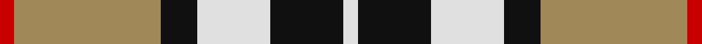
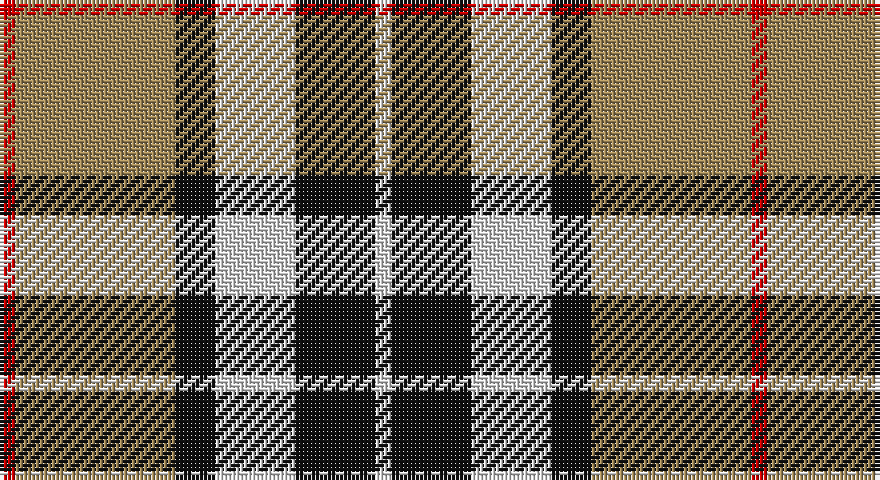

This page is one **sett** — a single exact thread-count. It belongs to the [tartan](/setts/r2lo20k5w10k10w2/)
(the same proportion at any scale), whose colour order is pattern [RYKWKW](/stripes/rykwkw/).

Sourced from house-of-tartan.  It is a [6 stripe tartan](/stripes/stripes6/).

Original link http://www.house-of-tartan.scotland.net/house/TartanViewjs.asp?colr=Def&tnam=2421

## Provenance

Earliest known date: 1967 Designed by Scotty Thompson. It it a simple colour variation on the usual blue Thompson, but is often confused with the Burberry Check.

## Thread count
R/4 LT40 K10 LN20 K20 LN/4

One full sett is **188 threads**.

## Palette

Palette: <strong>Tartan Register</strong>
<table><thead><tr><th>Colour</th><th>Threads</th><th>Shade</th><th>Base</th><th>OKLCh</th></tr></thead><tbody><tr><td>R/</td><td style="text-align:right;font-variant-numeric:tabular-nums">4</td><td><code style="background-color:#C80000;">#C80000</code> <small style="color:#888">#C80000</small></td><td>R <code style="background-color:#CC0000;">#CC0000</code></td><td><small style="color:#888">oklch(52.3% 0.215 29.2)</small></td></tr><tr><td>LT</td><td style="text-align:right;font-variant-numeric:tabular-nums">40</td><td><code style="background-color:#A08858;">#A08858</code> <small style="color:#888">#A08858</small></td><td>Y <code style="background-color:#F2BF00;">#F2BF00</code></td><td><small style="color:#888">oklch(63.7% 0.071 84.0)</small></td></tr><tr><td>K</td><td style="text-align:right;font-variant-numeric:tabular-nums">10</td><td><code style="background-color:#101010;">#101010</code> <small style="color:#888">#101010</small></td><td>K <code style="background-color:#000000;">#000000</code></td><td><small style="color:#888">oklch(17.3% 0.000 89.9)</small></td></tr><tr><td>LN</td><td style="text-align:right;font-variant-numeric:tabular-nums">20</td><td><code style="background-color:#E0E0E0;">#E0E0E0</code> <small style="color:#888">#E0E0E0</small></td><td>W <code style="background-color:#F7F7F7;">#F7F7F7</code></td><td><small style="color:#888">oklch(90.7% 0.000 89.9)</small></td></tr><tr><td>K</td><td style="text-align:right;font-variant-numeric:tabular-nums">20</td><td><code style="background-color:#101010;">#101010</code> <small style="color:#888">#101010</small></td><td>K <code style="background-color:#000000;">#000000</code></td><td><small style="color:#888">oklch(17.3% 0.000 89.9)</small></td></tr><tr><td>LN/</td><td style="text-align:right;font-variant-numeric:tabular-nums">4</td><td><code style="background-color:#E0E0E0;">#E0E0E0</code> <small style="color:#888">#E0E0E0</small></td><td>W <code style="background-color:#F7F7F7;">#F7F7F7</code></td><td><small style="color:#888">oklch(90.7% 0.000 89.9)</small></td></tr></tbody></table>

# Sample pattern

## Nearest tartans

The nearest existing variants by ΔTartan distance, with this tartan at the top so the swatches line up against it.

ΔTartan

Tartan

Sett

—

<a href="/ttd/edit/#slug=r2lo20k5w10k10w2~x2">Thompson Camel Clan Tartan</a> <a class="nn-out" href="/variants/s6/r2lo20k5w10k10w2~x2/" title="open its dictionary page">↗</a>

0.29

<a href="/ttd/edit/#slug=r4lo30k6w13k13w3~x2&amp;base=r2lo20k5w10k10w2~x2">Thomson Camel</a> <a class="nn-out" href="/variants/s6/r4lo30k6w13k13w3~x2/" title="open its dictionary page">↗</a>

0.47

<a href="/ttd/edit/#slug=r4ly30k6w13k13w3~x2&amp;base=r2lo20k5w10k10w2~x2">Thomson, Camel (Fashion)</a> <a class="nn-out" href="/variants/s6/r4ly30k6w13k13w3~x2/" title="open its dictionary page">↗</a>

0.57

<a href="/ttd/edit/#slug=r2o20k5w10k10r2~x2&amp;base=r2lo20k5w10k10w2~x2">Thompson Grey Family Tartan</a> <a class="nn-out" href="/variants/s6/r2o20k5w10k10r2~x2/" title="open its dictionary page">↗</a>

0.73

<a href="/ttd/edit/#slug=lo9k32g6lb20lo3lb9k5~x2&amp;base=r2lo20k5w10k10w2~x2">Black &amp; White Golf (Corporate)</a> <a class="nn-out" href="/variants/s7/lo9k32g6lb20lo3lb9k5~x2/" title="open its dictionary page">↗</a>

0.82

<a href="/ttd/edit/#slug=r3w8db4dg14r4db2~x4&amp;base=r2lo20k5w10k10w2~x2">MacKintosh Dress (Scott Adie)</a> <a class="nn-out" href="/variants/s6/r3w8db4dg14r4db2~x4/" title="open its dictionary page">↗</a>

0.83

<a href="/ttd/edit/#slug=k3g25o3k15lr24g3~x2&amp;base=r2lo20k5w10k10w2~x2">Un-named (D C Dalgliesh) #3</a> <a class="nn-out" href="/variants/s6/k3g25o3k15lr24g3~x2/" title="open its dictionary page">↗</a>

0.84

<a href="/ttd/edit/#slug=ly9k32g6w20ly3w9k5~x2&amp;base=r2lo20k5w10k10w2~x2">Black and White Golf</a> <a class="nn-out" href="/variants/s7/ly9k32g6w20ly3w9k5~x2/" title="open its dictionary page">↗</a>

0.85

<a href="/ttd/edit/#slug=ly6k6y30k8lb18k6ly3~x2&amp;base=r2lo20k5w10k10w2~x2">Cape Breton (yellow stripes)</a> <a class="nn-out" href="/variants/s7/ly6k6y30k8lb18k6ly3~x2/" title="open its dictionary page">↗</a>

0.89

<a href="/ttd/edit/#slug=k4ly2k13ly1w8lo13ly2lo4~x2&amp;base=r2lo20k5w10k10w2~x2">Bannockbane Light Tan</a> <a class="nn-out" href="/variants/s8/k4ly2k13ly1w8lo13ly2lo4~x2/" title="open its dictionary page">↗</a>

0.89

<a href="/ttd/edit/#slug=r6k14r6dg14w27k4&amp;base=r2lo20k5w10k10w2~x2">Fraser Dress</a> <a class="nn-out" href="/variants/s6/r6k14r6dg14w27k4/" title="open its dictionary page">↗</a>

## Neighbour map

Every grey dot is one of 14360 variants placed by the first two principal components of the ΔTartan feature space (44% of its variance). Red is this tartan; blue dots are its nearest — click one to open its page.

<svg viewBox="0 0 640 380" role="img" style="max-width:100%;height:auto;border:1px solid #e0e0e0;border-radius:4px;display:block" xmlns="http://www.w3.org/2000/svg"><image href="/nn/cloud.v1.png" width="640" height="380"/><a href="/variants/s6/r4lo30k6w13k13w3~x2/"><circle cx="189.7" cy="187.9" r="4" fill="#3465a4"><title>Thomson Camel</title></circle></a><a href="/variants/s6/r4ly30k6w13k13w3~x2/"><circle cx="185.0" cy="184.4" r="4" fill="#3465a4"><title>Thomson, Camel (Fashion)</title></circle></a><a href="/variants/s6/r2o20k5w10k10r2~x2/"><circle cx="173.9" cy="193.4" r="4" fill="#3465a4"><title>Thompson Grey Family Tartan</title></circle></a><a href="/variants/s7/lo9k32g6lb20lo3lb9k5~x2/"><circle cx="189.5" cy="180.7" r="4" fill="#3465a4"><title>Black &amp; White Golf (Corporate)</title></circle></a><a href="/variants/s6/r3w8db4dg14r4db2~x4/"><circle cx="150.0" cy="215.1" r="4" fill="#3465a4"><title>MacKintosh Dress (Scott Adie)</title></circle></a><a href="/variants/s6/k3g25o3k15lr24g3~x2/"><circle cx="179.5" cy="206.9" r="4" fill="#3465a4"><title>Un-named (D C Dalgliesh) #3</title></circle></a><a href="/variants/s7/ly9k32g6w20ly3w9k5~x2/"><circle cx="177.1" cy="174.5" r="4" fill="#3465a4"><title>Black and White Golf</title></circle></a><a href="/variants/s7/ly6k6y30k8lb18k6ly3~x2/"><circle cx="147.5" cy="180.5" r="4" fill="#3465a4"><title>Cape Breton (yellow stripes)</title></circle></a><a href="/variants/s8/k4ly2k13ly1w8lo13ly2lo4~x2/"><circle cx="156.6" cy="169.1" r="4" fill="#3465a4"><title>Bannockbane Light Tan</title></circle></a><a href="/variants/s6/r6k14r6dg14w27k4/"><circle cx="119.7" cy="209.0" r="4" fill="#3465a4"><title>Fraser Dress</title></circle></a><circle cx="175.6" cy="191.0" r="5" fill="#c00000"/></svg>

ID: /variants/s6/r2lo20k5w10k10w2~x2/
