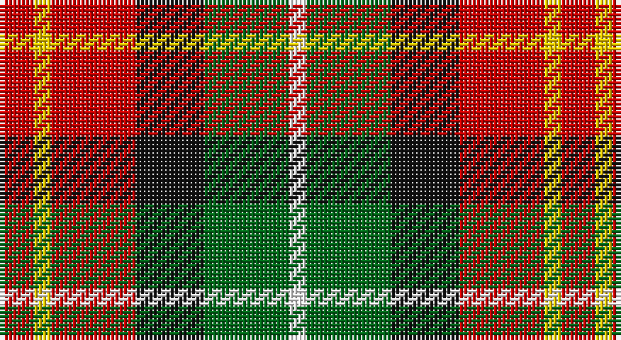

This page is one **sett** — a single exact thread-count. It belongs to the [tartan](/setts/r2ly1r5k4g5w1/)
(the same proportion at any scale), whose colour order is pattern [RYRKGW](/stripes/ryrkgw/).

Part of the [Aboyne](/tartans/aboyne/) tartan — the named design grouping this sett with its other cloths.

Sourced from tartans-authority.  It is a [6 stripe tartan](/stripes/stripes6/).

Original link http://www.tartansauthority.com/tartan-ferret/display/8811/

## Also known as

This cloth is also recorded under:

- Aboyne I
- Aboyne II

## Register references

External register numbers recorded for this tartan.

- Scottish Register of Tartans: [8811](https://www.tartanregister.gov.uk/tartanDetails?ref=8811)
- Scottish Tartans Authority (ITI): 8811

## Thread count
R/8 Y4 R20 K16 G20 W/4

One full sett is **132 threads**.

## Palette

Palette: <strong>Tartan Register</strong>
<table><thead><tr><th>Colour</th><th>Threads</th><th>Shade</th><th>Base</th><th>OKLCh</th></tr></thead><tbody><tr><td>R/</td><td style="text-align:right;font-variant-numeric:tabular-nums">8</td><td><code style="background-color:#C80000;">#C80000</code> <small style="color:#888">#C80000</small></td><td>R <code style="background-color:#CC0000;">#CC0000</code></td><td><small style="color:#888">oklch(52.3% 0.215 29.2)</small></td></tr><tr><td>Y</td><td style="text-align:right;font-variant-numeric:tabular-nums">4</td><td><code style="background-color:#FCCC00;">#FCCC00</code> <small style="color:#888">#FCCC00</small></td><td>Y <code style="background-color:#F2BF00;">#F2BF00</code></td><td><small style="color:#888">oklch(86.2% 0.176 91.5)</small></td></tr><tr><td>R</td><td style="text-align:right;font-variant-numeric:tabular-nums">20</td><td><code style="background-color:#C80000;">#C80000</code> <small style="color:#888">#C80000</small></td><td>R <code style="background-color:#CC0000;">#CC0000</code></td><td><small style="color:#888">oklch(52.3% 0.215 29.2)</small></td></tr><tr><td>K</td><td style="text-align:right;font-variant-numeric:tabular-nums">16</td><td><code style="background-color:#101010;">#101010</code> <small style="color:#888">#101010</small></td><td>K <code style="background-color:#000000;">#000000</code></td><td><small style="color:#888">oklch(17.3% 0.000 89.9)</small></td></tr><tr><td>G</td><td style="text-align:right;font-variant-numeric:tabular-nums">20</td><td><code style="background-color:#006818;">#006818</code> <small style="color:#888">#006818</small></td><td>G <code style="background-color:#006100;">#006100</code></td><td><small style="color:#888">oklch(45.0% 0.142 145.0)</small></td></tr><tr><td>W/</td><td style="text-align:right;font-variant-numeric:tabular-nums">4</td><td><code style="background-color:#FCFCFC;">#FCFCFC</code> <small style="color:#888">#FCFCFC</small></td><td>W <code style="background-color:#F7F7F7;">#F7F7F7</code></td><td><small style="color:#888">oklch(99.1% 0.000 89.9)</small></td></tr></tbody></table>

# Sample pattern

## Compared to the master

This cloth is one sett of its design; the master sett (the exemplar the design is anchored on) is below for comparison.

<figure style="margin:0"><figcaption style="color:#888;font-size:smaller">this sett</figcaption></figure>
<figure style="margin:0"><figcaption style="color:#888;font-size:smaller"><a href="/setts/lo12k1lo1r28lo4k8lr1do11k8lo32r11lo6r4/">master sett →</a></figcaption></figure>

## Nearest tartans

The nearest existing variants by ΔTartan distance, with this tartan at the top so the swatches line up against it.

ΔTartan

Tartan

Sett

—

<a href="/ttd/edit/#slug=r2ly1r5k4g5w1~x4">Aboyne II (Fashion)</a> <a class="nn-out" href="/variants/s6/r2ly1r5k4g5w1~x4/" title="open its dictionary page">↗</a>

1.16

<a href="/ttd/edit/#slug=r8dy33ly33k33r8db8ly33db8r8&amp;base=r2ly1r5k4g5w1~x4">Jardine of Castlemilk</a> <a class="nn-out" href="/variants/s9/r8dy33ly33k33r8db8ly33db8r8/" title="open its dictionary page">↗</a>

1.18

<a href="/ttd/edit/#slug=g9ly2g9w5r9t2r9t2~x2&amp;base=r2ly1r5k4g5w1~x4">Blackie</a> <a class="nn-out" href="/variants/s8/g9ly2g9w5r9t2r9t2~x2/" title="open its dictionary page">↗</a>

1.20

<a href="/ttd/edit/#slug=ly32k21r16lr6dt4~x2&amp;base=r2ly1r5k4g5w1~x4">Scottish American Athletic Assoc</a> <a class="nn-out" href="/variants/s5/ly32k21r16lr6dt4~x2/" title="open its dictionary page">↗</a>

1.23

<a href="/ttd/edit/#slug=r8o33ly33k33r8db8ly33db8r8&amp;base=r2ly1r5k4g5w1~x4">Jardine, of Castlemilk</a> <a class="nn-out" href="/variants/s9/r8o33ly33k33r8db8ly33db8r8/" title="open its dictionary page">↗</a>

1.25

<a href="/ttd/edit/#slug=r5db12lyi11n21ly5~x2&amp;base=r2ly1r5k4g5w1~x4">Inspiration</a> <a class="nn-out" href="/variants/s5/r5db12lyi11n21ly5~x2/" title="open its dictionary page">↗</a>

1.26

<a href="/ttd/edit/#slug=k6db3dg20r20ly3~x2&amp;base=r2ly1r5k4g5w1~x4">Douglas of Roxburgh</a> <a class="nn-out" href="/variants/s5/k6db3dg20r20ly3~x2/" title="open its dictionary page">↗</a>

1.26

<a href="/ttd/edit/#slug=r13dt13o5lo2dt13lo13~x2&amp;base=r2ly1r5k4g5w1~x4">Torana</a> <a class="nn-out" href="/variants/s6/r13dt13o5lo2dt13lo13~x2/" title="open its dictionary page">↗</a>

1.27

<a href="/ttd/edit/#slug=dy12k4w2o6r3~x2&amp;base=r2ly1r5k4g5w1~x4">Strathblane (Fashion)</a> <a class="nn-out" href="/variants/s5/dy12k4w2o6r3~x2/" title="open its dictionary page">↗</a>

1.27

<a href="/ttd/edit/#slug=o2dg2r9k9g2ly2~x4&amp;base=r2ly1r5k4g5w1~x4">Wolves Wod Kindred</a> <a class="nn-out" href="/variants/s6/o2dg2r9k9g2ly2~x4/" title="open its dictionary page">↗</a>

1.28

<a href="/ttd/edit/#slug=o12k4w2y6r3~x2&amp;base=r2ly1r5k4g5w1~x4">Strathblane</a> <a class="nn-out" href="/variants/s5/o12k4w2y6r3~x2/" title="open its dictionary page">↗</a>

## Neighbour map

Every grey dot is one of 14360 variants placed by the first two principal components of the ΔTartan feature space (44% of its variance). Red is this tartan; blue dots are its nearest — click one to open its page.

<svg viewBox="0 0 640 380" role="img" style="max-width:100%;height:auto;border:1px solid #e0e0e0;border-radius:4px;display:block" xmlns="http://www.w3.org/2000/svg"><image href="/nn/cloud.v1.png" width="640" height="380"/><a href="/variants/s9/r8dy33ly33k33r8db8ly33db8r8/"><circle cx="77.7" cy="196.8" r="4" fill="#3465a4"><title>Jardine of Castlemilk</title></circle></a><a href="/variants/s8/g9ly2g9w5r9t2r9t2~x2/"><circle cx="114.2" cy="219.4" r="4" fill="#3465a4"><title>Blackie</title></circle></a><a href="/variants/s5/ly32k21r16lr6dt4~x2/"><circle cx="129.9" cy="197.9" r="4" fill="#3465a4"><title>Scottish American Athletic Assoc</title></circle></a><a href="/variants/s9/r8o33ly33k33r8db8ly33db8r8/"><circle cx="70.8" cy="193.3" r="4" fill="#3465a4"><title>Jardine, of Castlemilk</title></circle></a><a href="/variants/s5/r5db12lyi11n21ly5~x2/"><circle cx="94.6" cy="241.3" r="4" fill="#3465a4"><title>Inspiration</title></circle></a><a href="/variants/s5/k6db3dg20r20ly3~x2/"><circle cx="164.1" cy="210.7" r="4" fill="#3465a4"><title>Douglas of Roxburgh</title></circle></a><a href="/variants/s6/r13dt13o5lo2dt13lo13~x2/"><circle cx="162.9" cy="246.7" r="4" fill="#3465a4"><title>Torana</title></circle></a><a href="/variants/s5/dy12k4w2o6r3~x2/"><circle cx="173.0" cy="230.8" r="4" fill="#3465a4"><title>Strathblane (Fashion)</title></circle></a><a href="/variants/s6/o2dg2r9k9g2ly2~x4/"><circle cx="88.9" cy="193.3" r="4" fill="#3465a4"><title>Wolves Wod Kindred</title></circle></a><a href="/variants/s5/o12k4w2y6r3~x2/"><circle cx="157.5" cy="222.7" r="4" fill="#3465a4"><title>Strathblane</title></circle></a><circle cx="112.9" cy="222.9" r="5" fill="#c00000"/></svg>

ID: /variants/s6/r2ly1r5k4g5w1~x4/
