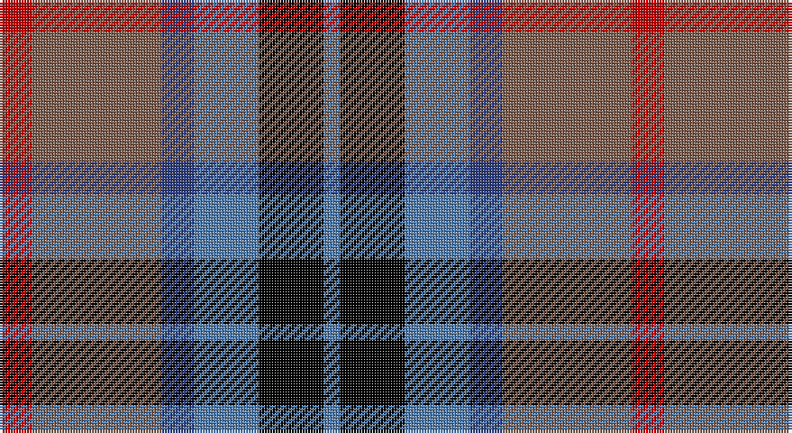

This page is one **sett** — a single exact thread-count. It belongs to the [tartan](/setts/r2o8db2t4k4t1/)
(the same proportion at any scale), whose colour order is pattern [BKBBRR](/stripes/bkbbrr/).

Sourced from weddslist.  It is a [6 stripe tartan](/stripes/stripes6/).

Original link http://www.weddslist.com/cgi-bin/tartans/pg.pl?source=sts

## Thread count
R/12 LT48 B12 Ba24 K24 Ba/6

One full sett is **234 threads**.

## Palette

Palette: <strong>Ingles Buchan</strong> <small style="color:#888">(1 of 5 colours)</small>
<table><thead><tr><th>Colour</th><th>Threads</th><th>Shade</th><th>Base</th><th>OKLCh</th></tr></thead><tbody><tr><td>R/</td><td style="text-align:right;font-variant-numeric:tabular-nums">12</td><td><code style="background-color:#C00000;">#C00000</code> <small style="color:#888">#C00000</small></td><td>R <code style="background-color:#CC0000;">#CC0000</code></td><td><small style="color:#888">oklch(50.7% 0.208 29.2)</small></td></tr><tr><td>LT</td><td style="text-align:right;font-variant-numeric:tabular-nums">48</td><td><code style="background-color:#806050;">#806050</code> <small style="color:#888">#806050</small></td><td>R <code style="background-color:#CC0000;">#CC0000</code></td><td><small style="color:#888">oklch(51.7% 0.049 47.8)</small></td></tr><tr><td>B</td><td style="text-align:right;font-variant-numeric:tabular-nums">12</td><td><code style="background-color:#304080;">#304080</code> <small style="color:#888">#304080</small></td><td>B <code style="background-color:#2A418A;">#2A418A</code></td><td><small style="color:#888">oklch(39.4% 0.109 270.2)</small></td></tr><tr><td>Ba</td><td style="text-align:right;font-variant-numeric:tabular-nums">24</td><td><code style="background-color:#5480B0;">#5480B0</code> <small style="color:#888">#5480B0</small></td><td>B <code style="background-color:#2A418A;">#2A418A</code></td><td><small style="color:#888">oklch(58.8% 0.089 251.5)</small></td></tr><tr><td>K</td><td style="text-align:right;font-variant-numeric:tabular-nums">24</td><td><code style="background-color:#000000;">#000000</code> <small style="color:#888">#000000</small></td><td>K <code style="background-color:#000000;">#000000</code></td><td><small style="color:#888">oklch(0.0% 0.000 0.0)</small></td></tr><tr><td>Ba/</td><td style="text-align:right;font-variant-numeric:tabular-nums">6</td><td><code style="background-color:#5480B0;">#5480B0</code> <small style="color:#888">#5480B0</small></td><td>B <code style="background-color:#2A418A;">#2A418A</code></td><td><small style="color:#888">oklch(58.8% 0.089 251.5)</small></td></tr></tbody></table>

# Sample pattern

## Nearest tartans

The nearest existing variants by ΔTartan distance, with this tartan at the top so the swatches line up against it.

ΔTartan

Tartan

Sett

—

<a href="/ttd/edit/#slug=r2o8db2t4k4t1~x6">Thom(p)son's, Fancy</a> <a class="nn-out" href="/variants/s6/r2o8db2t4k4t1~x6/" title="open its dictionary page">↗</a>

0.80

<a href="/ttd/edit/#slug=m3k17n11m2o20w2~x2&amp;base=r2o8db2t4k4t1~x6">Commonwealth Games Council (Corp.)</a> <a class="nn-out" href="/variants/s6/m3k17n11m2o20w2~x2/" title="open its dictionary page">↗</a>

0.86

<a href="/ttd/edit/#slug=r12db3g5dbi16ly2g2~x2&amp;base=r2o8db2t4k4t1~x6">Dunbog, Primary School</a> <a class="nn-out" href="/variants/s6/r12db3g5dbi16ly2g2~x2/" title="open its dictionary page">↗</a>

0.86

<a href="/ttd/edit/#slug=db6g27db3k19dp27w3~x2&amp;base=r2o8db2t4k4t1~x6">Gold Brothers</a> <a class="nn-out" href="/variants/s6/db6g27db3k19dp27w3~x2/" title="open its dictionary page">↗</a>

0.87

<a href="/ttd/edit/#slug=r10db6g24dbi24r6ly3&amp;base=r2o8db2t4k4t1~x6">Canine All Dogs (Fashion)</a> <a class="nn-out" href="/variants/s6/r10db6g24dbi24r6ly3/" title="open its dictionary page">↗</a>

0.88

<a href="/ttd/edit/#slug=r12dbi3g5db16ly2g2~x2&amp;base=r2o8db2t4k4t1~x6">Dunbog Primary School Corporate Tartan</a> <a class="nn-out" href="/variants/s6/r12dbi3g5db16ly2g2~x2/" title="open its dictionary page">↗</a>

0.88

<a href="/ttd/edit/#slug=r1dy6db2lb4k4lb1~x6&amp;base=r2o8db2t4k4t1~x6">Thompson's Fancy (Fashion)</a> <a class="nn-out" href="/variants/s6/r1dy6db2lb4k4lb1~x6/" title="open its dictionary page">↗</a>

0.90

<a href="/ttd/edit/#slug=k4t3g12p13ly2~x2&amp;base=r2o8db2t4k4t1~x6">Wilson's, No 176</a> <a class="nn-out" href="/variants/s5/k4t3g12p13ly2~x2/" title="open its dictionary page">↗</a>

0.95

<a href="/ttd/edit/#slug=k4b21dy10y4k20r6b3~x2&amp;base=r2o8db2t4k4t1~x6">Swankie (Personal)</a> <a class="nn-out" href="/variants/s7/k4b21dy10y4k20r6b3~x2/" title="open its dictionary page">↗</a>

0.96

<a href="/ttd/edit/#slug=dp9k7dg5r4dg7k1ly1~x2&amp;base=r2o8db2t4k4t1~x6">MacLaren #2</a> <a class="nn-out" href="/variants/s7/dp9k7dg5r4dg7k1ly1~x2/" title="open its dictionary page">↗</a>

0.97

<a href="/ttd/edit/#slug=dgi3db12w1dg12r12dg2~x2&amp;base=r2o8db2t4k4t1~x6">Patterson, John (Personal)</a> <a class="nn-out" href="/variants/s6/dgi3db12w1dg12r12dg2~x2/" title="open its dictionary page">↗</a>

## Neighbour map

Every grey dot is one of 14360 variants placed by the first two principal components of the ΔTartan feature space (44% of its variance). Red is this tartan; blue dots are its nearest — click one to open its page.

<svg viewBox="0 0 640 380" role="img" style="max-width:100%;height:auto;border:1px solid #e0e0e0;border-radius:4px;display:block" xmlns="http://www.w3.org/2000/svg"><image href="/nn/cloud.v1.png" width="640" height="380"/><a href="/variants/s6/m3k17n11m2o20w2~x2/"><circle cx="159.8" cy="192.2" r="4" fill="#3465a4"><title>Commonwealth Games Council (Corp.)</title></circle></a><a href="/variants/s6/r12db3g5dbi16ly2g2~x2/"><circle cx="159.6" cy="194.4" r="4" fill="#3465a4"><title>Dunbog, Primary School</title></circle></a><a href="/variants/s6/db6g27db3k19dp27w3~x2/"><circle cx="140.8" cy="208.0" r="4" fill="#3465a4"><title>Gold Brothers</title></circle></a><a href="/variants/s6/r10db6g24dbi24r6ly3/"><circle cx="141.9" cy="215.2" r="4" fill="#3465a4"><title>Canine All Dogs (Fashion)</title></circle></a><a href="/variants/s6/r12dbi3g5db16ly2g2~x2/"><circle cx="180.0" cy="200.4" r="4" fill="#3465a4"><title>Dunbog Primary School Corporate Tartan</title></circle></a><a href="/variants/s6/r1dy6db2lb4k4lb1~x6/"><circle cx="87.4" cy="220.3" r="4" fill="#3465a4"><title>Thompson's Fancy (Fashion)</title></circle></a><a href="/variants/s5/k4t3g12p13ly2~x2/"><circle cx="135.2" cy="217.1" r="4" fill="#3465a4"><title>Wilson's, No 176</title></circle></a><a href="/variants/s7/k4b21dy10y4k20r6b3~x2/"><circle cx="147.2" cy="214.6" r="4" fill="#3465a4"><title>Swankie (Personal)</title></circle></a><a href="/variants/s7/dp9k7dg5r4dg7k1ly1~x2/"><circle cx="143.5" cy="222.2" r="4" fill="#3465a4"><title>MacLaren #2</title></circle></a><a href="/variants/s6/dgi3db12w1dg12r12dg2~x2/"><circle cx="162.9" cy="196.7" r="4" fill="#3465a4"><title>Patterson, John (Personal)</title></circle></a><circle cx="135.0" cy="212.1" r="5" fill="#c00000"/></svg>

ID: /variants/s6/r2o8db2t4k4t1~x6/
