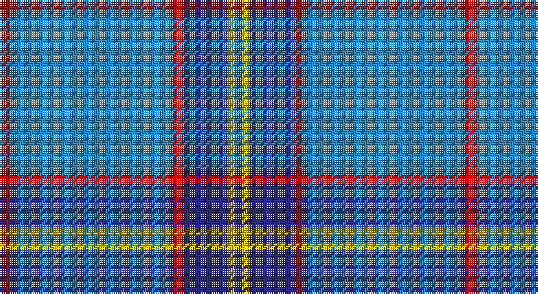

This page is one **sett** — a single exact thread-count. It belongs to the [tartan](/setts/r2t21r2db6ly1r1/)
(the same proportion at any scale), whose colour order is pattern [RBRBYR](/stripes/rbrbyr/).

Part of the [Lauder Primary School](/tartans/lauder-primary-school/) tartan — the named design grouping this sett with its other cloths.

Sourced from tartans-authority.  It is a [6 stripe tartan](/stripes/stripes6/).

Original link http://www.tartansauthority.com/tartan-ferret/display/10307/

## Register references

External register numbers recorded for this tartan.

- Scottish Register of Tartans: [10307](https://www.tartanregister.gov.uk/tartanDetails?ref=10307)
- Scottish Tartans Authority (ITI): 10307

## Thread count
R/8 B84 R8 DB24 Y4 R/4

One full sett is **252 threads**.

## Palette

Palette: <strong>Tartan Register</strong>
<table><thead><tr><th>Colour</th><th>Threads</th><th>Shade</th><th>Base</th><th>OKLCh</th></tr></thead><tbody><tr><td>R/</td><td style="text-align:right;font-variant-numeric:tabular-nums">8</td><td><code style="background-color:#C80000;">#C80000</code> <small style="color:#888">#C80000</small></td><td>R <code style="background-color:#CC0000;">#CC0000</code></td><td><small style="color:#888">oklch(52.3% 0.215 29.2)</small></td></tr><tr><td>B</td><td style="text-align:right;font-variant-numeric:tabular-nums">84</td><td><code style="background-color:#2888C4;">#2888C4</code> <small style="color:#888">#2888C4</small></td><td>B <code style="background-color:#2A418A;">#2A418A</code></td><td><small style="color:#888">oklch(60.1% 0.125 241.5)</small></td></tr><tr><td>R</td><td style="text-align:right;font-variant-numeric:tabular-nums">8</td><td><code style="background-color:#C80000;">#C80000</code> <small style="color:#888">#C80000</small></td><td>R <code style="background-color:#CC0000;">#CC0000</code></td><td><small style="color:#888">oklch(52.3% 0.215 29.2)</small></td></tr><tr><td>DB</td><td style="text-align:right;font-variant-numeric:tabular-nums">24</td><td><code style="background-color:#2C2C80;">#2C2C80</code> <small style="color:#888">#2C2C80</small></td><td>B <code style="background-color:#2A418A;">#2A418A</code></td><td><small style="color:#888">oklch(35.0% 0.138 276.6)</small></td></tr><tr><td>Y</td><td style="text-align:right;font-variant-numeric:tabular-nums">4</td><td><code style="background-color:#E8C000;">#E8C000</code> <small style="color:#888">#E8C000</small></td><td>Y <code style="background-color:#F2BF00;">#F2BF00</code></td><td><small style="color:#888">oklch(81.9% 0.168 93.7)</small></td></tr><tr><td>R/</td><td style="text-align:right;font-variant-numeric:tabular-nums">4</td><td><code style="background-color:#C80000;">#C80000</code> <small style="color:#888">#C80000</small></td><td>R <code style="background-color:#CC0000;">#CC0000</code></td><td><small style="color:#888">oklch(52.3% 0.215 29.2)</small></td></tr></tbody></table>

# Sample pattern

## Compared to the master

This cloth is one sett of its design; the master sett (the exemplar the design is anchored on) is below for comparison.

<figure style="margin:0"><figcaption style="color:#888;font-size:smaller">this sett</figcaption></figure>
<figure style="margin:0"><figcaption style="color:#888;font-size:smaller"><a href="/setts/ly2b9r2db6ly1r1/">master sett →</a></figcaption></figure>

## Nearest tartans

The nearest existing variants by ΔTartan distance, with this tartan at the top so the swatches line up against it.

ΔTartan

Tartan

Sett

—

<a href="/ttd/edit/#slug=r2t21r2db6ly1r1~x4">Lauder Primary School (Corporate)</a> <a class="nn-out" href="/variants/s6/r2t21r2db6ly1r1~x4/" title="open its dictionary page">↗</a>

1.17

<a href="/ttd/edit/#slug=w1lb4b4db3w3b20lb1~x4&amp;base=r2t21r2db6ly1r1~x4">Starr</a> <a class="nn-out" href="/variants/s7/w1lb4b4db3w3b20lb1~x4/" title="open its dictionary page">↗</a>

1.20

<a href="/ttd/edit/#slug=n42db2n2db17lo8db4~x2&amp;base=r2t21r2db6ly1r1~x4">Connecticut State Police PB (Cor.)</a> <a class="nn-out" href="/variants/s6/n42db2n2db17lo8db4~x2/" title="open its dictionary page">↗</a>

1.27

<a href="/ttd/edit/#slug=b64k3g14k4b4k12lo4~x2&amp;base=r2t21r2db6ly1r1~x4">Murray of Elibank</a> <a class="nn-out" href="/variants/s7/b64k3g14k4b4k12lo4~x2/" title="open its dictionary page">↗</a>

1.30

<a href="/ttd/edit/#slug=t20dp3db7ly1~x4&amp;base=r2t21r2db6ly1r1~x4">Peacock (Samantha)</a> <a class="nn-out" href="/variants/s4/t20dp3db7ly1~x4/" title="open its dictionary page">↗</a>

1.32

<a href="/ttd/edit/#slug=lb5dy6w2g7w2b44w2~x2&amp;base=r2t21r2db6ly1r1~x4">Leblant-Macqueron (Personal)</a> <a class="nn-out" href="/variants/s7/lb5dy6w2g7w2b44w2~x2/" title="open its dictionary page">↗</a>

1.33

<a href="/ttd/edit/#slug=t72r16k5ly2dt16~x2&amp;base=r2t21r2db6ly1r1~x4">Thomas, Jean Marc (Personal)</a> <a class="nn-out" href="/variants/s5/t72r16k5ly2dt16~x2/" title="open its dictionary page">↗</a>

1.33

<a href="/ttd/edit/#slug=r2db19n6b44lb2~x2&amp;base=r2t21r2db6ly1r1~x4">World Fed. of Bldg Contractors (Corp</a> <a class="nn-out" href="/variants/s5/r2db19n6b44lb2~x2/" title="open its dictionary page">↗</a>

1.39

<a href="/ttd/edit/#slug=t28dt15r2dt2w1dt6~x2&amp;base=r2t21r2db6ly1r1~x4">Corries</a> <a class="nn-out" href="/variants/s6/t28dt15r2dt2w1dt6~x2/" title="open its dictionary page">↗</a>

1.43

<a href="/ttd/edit/#slug=t42db10lo2db2lb2db2t10lb6db2lb3t2~x2&amp;base=r2t21r2db6ly1r1~x4">Goil Dress</a> <a class="nn-out" href="/variants/s11/t42db10lo2db2lb2db2t10lb6db2lb3t2~x2/" title="open its dictionary page">↗</a>

1.48

<a href="/ttd/edit/#slug=y8ly4y35db2lt8db2y4db21y4~x2&amp;base=r2t21r2db6ly1r1~x4">Bedford Academy</a> <a class="nn-out" href="/variants/s9/y8ly4y35db2lt8db2y4db21y4~x2/" title="open its dictionary page">↗</a>

## Neighbour map

Every grey dot is one of 14360 variants placed by the first two principal components of the ΔTartan feature space (44% of its variance). Red is this tartan; blue dots are its nearest — click one to open its page.

<svg viewBox="0 0 640 380" role="img" style="max-width:100%;height:auto;border:1px solid #e0e0e0;border-radius:4px;display:block" xmlns="http://www.w3.org/2000/svg"><image href="/nn/cloud.v1.png" width="640" height="380"/><a href="/variants/s7/w1lb4b4db3w3b20lb1~x4/"><circle cx="403.0" cy="162.8" r="4" fill="#3465a4"><title>Starr</title></circle></a><a href="/variants/s6/n42db2n2db17lo8db4~x2/"><circle cx="380.8" cy="179.7" r="4" fill="#3465a4"><title>Connecticut State Police PB (Cor.)</title></circle></a><a href="/variants/s7/b64k3g14k4b4k12lo4~x2/"><circle cx="413.1" cy="162.1" r="4" fill="#3465a4"><title>Murray of Elibank</title></circle></a><a href="/variants/s4/t20dp3db7ly1~x4/"><circle cx="420.9" cy="213.1" r="4" fill="#3465a4"><title>Peacock (Samantha)</title></circle></a><a href="/variants/s7/lb5dy6w2g7w2b44w2~x2/"><circle cx="398.8" cy="138.3" r="4" fill="#3465a4"><title>Leblant-Macqueron (Personal)</title></circle></a><a href="/variants/s5/t72r16k5ly2dt16~x2/"><circle cx="410.6" cy="146.2" r="4" fill="#3465a4"><title>Thomas, Jean Marc (Personal)</title></circle></a><a href="/variants/s5/r2db19n6b44lb2~x2/"><circle cx="370.3" cy="170.8" r="4" fill="#3465a4"><title>World Fed. of Bldg Contractors (Corp</title></circle></a><a href="/variants/s6/t28dt15r2dt2w1dt6~x2/"><circle cx="381.3" cy="178.9" r="4" fill="#3465a4"><title>Corries</title></circle></a><a href="/variants/s11/t42db10lo2db2lb2db2t10lb6db2lb3t2~x2/"><circle cx="409.6" cy="124.1" r="4" fill="#3465a4"><title>Goil Dress</title></circle></a><a href="/variants/s9/y8ly4y35db2lt8db2y4db21y4~x2/"><circle cx="336.5" cy="159.7" r="4" fill="#3465a4"><title>Bedford Academy</title></circle></a><circle cx="413.5" cy="165.4" r="5" fill="#c00000"/></svg>

ID: /variants/s6/r2t21r2db6ly1r1~x4/
