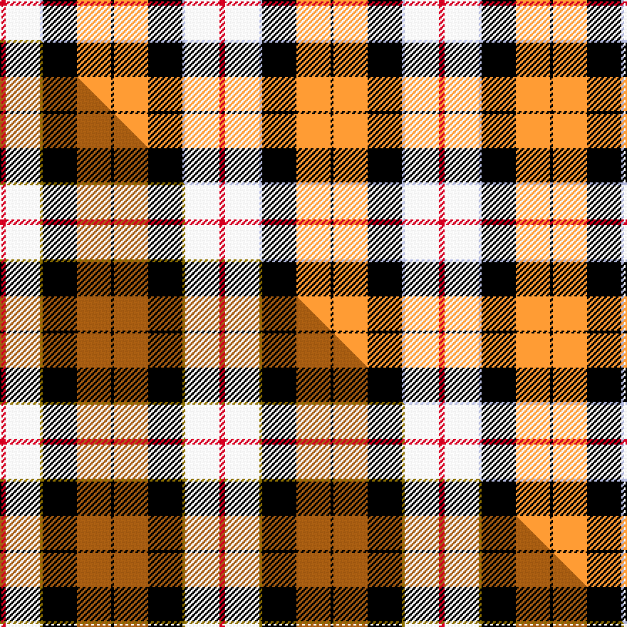

This is one **variant** — a specific cloth: this exact thread count and colourway, with its own
provenance below. It is one weaving of the [sett](/setts/r2w12lb1k12lo12k1/) (the scale-free proportion — the
same cloth at any scale or shade), whose colour order is pattern [KYKWWR](/stripes/kykwwr/).

Part of the [Dutch Dress](/tartans/d/du/dutch-dress/) tartan — the named design grouping this sett with its other cloths.

Sourced from house-of-tartan.  It is a [6 stripe tartan](/stripes/stripes6/).

Original link [http://www.house-of-tartan.scotland.net/house/TartanViewjs.asp?colr=Def&tnam=1133](http://www.house-of-tartan.scotland.net/house/TartanViewjs.asp?colr=Def&tnam=1133)

## Provenance

Earliest known date: 1965 The late Sir Iain Moncrieffe of that Ilk, Albany Herald said, "It should be based on Mackay tartan because of the association with the Chiefs of the Clan Mackay. Baron Aeneas Mackay was Prime Minister of the Netherlands in 1889 and his great grandson Lord Reay, the present Chief, is also a Dutch Baron." The sett chosen was John Cargill's proposal of a simple colour change in respect of the two tartans, Dutch and Dutch Dress.

Dataset <small>— provenance for this record, inherited from the source manifest</small>

<dl class="dataset-prov">
<dt>source</dt><dd><a href="/sources/house-of-tartan/">House of Tartan</a></dd>
<dt>data captured from</dt><dd><a href="https://github.com/thetartan/tartan-database/blob/master/data/house-of-tartan/data.csv">https://github.com/thetartan/tartan-database/blob/master/data/house-of-tartan/data.csv</a></dd>
<dt>data date</dt><dd>1965 <small>(this record)</small></dd>
<dt>licence</dt><dd><a href="https://creativecommons.org/licenses/by-nc-nd/4.0/">CC BY-NC-ND 4.0</a></dd>
</dl>

Capture chain <small>— the hands this data passed through, oldest first; each capture carries its own licence</small>

<ol class="capture-chain">
<li><a href="http://www.house-of-tartan.scotland.net/">House of Tartan</a> <small>the weaver/retailer's database — the site is now offline; the URL is kept as the ultimate source's identity</small></li>
<li><a href="https://github.com/thetartan/tartan-database">thetartan/tartan-database</a> <small>2016-2017</small> · <a href="https://creativecommons.org/licenses/by-nc-nd/4.0/">CC BY-NC-ND 4.0</a> <small>Levko Kravets's frozen compilation — the capture we vendored, and where its CC licence text came from</small></li>
<li>this dictionary <small>captured 2026-06-10 · commit 5bf86c7566</small> <small>each re-capture is a git commit to data/sources</small></li>
</ol>

## Thread count
R/4 W24 LB2 K24 LO24 K/2

One full sett is **154 threads**.

## Palette
<table><thead><tr><th>Colour</th><th>Shade</th><th>OKLCh</th></tr></thead><tbody><tr><td>LB</td><td><code style="background-color:#B5BBDE;">#B5BBDE</code> <small style="color:#888">#B5BBDE</small></td><td><small style="color:#888">oklch(79.9% 0.050 277.6)</small></td></tr><tr><td>K</td><td><code style="background-color:#000000;">#000000</code> <small style="color:#888">#000000</small></td><td><small style="color:#888">oklch(0.0% 0.000 0.0)</small></td></tr><tr><td>W</td><td><code style="background-color:#F7F7F7;">#F7F7F7</code> <small style="color:#888">#F7F7F7</small></td><td><small style="color:#888">oklch(97.6% 0.000 89.9)</small></td></tr><tr><td>LO</td><td><code style="background-color:#FF9C34;">#FF9C34</code> <small style="color:#888">#FF9C34</small></td><td><small style="color:#888">oklch(77.9% 0.161 61.8)</small></td></tr><tr><td>R</td><td><code style="background-color:#D60020;">#D60020</code> <small style="color:#888">#D60020</small></td><td><small style="color:#888">oklch(55.2% 0.224 25.5)</small></td></tr></tbody></table>

# Sample pattern

## Compared to the master

This cloth is one sett of its design; the master sett (the exemplar the design is anchored on) is below for comparison.

Its **ΔTartan distance** from the master is **0.39** — the same measure the nearest-tartans table ranks by (0 is identical; a re-scale of the same cloth is near 0, a recolour or a different proportion further).

<figure class="master-compare" style="margin:0">

this sett
master sett ★

<figcaption style="color:#888;font-size:smaller">One weave of this sett against the <a href="/setts/r2w12y1k12o12k1/">master sett ★</a>, split on the diagonal: a shared proportion runs seamlessly across it with only the shades shifting; a different proportion breaks on it.</figcaption>
</figure>

## Nearest tartan variants

The nearest existing variants by ΔTartan distance, with this cloth at the top so the swatches line up against it.

ΔTartan

Threads

Variant

Sett

—

154

<a href="/variants/s6/r2w12lb1k12lo12k1~x2/">Dutch Dress District Tartan</a>

<a href="/ttd/edit/#slug=r2w12y1k12o12k1~x2&amp;base=r2w12lb1k12lo12k1~x2" title="compare in the TTD">0.39</a>

154

<a href="/variants/s6/r2w12y1k12o12k1~x2/">Dutch Dress</a>

<a href="/ttd/edit/#slug=r3n27k6lo13k14r3~x2&amp;base=r2w12lb1k12lo12k1~x2" title="compare in the TTD">1.33</a>

252

<a href="/variants/s6/r3n27k6lo13k14r3~x2/">Thompson/Thomson/MacTavish special grey</a>

<a href="/ttd/edit/#slug=w2k1o10k6t12ly2~x2&amp;base=r2w12lb1k12lo12k1~x2" title="compare in the TTD">1.56</a>

124

<a href="/variants/s6/w2k1o10k6t12ly2~x2/">Soroptimist International (Corporate</a>

<a href="/ttd/edit/#slug=w39db9k10g11r7k3r7~x2&amp;base=r2w12lb1k12lo12k1~x2" title="compare in the TTD">2.13</a>

252

<a href="/variants/s7/w39db9k10g11r7k3r7~x2/">MacDuff Dress Clan Tartan</a>

<a href="/ttd/edit/#slug=k3r28k10w28lb3~x2&amp;base=r2w12lb1k12lo12k1~x2" title="compare in the TTD">2.26</a>

276

<a href="/variants/s5/k3r28k10w28lb3~x2/">Wallace Dress, Red (Dance)</a>

<a href="/ttd/edit/#slug=r34w3dg4g23w24k3dg4~x2&amp;base=r2w12lb1k12lo12k1~x2" title="compare in the TTD">2.27</a>

304

<a href="/variants/s7/r34w3dg4g23w24k3dg4~x2/">MacLachlan Dress Clan Tartan</a>

<a href="/ttd/edit/#slug=dr36w3lo4g24w24k3lo6~x2&amp;base=r2w12lb1k12lo12k1~x2" title="compare in the TTD">2.38</a>

316

<a href="/variants/s7/dr36w3lo4g24w24k3lo6~x2/">MacLachlan Dress</a>

<a href="/ttd/edit/#slug=r2n20k5w10k10r2~x2&amp;base=r2w12lb1k12lo12k1~x2" title="compare in the TTD">2.39</a>

188

<a href="/variants/s6/r2n20k5w10k10r2~x2/">Thompson Grey Family Tartan</a>

<a href="/ttd/edit/#slug=r5w2o20dy2k16w18k2w5~x2~r2109032-o2500000&amp;base=r2w12lb1k12lo12k1~x2" title="compare in the TTD">2.41</a>

260

<a href="/variants/s8/r5w2o20dy2k16w18k2w5~x2~r2109032-o2500000/">Ailsa Craig</a>

<a href="/ttd/edit/#slug=r4n25k6w12k11y3~x2&amp;base=r2w12lb1k12lo12k1~x2" title="compare in the TTD">2.44</a>

230

<a href="/variants/s6/r4n25k6w12k11y3~x2/">Thomson Dress (Grey) (Fashion)</a>

## Neighbour map

Every grey dot is one of 13621 variants placed by the first two principal components of the ΔTartan feature space (42% of its variance). Red is this tartan; blue dots are its nearest — click one to open its page.

<svg viewBox="0 0 640 380" role="img" style="max-width:100%;height:auto;border:1px solid #e0e0e0;border-radius:4px;display:block" xmlns="http://www.w3.org/2000/svg"><image href="/nn/cloud.v1.png" width="640" height="380"/><a href="/variants/s6/r2w12y1k12o12k1~x2/"><circle cx="105.9" cy="165.7" r="4" fill="#3465a4"><title>Dutch Dress</title></circle></a><a href="/variants/s6/r3n27k6lo13k14r3~x2/"><circle cx="158.4" cy="195.3" r="4" fill="#3465a4"><title>Thompson/Thomson/MacTavish special grey</title></circle></a><a href="/variants/s6/w2k1o10k6t12ly2~x2/"><circle cx="126.8" cy="177.7" r="4" fill="#3465a4"><title>Soroptimist International (Corporate</title></circle></a><a href="/variants/s7/w39db9k10g11r7k3r7~x2/"><circle cx="148.3" cy="148.5" r="4" fill="#3465a4"><title>MacDuff Dress Clan Tartan</title></circle></a><a href="/variants/s5/k3r28k10w28lb3~x2/"><circle cx="161.3" cy="193.0" r="4" fill="#3465a4"><title>Wallace Dress, Red (Dance)</title></circle></a><a href="/variants/s7/r34w3dg4g23w24k3dg4~x2/"><circle cx="135.9" cy="163.5" r="4" fill="#3465a4"><title>MacLachlan Dress Clan Tartan</title></circle></a><a href="/variants/s7/dr36w3lo4g24w24k3lo6~x2/"><circle cx="134.4" cy="167.9" r="4" fill="#3465a4"><title>MacLachlan Dress</title></circle></a><a href="/variants/s6/r2n20k5w10k10r2~x2/"><circle cx="150.0" cy="190.2" r="4" fill="#3465a4"><title>Thompson Grey Family Tartan</title></circle></a><a href="/variants/s8/r5w2o20dy2k16w18k2w5~x2~r2109032-o2500000/"><circle cx="106.3" cy="162.7" r="4" fill="#3465a4"><title>Ailsa Craig</title></circle></a><a href="/variants/s6/r4n25k6w12k11y3~x2/"><circle cx="124.9" cy="189.7" r="4" fill="#3465a4"><title>Thomson Dress (Grey) (Fashion)</title></circle></a><circle cx="107.0" cy="167.6" r="5" fill="#c00000"/><text x="320" y="376" text-anchor="middle" font-size="11" fill="#999">ground</text><text x="11" y="190" text-anchor="middle" font-size="11" fill="#999" transform="rotate(-90 11 190)">complexity</text></svg>

ID: /variants/s6/r2w12lb1k12lo12k1~x2/
