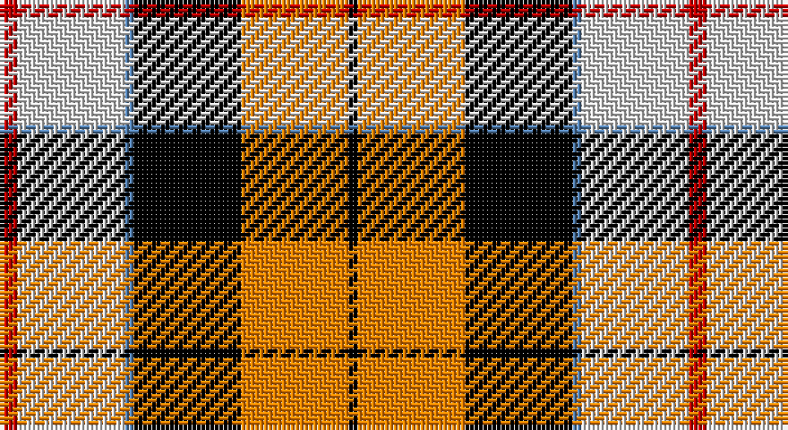

This page is one **sett** — a single exact thread-count. It belongs to the [tartan](/setts/r2w12t1k12lo12k1/)
(the same proportion at any scale), whose colour order is pattern [KYKBWR](/stripes/kykbwr/).

Part of the [Dutch Dress](/tartans/dutch-dress/) tartan — the named design grouping this sett with its other cloths.

Sourced from weddslist.  It is a [6 stripe tartan](/stripes/stripes6/).

Original link http://www.weddslist.com/cgi-bin/tartans/pg.pl?source=sts

## Provenance

Earliest known date: 1965 The late Sir Iain Moncrieffe of that Ilk, Albany Herald said, "It should be based on Mackay tartan because of the association with the Chiefs of the Clan Mackay. Baron Aeneas Mackay was Prime Minister of the Netherlands in 1889 and his great grandson Lord Reay, the present Chief, is also a Dutch Baron." The sett chosen was John Cargill's proposal of a simple colour change in respect of the two tartans, Dutch and Dutch Dress.

## Also known as

This cloth is also recorded under:

- Dutch, dress

2 attestations — the source records this cloth was collapsed from (oldest owns this page)

<ul>
<li>undated — Dutch, dress (weddslist, <a href="http://www.weddslist.com/cgi-bin/tartans/pg.pl?source=sts">record</a>)</li>
<li>undated — Dutch Dress District Tartan (house-of-tartan, <a href="http://www.house-of-tartan.scotland.net/house/TartanViewjs.asp?colr=Def&tnam=1133">record</a>)</li>
</ul>

## Thread count
R/4 LN24 B2 K24 O24 K/2

One full sett is **154 threads**.

## Palette

Palette: <strong>Tartan Register</strong> <small style="color:#888">(2 of 5 colours)</small>
<table><thead><tr><th>Colour</th><th>Threads</th><th>Shade</th><th>Base</th><th>OKLCh</th></tr></thead><tbody><tr><td>R/</td><td style="text-align:right;font-variant-numeric:tabular-nums">4</td><td><code style="background-color:#C00000;">#C00000</code> <small style="color:#888">#C00000</small></td><td>R <code style="background-color:#CC0000;">#CC0000</code></td><td><small style="color:#888">oklch(50.7% 0.208 29.2)</small></td></tr><tr><td>LN</td><td style="text-align:right;font-variant-numeric:tabular-nums">24</td><td><code style="background-color:#E0E0E0;">#E0E0E0</code> <small style="color:#888">#E0E0E0</small></td><td>W <code style="background-color:#F7F7F7;">#F7F7F7</code></td><td><small style="color:#888">oklch(90.7% 0.000 89.9)</small></td></tr><tr><td>B</td><td style="text-align:right;font-variant-numeric:tabular-nums">2</td><td><code style="background-color:#5480B0;">#5480B0</code> <small style="color:#888">#5480B0</small></td><td>B <code style="background-color:#2A418A;">#2A418A</code></td><td><small style="color:#888">oklch(58.8% 0.089 251.5)</small></td></tr><tr><td>K</td><td style="text-align:right;font-variant-numeric:tabular-nums">24</td><td><code style="background-color:#000000;">#000000</code> <small style="color:#888">#000000</small></td><td>K <code style="background-color:#000000;">#000000</code></td><td><small style="color:#888">oklch(0.0% 0.000 0.0)</small></td></tr><tr><td>O</td><td style="text-align:right;font-variant-numeric:tabular-nums">24</td><td><code style="background-color:#FF8500;">#FF8500</code> <small style="color:#888">#FF8500</small></td><td>Y <code style="background-color:#F2BF00;">#F2BF00</code></td><td><small style="color:#888">oklch(74.0% 0.183 55.1)</small></td></tr><tr><td>K/</td><td style="text-align:right;font-variant-numeric:tabular-nums">2</td><td><code style="background-color:#000000;">#000000</code> <small style="color:#888">#000000</small></td><td>K <code style="background-color:#000000;">#000000</code></td><td><small style="color:#888">oklch(0.0% 0.000 0.0)</small></td></tr></tbody></table>

# Sample pattern

## Compared to the master

This cloth is one sett of its design; the master sett (the exemplar the design is anchored on) is below for comparison.

<figure style="margin:0"><figcaption style="color:#888;font-size:smaller">this sett</figcaption></figure>
<figure style="margin:0"><figcaption style="color:#888;font-size:smaller"><a href="/setts/r2w12y1k12o12k1/">master sett →</a></figcaption></figure>

## Nearest tartans

The nearest existing variants by ΔTartan distance, with this tartan at the top so the swatches line up against it.

ΔTartan

Tartan

Sett

—

<a href="/ttd/edit/#slug=r2w12t1k12lo12k1~x2">Dutch, dress</a> <a class="nn-out" href="/variants/s6/r2w12t1k12lo12k1~x2/" title="open its dictionary page">↗</a>

0.56

<a href="/ttd/edit/#slug=r2w12y1k12o12k1~x2&amp;base=r2w12t1k12lo12k1~x2">Dutch Dress</a> <a class="nn-out" href="/variants/s6/r2w12y1k12o12k1~x2/" title="open its dictionary page">↗</a>

0.73

<a href="/ttd/edit/#slug=dg20r3y3r15w19dg3t2~x2&amp;base=r2w12t1k12lo12k1~x2">Glasgow</a> <a class="nn-out" href="/variants/s7/dg20r3y3r15w19dg3t2~x2/" title="open its dictionary page">↗</a>

1.00

<a href="/ttd/edit/#slug=r36w3lo4g24w24k3lo6~x2&amp;base=r2w12t1k12lo12k1~x2">MacLachlan Dress</a> <a class="nn-out" href="/variants/s7/r36w3lo4g24w24k3lo6~x2/" title="open its dictionary page">↗</a>

1.19

<a href="/ttd/edit/#slug=dg2do8dg8r3do1w12dg2y1~x2&amp;base=r2w12t1k12lo12k1~x2">National Trust Corporate Tartan</a> <a class="nn-out" href="/variants/s8/dg2do8dg8r3do1w12dg2y1~x2/" title="open its dictionary page">↗</a>

1.21

<a href="/variants/s7/k3r3lo2r20ki16lb24w2~x2/">Oor Wullie Corporate Tartan</a>

1.22

<a href="/ttd/edit/#slug=r24w2ly3dg16k16w2ly3~x2&amp;base=r2w12t1k12lo12k1~x2">MacLachlan #4</a> <a class="nn-out" href="/variants/s7/r24w2ly3dg16k16w2ly3~x2/" title="open its dictionary page">↗</a>

1.26

<a href="/ttd/edit/#slug=w2k11ly11db3k1r1~x2&amp;base=r2w12t1k12lo12k1~x2">Cornish National #2</a> <a class="nn-out" href="/variants/s6/w2k11ly11db3k1r1~x2/" title="open its dictionary page">↗</a>

1.27

<a href="/ttd/edit/#slug=lyi3r3ly2r20k16lb24w2~x2&amp;base=r2w12t1k12lo12k1~x2">Oor Wullie (Corporate)</a> <a class="nn-out" href="/variants/s7/lyi3r3ly2r20k16lb24w2~x2/" title="open its dictionary page">↗</a>

1.28

<a href="/ttd/edit/#slug=r32db6k6g6w18k3&amp;base=r2w12t1k12lo12k1~x2">Rose, White dress</a> <a class="nn-out" href="/variants/s6/r32db6k6g6w18k3/" title="open its dictionary page">↗</a>

1.28

<a href="/ttd/edit/#slug=r24w2ly3g16k16w2ly3~x2&amp;base=r2w12t1k12lo12k1~x2">MacLachlan Old Clan Tartan</a> <a class="nn-out" href="/variants/s7/r24w2ly3g16k16w2ly3~x2/" title="open its dictionary page">↗</a>

## Neighbour map

Every grey dot is one of 14360 variants placed by the first two principal components of the ΔTartan feature space (44% of its variance). Red is this tartan; blue dots are its nearest — click one to open its page.

<svg viewBox="0 0 640 380" role="img" style="max-width:100%;height:auto;border:1px solid #e0e0e0;border-radius:4px;display:block" xmlns="http://www.w3.org/2000/svg"><image href="/nn/cloud.v1.png" width="640" height="380"/><a href="/variants/s6/r2w12y1k12o12k1~x2/"><circle cx="131.6" cy="163.1" r="4" fill="#3465a4"><title>Dutch Dress</title></circle></a><a href="/variants/s7/dg20r3y3r15w19dg3t2~x2/"><circle cx="133.9" cy="158.8" r="4" fill="#3465a4"><title>Glasgow</title></circle></a><a href="/variants/s7/r36w3lo4g24w24k3lo6~x2/"><circle cx="139.4" cy="147.3" r="4" fill="#3465a4"><title>MacLachlan Dress</title></circle></a><a href="/variants/s8/dg2do8dg8r3do1w12dg2y1~x2/"><circle cx="122.4" cy="152.8" r="4" fill="#3465a4"><title>National Trust Corporate Tartan</title></circle></a><a href="/variants/s7/k3r3lo2r20ki16lb24w2~x2/"><circle cx="127.2" cy="129.6" r="4" fill="#3465a4"><title>Oor Wullie Corporate Tartan</title></circle></a><a href="/variants/s7/r24w2ly3dg16k16w2ly3~x2/"><circle cx="153.5" cy="153.4" r="4" fill="#3465a4"><title>MacLachlan #4</title></circle></a><a href="/variants/s6/w2k11ly11db3k1r1~x2/"><circle cx="173.7" cy="159.8" r="4" fill="#3465a4"><title>Cornish National #2</title></circle></a><a href="/variants/s7/lyi3r3ly2r20k16lb24w2~x2/"><circle cx="128.5" cy="128.5" r="4" fill="#3465a4"><title>Oor Wullie (Corporate)</title></circle></a><a href="/variants/s6/r32db6k6g6w18k3/"><circle cx="179.3" cy="155.8" r="4" fill="#3465a4"><title>Rose, White dress</title></circle></a><a href="/variants/s7/r24w2ly3g16k16w2ly3~x2/"><circle cx="154.4" cy="155.6" r="4" fill="#3465a4"><title>MacLachlan Old Clan Tartan</title></circle></a><circle cx="120.1" cy="155.0" r="5" fill="#c00000"/></svg>

ID: /variants/s6/r2w12t1k12lo12k1~x2/
