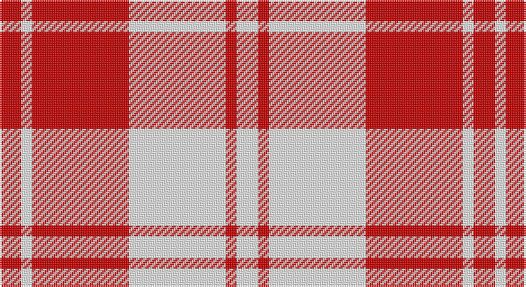

This page is one **sett** — a single exact thread-count. It belongs to the [tartan](/setts/r2w1r9w9r1w2/)
(the same proportion at any scale), whose colour order is pattern [RWRWRW](/stripes/rwrwrw/).

Sourced from tartans-authority.  It is a [6 stripe tartan](/stripes/stripes6/).

Original link http://www.tartansauthority.com/tartan-ferret/display/8897/

## Also known as

This cloth is also recorded under:

- Erskine Red & White

## Register references

External register numbers recorded for this tartan.

- Scottish Tartans Authority (ITI): 8897

## Thread count
R/12 W6 R54 W54 R6 W/12

One full sett is **264 threads**.

## Palette

Palette: <strong>Tartan Register</strong>
<table><thead><tr><th>Colour</th><th>Threads</th><th>Shade</th><th>Base</th><th>OKLCh</th></tr></thead><tbody><tr><td>R/</td><td style="text-align:right;font-variant-numeric:tabular-nums">12</td><td><code style="background-color:#C80000;">#C80000</code> <small style="color:#888">#C80000</small></td><td>R <code style="background-color:#CC0000;">#CC0000</code></td><td><small style="color:#888">oklch(52.3% 0.215 29.2)</small></td></tr><tr><td>W</td><td style="text-align:right;font-variant-numeric:tabular-nums">6</td><td><code style="background-color:#FCFCFC;">#FCFCFC</code> <small style="color:#888">#FCFCFC</small></td><td>W <code style="background-color:#F7F7F7;">#F7F7F7</code></td><td><small style="color:#888">oklch(99.1% 0.000 89.9)</small></td></tr><tr><td>R</td><td style="text-align:right;font-variant-numeric:tabular-nums">54</td><td><code style="background-color:#C80000;">#C80000</code> <small style="color:#888">#C80000</small></td><td>R <code style="background-color:#CC0000;">#CC0000</code></td><td><small style="color:#888">oklch(52.3% 0.215 29.2)</small></td></tr><tr><td>W</td><td style="text-align:right;font-variant-numeric:tabular-nums">54</td><td><code style="background-color:#FCFCFC;">#FCFCFC</code> <small style="color:#888">#FCFCFC</small></td><td>W <code style="background-color:#F7F7F7;">#F7F7F7</code></td><td><small style="color:#888">oklch(99.1% 0.000 89.9)</small></td></tr><tr><td>R</td><td style="text-align:right;font-variant-numeric:tabular-nums">6</td><td><code style="background-color:#C80000;">#C80000</code> <small style="color:#888">#C80000</small></td><td>R <code style="background-color:#CC0000;">#CC0000</code></td><td><small style="color:#888">oklch(52.3% 0.215 29.2)</small></td></tr><tr><td>W/</td><td style="text-align:right;font-variant-numeric:tabular-nums">12</td><td><code style="background-color:#FCFCFC;">#FCFCFC</code> <small style="color:#888">#FCFCFC</small></td><td>W <code style="background-color:#F7F7F7;">#F7F7F7</code></td><td><small style="color:#888">oklch(99.1% 0.000 89.9)</small></td></tr></tbody></table>

# Sample pattern

## Nearest tartans

The nearest existing variants by ΔTartan distance, with this tartan at the top so the swatches line up against it.

ΔTartan

Tartan

Sett

—

<a href="/ttd/edit/#slug=r2w1r9w9r1w2~x6">Erskine Red &amp; White (Dance)</a> <a class="nn-out" href="/variants/s6/r2w1r9w9r1w2~x6/" title="open its dictionary page">↗</a>

1.18

<a href="/ttd/edit/#slug=r4w35r31w4~x2&amp;base=r2w1r9w9r1w2~x6">Lewis, Red (Dance)</a> <a class="nn-out" href="/variants/s4/r4w35r31w4~x2/" title="open its dictionary page">↗</a>

1.25

<a href="/ttd/edit/#slug=r5w2r25w25r2w5~x2&amp;base=r2w1r9w9r1w2~x6">Erskine Dress Burgandy Clan Tartan</a> <a class="nn-out" href="/variants/s6/r5w2r25w25r2w5~x2/" title="open its dictionary page">↗</a>

1.32

<a href="/ttd/edit/#slug=r6w2r29w29r2w6~x2&amp;base=r2w1r9w9r1w2~x6">Erskine, Burgundy (Dance)</a> <a class="nn-out" href="/variants/s6/r6w2r29w29r2w6~x2/" title="open its dictionary page">↗</a>

1.35

<a href="/ttd/edit/#slug=r8ri3r28w32ri3w4~x2&amp;base=r2w1r9w9r1w2~x6">Ailsa, Red V2 (Dance)</a> <a class="nn-out" href="/variants/s6/r8ri3r28w32ri3w4~x2/" title="open its dictionary page">↗</a>

1.36

<a href="/ttd/edit/#slug=lb2r4lb2r4lb9k1~x2&amp;base=r2w1r9w9r1w2~x6">Buchanan VS</a> <a class="nn-out" href="/variants/s6/lb2r4lb2r4lb9k1~x2/" title="open its dictionary page">↗</a>

1.45

<a href="/ttd/edit/#slug=k5w37r37w5~x2&amp;base=r2w1r9w9r1w2~x6">MacRae of Conchra #2</a> <a class="nn-out" href="/variants/s4/k5w37r37w5~x2/" title="open its dictionary page">↗</a>

1.56

<a href="/ttd/edit/#slug=k2w28r13w2r13w2~x2&amp;base=r2w1r9w9r1w2~x6">Buchanan #5</a> <a class="nn-out" href="/variants/s6/k2w28r13w2r13w2~x2/" title="open its dictionary page">↗</a>

1.74

<a href="/ttd/edit/#slug=w4m31w35lg4~x2&amp;base=r2w1r9w9r1w2~x6">Lewis, Magenta (Dance)</a> <a class="nn-out" href="/variants/s4/w4m31w35lg4~x2/" title="open its dictionary page">↗</a>

1.84

<a href="/ttd/edit/#slug=w8r14w8r14w35k4~x2&amp;base=r2w1r9w9r1w2~x6">Clayton Dress (Dance)</a> <a class="nn-out" href="/variants/s6/w8r14w8r14w35k4~x2/" title="open its dictionary page">↗</a>

1.93

<a href="/ttd/edit/#slug=k1r1w1r15w15r1w1k1~x4&amp;base=r2w1r9w9r1w2~x6">Bundy, Dress Red (Personal Dance)</a> <a class="nn-out" href="/variants/s8/k1r1w1r15w15r1w1k1~x4/" title="open its dictionary page">↗</a>

## Neighbour map

Every grey dot is one of 14360 variants placed by the first two principal components of the ΔTartan feature space (44% of its variance). Red is this tartan; blue dots are its nearest — click one to open its page.

<svg viewBox="0 0 640 380" role="img" style="max-width:100%;height:auto;border:1px solid #e0e0e0;border-radius:4px;display:block" xmlns="http://www.w3.org/2000/svg"><image href="/nn/cloud.v1.png" width="640" height="380"/><a href="/variants/s4/r4w35r31w4~x2/"><circle cx="347.5" cy="233.9" r="4" fill="#3465a4"><title>Lewis, Red (Dance)</title></circle></a><a href="/variants/s6/r5w2r25w25r2w5~x2/"><circle cx="340.0" cy="192.9" r="4" fill="#3465a4"><title>Erskine Dress Burgandy Clan Tartan</title></circle></a><a href="/variants/s6/r6w2r29w29r2w6~x2/"><circle cx="331.1" cy="179.4" r="4" fill="#3465a4"><title>Erskine, Burgundy (Dance)</title></circle></a><a href="/variants/s6/r8ri3r28w32ri3w4~x2/"><circle cx="291.5" cy="179.9" r="4" fill="#3465a4"><title>Ailsa, Red V2 (Dance)</title></circle></a><a href="/variants/s6/lb2r4lb2r4lb9k1~x2/"><circle cx="320.3" cy="206.4" r="4" fill="#3465a4"><title>Buchanan VS</title></circle></a><a href="/variants/s4/k5w37r37w5~x2/"><circle cx="279.9" cy="222.5" r="4" fill="#3465a4"><title>MacRae of Conchra #2</title></circle></a><a href="/variants/s6/k2w28r13w2r13w2~x2/"><circle cx="321.5" cy="171.3" r="4" fill="#3465a4"><title>Buchanan #5</title></circle></a><a href="/variants/s4/w4m31w35lg4~x2/"><circle cx="305.5" cy="218.6" r="4" fill="#3465a4"><title>Lewis, Magenta (Dance)</title></circle></a><a href="/variants/s6/w8r14w8r14w35k4~x2/"><circle cx="301.9" cy="199.1" r="4" fill="#3465a4"><title>Clayton Dress (Dance)</title></circle></a><a href="/variants/s8/k1r1w1r15w15r1w1k1~x4/"><circle cx="322.1" cy="129.7" r="4" fill="#3465a4"><title>Bundy, Dress Red (Personal Dance)</title></circle></a><circle cx="320.0" cy="198.8" r="5" fill="#c00000"/></svg>

ID: /variants/s6/r2w1r9w9r1w2~x6/
