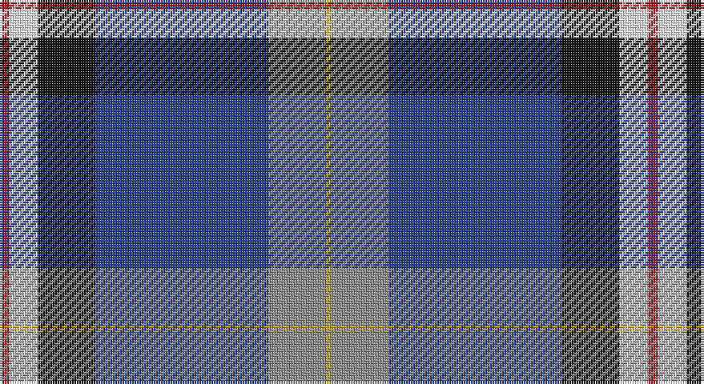

This page is one **sett** — a single exact thread-count. It belongs to the [tartan](/setts/r2w6k12db36o12ly1/)
(the same proportion at any scale), whose colour order is pattern [RWKBRY](/stripes/rwkbry/).

Sourced from register-of-tartans.  It is a [6 stripe tartan](/stripes/stripes6/).

Original link https://www.tartanregister.gov.uk/tartanDetails.aspx?ref=10133

## Register references

External register numbers recorded for this tartan.

- Scottish Register of Tartans: [10133](https://www.tartanregister.gov.uk/tartanDetails.aspx?ref=10133)

## Thread count
R/4 W12 K24 B72 N24 Y/2

One full sett is **270 threads**.

## Palette

Palette: <strong>Tartan Register</strong> <small style="color:#888">(2 of 6 colours)</small>
<table><thead><tr><th>Colour</th><th>Threads</th><th>Shade</th><th>Base</th><th>OKLCh</th></tr></thead><tbody><tr><td>R/</td><td style="text-align:right;font-variant-numeric:tabular-nums">4</td><td><code style="background-color:#B0171F;">#B0171F</code> <small style="color:#888">#B0171F</small></td><td>R <code style="background-color:#CC0000;">#CC0000</code></td><td><small style="color:#888">oklch(48.6% 0.185 25.8)</small></td></tr><tr><td>W</td><td style="text-align:right;font-variant-numeric:tabular-nums">12</td><td><code style="background-color:#FFFFFF;">#FFFFFF</code> <small style="color:#888">#FFFFFF</small></td><td>W <code style="background-color:#F7F7F7;">#F7F7F7</code></td><td><small style="color:#888">oklch(100.0% 0.000 89.9)</small></td></tr><tr><td>K</td><td style="text-align:right;font-variant-numeric:tabular-nums">24</td><td><code style="background-color:#101010;">#101010</code> <small style="color:#888">#101010</small></td><td>K <code style="background-color:#000000;">#000000</code></td><td><small style="color:#888">oklch(17.3% 0.000 89.9)</small></td></tr><tr><td>B</td><td style="text-align:right;font-variant-numeric:tabular-nums">72</td><td><code style="background-color:#27408B;">#27408B</code> <small style="color:#888">#27408B</small></td><td>B <code style="background-color:#2A418A;">#2A418A</code></td><td><small style="color:#888">oklch(39.7% 0.129 266.6)</small></td></tr><tr><td>N</td><td style="text-align:right;font-variant-numeric:tabular-nums">24</td><td><code style="background-color:#8C8C8C;">#8C8C8C</code> <small style="color:#888">#8C8C8C</small></td><td>R <code style="background-color:#CC0000;">#CC0000</code></td><td><small style="color:#888">oklch(64.0% 0.000 89.9)</small></td></tr><tr><td>Y/</td><td style="text-align:right;font-variant-numeric:tabular-nums">2</td><td><code style="background-color:#CDAD00;">#CDAD00</code> <small style="color:#888">#CDAD00</small></td><td>Y <code style="background-color:#F2BF00;">#F2BF00</code></td><td><small style="color:#888">oklch(75.3% 0.155 95.6)</small></td></tr></tbody></table>

# Sample pattern

## Nearest tartans

The nearest existing variants by ΔTartan distance, with this tartan at the top so the swatches line up against it.

ΔTartan

Tartan

Sett

—

<a href="/ttd/edit/#slug=r2w6k12db36o12ly1~x2">Alan Stone Family (Personal)</a> <a class="nn-out" href="/variants/s6/r2w6k12db36o12ly1~x2/" title="open its dictionary page">↗</a>

0.94

<a href="/ttd/edit/#slug=r2w6k12n36o12ly1~x2&amp;base=r2w6k12db36o12ly1~x2">Stone, Alan (Personal)</a> <a class="nn-out" href="/variants/s6/r2w6k12n36o12ly1~x2/" title="open its dictionary page">↗</a>

1.15

<a href="/ttd/edit/#slug=w3k2t30k5r5ly5t5db12w1~x2&amp;base=r2w6k12db36o12ly1~x2">Wiegratz Alba (Personal)</a> <a class="nn-out" href="/variants/s9/w3k2t30k5r5ly5t5db12w1~x2/" title="open its dictionary page">↗</a>

1.18

<a href="/ttd/edit/#slug=r4k2dp14k12lo1t32k12t14k2g4~x2&amp;base=r2w6k12db36o12ly1~x2">Timmins (2013)</a> <a class="nn-out" href="/variants/s10/r4k2dp14k12lo1t32k12t14k2g4~x2/" title="open its dictionary page">↗</a>

1.26

<a href="/ttd/edit/#slug=w10db2w1db35g10lo3g10r4~x2&amp;base=r2w6k12db36o12ly1~x2">Sandelin (Personal)</a> <a class="nn-out" href="/variants/s8/w10db2w1db35g10lo3g10r4~x2/" title="open its dictionary page">↗</a>

1.27

<a href="/ttd/edit/#slug=t23w3k10r2db45ly1~x2&amp;base=r2w6k12db36o12ly1~x2">Kirkcaldy</a> <a class="nn-out" href="/variants/s6/t23w3k10r2db45ly1~x2/" title="open its dictionary page">↗</a>

1.27

<a href="/ttd/edit/#slug=r3db38k13w3o20ly2~x2&amp;base=r2w6k12db36o12ly1~x2">LLoyd of Astargus Canadian Family Tartan</a> <a class="nn-out" href="/variants/s6/r3db38k13w3o20ly2~x2/" title="open its dictionary page">↗</a>

1.28

<a href="/ttd/edit/#slug=t2g13r2k6db23w1~x4&amp;base=r2w6k12db36o12ly1~x2">Gamblin Thompson (Personal)</a> <a class="nn-out" href="/variants/s6/t2g13r2k6db23w1~x4/" title="open its dictionary page">↗</a>

1.30

<a href="/ttd/edit/#slug=lb8db10dt69w6dt6r8b19lb3&amp;base=r2w6k12db36o12ly1~x2">Virginia International Tattoo Hixon</a> <a class="nn-out" href="/variants/s8/lb8db10dt69w6dt6r8b19lb3/" title="open its dictionary page">↗</a>

1.31

<a href="/ttd/edit/#slug=t23w3k10r2dt45ly1~x2&amp;base=r2w6k12db36o12ly1~x2">Kirkcaldy Name Tartan</a> <a class="nn-out" href="/variants/s6/t23w3k10r2dt45ly1~x2/" title="open its dictionary page">↗</a>

1.33

<a href="/ttd/edit/#slug=w3db3k1t16k1db8r3db24ly3~x2&amp;base=r2w6k12db36o12ly1~x2">MacCormick Festive</a> <a class="nn-out" href="/variants/s9/w3db3k1t16k1db8r3db24ly3~x2/" title="open its dictionary page">↗</a>

## Neighbour map

Every grey dot is one of 14360 variants placed by the first two principal components of the ΔTartan feature space (44% of its variance). Red is this tartan; blue dots are its nearest — click one to open its page.

<svg viewBox="0 0 640 380" role="img" style="max-width:100%;height:auto;border:1px solid #e0e0e0;border-radius:4px;display:block" xmlns="http://www.w3.org/2000/svg"><image href="/nn/cloud.v1.png" width="640" height="380"/><a href="/variants/s6/r2w6k12n36o12ly1~x2/"><circle cx="285.5" cy="119.5" r="4" fill="#3465a4"><title>Stone, Alan (Personal)</title></circle></a><a href="/variants/s9/w3k2t30k5r5ly5t5db12w1~x2/"><circle cx="244.6" cy="93.8" r="4" fill="#3465a4"><title>Wiegratz Alba (Personal)</title></circle></a><a href="/variants/s10/r4k2dp14k12lo1t32k12t14k2g4~x2/"><circle cx="229.4" cy="104.4" r="4" fill="#3465a4"><title>Timmins (2013)</title></circle></a><a href="/variants/s8/w10db2w1db35g10lo3g10r4~x2/"><circle cx="273.1" cy="113.0" r="4" fill="#3465a4"><title>Sandelin (Personal)</title></circle></a><a href="/variants/s6/t23w3k10r2db45ly1~x2/"><circle cx="325.6" cy="117.3" r="4" fill="#3465a4"><title>Kirkcaldy</title></circle></a><a href="/variants/s6/r3db38k13w3o20ly2~x2/"><circle cx="236.4" cy="146.3" r="4" fill="#3465a4"><title>LLoyd of Astargus Canadian Family Tartan</title></circle></a><a href="/variants/s6/t2g13r2k6db23w1~x4/"><circle cx="268.1" cy="149.6" r="4" fill="#3465a4"><title>Gamblin Thompson (Personal)</title></circle></a><a href="/variants/s8/lb8db10dt69w6dt6r8b19lb3/"><circle cx="298.9" cy="110.6" r="4" fill="#3465a4"><title>Virginia International Tattoo Hixon</title></circle></a><a href="/variants/s6/t23w3k10r2dt45ly1~x2/"><circle cx="331.8" cy="121.2" r="4" fill="#3465a4"><title>Kirkcaldy Name Tartan</title></circle></a><a href="/variants/s9/w3db3k1t16k1db8r3db24ly3~x2/"><circle cx="297.1" cy="115.1" r="4" fill="#3465a4"><title>MacCormick Festive</title></circle></a><circle cx="268.9" cy="114.7" r="5" fill="#c00000"/></svg>

ID: /variants/s6/r2w6k12db36o12ly1~x2/
