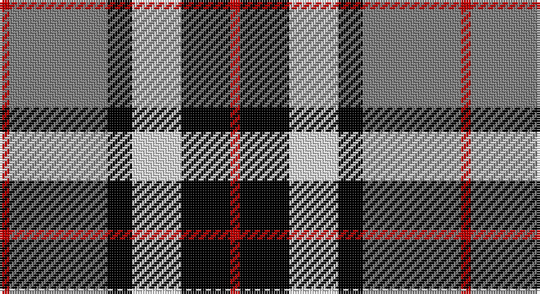

This page is one **sett** — a single exact thread-count. It belongs to the [tartan](/setts/r2y20k5w10k10r2/)
(the same proportion at any scale), whose colour order is pattern [RGKWKR](/stripes/rgkwkr/).

Part of the [Thomson](/tartans/thomson/) tartan — the named design grouping this sett with its other cloths.

Sourced from weddslist.  It is a [6 stripe tartan](/stripes/stripes6/).

Original link http://www.weddslist.com/cgi-bin/tartans/pg.pl?source=sts

## Also known as

This cloth is also recorded under:

- Thomson, Grey
- Thomson, Red

## Thread count
R/4 N40 K10 LN20 K20 R/4

One full sett is **188 threads**.

## Palette

Palette: <strong>Tartan Register</strong> <small style="color:#888">(3 of 4 colours)</small>
<table><thead><tr><th>Colour</th><th>Threads</th><th>Shade</th><th>Base</th><th>OKLCh</th></tr></thead><tbody><tr><td>R/</td><td style="text-align:right;font-variant-numeric:tabular-nums">4</td><td><code style="background-color:#C00000;">#C00000</code> <small style="color:#888">#C00000</small></td><td>R <code style="background-color:#CC0000;">#CC0000</code></td><td><small style="color:#888">oklch(50.7% 0.208 29.2)</small></td></tr><tr><td>N</td><td style="text-align:right;font-variant-numeric:tabular-nums">40</td><td><code style="background-color:#808080;">#808080</code> <small style="color:#888">#808080</small></td><td>G <code style="background-color:#006100;">#006100</code></td><td><small style="color:#888">oklch(60.0% 0.000 89.9)</small></td></tr><tr><td>K</td><td style="text-align:right;font-variant-numeric:tabular-nums">10</td><td><code style="background-color:#000000;">#000000</code> <small style="color:#888">#000000</small></td><td>K <code style="background-color:#000000;">#000000</code></td><td><small style="color:#888">oklch(0.0% 0.000 0.0)</small></td></tr><tr><td>LN</td><td style="text-align:right;font-variant-numeric:tabular-nums">20</td><td><code style="background-color:#E0E0E0;">#E0E0E0</code> <small style="color:#888">#E0E0E0</small></td><td>W <code style="background-color:#F7F7F7;">#F7F7F7</code></td><td><small style="color:#888">oklch(90.7% 0.000 89.9)</small></td></tr><tr><td>K</td><td style="text-align:right;font-variant-numeric:tabular-nums">20</td><td><code style="background-color:#000000;">#000000</code> <small style="color:#888">#000000</small></td><td>K <code style="background-color:#000000;">#000000</code></td><td><small style="color:#888">oklch(0.0% 0.000 0.0)</small></td></tr><tr><td>R/</td><td style="text-align:right;font-variant-numeric:tabular-nums">4</td><td><code style="background-color:#C00000;">#C00000</code> <small style="color:#888">#C00000</small></td><td>R <code style="background-color:#CC0000;">#CC0000</code></td><td><small style="color:#888">oklch(50.7% 0.208 29.2)</small></td></tr></tbody></table>

# Sample pattern

## Compared to the master

This cloth is one sett of its design; the master sett (the exemplar the design is anchored on) is below for comparison.

<figure style="margin:0"><figcaption style="color:#888;font-size:smaller">this sett</figcaption></figure>
<figure style="margin:0"><figcaption style="color:#888;font-size:smaller"><a href="/setts/r1k1w2k2w2k1w4k1db9ly1/">master sett →</a></figcaption></figure>

## Nearest tartans

The nearest existing variants by ΔTartan distance, with this tartan at the top so the swatches line up against it.

ΔTartan

Tartan

Sett

—

<a href="/ttd/edit/#slug=r2y20k5w10k10r2~x2">Thom(p)son, Grey</a> <a class="nn-out" href="/variants/s6/r2y20k5w10k10r2~x2/" title="open its dictionary page">↗</a>

0.45

<a href="/ttd/edit/#slug=r4o30k6w13k13w3~x2&amp;base=r2y20k5w10k10r2~x2">Thom(p)son camel</a> <a class="nn-out" href="/variants/s6/r4o30k6w13k13w3~x2/" title="open its dictionary page">↗</a>

0.70

<a href="/ttd/edit/#slug=r2o20k5w10k10r2~x2&amp;base=r2y20k5w10k10r2~x2">Thompson Grey Family Tartan</a> <a class="nn-out" href="/variants/s6/r2o20k5w10k10r2~x2/" title="open its dictionary page">↗</a>

0.80

<a href="/ttd/edit/#slug=w23db6w6r5k35r10~x2&amp;base=r2y20k5w10k10r2~x2">Meg, Merrilees</a> <a class="nn-out" href="/variants/s6/w23db6w6r5k35r10~x2/" title="open its dictionary page">↗</a>

0.83

<a href="/ttd/edit/#slug=lb5o34k24o4r24o4~x2&amp;base=r2y20k5w10k10r2~x2">Wcwm 759-3</a> <a class="nn-out" href="/variants/s6/lb5o34k24o4r24o4~x2/" title="open its dictionary page">↗</a>

0.89

<a href="/ttd/edit/#slug=lo9k32g6lb20lo3lb9k5~x2&amp;base=r2y20k5w10k10r2~x2">Black &amp; White Golf (Corporate)</a> <a class="nn-out" href="/variants/s7/lo9k32g6lb20lo3lb9k5~x2/" title="open its dictionary page">↗</a>

0.89

<a href="/ttd/edit/#slug=w23t6w6r5k35r10~x2&amp;base=r2y20k5w10k10r2~x2">Merrilees</a> <a class="nn-out" href="/variants/s6/w23t6w6r5k35r10~x2/" title="open its dictionary page">↗</a>

0.93

<a href="/ttd/edit/#slug=k4w3k4o9r1~x4&amp;base=r2y20k5w10k10r2~x2">Oban Grey District Tartan</a> <a class="nn-out" href="/variants/s5/k4w3k4o9r1~x4/" title="open its dictionary page">↗</a>

0.94

<a href="/ttd/edit/#slug=k4w3k4y9r1~x4&amp;base=r2y20k5w10k10r2~x2">Oban Grey</a> <a class="nn-out" href="/variants/s5/k4w3k4y9r1~x4/" title="open its dictionary page">↗</a>

0.96

<a href="/ttd/edit/#slug=r2lo20k5w10k10w2~x2&amp;base=r2y20k5w10k10r2~x2">Thompson Camel Clan Tartan</a> <a class="nn-out" href="/variants/s6/r2lo20k5w10k10w2~x2/" title="open its dictionary page">↗</a>

0.98

<a href="/ttd/edit/#slug=dt8w22dt5w4k24r6k2r6~x2&amp;base=r2y20k5w10k10r2~x2">Unidentified (ex Tony Murray)</a> <a class="nn-out" href="/variants/s8/dt8w22dt5w4k24r6k2r6~x2/" title="open its dictionary page">↗</a>

## Neighbour map

Every grey dot is one of 14360 variants placed by the first two principal components of the ΔTartan feature space (44% of its variance). Red is this tartan; blue dots are its nearest — click one to open its page.

<svg viewBox="0 0 640 380" role="img" style="max-width:100%;height:auto;border:1px solid #e0e0e0;border-radius:4px;display:block" xmlns="http://www.w3.org/2000/svg"><image href="/nn/cloud.v1.png" width="640" height="380"/><a href="/variants/s6/r4o30k6w13k13w3~x2/"><circle cx="184.3" cy="188.4" r="4" fill="#3465a4"><title>Thom(p)son camel</title></circle></a><a href="/variants/s6/r2o20k5w10k10r2~x2/"><circle cx="173.9" cy="193.4" r="4" fill="#3465a4"><title>Thompson Grey Family Tartan</title></circle></a><a href="/variants/s6/w23db6w6r5k35r10~x2/"><circle cx="158.2" cy="200.5" r="4" fill="#3465a4"><title>Meg, Merrilees</title></circle></a><a href="/variants/s6/lb5o34k24o4r24o4~x2/"><circle cx="190.3" cy="203.2" r="4" fill="#3465a4"><title>Wcwm 759-3</title></circle></a><a href="/variants/s7/lo9k32g6lb20lo3lb9k5~x2/"><circle cx="189.5" cy="180.7" r="4" fill="#3465a4"><title>Black &amp; White Golf (Corporate)</title></circle></a><a href="/variants/s6/w23t6w6r5k35r10~x2/"><circle cx="156.5" cy="194.7" r="4" fill="#3465a4"><title>Merrilees</title></circle></a><a href="/variants/s5/k4w3k4o9r1~x4/"><circle cx="185.2" cy="223.7" r="4" fill="#3465a4"><title>Oban Grey District Tartan</title></circle></a><a href="/variants/s5/k4w3k4y9r1~x4/"><circle cx="186.9" cy="224.9" r="4" fill="#3465a4"><title>Oban Grey</title></circle></a><a href="/variants/s6/r2lo20k5w10k10w2~x2/"><circle cx="175.6" cy="191.0" r="4" fill="#3465a4"><title>Thompson Camel Clan Tartan</title></circle></a><a href="/variants/s8/dt8w22dt5w4k24r6k2r6~x2/"><circle cx="139.6" cy="165.6" r="4" fill="#3465a4"><title>Unidentified (ex Tony Murray)</title></circle></a><circle cx="164.2" cy="191.7" r="5" fill="#c00000"/></svg>

ID: /variants/s6/r2y20k5w10k10r2~x2/
