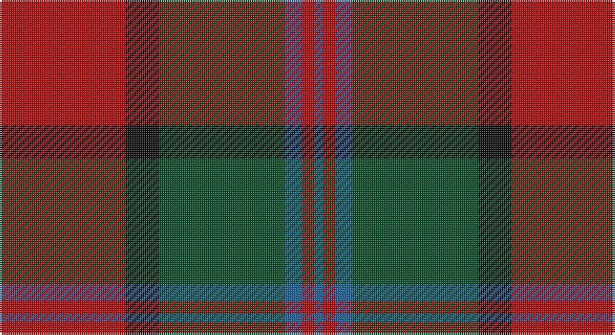

This page is one **sett** — a single exact thread-count. It belongs to the [tartan](/setts/r30k8dg30b4r3b2/)
(the same proportion at any scale), whose colour order is pattern [BRBGKR](/stripes/brbgkr/).

Part of the [Plummer](/tartans/plummer/) tartan — the named design grouping this sett with its other cloths.

Sourced from house-of-tartan.  It is a [6 stripe tartan](/stripes/stripes6/).

Original link http://www.house-of-tartan.scotland.net/house/TartanViewjs.asp?colr=Def&tnam=2778

## Provenance

Earliest known date: 2001 From a D C Dalgliesh swatch in 2001 via Phil Smith June 2004.

## Also known as

This cloth is also recorded under:

- Plummer Family Personal

## Thread count
R/60 K16 G60 B8 R6 B/4

One full sett is **244 threads**.

## Palette

Palette: <strong>Tartan Register</strong> <small style="color:#888">(3 of 7 colours)</small>
<table><thead><tr><th>Colour</th><th>Threads</th><th>Shade</th><th>Base</th><th>OKLCh</th></tr></thead><tbody><tr><td>R/</td><td style="text-align:right;font-variant-numeric:tabular-nums">60</td><td><code style="background-color:#C80000;">#C80000</code> <small style="color:#888">#C80000</small></td><td>R <code style="background-color:#CC0000;">#CC0000</code></td><td><small style="color:#888">oklch(52.3% 0.215 29.2)</small></td></tr><tr><td>K</td><td style="text-align:right;font-variant-numeric:tabular-nums">16</td><td><code style="background-color:#101010;">#101010</code> <small style="color:#888">#101010</small></td><td>K <code style="background-color:#000000;">#000000</code></td><td><small style="color:#888">oklch(17.3% 0.000 89.9)</small></td></tr><tr><td>G</td><td style="text-align:right;font-variant-numeric:tabular-nums">60</td><td><code style="background-color:#005028;">#005028</code> <small style="color:#888">#005028</small></td><td>G <code style="background-color:#006100;">#006100</code></td><td><small style="color:#888">oklch(37.8% 0.097 153.4)</small></td></tr><tr><td>B</td><td style="text-align:right;font-variant-numeric:tabular-nums">8</td><td><code style="background-color:#1860A8;">#1860A8</code> <small style="color:#888">#1860A8</small></td><td>B <code style="background-color:#2A418A;">#2A418A</code></td><td><small style="color:#888">oklch(48.6% 0.134 252.8)</small></td></tr><tr><td>R</td><td style="text-align:right;font-variant-numeric:tabular-nums">6</td><td><code style="background-color:#C80000;">#C80000</code> <small style="color:#888">#C80000</small></td><td>R <code style="background-color:#CC0000;">#CC0000</code></td><td><small style="color:#888">oklch(52.3% 0.215 29.2)</small></td></tr><tr><td>B/</td><td style="text-align:right;font-variant-numeric:tabular-nums">4</td><td><code style="background-color:#1860A8;">#1860A8</code> <small style="color:#888">#1860A8</small></td><td>B <code style="background-color:#2A418A;">#2A418A</code></td><td><small style="color:#888">oklch(48.6% 0.134 252.8)</small></td></tr></tbody></table>

# Sample pattern

## Compared to the master

This cloth is one sett of its design; the master sett (the exemplar the design is anchored on) is below for comparison.

<figure style="margin:0"><figcaption style="color:#888;font-size:smaller">this sett</figcaption></figure>
<figure style="margin:0"><figcaption style="color:#888;font-size:smaller"><a href="/setts/r100k15g48db5r7db16/">master sett →</a></figcaption></figure>

## Nearest tartans

The nearest existing variants by ΔTartan distance, with this tartan at the top so the swatches line up against it.

ΔTartan

Tartan

Sett

—

<a href="/ttd/edit/#slug=r30k8dg30b4r3b2~x2">Plummer Family Personal Tartan</a> <a class="nn-out" href="/variants/s6/r30k8dg30b4r3b2~x2/" title="open its dictionary page">↗</a>

0.59

<a href="/ttd/edit/#slug=dp8r3ly1r3dg14r3ly1~x4&amp;base=r30k8dg30b4r3b2~x2">Logan - 1819 (with yellow)</a> <a class="nn-out" href="/variants/s7/dp8r3ly1r3dg14r3ly1~x4/" title="open its dictionary page">↗</a>

0.61

<a href="/ttd/edit/#slug=k6r2dg17r16k1t2~x2&amp;base=r30k8dg30b4r3b2~x2">Unidentified #15</a> <a class="nn-out" href="/variants/s6/k6r2dg17r16k1t2~x2/" title="open its dictionary page">↗</a>

0.63

<a href="/ttd/edit/#slug=ly2dg17g4r15dg1~x2&amp;base=r30k8dg30b4r3b2~x2">Christmas</a> <a class="nn-out" href="/variants/s5/ly2dg17g4r15dg1~x2/" title="open its dictionary page">↗</a>

0.65

<a href="/ttd/edit/#slug=dg12g6dg6r15k1r1k2~x2&amp;base=r30k8dg30b4r3b2~x2">Cook (Name)</a> <a class="nn-out" href="/variants/s7/dg12g6dg6r15k1r1k2~x2/" title="open its dictionary page">↗</a>

0.71

<a href="/ttd/edit/#slug=dp8r3ly1r3g14r3ly1~x4&amp;base=r30k8dg30b4r3b2~x2">Logan with Yellow</a> <a class="nn-out" href="/variants/s7/dp8r3ly1r3g14r3ly1~x4/" title="open its dictionary page">↗</a>

0.82

<a href="/ttd/edit/#slug=db1r5dg18r4db9r10w1~x4&amp;base=r30k8dg30b4r3b2~x2">MacKintosh Geddes</a> <a class="nn-out" href="/variants/s7/db1r5dg18r4db9r10w1~x4/" title="open its dictionary page">↗</a>

0.89

<a href="/ttd/edit/#slug=dp1r5g15r3dp9r10w1~x4&amp;base=r30k8dg30b4r3b2~x2">Geddes</a> <a class="nn-out" href="/variants/s7/dp1r5g15r3dp9r10w1~x4/" title="open its dictionary page">↗</a>

0.93

<a href="/ttd/edit/#slug=lb2dr12g6dr1n6dr1~x4&amp;base=r30k8dg30b4r3b2~x2">Fraser Green</a> <a class="nn-out" href="/variants/s6/lb2dr12g6dr1n6dr1~x4/" title="open its dictionary page">↗</a>

0.95

<a href="/ttd/edit/#slug=r3dr14g8r2g2w2g2r1~x2&amp;base=r30k8dg30b4r3b2~x2">Scott Hunting Clan Tartan</a> <a class="nn-out" href="/variants/s8/r3dr14g8r2g2w2g2r1~x2/" title="open its dictionary page">↗</a>

0.97

<a href="/ttd/edit/#slug=g12t6g6r15k1r1k2~x4&amp;base=r30k8dg30b4r3b2~x2">McCook/Cook (Name)</a> <a class="nn-out" href="/variants/s7/g12t6g6r15k1r1k2~x4/" title="open its dictionary page">↗</a>

## Neighbour map

Every grey dot is one of 14360 variants placed by the first two principal components of the ΔTartan feature space (44% of its variance). Red is this tartan; blue dots are its nearest — click one to open its page.

<svg viewBox="0 0 640 380" role="img" style="max-width:100%;height:auto;border:1px solid #e0e0e0;border-radius:4px;display:block" xmlns="http://www.w3.org/2000/svg"><image href="/nn/cloud.v1.png" width="640" height="380"/><a href="/variants/s7/dp8r3ly1r3dg14r3ly1~x4/"><circle cx="248.0" cy="181.0" r="4" fill="#3465a4"><title>Logan - 1819 (with yellow)</title></circle></a><a href="/variants/s6/k6r2dg17r16k1t2~x2/"><circle cx="258.0" cy="179.2" r="4" fill="#3465a4"><title>Unidentified #15</title></circle></a><a href="/variants/s5/ly2dg17g4r15dg1~x2/"><circle cx="301.4" cy="200.9" r="4" fill="#3465a4"><title>Christmas</title></circle></a><a href="/variants/s7/dg12g6dg6r15k1r1k2~x2/"><circle cx="252.7" cy="191.8" r="4" fill="#3465a4"><title>Cook (Name)</title></circle></a><a href="/variants/s7/dp8r3ly1r3g14r3ly1~x4/"><circle cx="246.7" cy="178.7" r="4" fill="#3465a4"><title>Logan with Yellow</title></circle></a><a href="/variants/s7/db1r5dg18r4db9r10w1~x4/"><circle cx="249.2" cy="180.7" r="4" fill="#3465a4"><title>MacKintosh Geddes</title></circle></a><a href="/variants/s7/dp1r5g15r3dp9r10w1~x4/"><circle cx="242.8" cy="188.1" r="4" fill="#3465a4"><title>Geddes</title></circle></a><a href="/variants/s6/lb2dr12g6dr1n6dr1~x4/"><circle cx="287.9" cy="212.9" r="4" fill="#3465a4"><title>Fraser Green</title></circle></a><a href="/variants/s8/r3dr14g8r2g2w2g2r1~x2/"><circle cx="245.5" cy="171.8" r="4" fill="#3465a4"><title>Scott Hunting Clan Tartan</title></circle></a><a href="/variants/s7/g12t6g6r15k1r1k2~x4/"><circle cx="248.7" cy="189.5" r="4" fill="#3465a4"><title>McCook/Cook (Name)</title></circle></a><circle cx="280.0" cy="188.3" r="5" fill="#c00000"/></svg>

ID: /variants/s6/r30k8dg30b4r3b2~x2/
