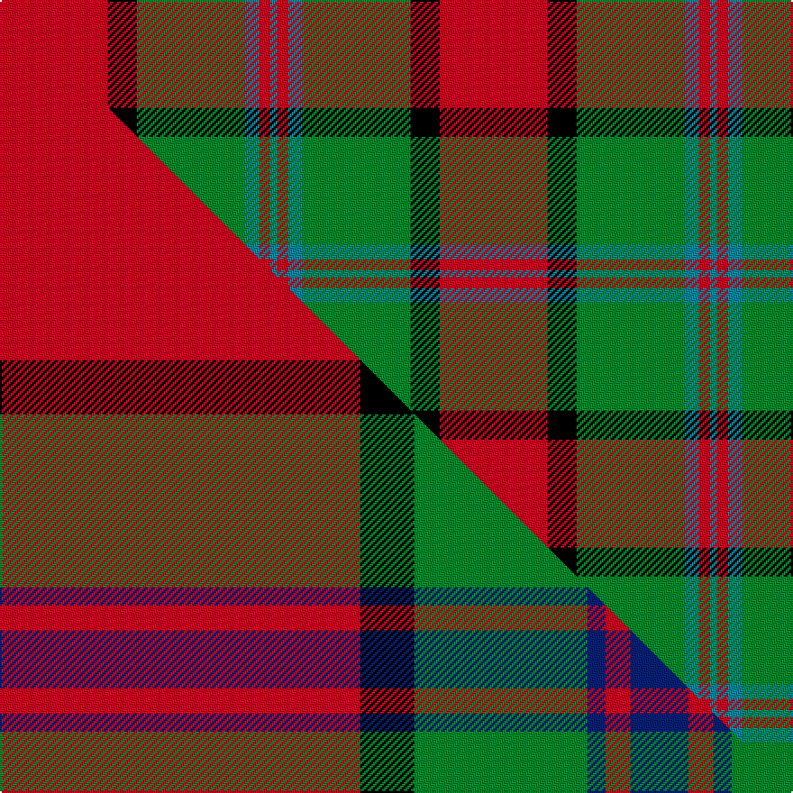

This page is one **sett** — a single exact thread-count. It belongs to the [tartan](/setts/r30k8g30t4r3t2/)
(the same proportion at any scale), whose colour order is pattern [BRBGKR](/stripes/brbgkr/).

Part of the [Plummer](/tartans/plummer/) tartan — the named design grouping this sett with its other cloths.

Sourced from house-of-tartan.  It is a [6 stripe tartan](/stripes/stripes6/).

Original link http://www.house-of-tartan.scotland.net/house/TartanViewjs.asp?colr=Def&tnam=2778

## Provenance

Earliest known date: 2001 From a D C Dalgliesh swatch in 2001 via Phil Smith June 2004.

## Thread count
R/60 K16 G60 T8 R6 T/4

One full sett is **244 threads**.

## Palette
<table><thead><tr><th>Colour</th><th>Shade</th><th>OKLCh</th></tr></thead><tbody><tr><td>T</td><td><code style="background-color:#00879F;">#00879F</code> <small style="color:#888">#00879F</small></td><td><small style="color:#888">oklch(57.4% 0.102 216.1)</small></td></tr><tr><td>DB</td><td><code style="background-color:#1C0070;">#1C0070</code> <small style="color:#888">#1C0070</small></td><td><small style="color:#888">oklch(26.3% 0.162 277.1)</small></td></tr><tr><td>DG</td><td><code style="background-color:#053819;">#053819</code> <small style="color:#888">#053819</small></td><td><small style="color:#888">oklch(30.0% 0.075 151.3)</small></td></tr><tr><td>G</td><td><code style="background-color:#008B2A;">#008B2A</code> <small style="color:#888">#008B2A</small></td><td><small style="color:#888">oklch(55.4% 0.170 145.9)</small></td></tr><tr><td>K</td><td><code style="background-color:#000000;">#000000</code> <small style="color:#888">#000000</small></td><td><small style="color:#888">oklch(0.0% 0.000 0.0)</small></td></tr><tr><td>DP</td><td><code style="background-color:#3C3C60;">#3C3C60</code> <small style="color:#888">#3C3C60</small></td><td><small style="color:#888">oklch(37.3% 0.061 283.0)</small></td></tr><tr><td>R</td><td><code style="background-color:#D60020;">#D60020</code> <small style="color:#888">#D60020</small></td><td><small style="color:#888">oklch(55.2% 0.224 25.5)</small></td></tr></tbody></table>

# Sample pattern

## Compared to the master

This cloth is one sett of its design; the master sett (the exemplar the design is anchored on) is below for comparison.

Its **ΔTartan distance** from the master is **1.63** — the same measure the nearest-tartans table ranks by (0 is identical; a re-scale of the same cloth is near 0, a recolour or a different proportion further).

<figure class="master-compare" style="margin:0">

this sett
master sett ★

<figcaption style="color:#888;font-size:smaller">One weave of this sett against the <a href="/setts/r100k15g48db5r7db16/">master sett ★</a>, split on the diagonal: a shared proportion runs seamlessly across it with only the shades shifting; a different proportion breaks on it.</figcaption>
</figure>

## Nearest variants

The nearest existing variants by ΔTartan distance, with this cloth at the top so the swatches line up against it.

ΔTartan

Threads

Variant

Sett

—

244

<a href="/variants/s6/r30k8g30t4r3t2~x2/">Plummer Family Personal Tartan</a>

<a href="/ttd/edit/#slug=r12t18k1r4k1g6k2~x2&amp;base=r30k8g30t4r3t2~x2" title="compare in the TTD">1.57</a>

148

<a href="/variants/s7/r12t18k1r4k1g6k2~x2/">Confederate</a>

<a href="/ttd/edit/#slug=g24db2r25y2k3~x2&amp;base=r30k8g30t4r3t2~x2" title="compare in the TTD">1.77</a>

170

<a href="/variants/s5/g24db2r25y2k3~x2/">Bronte</a>

<a href="/ttd/edit/#slug=g24t2r25y2k3~x2&amp;base=r30k8g30t4r3t2~x2" title="compare in the TTD">1.77</a>

170

<a href="/variants/s5/g24t2r25y2k3~x2/">Bronte (Name)</a>

<a href="/ttd/edit/#slug=g12lb6g6r15k1r1k2~x4&amp;base=r30k8g30t4r3t2~x2" title="compare in the TTD">1.99</a>

288

<a href="/variants/s7/g12lb6g6r15k1r1k2~x4/">McCook/Cook (Name)</a>

<a href="/ttd/edit/#slug=g12lb6g6r15k1r1k2~x2&amp;base=r30k8g30t4r3t2~x2" title="compare in the TTD">1.99</a>

144

<a href="/variants/s7/g12lb6g6r15k1r1k2~x2/">(2) Cook</a>

<a href="/ttd/edit/#slug=k2db1g10r10ly1~x6&amp;base=r30k8g30t4r3t2~x2" title="compare in the TTD">2.04</a>

270

<a href="/variants/s5/k2db1g10r10ly1~x6/">Turnbull Dress</a>

<a href="/ttd/edit/#slug=k2r20k8g18r3w2~x2&amp;base=r30k8g30t4r3t2~x2" title="compare in the TTD">2.05</a>

204

<a href="/variants/s6/k2r20k8g18r3w2~x2/">Celtic Combat</a>

<a href="/ttd/edit/#slug=k7db3g28r28y3~x2&amp;base=r30k8g30t4r3t2~x2" title="compare in the TTD">2.07</a>

256

<a href="/variants/s5/k7db3g28r28y3~x2/">Turnbull, dress</a>

<a href="/ttd/edit/#slug=lb2k2r27g27k12lb12r27k2lb2~x2&amp;base=r30k8g30t4r3t2~x2" title="compare in the TTD">2.08</a>

444

<a href="/variants/s9/lb2k2r27g27k12lb12r27k2lb2~x2/">MacNaughton</a>

<a href="/ttd/edit/#slug=k2r16g6r3g8w1~x4&amp;base=r30k8g30t4r3t2~x2" title="compare in the TTD">2.08</a>

276

<a href="/variants/s6/k2r16g6r3g8w1~x4/">MacAulay (Clan)</a>

## Neighbour map

Every grey dot is one of 13620 variants placed by the first two principal components of the ΔTartan feature space (42% of its variance). Red is this tartan; blue dots are its nearest — click one to open its page.

<svg viewBox="0 0 640 380" role="img" style="max-width:100%;height:auto;border:1px solid #e0e0e0;border-radius:4px;display:block" xmlns="http://www.w3.org/2000/svg"><image href="/nn/cloud.v1.png" width="640" height="380"/><a href="/variants/s7/r12t18k1r4k1g6k2~x2/"><circle cx="224.0" cy="159.8" r="4" fill="#3465a4"><title>Confederate</title></circle></a><a href="/variants/s5/g24db2r25y2k3~x2/"><circle cx="249.0" cy="173.6" r="4" fill="#3465a4"><title>Bronte</title></circle></a><a href="/variants/s5/g24t2r25y2k3~x2/"><circle cx="253.5" cy="175.6" r="4" fill="#3465a4"><title>Bronte (Name)</title></circle></a><a href="/variants/s7/g12lb6g6r15k1r1k2~x4/"><circle cx="210.2" cy="173.7" r="4" fill="#3465a4"><title>McCook/Cook (Name)</title></circle></a><a href="/variants/s7/g12lb6g6r15k1r1k2~x2/"><circle cx="210.2" cy="173.7" r="4" fill="#3465a4"><title>(2) Cook</title></circle></a><a href="/variants/s5/k2db1g10r10ly1~x6/"><circle cx="206.8" cy="187.1" r="4" fill="#3465a4"><title>Turnbull Dress</title></circle></a><a href="/variants/s6/k2r20k8g18r3w2~x2/"><circle cx="190.0" cy="183.1" r="4" fill="#3465a4"><title>Celtic Combat</title></circle></a><a href="/variants/s5/k7db3g28r28y3~x2/"><circle cx="190.7" cy="190.9" r="4" fill="#3465a4"><title>Turnbull, dress</title></circle></a><a href="/variants/s9/lb2k2r27g27k12lb12r27k2lb2~x2/"><circle cx="206.9" cy="154.2" r="4" fill="#3465a4"><title>MacNaughton</title></circle></a><a href="/variants/s6/k2r16g6r3g8w1~x4/"><circle cx="292.5" cy="172.7" r="4" fill="#3465a4"><title>MacAulay (Clan)</title></circle></a><circle cx="232.1" cy="169.1" r="5" fill="#c00000"/><text x="320" y="376" text-anchor="middle" font-size="11" fill="#999">ground</text><text x="11" y="190" text-anchor="middle" font-size="11" fill="#999" transform="rotate(-90 11 190)">complexity</text></svg>

ID: /variants/s6/r30k8g30t4r3t2~x2/
