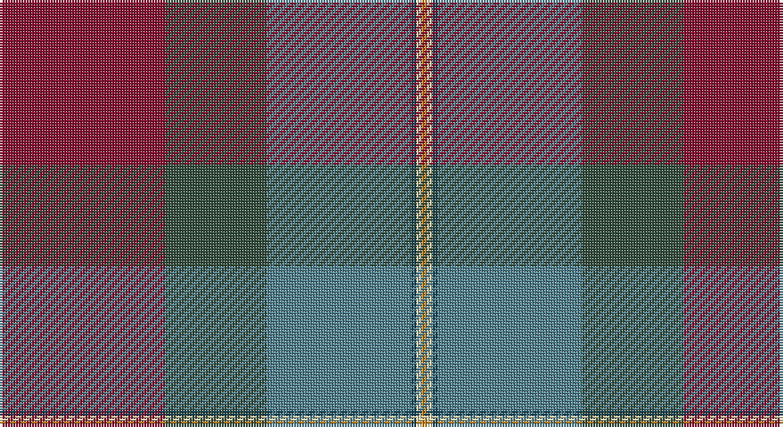

This page is one **sett** — a single exact thread-count. It belongs to the [tartan](/setts/r31dg19t27dt1w1lo1/)
(the same proportion at any scale), whose colour order is pattern [RGBBWY](/stripes/rgbbwy/).

Part of the [Glencross](/tartans/glencross/) tartan — the named design grouping this sett with its other cloths.

Sourced from register-of-tartans.  It is a [6 stripe tartan](/stripes/stripes6/).

Original link https://www.tartanregister.gov.uk/tartanDetails.aspx?ref=10438

## Also known as

This cloth is also recorded under:

- Glencross,

## Register references

External register numbers recorded for this tartan.

- Scottish Register of Tartans: [10438](https://www.tartanregister.gov.uk/tartanDetails.aspx?ref=10438)

## Thread count
DR/62 N38 B54 DB2 LR2 DO/2

One full sett is **256 threads**.

## Palette

Palette: <strong>custom</strong>
<table><thead><tr><th>Colour</th><th>Threads</th><th>Shade</th><th>Base</th><th>OKLCh</th></tr></thead><tbody><tr><td>DR/</td><td style="text-align:right;font-variant-numeric:tabular-nums">62</td><td><code style="background-color:#861031;">#861031</code> <small style="color:#888">#861031</small></td><td>R <code style="background-color:#CC0000;">#CC0000</code></td><td><small style="color:#888">oklch(40.3% 0.150 12.8)</small></td></tr><tr><td>N</td><td style="text-align:right;font-variant-numeric:tabular-nums">38</td><td><code style="background-color:#334E3D;">#334E3D</code> <small style="color:#888">#334E3D</small></td><td>G <code style="background-color:#006100;">#006100</code></td><td><small style="color:#888">oklch(39.7% 0.044 156.2)</small></td></tr><tr><td>B</td><td style="text-align:right;font-variant-numeric:tabular-nums">54</td><td><code style="background-color:#50818E;">#50818E</code> <small style="color:#888">#50818E</small></td><td>B <code style="background-color:#2A418A;">#2A418A</code></td><td><small style="color:#888">oklch(57.3% 0.056 216.5)</small></td></tr><tr><td>DB</td><td style="text-align:right;font-variant-numeric:tabular-nums">2</td><td><code style="background-color:#14465C;">#14465C</code> <small style="color:#888">#14465C</small></td><td>B <code style="background-color:#2A418A;">#2A418A</code></td><td><small style="color:#888">oklch(37.2% 0.064 231.3)</small></td></tr><tr><td>LR</td><td style="text-align:right;font-variant-numeric:tabular-nums">2</td><td><code style="background-color:#DDD5AF;">#DDD5AF</code> <small style="color:#888">#DDD5AF</small></td><td>W <code style="background-color:#F7F7F7;">#F7F7F7</code></td><td><small style="color:#888">oklch(87.0% 0.051 97.4)</small></td></tr><tr><td>DO/</td><td style="text-align:right;font-variant-numeric:tabular-nums">2</td><td><code style="background-color:#C5831B;">#C5831B</code> <small style="color:#888">#C5831B</small></td><td>Y <code style="background-color:#F2BF00;">#F2BF00</code></td><td><small style="color:#888">oklch(66.2% 0.134 71.7)</small></td></tr></tbody></table>

# Sample pattern

## Compared to the master

This cloth is one sett of its design; the master sett (the exemplar the design is anchored on) is below for comparison.

<figure style="margin:0"><figcaption style="color:#888;font-size:smaller">this sett</figcaption></figure>
<figure style="margin:0"><figcaption style="color:#888;font-size:smaller"><a href="/setts/o3dgi13dt13lo2dg34w3/">master sett →</a></figcaption></figure>

## Nearest tartans

The nearest existing variants by ΔTartan distance, with this tartan at the top so the swatches line up against it.

ΔTartan

Tartan

Sett

—

<a href="/ttd/edit/#slug=r31dg19t27dt1w1lo1~x2">Glencross (Solway) (Personal)</a> <a class="nn-out" href="/variants/s6/r31dg19t27dt1w1lo1~x2/" title="open its dictionary page">↗</a>

1.45

<a href="/ttd/edit/#slug=oii16k1oi7k1oi7k1oii7dy24o4~x2&amp;base=r31dg19t27dt1w1lo1~x2">Knockando Woolmill</a> <a class="nn-out" href="/variants/s9/oii16k1oi7k1oi7k1oii7dy24o4~x2/" title="open its dictionary page">↗</a>

1.46

<a href="/ttd/edit/#slug=y2dg9ri16r2b30y3dg6lb1~x2&amp;base=r31dg19t27dt1w1lo1~x2">The Climb (Fashion)</a> <a class="nn-out" href="/variants/s8/y2dg9ri16r2b30y3dg6lb1~x2/" title="open its dictionary page">↗</a>

1.47

<a href="/ttd/edit/#slug=dg30dt2n7r14n7r7w1dt14~x2&amp;base=r31dg19t27dt1w1lo1~x2">Harding (Name)</a> <a class="nn-out" href="/variants/s8/dg30dt2n7r14n7r7w1dt14~x2/" title="open its dictionary page">↗</a>

1.56

<a href="/ttd/edit/#slug=k6y1r18b6dg18k2~x2&amp;base=r31dg19t27dt1w1lo1~x2">Eachaidh</a> <a class="nn-out" href="/variants/s6/k6y1r18b6dg18k2~x2/" title="open its dictionary page">↗</a>

1.63

<a href="/ttd/edit/#slug=m8k2dy10dp30dy30g55k4lo6&amp;base=r31dg19t27dt1w1lo1~x2">Aberuchill</a> <a class="nn-out" href="/variants/s8/m8k2dy10dp30dy30g55k4lo6/" title="open its dictionary page">↗</a>

1.63

<a href="/ttd/edit/#slug=m8k2y10dp30y30g55k4o6&amp;base=r31dg19t27dt1w1lo1~x2">Aberuchill District Tartan</a> <a class="nn-out" href="/variants/s8/m8k2y10dp30y30g55k4o6/" title="open its dictionary page">↗</a>

1.63

<a href="/ttd/edit/#slug=t16k1r7k1r7k1t7y24lo4~x2&amp;base=r31dg19t27dt1w1lo1~x2">Knockando Woolmill (Corporate)</a> <a class="nn-out" href="/variants/s9/t16k1r7k1r7k1t7y24lo4~x2/" title="open its dictionary page">↗</a>

1.65

<a href="/ttd/edit/#slug=r26t1t10t1g32r11t8w3t1~x2&amp;base=r31dg19t27dt1w1lo1~x2">Spens/Spence (Clan)</a> <a class="nn-out" href="/variants/s9/r26t1t10t1g32r11t8w3t1~x2/" title="open its dictionary page">↗</a>

1.65

<a href="/ttd/edit/#slug=db12t6g30db9r8lo1~x2&amp;base=r31dg19t27dt1w1lo1~x2">Wright, Anne (Personal)</a> <a class="nn-out" href="/variants/s6/db12t6g30db9r8lo1~x2/" title="open its dictionary page">↗</a>

1.66

<a href="/ttd/edit/#slug=n50o50ly1db27dg18do9ly4~x2&amp;base=r31dg19t27dt1w1lo1~x2">Lachance (Commemorative)</a> <a class="nn-out" href="/variants/s7/n50o50ly1db27dg18do9ly4~x2/" title="open its dictionary page">↗</a>

## Neighbour map

Every grey dot is one of 14360 variants placed by the first two principal components of the ΔTartan feature space (44% of its variance). Red is this tartan; blue dots are its nearest — click one to open its page.

<svg viewBox="0 0 640 380" role="img" style="max-width:100%;height:auto;border:1px solid #e0e0e0;border-radius:4px;display:block" xmlns="http://www.w3.org/2000/svg"><image href="/nn/cloud.v1.png" width="640" height="380"/><a href="/variants/s9/oii16k1oi7k1oi7k1oii7dy24o4~x2/"><circle cx="271.8" cy="164.6" r="4" fill="#3465a4"><title>Knockando Woolmill</title></circle></a><a href="/variants/s8/y2dg9ri16r2b30y3dg6lb1~x2/"><circle cx="266.5" cy="128.0" r="4" fill="#3465a4"><title>The Climb (Fashion)</title></circle></a><a href="/variants/s8/dg30dt2n7r14n7r7w1dt14~x2/"><circle cx="244.6" cy="162.5" r="4" fill="#3465a4"><title>Harding (Name)</title></circle></a><a href="/variants/s6/k6y1r18b6dg18k2~x2/"><circle cx="251.2" cy="204.8" r="4" fill="#3465a4"><title>Eachaidh</title></circle></a><a href="/variants/s8/m8k2dy10dp30dy30g55k4lo6/"><circle cx="232.1" cy="141.8" r="4" fill="#3465a4"><title>Aberuchill</title></circle></a><a href="/variants/s8/m8k2y10dp30y30g55k4o6/"><circle cx="243.3" cy="151.3" r="4" fill="#3465a4"><title>Aberuchill District Tartan</title></circle></a><a href="/variants/s9/t16k1r7k1r7k1t7y24lo4~x2/"><circle cx="247.8" cy="153.8" r="4" fill="#3465a4"><title>Knockando Woolmill (Corporate)</title></circle></a><a href="/variants/s9/r26t1t10t1g32r11t8w3t1~x2/"><circle cx="274.5" cy="132.0" r="4" fill="#3465a4"><title>Spens/Spence (Clan)</title></circle></a><a href="/variants/s6/db12t6g30db9r8lo1~x2/"><circle cx="319.9" cy="193.3" r="4" fill="#3465a4"><title>Wright, Anne (Personal)</title></circle></a><a href="/variants/s7/n50o50ly1db27dg18do9ly4~x2/"><circle cx="216.6" cy="134.3" r="4" fill="#3465a4"><title>Lachance (Commemorative)</title></circle></a><circle cx="289.5" cy="156.4" r="5" fill="#c00000"/></svg>

ID: /variants/s6/r31dg19t27dt1w1lo1~x2/
