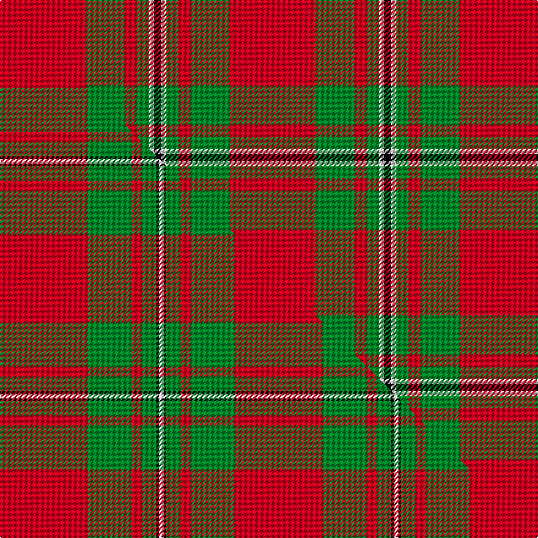

This page is one **sett** — a single exact thread-count. It belongs to the [tartan](/setts/r35g16r5g5w2k3/)
(the same proportion at any scale), whose colour order is pattern [KWGRGR](/stripes/kwgrgr/).

Part of the [MacGregor](/tartans/macgregor-2/) tartan — the named design grouping this sett with its other cloths.

Sourced from register-of-tartans.  It is a [6 stripe tartan](/stripes/stripes6/).

Original link https://www.tartanregister.gov.uk/tartanDetails.aspx?ref=2449

2 attestations — the source records this cloth was collapsed from (oldest owns this page)

<ul>
<li>undated — MacGregor (register-of-tartans, <a href="https://www.tartanregister.gov.uk/tartanDetails.aspx?ref=2449">record</a>)  <em>Trade sett with double white lines, Scottish Tartans Society archive.</em></li>
<li>undated — MacGregor (weddslist, <a href="http://www.weddslist.com/cgi-bin/tartans/pg.pl?source=sts">record</a>) </li>
</ul>

## Register references

External register numbers recorded for this tartan.

- Scottish Register of Tartans: [2449](https://www.tartanregister.gov.uk/tartanDetails.aspx?ref=2449)
- Scottish Tartans World Register: 1114

## Thread count
R/70 G32 R10 G10 W4 K/6

One full sett is **188 threads**.

## Palette
<table><thead><tr><th>Colour</th><th>Shade</th><th>OKLCh</th></tr></thead><tbody><tr><td>G</td><td><code style="background-color:#008B2A;">#008B2A</code> <small style="color:#888">#008B2A</small></td><td><small style="color:#888">oklch(55.4% 0.170 145.9)</small></td></tr><tr><td>K</td><td><code style="background-color:#000000;">#000000</code> <small style="color:#888">#000000</small></td><td><small style="color:#888">oklch(0.0% 0.000 0.0)</small></td></tr><tr><td>W</td><td><code style="background-color:#F7F7F7;">#F7F7F7</code> <small style="color:#888">#F7F7F7</small></td><td><small style="color:#888">oklch(97.6% 0.000 89.9)</small></td></tr><tr><td>R</td><td><code style="background-color:#D60020;">#D60020</code> <small style="color:#888">#D60020</small></td><td><small style="color:#888">oklch(55.2% 0.224 25.5)</small></td></tr></tbody></table>

# Sample pattern

## Compared to the master

This cloth is one sett of its design; the master sett (the exemplar the design is anchored on) is below for comparison.

Its **ΔTartan distance** from the master is **1.17** — the same measure the nearest-tartans table ranks by (0 is identical; a re-scale of the same cloth is near 0, a recolour or a different proportion further).

<figure class="master-compare" style="margin:0">

this sett
master sett ★

<figcaption style="color:#888;font-size:smaller">One weave of this sett against the <a href="/setts/r36g18r4g6k1w2/">master sett ★</a>, split on the diagonal: a shared proportion runs seamlessly across it with only the shades shifting; a different proportion breaks on it.</figcaption>
</figure>

## Nearest tartan variants

The nearest existing variants by ΔTartan distance, with this cloth at the top so the swatches line up against it.

ΔTartan

Threads

Variant

Sett

—

188

<a href="/variants/s6/r35g16r5g5w2k3~x2/">MacGregor</a>

<a href="/ttd/edit/#slug=k2r16g6r3g8w1~x4&amp;base=r35g16r5g5w2k3~x2" title="compare in the TTD">0.48</a>

276

<a href="/variants/s6/k2r16g6r3g8w1~x4/">MacAulay (Clan)</a>

<a href="/ttd/edit/#slug=k2r16g6r3g8w1&amp;base=r35g16r5g5w2k3~x2" title="compare in the TTD">0.48</a>

69

<a href="/variants/s6/k2r16g6r3g8w1/">MacAulay</a>

<a href="/ttd/edit/#slug=k2r16g6r3g8w1~x2&amp;base=r35g16r5g5w2k3~x2" title="compare in the TTD">0.48</a>

138

<a href="/variants/s6/k2r16g6r3g8w1~x2/">MacAulay</a>

<a href="/ttd/edit/#slug=r60k2w3dg20r10dg20~x2&amp;base=r35g16r5g5w2k3~x2" title="compare in the TTD">0.58</a>

300

<a href="/variants/s6/r60k2w3dg20r10dg20~x2/">Greig (Personal)</a>

<a href="/ttd/edit/#slug=g10r4g46r69k2w6&amp;base=r35g16r5g5w2k3~x2" title="compare in the TTD">0.70</a>

258

<a href="/variants/s6/g10r4g46r69k2w6/">Colchester &amp; District Pipes &amp; Drums</a>

<a href="/ttd/edit/#slug=r18g9r2g3k1w1~x4&amp;base=r35g16r5g5w2k3~x2" title="compare in the TTD">0.78</a>

196

<a href="/variants/s6/r18g9r2g3k1w1~x4/">MacGregor of Cardney</a>

<a href="/ttd/edit/#slug=r18g9r2g3k1n1~x4&amp;base=r35g16r5g5w2k3~x2" title="compare in the TTD">0.78</a>

196

<a href="/variants/s6/r18g9r2g3k1n1~x4/">MacGregor of Cardney - 1930 (Clan)</a>

<a href="/ttd/edit/#slug=k2r16g6r3g8lb1~x2&amp;base=r35g16r5g5w2k3~x2" title="compare in the TTD">0.79</a>

138

<a href="/variants/s6/k2r16g6r3g8lb1~x2/">MacAulay</a>

<a href="/ttd/edit/#slug=r32lb5g17r4g5w2~x2&amp;base=r35g16r5g5w2k3~x2" title="compare in the TTD">0.82</a>

192

<a href="/variants/s6/r32lb5g17r4g5w2~x2/">Wilson's, No 5</a>

<a href="/ttd/edit/#slug=r96g42r16g17k4lb6&amp;base=r35g16r5g5w2k3~x2" title="compare in the TTD">0.94</a>

260

<a href="/variants/s6/r96g42r16g17k4lb6/">MacGregor Hunting Glengyle Clan Tartan</a>

## Neighbour map

Every grey dot is one of 13620 variants placed by the first two principal components of the ΔTartan feature space (42% of its variance). Red is this tartan; blue dots are its nearest — click one to open its page.

<svg viewBox="0 0 640 380" role="img" style="max-width:100%;height:auto;border:1px solid #e0e0e0;border-radius:4px;display:block" xmlns="http://www.w3.org/2000/svg"><image href="/nn/cloud.v1.png" width="640" height="380"/><a href="/variants/s6/k2r16g6r3g8w1~x4/"><circle cx="292.5" cy="172.7" r="4" fill="#3465a4"><title>MacAulay (Clan)</title></circle></a><a href="/variants/s6/k2r16g6r3g8w1/"><circle cx="292.5" cy="172.7" r="4" fill="#3465a4"><title>MacAulay</title></circle></a><a href="/variants/s6/k2r16g6r3g8w1~x2/"><circle cx="292.5" cy="172.7" r="4" fill="#3465a4"><title>MacAulay</title></circle></a><a href="/variants/s6/r60k2w3dg20r10dg20~x2/"><circle cx="380.1" cy="131.4" r="4" fill="#3465a4"><title>Greig (Personal)</title></circle></a><a href="/variants/s6/g10r4g46r69k2w6/"><circle cx="353.4" cy="128.9" r="4" fill="#3465a4"><title>Colchester &amp; District Pipes &amp; Drums</title></circle></a><a href="/variants/s6/r18g9r2g3k1w1~x4/"><circle cx="357.3" cy="152.6" r="4" fill="#3465a4"><title>MacGregor of Cardney</title></circle></a><a href="/variants/s6/r18g9r2g3k1n1~x4/"><circle cx="369.1" cy="156.4" r="4" fill="#3465a4"><title>MacGregor of Cardney - 1930 (Clan)</title></circle></a><a href="/variants/s6/k2r16g6r3g8lb1~x2/"><circle cx="297.2" cy="174.2" r="4" fill="#3465a4"><title>MacAulay</title></circle></a><a href="/variants/s6/r32lb5g17r4g5w2~x2/"><circle cx="355.5" cy="184.5" r="4" fill="#3465a4"><title>Wilson's, No 5</title></circle></a><a href="/variants/s6/r96g42r16g17k4lb6/"><circle cx="392.4" cy="146.0" r="4" fill="#3465a4"><title>MacGregor Hunting Glengyle Clan Tartan</title></circle></a><circle cx="351.7" cy="150.1" r="5" fill="#c00000"/><text x="320" y="376" text-anchor="middle" font-size="11" fill="#999">ground</text><text x="11" y="190" text-anchor="middle" font-size="11" fill="#999" transform="rotate(-90 11 190)">complexity</text></svg>

ID: /variants/s6/r35g16r5g5w2k3~x2/
