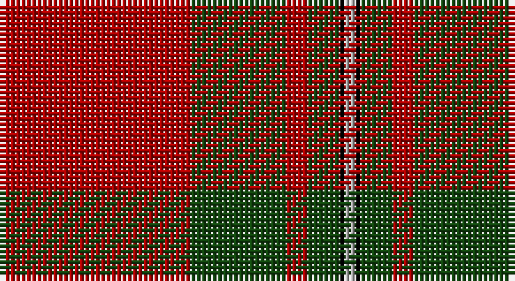

This page is one **sett** — a single exact thread-count. It belongs to the [tartan](/setts/r36dg18r4dg6k1lr2/)
(the same proportion at any scale), whose colour order is pattern [RGRGKY](/stripes/rgrgky/).

Part of the [MacGregor](/tartans/macgregor/) tartan — the named design grouping this sett with its other cloths.

Sourced from weddslist.  It is a [6 stripe tartan](/stripes/stripes6/).

Original link http://www.weddslist.com/cgi-bin/tartans/pg.pl?source=x

## Also known as

This cloth is also recorded under:

- MacGregor #2
- MacGregor #3
- MacGregor #4
- MacGregor of Glengyle
- MacGregor, Black
- MacGregor, Modern

## Thread count
DR/36 DG18 DR4 DG6 K1 N/2

One full sett is **96 threads**.

## Palette

Palette: <strong>Ingles Buchan</strong> <small style="color:#888">(1 of 4 colours)</small>
<table><thead><tr><th>Colour</th><th>Threads</th><th>Shade</th><th>Base</th><th>OKLCh</th></tr></thead><tbody><tr><td>DR/</td><td style="text-align:right;font-variant-numeric:tabular-nums">36</td><td><code style="background-color:#AA0000;">#AA0000</code> <small style="color:#888">#AA0000</small></td><td>R <code style="background-color:#CC0000;">#CC0000</code></td><td><small style="color:#888">oklch(46.3% 0.190 29.2)</small></td></tr><tr><td>DG</td><td style="text-align:right;font-variant-numeric:tabular-nums">18</td><td><code style="background-color:#11450D;">#11450D</code> <small style="color:#888">#11450D</small></td><td>G <code style="background-color:#006100;">#006100</code></td><td><small style="color:#888">oklch(34.4% 0.101 142.1)</small></td></tr><tr><td>DR</td><td style="text-align:right;font-variant-numeric:tabular-nums">4</td><td><code style="background-color:#AA0000;">#AA0000</code> <small style="color:#888">#AA0000</small></td><td>R <code style="background-color:#CC0000;">#CC0000</code></td><td><small style="color:#888">oklch(46.3% 0.190 29.2)</small></td></tr><tr><td>DG</td><td style="text-align:right;font-variant-numeric:tabular-nums">6</td><td><code style="background-color:#11450D;">#11450D</code> <small style="color:#888">#11450D</small></td><td>G <code style="background-color:#006100;">#006100</code></td><td><small style="color:#888">oklch(34.4% 0.101 142.1)</small></td></tr><tr><td>K</td><td style="text-align:right;font-variant-numeric:tabular-nums">1</td><td><code style="background-color:#000000;">#000000</code> <small style="color:#888">#000000</small></td><td>K <code style="background-color:#000000;">#000000</code></td><td><small style="color:#888">oklch(0.0% 0.000 0.0)</small></td></tr><tr><td>N/</td><td style="text-align:right;font-variant-numeric:tabular-nums">2</td><td><code style="background-color:#AAAAAA;">#AAAAAA</code> <small style="color:#888">#AAAAAA</small></td><td>Y <code style="background-color:#F2BF00;">#F2BF00</code></td><td><small style="color:#888">oklch(73.8% 0.000 89.9)</small></td></tr></tbody></table>

# Sample pattern

## Compared to the master

This cloth is one sett of its design; the master sett (the exemplar the design is anchored on) is below for comparison.

<figure style="margin:0"><figcaption style="color:#888;font-size:smaller">this sett</figcaption></figure>
<figure style="margin:0"><figcaption style="color:#888;font-size:smaller"><a href="/setts/r39dg6r2dg3w1/">master sett →</a></figcaption></figure>

## Nearest tartans

The nearest existing variants by ΔTartan distance, with this tartan at the top so the swatches line up against it.

ΔTartan

Tartan

Sett

—

<a href="/ttd/edit/#slug=r36dg18r4dg6k1lr2">MacGregor</a> <a class="nn-out" href="/variants/s6/r36dg18r4dg6k1lr2/" title="open its dictionary page">↗</a>

0.00

<a href="/ttd/edit/#slug=r36dg18r4dg6k1lr2~x2&amp;base=r36dg18r4dg6k1lr2">MacGregor</a> <a class="nn-out" href="/variants/s6/r36dg18r4dg6k1lr2~x2/" title="open its dictionary page">↗</a>

0.97

<a href="/ttd/edit/#slug=r36dg18r4dg6k1lb2&amp;base=r36dg18r4dg6k1lr2">MacGregor</a> <a class="nn-out" href="/variants/s6/r36dg18r4dg6k1lb2/" title="open its dictionary page">↗</a>

1.01

<a href="/ttd/edit/#slug=r96g42r16g17k4y6&amp;base=r36dg18r4dg6k1lr2">MacGregor, Glengyle</a> <a class="nn-out" href="/variants/s6/r96g42r16g17k4y6/" title="open its dictionary page">↗</a>

1.08

<a href="/ttd/edit/#slug=r36g18r4g6k1lb2k1g2~x2&amp;base=r36dg18r4dg6k1lr2">Strang (Personal)</a> <a class="nn-out" href="/variants/s8/r36g18r4g6k1lb2k1g2~x2/" title="open its dictionary page">↗</a>

1.13

<a href="/ttd/edit/#slug=r60k2w3dg20r10dg20~x2&amp;base=r36dg18r4dg6k1lr2">Greig (Personal)</a> <a class="nn-out" href="/variants/s6/r60k2w3dg20r10dg20~x2/" title="open its dictionary page">↗</a>

1.13

<a href="/ttd/edit/#slug=r4k2dg28r38k1ly4~x2&amp;base=r36dg18r4dg6k1lr2">Wcwm 9275 5471-1</a> <a class="nn-out" href="/variants/s6/r4k2dg28r38k1ly4~x2/" title="open its dictionary page">↗</a>

1.16

<a href="/ttd/edit/#slug=m96g42m16g17k4lb6&amp;base=r36dg18r4dg6k1lr2">MacGregor Hunting Glengyle Clan Tartan</a> <a class="nn-out" href="/variants/s6/m96g42m16g17k4lb6/" title="open its dictionary page">↗</a>

1.17

<a href="/ttd/edit/#slug=dg4r3k1r28dg14r4dg4lr3dg4r4~x2&amp;base=r36dg18r4dg6k1lr2">Scott</a> <a class="nn-out" href="/variants/s10/dg4r3k1r28dg14r4dg4lr3dg4r4~x2/" title="open its dictionary page">↗</a>

1.19

<a href="/ttd/edit/#slug=r41g19r7g8k1w3~x2&amp;base=r36dg18r4dg6k1lr2">MacGregor #4</a> <a class="nn-out" href="/variants/s6/r41g19r7g8k1w3~x2/" title="open its dictionary page">↗</a>

1.25

<a href="/ttd/edit/#slug=r36dg18r4dg6k1w2~x2&amp;base=r36dg18r4dg6k1lr2">MacGregor #3</a> <a class="nn-out" href="/variants/s6/r36dg18r4dg6k1w2~x2/" title="open its dictionary page">↗</a>

## Neighbour map

Every grey dot is one of 14360 variants placed by the first two principal components of the ΔTartan feature space (44% of its variance). Red is this tartan; blue dots are its nearest — click one to open its page.

<svg viewBox="0 0 640 380" role="img" style="max-width:100%;height:auto;border:1px solid #e0e0e0;border-radius:4px;display:block" xmlns="http://www.w3.org/2000/svg"><image href="/nn/cloud.v1.png" width="640" height="380"/><a href="/variants/s6/r36dg18r4dg6k1lr2~x2/"><circle cx="450.0" cy="156.5" r="4" fill="#3465a4"><title>MacGregor</title></circle></a><a href="/variants/s6/r36dg18r4dg6k1lb2/"><circle cx="424.7" cy="139.8" r="4" fill="#3465a4"><title>MacGregor</title></circle></a><a href="/variants/s6/r96g42r16g17k4y6/"><circle cx="421.5" cy="167.8" r="4" fill="#3465a4"><title>MacGregor, Glengyle</title></circle></a><a href="/variants/s8/r36g18r4g6k1lb2k1g2~x2/"><circle cx="421.8" cy="123.3" r="4" fill="#3465a4"><title>Strang (Personal)</title></circle></a><a href="/variants/s6/r60k2w3dg20r10dg20~x2/"><circle cx="418.3" cy="151.3" r="4" fill="#3465a4"><title>Greig (Personal)</title></circle></a><a href="/variants/s6/r4k2dg28r38k1ly4~x2/"><circle cx="412.8" cy="158.5" r="4" fill="#3465a4"><title>Wcwm 9275 5471-1</title></circle></a><a href="/variants/s6/m96g42m16g17k4lb6/"><circle cx="428.6" cy="168.2" r="4" fill="#3465a4"><title>MacGregor Hunting Glengyle Clan Tartan</title></circle></a><a href="/variants/s10/dg4r3k1r28dg14r4dg4lr3dg4r4~x2/"><circle cx="407.6" cy="141.5" r="4" fill="#3465a4"><title>Scott</title></circle></a><a href="/variants/s6/r41g19r7g8k1w3~x2/"><circle cx="427.1" cy="138.0" r="4" fill="#3465a4"><title>MacGregor #4</title></circle></a><a href="/variants/s6/r36dg18r4dg6k1w2~x2/"><circle cx="420.6" cy="134.5" r="4" fill="#3465a4"><title>MacGregor #3</title></circle></a><circle cx="450.0" cy="156.5" r="5" fill="#c00000"/></svg>

ID: /variants/s6/r36dg18r4dg6k1lr2/
