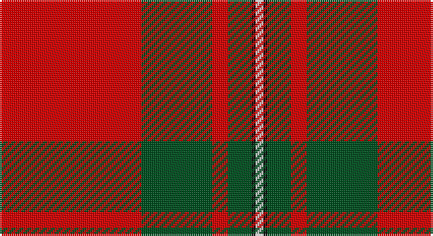

This page is one **sett** — a single exact thread-count. It belongs to the [tartan](/setts/r36dg18r4dg6k1w2/)
(the same proportion at any scale), whose colour order is pattern [RGRGKW](/stripes/rgrgkw/).

Part of the [MacGregor](/tartans/macgregor/) tartan — the named design grouping this sett with its other cloths.

Sourced from register-of-tartans.  It is a [6 stripe tartan](/stripes/stripes6/).

Original link https://www.tartanregister.gov.uk/tartanDetails.aspx?ref=2451

## Also known as

This cloth is also recorded under:

- MacGregor #2
- MacGregor #3
- MacGregor #4
- MacGregor of Glengyle
- MacGregor, Black
- MacGregor, Modern

## Register references

External register numbers recorded for this tartan.

- Scottish Register of Tartans: [2451](https://www.tartanregister.gov.uk/tartanDetails.aspx?ref=2451)
- Scottish Tartans World Register: 1526

## Thread count
R/72 G36 R8 G12 K2 LN/4

One full sett is **192 threads**.

## Palette

Palette: <strong>Tartan Register</strong>
<table><thead><tr><th>Colour</th><th>Threads</th><th>Shade</th><th>Base</th><th>OKLCh</th></tr></thead><tbody><tr><td>R/</td><td style="text-align:right;font-variant-numeric:tabular-nums">72</td><td><code style="background-color:#DC0000;">#DC0000</code> <small style="color:#888">#DC0000</small></td><td>R <code style="background-color:#CC0000;">#CC0000</code></td><td><small style="color:#888">oklch(56.2% 0.230 29.2)</small></td></tr><tr><td>G</td><td style="text-align:right;font-variant-numeric:tabular-nums">36</td><td><code style="background-color:#005020;">#005020</code> <small style="color:#888">#005020</small></td><td>G <code style="background-color:#006100;">#006100</code></td><td><small style="color:#888">oklch(37.7% 0.105 149.6)</small></td></tr><tr><td>R</td><td style="text-align:right;font-variant-numeric:tabular-nums">8</td><td><code style="background-color:#DC0000;">#DC0000</code> <small style="color:#888">#DC0000</small></td><td>R <code style="background-color:#CC0000;">#CC0000</code></td><td><small style="color:#888">oklch(56.2% 0.230 29.2)</small></td></tr><tr><td>G</td><td style="text-align:right;font-variant-numeric:tabular-nums">12</td><td><code style="background-color:#005020;">#005020</code> <small style="color:#888">#005020</small></td><td>G <code style="background-color:#006100;">#006100</code></td><td><small style="color:#888">oklch(37.7% 0.105 149.6)</small></td></tr><tr><td>K</td><td style="text-align:right;font-variant-numeric:tabular-nums">2</td><td><code style="background-color:#101010;">#101010</code> <small style="color:#888">#101010</small></td><td>K <code style="background-color:#000000;">#000000</code></td><td><small style="color:#888">oklch(17.3% 0.000 89.9)</small></td></tr><tr><td>LN/</td><td style="text-align:right;font-variant-numeric:tabular-nums">4</td><td><code style="background-color:#E0E0E0;">#E0E0E0</code> <small style="color:#888">#E0E0E0</small></td><td>W <code style="background-color:#F7F7F7;">#F7F7F7</code></td><td><small style="color:#888">oklch(90.7% 0.000 89.9)</small></td></tr></tbody></table>

# Sample pattern

## Compared to the master

This cloth is one sett of its design; the master sett (the exemplar the design is anchored on) is below for comparison.

<figure style="margin:0"><figcaption style="color:#888;font-size:smaller">this sett</figcaption></figure>
<figure style="margin:0"><figcaption style="color:#888;font-size:smaller"><a href="/setts/r39dg6r2dg3w1/">master sett →</a></figcaption></figure>

## Nearest tartans

The nearest existing variants by ΔTartan distance, with this tartan at the top so the swatches line up against it.

ΔTartan

Tartan

Sett

—

<a href="/ttd/edit/#slug=r36dg18r4dg6k1w2~x2">MacGregor #3</a> <a class="nn-out" href="/variants/s6/r36dg18r4dg6k1w2~x2/" title="open its dictionary page">↗</a>

0.39

<a href="/ttd/edit/#slug=r36dg18r4dg6k1lb2&amp;base=r36dg18r4dg6k1w2~x2">MacGregor</a> <a class="nn-out" href="/variants/s6/r36dg18r4dg6k1lb2/" title="open its dictionary page">↗</a>

0.47

<a href="/ttd/edit/#slug=r41g19r7g8k1w3~x2&amp;base=r36dg18r4dg6k1w2~x2">MacGregor #4</a> <a class="nn-out" href="/variants/s6/r41g19r7g8k1w3~x2/" title="open its dictionary page">↗</a>

0.64

<a href="/ttd/edit/#slug=r60k2w3dg20r10dg20~x2&amp;base=r36dg18r4dg6k1w2~x2">Greig (Personal)</a> <a class="nn-out" href="/variants/s6/r60k2w3dg20r10dg20~x2/" title="open its dictionary page">↗</a>

0.72

<a href="/ttd/edit/#slug=r36g18r4g6k1w2~x2&amp;base=r36dg18r4dg6k1w2~x2">MacGregor</a> <a class="nn-out" href="/variants/s6/r36g18r4g6k1w2~x2/" title="open its dictionary page">↗</a>

0.99

<a href="/ttd/edit/#slug=r57g21r8g8k1w3~x2&amp;base=r36dg18r4dg6k1w2~x2">MacGregor - 1800 (Clan)</a> <a class="nn-out" href="/variants/s6/r57g21r8g8k1w3~x2/" title="open its dictionary page">↗</a>

1.04

<a href="/ttd/edit/#slug=r40w2db2w2r1ly20~x2&amp;base=r36dg18r4dg6k1w2~x2">National Defense</a> <a class="nn-out" href="/variants/s6/r40w2db2w2r1ly20~x2/" title="open its dictionary page">↗</a>

1.07

<a href="/ttd/edit/#slug=r2dg20r2db8r36dg1~x2&amp;base=r36dg18r4dg6k1w2~x2">Robertson</a> <a class="nn-out" href="/variants/s6/r2dg20r2db8r36dg1~x2/" title="open its dictionary page">↗</a>

1.08

<a href="/ttd/edit/#slug=r3dg16r4k6r28dg1r3~x2&amp;base=r36dg18r4dg6k1w2~x2">Maxwell Ancient</a> <a class="nn-out" href="/variants/s7/r3dg16r4k6r28dg1r3~x2/" title="open its dictionary page">↗</a>

1.11

<a href="/ttd/edit/#slug=r3g16r4k6r28g1r3~x2&amp;base=r36dg18r4dg6k1w2~x2">Maxwell</a> <a class="nn-out" href="/variants/s7/r3g16r4k6r28g1r3~x2/" title="open its dictionary page">↗</a>

1.11

<a href="/ttd/edit/#slug=r35dg16r5dg5w2k3~x2&amp;base=r36dg18r4dg6k1w2~x2">MacGregor</a> <a class="nn-out" href="/variants/s6/r35dg16r5dg5w2k3~x2/" title="open its dictionary page">↗</a>

## Neighbour map

Every grey dot is one of 14360 variants placed by the first two principal components of the ΔTartan feature space (44% of its variance). Red is this tartan; blue dots are its nearest — click one to open its page.

<svg viewBox="0 0 640 380" role="img" style="max-width:100%;height:auto;border:1px solid #e0e0e0;border-radius:4px;display:block" xmlns="http://www.w3.org/2000/svg"><image href="/nn/cloud.v1.png" width="640" height="380"/><a href="/variants/s6/r36dg18r4dg6k1lb2/"><circle cx="424.7" cy="139.8" r="4" fill="#3465a4"><title>MacGregor</title></circle></a><a href="/variants/s6/r41g19r7g8k1w3~x2/"><circle cx="427.1" cy="138.0" r="4" fill="#3465a4"><title>MacGregor #4</title></circle></a><a href="/variants/s6/r60k2w3dg20r10dg20~x2/"><circle cx="418.3" cy="151.3" r="4" fill="#3465a4"><title>Greig (Personal)</title></circle></a><a href="/variants/s6/r36g18r4g6k1w2~x2/"><circle cx="420.9" cy="138.9" r="4" fill="#3465a4"><title>MacGregor</title></circle></a><a href="/variants/s6/r57g21r8g8k1w3~x2/"><circle cx="477.2" cy="120.5" r="4" fill="#3465a4"><title>MacGregor - 1800 (Clan)</title></circle></a><a href="/variants/s6/r40w2db2w2r1ly20~x2/"><circle cx="407.7" cy="104.4" r="4" fill="#3465a4"><title>National Defense</title></circle></a><a href="/variants/s6/r2dg20r2db8r36dg1~x2/"><circle cx="423.6" cy="154.3" r="4" fill="#3465a4"><title>Robertson</title></circle></a><a href="/variants/s7/r3dg16r4k6r28dg1r3~x2/"><circle cx="427.3" cy="156.4" r="4" fill="#3465a4"><title>Maxwell Ancient</title></circle></a><a href="/variants/s7/r3g16r4k6r28g1r3~x2/"><circle cx="435.6" cy="163.6" r="4" fill="#3465a4"><title>Maxwell</title></circle></a><a href="/variants/s6/r35dg16r5dg5w2k3~x2/"><circle cx="386.2" cy="161.0" r="4" fill="#3465a4"><title>MacGregor</title></circle></a><circle cx="420.6" cy="134.5" r="5" fill="#c00000"/></svg>

ID: /variants/s6/r36dg18r4dg6k1w2~x2/
