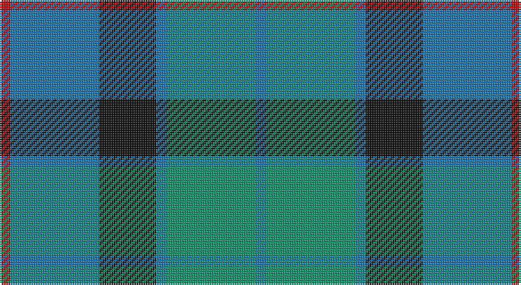

This page is one **sett** — a single exact thread-count. It belongs to the [tartan](/setts/r3b25k16b3g25b3/)
(the same proportion at any scale), whose colour order is pattern [BGBKBR](/stripes/bgbkbr/).

Part of the [Flower of Scotland](/tartans/flower-of-scotland/) tartan — the named design grouping this sett with its other cloths.

Sourced from register-of-tartans.  It is a [6 stripe tartan](/stripes/stripes6/).

Original link https://www.tartanregister.gov.uk/tartanDetails.aspx?ref=1210

2 attestations — the source records this cloth was collapsed from (oldest owns this page)

<ul>
<li>01/01/1990 — Flower of Scotland (register-of-tartans, <a href="https://www.tartanregister.gov.uk/tartanDetails.aspx?ref=1210">record</a>)</li>
<li>1990 — Flower of Scotland (Universal) (tartans-authority, <a href="http://www.tartansauthority.com/tartan-ferret/display/2059/">record</a>)</li>
</ul>

## Register references

External register numbers recorded for this tartan.

- Scottish Register of Tartans: [1210](https://www.tartanregister.gov.uk/tartanDetails.aspx?ref=1210)
- Scottish Tartans Authority (ITI): 2059
- Scottish Tartans World Register: 2059

## Thread count
R/6 Ba50 K32 Ba6 B50 Ba/6

One full sett is **288 threads**.

## Palette

Palette: <strong>Tartan Register</strong> <small style="color:#888">(4 of 5 colours)</small>
<table><thead><tr><th>Colour</th><th>Threads</th><th>Shade</th><th>Base</th><th>OKLCh</th></tr></thead><tbody><tr><td>R/</td><td style="text-align:right;font-variant-numeric:tabular-nums">6</td><td><code style="background-color:#C80000;">#C80000</code> <small style="color:#888">#C80000</small></td><td>R <code style="background-color:#CC0000;">#CC0000</code></td><td><small style="color:#888">oklch(52.3% 0.215 29.2)</small></td></tr><tr><td>Ba</td><td style="text-align:right;font-variant-numeric:tabular-nums">50</td><td><code style="background-color:#1474B4;">#1474B4</code> <small style="color:#888">#1474B4</small></td><td>B <code style="background-color:#2A418A;">#2A418A</code></td><td><small style="color:#888">oklch(54.0% 0.129 245.1)</small></td></tr><tr><td>K</td><td style="text-align:right;font-variant-numeric:tabular-nums">32</td><td><code style="background-color:#101010;">#101010</code> <small style="color:#888">#101010</small></td><td>K <code style="background-color:#000000;">#000000</code></td><td><small style="color:#888">oklch(17.3% 0.000 89.9)</small></td></tr><tr><td>Ba</td><td style="text-align:right;font-variant-numeric:tabular-nums">6</td><td><code style="background-color:#1474B4;">#1474B4</code> <small style="color:#888">#1474B4</small></td><td>B <code style="background-color:#2A418A;">#2A418A</code></td><td><small style="color:#888">oklch(54.0% 0.129 245.1)</small></td></tr><tr><td>B</td><td style="text-align:right;font-variant-numeric:tabular-nums">50</td><td><code style="background-color:#009468;">#009468</code> <small style="color:#888">#009468</small></td><td>G <code style="background-color:#006100;">#006100</code></td><td><small style="color:#888">oklch(59.0% 0.126 163.6)</small></td></tr><tr><td>Ba/</td><td style="text-align:right;font-variant-numeric:tabular-nums">6</td><td><code style="background-color:#1474B4;">#1474B4</code> <small style="color:#888">#1474B4</small></td><td>B <code style="background-color:#2A418A;">#2A418A</code></td><td><small style="color:#888">oklch(54.0% 0.129 245.1)</small></td></tr></tbody></table>

# Sample pattern

## Nearest tartans

The nearest existing variants by ΔTartan distance, with this tartan at the top so the swatches line up against it.

ΔTartan

Tartan

Sett

—

<a href="/ttd/edit/#slug=r3b25k16b3g25b3~x2">Flower of Scotland</a> <a class="nn-out" href="/variants/s6/r3b25k16b3g25b3~x2/" title="open its dictionary page">↗</a>

0.90

<a href="/ttd/edit/#slug=g24b6lb3k6b12k15g4~x2&amp;base=r3b25k16b3g25b3~x2">Blaylock Annandale</a> <a class="nn-out" href="/variants/s7/g24b6lb3k6b12k15g4~x2/" title="open its dictionary page">↗</a>

0.96

<a href="/ttd/edit/#slug=r2g23dbi11db22r2~x2&amp;base=r3b25k16b3g25b3~x2">Skibo</a> <a class="nn-out" href="/variants/s5/r2g23dbi11db22r2~x2/" title="open its dictionary page">↗</a>

1.02

<a href="/ttd/edit/#slug=b30dt15lb4dg12lb9b8lb3~x2&amp;base=r3b25k16b3g25b3~x2">Newall (Personal)</a> <a class="nn-out" href="/variants/s7/b30dt15lb4dg12lb9b8lb3~x2/" title="open its dictionary page">↗</a>

1.04

<a href="/ttd/edit/#slug=db20k6lo4db3g20w2~x2&amp;base=r3b25k16b3g25b3~x2">DeLoughery (Personal)</a> <a class="nn-out" href="/variants/s6/db20k6lo4db3g20w2~x2/" title="open its dictionary page">↗</a>

1.05

<a href="/ttd/edit/#slug=t2db29t12g29w2~x2&amp;base=r3b25k16b3g25b3~x2">Wallace Blue (Fashion)</a> <a class="nn-out" href="/variants/s5/t2db29t12g29w2~x2/" title="open its dictionary page">↗</a>

1.12

<a href="/ttd/edit/#slug=r5db25w5db3g25db3~x2&amp;base=r3b25k16b3g25b3~x2">Thayer USA (Name)</a> <a class="nn-out" href="/variants/s6/r5db25w5db3g25db3~x2/" title="open its dictionary page">↗</a>

1.13

<a href="/ttd/edit/#slug=g3t1db7t1g3k1~x8&amp;base=r3b25k16b3g25b3~x2">Scott Green (Sir Walter)</a> <a class="nn-out" href="/variants/s6/g3t1db7t1g3k1~x8/" title="open its dictionary page">↗</a>

1.13

<a href="/ttd/edit/#slug=b11k4g4m1g4k1r1~x4&amp;base=r3b25k16b3g25b3~x2">Ednie (Personal)</a> <a class="nn-out" href="/variants/s7/b11k4g4m1g4k1r1~x4/" title="open its dictionary page">↗</a>

1.16

<a href="/ttd/edit/#slug=o1b7k4b1g7b1~x4&amp;base=r3b25k16b3g25b3~x2">Flower of Scotland Commemorative Tartan</a> <a class="nn-out" href="/variants/s6/o1b7k4b1g7b1~x4/" title="open its dictionary page">↗</a>

1.16

<a href="/ttd/edit/#slug=o1b7k4b1g7b1~x2&amp;base=r3b25k16b3g25b3~x2">Flower of Scotland MINI Tartan</a> <a class="nn-out" href="/variants/s6/o1b7k4b1g7b1~x2/" title="open its dictionary page">↗</a>

## Neighbour map

Every grey dot is one of 14360 variants placed by the first two principal components of the ΔTartan feature space (44% of its variance). Red is this tartan; blue dots are its nearest — click one to open its page.

<svg viewBox="0 0 640 380" role="img" style="max-width:100%;height:auto;border:1px solid #e0e0e0;border-radius:4px;display:block" xmlns="http://www.w3.org/2000/svg"><image href="/nn/cloud.v1.png" width="640" height="380"/><a href="/variants/s7/g24b6lb3k6b12k15g4~x2/"><circle cx="189.5" cy="236.9" r="4" fill="#3465a4"><title>Blaylock Annandale</title></circle></a><a href="/variants/s5/r2g23dbi11db22r2~x2/"><circle cx="216.3" cy="232.8" r="4" fill="#3465a4"><title>Skibo</title></circle></a><a href="/variants/s7/b30dt15lb4dg12lb9b8lb3~x2/"><circle cx="215.4" cy="216.3" r="4" fill="#3465a4"><title>Newall (Personal)</title></circle></a><a href="/variants/s6/db20k6lo4db3g20w2~x2/"><circle cx="206.5" cy="204.1" r="4" fill="#3465a4"><title>DeLoughery (Personal)</title></circle></a><a href="/variants/s5/t2db29t12g29w2~x2/"><circle cx="248.9" cy="224.0" r="4" fill="#3465a4"><title>Wallace Blue (Fashion)</title></circle></a><a href="/variants/s6/r5db25w5db3g25db3~x2/"><circle cx="251.4" cy="216.9" r="4" fill="#3465a4"><title>Thayer USA (Name)</title></circle></a><a href="/variants/s6/g3t1db7t1g3k1~x8/"><circle cx="249.7" cy="253.0" r="4" fill="#3465a4"><title>Scott Green (Sir Walter)</title></circle></a><a href="/variants/s7/b11k4g4m1g4k1r1~x4/"><circle cx="212.9" cy="195.3" r="4" fill="#3465a4"><title>Ednie (Personal)</title></circle></a><a href="/variants/s6/o1b7k4b1g7b1~x4/"><circle cx="238.7" cy="253.6" r="4" fill="#3465a4"><title>Flower of Scotland Commemorative Tartan</title></circle></a><a href="/variants/s6/o1b7k4b1g7b1~x2/"><circle cx="238.7" cy="253.6" r="4" fill="#3465a4"><title>Flower of Scotland MINI Tartan</title></circle></a><circle cx="210.3" cy="231.2" r="5" fill="#c00000"/></svg>

ID: /variants/s6/r3b25k16b3g25b3~x2/
