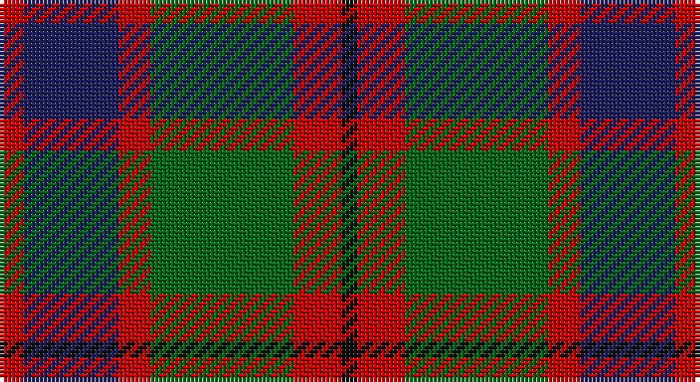

This page is one **sett** — a single exact thread-count. It belongs to the [tartan](/setts/r3db12r4g18r6k2/)
(the same proportion at any scale), whose colour order is pattern [KRGRBR](/stripes/krgrbr/).

Sourced from register-of-tartans.  It is a [6 stripe tartan](/stripes/stripes6/).

Original link https://www.tartanregister.gov.uk/tartanDetails.aspx?ref=1143

2 attestations — the source records this cloth was collapsed from (oldest owns this page)

<ul>
<li>01/01/1963 — Eyre (Personal) (register-of-tartans, <a href="https://www.tartanregister.gov.uk/tartanDetails.aspx?ref=1143">record</a>)</li>
<li>1963 — Eyre (Personal) (tartans-authority, <a href="http://www.tartansauthority.com/tartan-ferret/display/6605/">record</a>)</li>
</ul>

## Register references

External register numbers recorded for this tartan.

- Scottish Register of Tartans: [1143](https://www.tartanregister.gov.uk/tartanDetails.aspx?ref=1143)
- Scottish Tartans Authority (ITI): 6605

## Thread count
R/6 DB24 R8 G36 R12 K/4

One full sett is **170 threads**.

## Palette

Palette: <strong>Tartan Register</strong>
<table><thead><tr><th>Colour</th><th>Threads</th><th>Shade</th><th>Base</th><th>OKLCh</th></tr></thead><tbody><tr><td>R/</td><td style="text-align:right;font-variant-numeric:tabular-nums">6</td><td><code style="background-color:#C80000;">#C80000</code> <small style="color:#888">#C80000</small></td><td>R <code style="background-color:#CC0000;">#CC0000</code></td><td><small style="color:#888">oklch(52.3% 0.215 29.2)</small></td></tr><tr><td>DB</td><td style="text-align:right;font-variant-numeric:tabular-nums">24</td><td><code style="background-color:#202060;">#202060</code> <small style="color:#888">#202060</small></td><td>B <code style="background-color:#2A418A;">#2A418A</code></td><td><small style="color:#888">oklch(28.9% 0.111 276.9)</small></td></tr><tr><td>R</td><td style="text-align:right;font-variant-numeric:tabular-nums">8</td><td><code style="background-color:#C80000;">#C80000</code> <small style="color:#888">#C80000</small></td><td>R <code style="background-color:#CC0000;">#CC0000</code></td><td><small style="color:#888">oklch(52.3% 0.215 29.2)</small></td></tr><tr><td>G</td><td style="text-align:right;font-variant-numeric:tabular-nums">36</td><td><code style="background-color:#006818;">#006818</code> <small style="color:#888">#006818</small></td><td>G <code style="background-color:#006100;">#006100</code></td><td><small style="color:#888">oklch(45.0% 0.142 145.0)</small></td></tr><tr><td>R</td><td style="text-align:right;font-variant-numeric:tabular-nums">12</td><td><code style="background-color:#C80000;">#C80000</code> <small style="color:#888">#C80000</small></td><td>R <code style="background-color:#CC0000;">#CC0000</code></td><td><small style="color:#888">oklch(52.3% 0.215 29.2)</small></td></tr><tr><td>K/</td><td style="text-align:right;font-variant-numeric:tabular-nums">4</td><td><code style="background-color:#101010;">#101010</code> <small style="color:#888">#101010</small></td><td>K <code style="background-color:#000000;">#000000</code></td><td><small style="color:#888">oklch(17.3% 0.000 89.9)</small></td></tr></tbody></table>

# Sample pattern

## Nearest tartans

The nearest existing variants by ΔTartan distance, with this tartan at the top so the swatches line up against it.

ΔTartan

Tartan

Sett

—

<a href="/ttd/edit/#slug=r3db12r4g18r6k2~x2">Eyre (Personal)</a> <a class="nn-out" href="/variants/s6/r3db12r4g18r6k2~x2/" title="open its dictionary page">↗</a>

0.73

<a href="/ttd/edit/#slug=t4dy28g6t12k12t3~x2&amp;base=r3db12r4g18r6k2~x2">MacTavish Hunting</a> <a class="nn-out" href="/variants/s6/t4dy28g6t12k12t3~x2/" title="open its dictionary page">↗</a>

0.88

<a href="/ttd/edit/#slug=do2o11do2k11do16lb2~x4&amp;base=r3db12r4g18r6k2~x2">Portrait, The</a> <a class="nn-out" href="/variants/s6/do2o11do2k11do16lb2~x4/" title="open its dictionary page">↗</a>

0.93

<a href="/ttd/edit/#slug=ly5g22dp15dpi11dp5g2~x2&amp;base=r3db12r4g18r6k2~x2">Scottish Ballet</a> <a class="nn-out" href="/variants/s6/ly5g22dp15dpi11dp5g2~x2/" title="open its dictionary page">↗</a>

0.93

<a href="/ttd/edit/#slug=g3k15r8g2o8k2~x4&amp;base=r3db12r4g18r6k2~x2">Thompson Black (Fashion)</a> <a class="nn-out" href="/variants/s6/g3k15r8g2o8k2~x4/" title="open its dictionary page">↗</a>

0.93

<a href="/ttd/edit/#slug=t3dy26g4t13k13t2~x2&amp;base=r3db12r4g18r6k2~x2">MacTavish Hunting Clan Tartan</a> <a class="nn-out" href="/variants/s6/t3dy26g4t13k13t2~x2/" title="open its dictionary page">↗</a>

0.96

<a href="/ttd/edit/#slug=g3r22t5g10k10g2~x2&amp;base=r3db12r4g18r6k2~x2">Strathspey (Fashion)</a> <a class="nn-out" href="/variants/s6/g3r22t5g10k10g2~x2/" title="open its dictionary page">↗</a>

0.98

<a href="/ttd/edit/#slug=k3lo18dg6r17k31dg3~x2&amp;base=r3db12r4g18r6k2~x2">MacMillan - 2002 (Black - Unofficial</a> <a class="nn-out" href="/variants/s6/k3lo18dg6r17k31dg3~x2/" title="open its dictionary page">↗</a>

1.01

<a href="/ttd/edit/#slug=r3y27k6lo13k14r3~x2&amp;base=r3db12r4g18r6k2~x2">Thompson/Thomson/MacTavish special grey</a> <a class="nn-out" href="/variants/s6/r3y27k6lo13k14r3~x2/" title="open its dictionary page">↗</a>

1.02

<a href="/ttd/edit/#slug=dg12g6dg6r15k1r1k2~x2&amp;base=r3db12r4g18r6k2~x2">Cook (Name)</a> <a class="nn-out" href="/variants/s7/dg12g6dg6r15k1r1k2~x2/" title="open its dictionary page">↗</a>

1.03

<a href="/ttd/edit/#slug=k2o20k8dg18o3w2~x2&amp;base=r3db12r4g18r6k2~x2">Celtic Combat</a> <a class="nn-out" href="/variants/s6/k2o20k8dg18o3w2~x2/" title="open its dictionary page">↗</a>

## Neighbour map

Every grey dot is one of 14360 variants placed by the first two principal components of the ΔTartan feature space (44% of its variance). Red is this tartan; blue dots are its nearest — click one to open its page.

<svg viewBox="0 0 640 380" role="img" style="max-width:100%;height:auto;border:1px solid #e0e0e0;border-radius:4px;display:block" xmlns="http://www.w3.org/2000/svg"><image href="/nn/cloud.v1.png" width="640" height="380"/><a href="/variants/s6/t4dy28g6t12k12t3~x2/"><circle cx="237.6" cy="231.6" r="4" fill="#3465a4"><title>MacTavish Hunting</title></circle></a><a href="/variants/s6/do2o11do2k11do16lb2~x4/"><circle cx="232.4" cy="227.0" r="4" fill="#3465a4"><title>Portrait, The</title></circle></a><a href="/variants/s6/ly5g22dp15dpi11dp5g2~x2/"><circle cx="194.5" cy="214.0" r="4" fill="#3465a4"><title>Scottish Ballet</title></circle></a><a href="/variants/s6/g3k15r8g2o8k2~x4/"><circle cx="200.8" cy="224.2" r="4" fill="#3465a4"><title>Thompson Black (Fashion)</title></circle></a><a href="/variants/s6/t3dy26g4t13k13t2~x2/"><circle cx="251.6" cy="215.6" r="4" fill="#3465a4"><title>MacTavish Hunting Clan Tartan</title></circle></a><a href="/variants/s6/g3r22t5g10k10g2~x2/"><circle cx="251.6" cy="226.8" r="4" fill="#3465a4"><title>Strathspey (Fashion)</title></circle></a><a href="/variants/s6/k3lo18dg6r17k31dg3~x2/"><circle cx="217.6" cy="211.7" r="4" fill="#3465a4"><title>MacMillan - 2002 (Black - Unofficial</title></circle></a><a href="/variants/s6/r3y27k6lo13k14r3~x2/"><circle cx="191.8" cy="207.7" r="4" fill="#3465a4"><title>Thompson/Thomson/MacTavish special grey</title></circle></a><a href="/variants/s7/dg12g6dg6r15k1r1k2~x2/"><circle cx="252.7" cy="191.8" r="4" fill="#3465a4"><title>Cook (Name)</title></circle></a><a href="/variants/s6/k2o20k8dg18o3w2~x2/"><circle cx="236.7" cy="205.1" r="4" fill="#3465a4"><title>Celtic Combat</title></circle></a><circle cx="215.3" cy="224.8" r="5" fill="#c00000"/></svg>

ID: /variants/s6/r3db12r4g18r6k2~x2/
