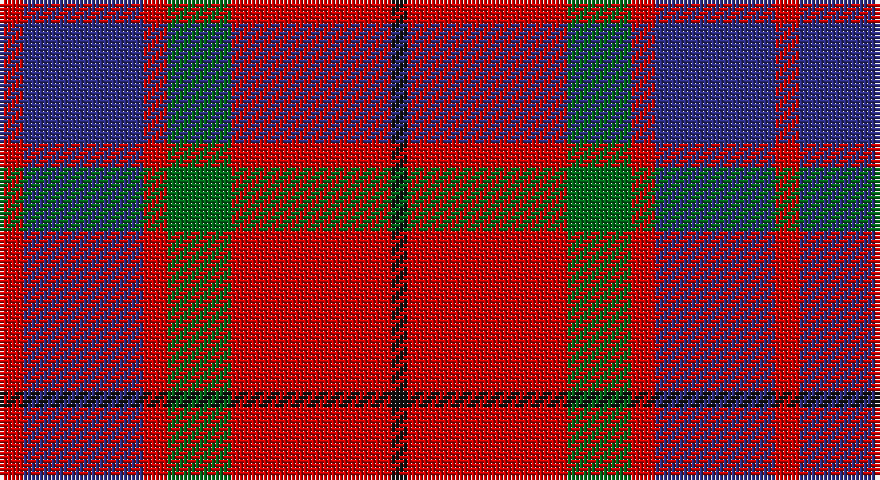

This page is one **sett** — a single exact thread-count. It belongs to the [tartan](/setts/r3db15r3g8r20k2/)
(the same proportion at any scale), whose colour order is pattern [KRGRBR](/stripes/krgrbr/).

Sourced from register-of-tartans.  It is a [6 stripe tartan](/stripes/stripes6/).

Original link https://www.tartanregister.gov.uk/tartanDetails.aspx?ref=1185

2 attestations — the source records this cloth was collapsed from (oldest owns this page)

<ul>
<li>01/01/2005 — Finnigan (Estimated threadcount) (register-of-tartans, <a href="https://www.tartanregister.gov.uk/tartanDetails.aspx?ref=1185">record</a>)</li>
<li>pre 2005 — Finnigan (Name?) (tartans-authority, <a href="http://www.tartansauthority.com/tartan-ferret/display/6752/">record</a>)</li>
</ul>

## Register references

External register numbers recorded for this tartan.

- Scottish Register of Tartans: [1185](https://www.tartanregister.gov.uk/tartanDetails.aspx?ref=1185)
- Scottish Tartans Authority (ITI): 6752

## Thread count
R/6 DB30 R6 G16 R40 K/4

One full sett is **194 threads**.

## Palette

Palette: <strong>Tartan Register</strong>
<table><thead><tr><th>Colour</th><th>Threads</th><th>Shade</th><th>Base</th><th>OKLCh</th></tr></thead><tbody><tr><td>R/</td><td style="text-align:right;font-variant-numeric:tabular-nums">6</td><td><code style="background-color:#C80000;">#C80000</code> <small style="color:#888">#C80000</small></td><td>R <code style="background-color:#CC0000;">#CC0000</code></td><td><small style="color:#888">oklch(52.3% 0.215 29.2)</small></td></tr><tr><td>DB</td><td style="text-align:right;font-variant-numeric:tabular-nums">30</td><td><code style="background-color:#2C2C80;">#2C2C80</code> <small style="color:#888">#2C2C80</small></td><td>B <code style="background-color:#2A418A;">#2A418A</code></td><td><small style="color:#888">oklch(35.0% 0.138 276.6)</small></td></tr><tr><td>R</td><td style="text-align:right;font-variant-numeric:tabular-nums">6</td><td><code style="background-color:#C80000;">#C80000</code> <small style="color:#888">#C80000</small></td><td>R <code style="background-color:#CC0000;">#CC0000</code></td><td><small style="color:#888">oklch(52.3% 0.215 29.2)</small></td></tr><tr><td>G</td><td style="text-align:right;font-variant-numeric:tabular-nums">16</td><td><code style="background-color:#006818;">#006818</code> <small style="color:#888">#006818</small></td><td>G <code style="background-color:#006100;">#006100</code></td><td><small style="color:#888">oklch(45.0% 0.142 145.0)</small></td></tr><tr><td>R</td><td style="text-align:right;font-variant-numeric:tabular-nums">40</td><td><code style="background-color:#C80000;">#C80000</code> <small style="color:#888">#C80000</small></td><td>R <code style="background-color:#CC0000;">#CC0000</code></td><td><small style="color:#888">oklch(52.3% 0.215 29.2)</small></td></tr><tr><td>K/</td><td style="text-align:right;font-variant-numeric:tabular-nums">4</td><td><code style="background-color:#101010;">#101010</code> <small style="color:#888">#101010</small></td><td>K <code style="background-color:#000000;">#000000</code></td><td><small style="color:#888">oklch(17.3% 0.000 89.9)</small></td></tr></tbody></table>

# Sample pattern

## Nearest tartans

The nearest existing variants by ΔTartan distance, with this tartan at the top so the swatches line up against it.

ΔTartan

Tartan

Sett

—

<a href="/ttd/edit/#slug=r3db15r3g8r20k2~x2">Finnigan (Estimated threadcount)</a> <a class="nn-out" href="/variants/s6/r3db15r3g8r20k2~x2/" title="open its dictionary page">↗</a>

0.60

<a href="/ttd/edit/#slug=r1db6r1dg6r12w1~x2&amp;base=r3db15r3g8r20k2~x2">Fraser Red Clan Tartan</a> <a class="nn-out" href="/variants/s6/r1db6r1dg6r12w1~x2/" title="open its dictionary page">↗</a>

0.77

<a href="/ttd/edit/#slug=r1db6r1dg6r12lr1~x2&amp;base=r3db15r3g8r20k2~x2">Fraser VS</a> <a class="nn-out" href="/variants/s6/r1db6r1dg6r12lr1~x2/" title="open its dictionary page">↗</a>

0.78

<a href="/ttd/edit/#slug=r28db12r3dg20t2dg2r7~x2&amp;base=r3db15r3g8r20k2~x2">Carrick (Strathmore) District Tartan</a> <a class="nn-out" href="/variants/s7/r28db12r3dg20t2dg2r7~x2/" title="open its dictionary page">↗</a>

0.83

<a href="/ttd/edit/#slug=k2r12db6r3dg12r4db1~x2&amp;base=r3db15r3g8r20k2~x2">MacBean/MacElvain</a> <a class="nn-out" href="/variants/s7/k2r12db6r3dg12r4db1~x2/" title="open its dictionary page">↗</a>

0.85

<a href="/ttd/edit/#slug=m10dy60dt13lo24dt24dy8&amp;base=r3db15r3g8r20k2~x2">Bronte House Check</a> <a class="nn-out" href="/variants/s6/m10dy60dt13lo24dt24dy8/" title="open its dictionary page">↗</a>

0.88

<a href="/ttd/edit/#slug=r1db6r1dg6r12lb1&amp;base=r3db15r3g8r20k2~x2">Fraser VS</a> <a class="nn-out" href="/variants/s6/r1db6r1dg6r12lb1/" title="open its dictionary page">↗</a>

0.92

<a href="/ttd/edit/#slug=r4k2r24k6db6dg16r3~x2&amp;base=r3db15r3g8r20k2~x2">MacDuff #4</a> <a class="nn-out" href="/variants/s7/r4k2r24k6db6dg16r3~x2/" title="open its dictionary page">↗</a>

0.97

<a href="/ttd/edit/#slug=r6dg16r4db12r16t1r2~x2&amp;base=r3db15r3g8r20k2~x2">MacQuarrie #6</a> <a class="nn-out" href="/variants/s7/r6dg16r4db12r16t1r2~x2/" title="open its dictionary page">↗</a>

1.01

<a href="/ttd/edit/#slug=r36lb3r5k21db24k3~x2&amp;base=r3db15r3g8r20k2~x2">Graham of Menteith (Red)</a> <a class="nn-out" href="/variants/s6/r36lb3r5k21db24k3~x2/" title="open its dictionary page">↗</a>

1.05

<a href="/ttd/edit/#slug=db24r3db4r6g8r3g8r30k3~x2&amp;base=r3db15r3g8r20k2~x2">Gates</a> <a class="nn-out" href="/variants/s9/db24r3db4r6g8r3g8r30k3~x2/" title="open its dictionary page">↗</a>

## Neighbour map

Every grey dot is one of 14360 variants placed by the first two principal components of the ΔTartan feature space (44% of its variance). Red is this tartan; blue dots are its nearest — click one to open its page.

<svg viewBox="0 0 640 380" role="img" style="max-width:100%;height:auto;border:1px solid #e0e0e0;border-radius:4px;display:block" xmlns="http://www.w3.org/2000/svg"><image href="/nn/cloud.v1.png" width="640" height="380"/><a href="/variants/s6/r1db6r1dg6r12w1~x2/"><circle cx="292.6" cy="189.0" r="4" fill="#3465a4"><title>Fraser Red Clan Tartan</title></circle></a><a href="/variants/s6/r1db6r1dg6r12lr1~x2/"><circle cx="298.2" cy="197.8" r="4" fill="#3465a4"><title>Fraser VS</title></circle></a><a href="/variants/s7/r28db12r3dg20t2dg2r7~x2/"><circle cx="308.1" cy="185.9" r="4" fill="#3465a4"><title>Carrick (Strathmore) District Tartan</title></circle></a><a href="/variants/s7/k2r12db6r3dg12r4db1~x2/"><circle cx="259.2" cy="199.0" r="4" fill="#3465a4"><title>MacBean/MacElvain</title></circle></a><a href="/variants/s6/m10dy60dt13lo24dt24dy8/"><circle cx="248.2" cy="223.4" r="4" fill="#3465a4"><title>Bronte House Check</title></circle></a><a href="/variants/s6/r1db6r1dg6r12lb1/"><circle cx="280.6" cy="185.4" r="4" fill="#3465a4"><title>Fraser VS</title></circle></a><a href="/variants/s7/r4k2r24k6db6dg16r3~x2/"><circle cx="278.1" cy="183.7" r="4" fill="#3465a4"><title>MacDuff #4</title></circle></a><a href="/variants/s7/r6dg16r4db12r16t1r2~x2/"><circle cx="284.4" cy="191.1" r="4" fill="#3465a4"><title>MacQuarrie #6</title></circle></a><a href="/variants/s6/r36lb3r5k21db24k3~x2/"><circle cx="248.5" cy="195.7" r="4" fill="#3465a4"><title>Graham of Menteith (Red)</title></circle></a><a href="/variants/s9/db24r3db4r6g8r3g8r30k3~x2/"><circle cx="269.6" cy="180.0" r="4" fill="#3465a4"><title>Gates</title></circle></a><circle cx="285.7" cy="208.5" r="5" fill="#c00000"/></svg>

ID: /variants/s6/r3db15r3g8r20k2~x2/
