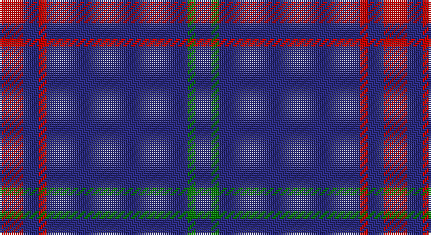

This page is one **sett** — a single exact thread-count. It belongs to the [tartan](/setts/r3db2r1db18g1db2/)
(the same proportion at any scale), whose colour order is pattern [BGBRBR](/stripes/bgbrbr/).

Part of the [Lynch](/tartans/lynch/) tartan — the named design grouping this sett with its other cloths.

Sourced from register-of-tartans.  It is a [6 stripe tartan](/stripes/stripes6/).

Original link https://www.tartanregister.gov.uk/tartanDetails.aspx?ref=2253

## Register references

External register numbers recorded for this tartan.

- Scottish Register of Tartans: [2253](https://www.tartanregister.gov.uk/tartanDetails.aspx?ref=2253)
- Scottish Tartans Authority (ITI): 2163
- Scottish Tartans World Register: 2163

## Thread count
R/12 DB8 R4 DB72 G4 DB/8

One full sett is **196 threads**.

## Palette

Palette: <strong>Tartan Register</strong> <small style="color:#888">(2 of 3 colours)</small>
<table><thead><tr><th>Colour</th><th>Threads</th><th>Shade</th><th>Base</th><th>OKLCh</th></tr></thead><tbody><tr><td>R/</td><td style="text-align:right;font-variant-numeric:tabular-nums">12</td><td><code style="background-color:#C80000;">#C80000</code> <small style="color:#888">#C80000</small></td><td>R <code style="background-color:#CC0000;">#CC0000</code></td><td><small style="color:#888">oklch(52.3% 0.215 29.2)</small></td></tr><tr><td>DB</td><td style="text-align:right;font-variant-numeric:tabular-nums">8</td><td><code style="background-color:#2C2C80;">#2C2C80</code> <small style="color:#888">#2C2C80</small></td><td>B <code style="background-color:#2A418A;">#2A418A</code></td><td><small style="color:#888">oklch(35.0% 0.138 276.6)</small></td></tr><tr><td>R</td><td style="text-align:right;font-variant-numeric:tabular-nums">4</td><td><code style="background-color:#C80000;">#C80000</code> <small style="color:#888">#C80000</small></td><td>R <code style="background-color:#CC0000;">#CC0000</code></td><td><small style="color:#888">oklch(52.3% 0.215 29.2)</small></td></tr><tr><td>DB</td><td style="text-align:right;font-variant-numeric:tabular-nums">72</td><td><code style="background-color:#2C2C80;">#2C2C80</code> <small style="color:#888">#2C2C80</small></td><td>B <code style="background-color:#2A418A;">#2A418A</code></td><td><small style="color:#888">oklch(35.0% 0.138 276.6)</small></td></tr><tr><td>G</td><td style="text-align:right;font-variant-numeric:tabular-nums">4</td><td><code style="background-color:#007C00;">#007C00</code> <small style="color:#888">#007C00</small></td><td>G <code style="background-color:#006100;">#006100</code></td><td><small style="color:#888">oklch(50.8% 0.173 142.5)</small></td></tr><tr><td>DB/</td><td style="text-align:right;font-variant-numeric:tabular-nums">8</td><td><code style="background-color:#2C2C80;">#2C2C80</code> <small style="color:#888">#2C2C80</small></td><td>B <code style="background-color:#2A418A;">#2A418A</code></td><td><small style="color:#888">oklch(35.0% 0.138 276.6)</small></td></tr></tbody></table>

# Sample pattern

## Nearest tartans

The nearest existing variants by ΔTartan distance, with this tartan at the top so the swatches line up against it.

ΔTartan

Tartan

Sett

—

<a href="/ttd/edit/#slug=r3db2r1db18g1db2~x4">Lynch</a> <a class="nn-out" href="/variants/s6/r3db2r1db18g1db2~x4/" title="open its dictionary page">↗</a>

1.01

<a href="/ttd/edit/#slug=b11db7b3db70lb4db6~x2&amp;base=r3db2r1db18g1db2~x4">Auchairne (Corporate)</a> <a class="nn-out" href="/variants/s6/b11db7b3db70lb4db6~x2/" title="open its dictionary page">↗</a>

1.14

<a href="/ttd/edit/#slug=r19db6r7db101dg6db7~x2&amp;base=r3db2r1db18g1db2~x4">Lynch</a> <a class="nn-out" href="/variants/s6/r19db6r7db101dg6db7~x2/" title="open its dictionary page">↗</a>

1.21

<a href="/ttd/edit/#slug=r19db6r14db101g7db7&amp;base=r3db2r1db18g1db2~x4">Lynch Family Tartan</a> <a class="nn-out" href="/variants/s6/r19db6r14db101g7db7/" title="open its dictionary page">↗</a>

1.66

<a href="/ttd/edit/#slug=db35w4db10ri3r3ri3~x4&amp;base=r3db2r1db18g1db2~x4">Steffen, Morris (Personal)</a> <a class="nn-out" href="/variants/s6/db35w4db10ri3r3ri3~x4/" title="open its dictionary page">↗</a>

1.67

<a href="/ttd/edit/#slug=db122r11w4r15ly4db6ly4db30&amp;base=r3db2r1db18g1db2~x4">Inverness, Duke of York</a> <a class="nn-out" href="/variants/s8/db122r11w4r15ly4db6ly4db30/" title="open its dictionary page">↗</a>

1.67

<a href="/ttd/edit/#slug=db48w2db7w2db7w2db20t11r2~x2&amp;base=r3db2r1db18g1db2~x4">RAAF #4</a> <a class="nn-out" href="/variants/s9/db48w2db7w2db7w2db20t11r2~x2/" title="open its dictionary page">↗</a>

1.72

<a href="/ttd/edit/#slug=db16ri4db3r1~x2&amp;base=r3db2r1db18g1db2~x4">Elliott</a> <a class="nn-out" href="/variants/s4/db16ri4db3r1~x2/" title="open its dictionary page">↗</a>

1.72

<a href="/ttd/edit/#slug=db32r3db4ly3~x2&amp;base=r3db2r1db18g1db2~x4">MacLaine of Lochbuie</a> <a class="nn-out" href="/variants/s4/db32r3db4ly3~x2/" title="open its dictionary page">↗</a>

1.72

<a href="/ttd/edit/#slug=db32r3db4k1ly3~x2&amp;base=r3db2r1db18g1db2~x4">MacLaine of Lochbuie, hunting</a> <a class="nn-out" href="/variants/s5/db32r3db4k1ly3~x2/" title="open its dictionary page">↗</a>

1.79

<a href="/ttd/edit/#slug=db140r11db14ly11&amp;base=r3db2r1db18g1db2~x4">Gem</a> <a class="nn-out" href="/variants/s4/db140r11db14ly11/" title="open its dictionary page">↗</a>

## Neighbour map

Every grey dot is one of 14360 variants placed by the first two principal components of the ΔTartan feature space (44% of its variance). Red is this tartan; blue dots are its nearest — click one to open its page.

<svg viewBox="0 0 640 380" role="img" style="max-width:100%;height:auto;border:1px solid #e0e0e0;border-radius:4px;display:block" xmlns="http://www.w3.org/2000/svg"><image href="/nn/cloud.v1.png" width="640" height="380"/><a href="/variants/s6/b11db7b3db70lb4db6~x2/"><circle cx="612.6" cy="198.8" r="4" fill="#3465a4"><title>Auchairne (Corporate)</title></circle></a><a href="/variants/s6/r19db6r7db101dg6db7~x2/"><circle cx="593.9" cy="211.5" r="4" fill="#3465a4"><title>Lynch</title></circle></a><a href="/variants/s6/r19db6r14db101g7db7/"><circle cx="530.1" cy="198.7" r="4" fill="#3465a4"><title>Lynch Family Tartan</title></circle></a><a href="/variants/s6/db35w4db10ri3r3ri3~x4/"><circle cx="493.9" cy="197.0" r="4" fill="#3465a4"><title>Steffen, Morris (Personal)</title></circle></a><a href="/variants/s8/db122r11w4r15ly4db6ly4db30/"><circle cx="575.0" cy="137.8" r="4" fill="#3465a4"><title>Inverness, Duke of York</title></circle></a><a href="/variants/s9/db48w2db7w2db7w2db20t11r2~x2/"><circle cx="548.7" cy="158.2" r="4" fill="#3465a4"><title>RAAF #4</title></circle></a><a href="/variants/s4/db16ri4db3r1~x2/"><circle cx="554.0" cy="251.9" r="4" fill="#3465a4"><title>Elliott</title></circle></a><a href="/variants/s4/db32r3db4ly3~x2/"><circle cx="589.6" cy="240.0" r="4" fill="#3465a4"><title>MacLaine of Lochbuie</title></circle></a><a href="/variants/s5/db32r3db4k1ly3~x2/"><circle cx="596.1" cy="164.5" r="4" fill="#3465a4"><title>MacLaine of Lochbuie, hunting</title></circle></a><a href="/variants/s4/db140r11db14ly11/"><circle cx="614.9" cy="231.6" r="4" fill="#3465a4"><title>Gem</title></circle></a><circle cx="601.3" cy="205.3" r="5" fill="#c00000"/></svg>

ID: /variants/s6/r3db2r1db18g1db2~x4/
