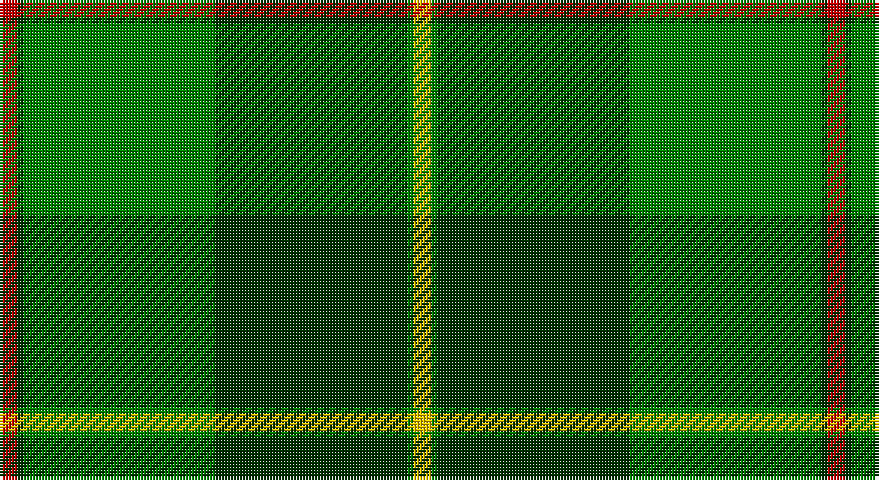

This page is one **sett** — a single exact thread-count. It belongs to the [tartan](/setts/r3dg1g32dg32g1ly3/)
(the same proportion at any scale), whose colour order is pattern [RGGGGY](/stripes/rggggy/).

Part of the [Galloway](/tartans/galloway/) tartan — the named design grouping this sett with its other cloths.

Sourced from weddslist.  It is a [6 stripe tartan](/stripes/stripes6/).

Original link http://www.weddslist.com/cgi-bin/tartans/pg.pl?source=sts

## Also known as

This cloth is also recorded under:

- Galloway Family
- Galloway Green
- Galloway Red
- Galloway, Green
- Galloway, Red

## Thread count
R/6 DG2 G64 DG64 G2 Y/6

One full sett is **276 threads**.

## Palette

Palette: <strong>custom</strong>
<table><thead><tr><th>Colour</th><th>Threads</th><th>Shade</th><th>Base</th><th>OKLCh</th></tr></thead><tbody><tr><td>R/</td><td style="text-align:right;font-variant-numeric:tabular-nums">6</td><td><code style="background-color:#C00000;">#C00000</code> <small style="color:#888">#C00000</small></td><td>R <code style="background-color:#CC0000;">#CC0000</code></td><td><small style="color:#888">oklch(50.7% 0.208 29.2)</small></td></tr><tr><td>DG</td><td style="text-align:right;font-variant-numeric:tabular-nums">2</td><td><code style="background-color:#003000;">#003000</code> <small style="color:#888">#003000</small></td><td>G <code style="background-color:#006100;">#006100</code></td><td><small style="color:#888">oklch(26.8% 0.091 142.5)</small></td></tr><tr><td>G</td><td style="text-align:right;font-variant-numeric:tabular-nums">64</td><td><code style="background-color:#008000;">#008000</code> <small style="color:#888">#008000</small></td><td>G <code style="background-color:#006100;">#006100</code></td><td><small style="color:#888">oklch(52.0% 0.177 142.5)</small></td></tr><tr><td>DG</td><td style="text-align:right;font-variant-numeric:tabular-nums">64</td><td><code style="background-color:#003000;">#003000</code> <small style="color:#888">#003000</small></td><td>G <code style="background-color:#006100;">#006100</code></td><td><small style="color:#888">oklch(26.8% 0.091 142.5)</small></td></tr><tr><td>G</td><td style="text-align:right;font-variant-numeric:tabular-nums">2</td><td><code style="background-color:#008000;">#008000</code> <small style="color:#888">#008000</small></td><td>G <code style="background-color:#006100;">#006100</code></td><td><small style="color:#888">oklch(52.0% 0.177 142.5)</small></td></tr><tr><td>Y/</td><td style="text-align:right;font-variant-numeric:tabular-nums">6</td><td><code style="background-color:#F0C000;">#F0C000</code> <small style="color:#888">#F0C000</small></td><td>Y <code style="background-color:#F2BF00;">#F2BF00</code></td><td><small style="color:#888">oklch(82.7% 0.169 90.5)</small></td></tr></tbody></table>

# Sample pattern

## Compared to the master

This cloth is one sett of its design; the master sett (the exemplar the design is anchored on) is below for comparison.

<figure style="margin:0"><figcaption style="color:#888;font-size:smaller">this sett</figcaption></figure>
<figure style="margin:0"><figcaption style="color:#888;font-size:smaller"><a href="/setts/r3b2w35b35r2g3/">master sett →</a></figcaption></figure>

## Nearest tartans

The nearest existing variants by ΔTartan distance, with this tartan at the top so the swatches line up against it.

ΔTartan

Tartan

Sett

—

<a href="/ttd/edit/#slug=r3dg1g32dg32g1ly3~x2">Galloway</a> <a class="nn-out" href="/variants/s6/r3dg1g32dg32g1ly3~x2/" title="open its dictionary page">↗</a>

0.27

<a href="/ttd/edit/#slug=r3dg1g32dg32g1w3~x2&amp;base=r3dg1g32dg32g1ly3~x2">Galloway, hunting</a> <a class="nn-out" href="/variants/s6/r3dg1g32dg32g1w3~x2/" title="open its dictionary page">↗</a>

1.51

<a href="/ttd/edit/#slug=g55k17r9k11ly2k4~x2&amp;base=r3dg1g32dg32g1ly3~x2">Moran (Name)</a> <a class="nn-out" href="/variants/s6/g55k17r9k11ly2k4~x2/" title="open its dictionary page">↗</a>

1.53

<a href="/ttd/edit/#slug=r3g30k12g1k16lo2~x2&amp;base=r3dg1g32dg32g1ly3~x2">MacArthur-Fox Htg (Personal)</a> <a class="nn-out" href="/variants/s6/r3g30k12g1k16lo2~x2/" title="open its dictionary page">↗</a>

1.61

<a href="/ttd/edit/#slug=g25k8o10r1o3~x4&amp;base=r3dg1g32dg32g1ly3~x2">Herbage Family Tartan</a> <a class="nn-out" href="/variants/s5/g25k8o10r1o3~x4/" title="open its dictionary page">↗</a>

1.73

<a href="/ttd/edit/#slug=g62k40ly3k3w3~x2&amp;base=r3dg1g32dg32g1ly3~x2">O'Donoghue</a> <a class="nn-out" href="/variants/s5/g62k40ly3k3w3~x2/" title="open its dictionary page">↗</a>

1.74

<a href="/ttd/edit/#slug=ly3g2k1g30b24k2b2k2~x2&amp;base=r3dg1g32dg32g1ly3~x2">Johnston (Clan)</a> <a class="nn-out" href="/variants/s8/ly3g2k1g30b24k2b2k2~x2/" title="open its dictionary page">↗</a>

1.76

<a href="/ttd/edit/#slug=g55k17r9k11ly2db4~x2&amp;base=r3dg1g32dg32g1ly3~x2">Moran Family Tartan</a> <a class="nn-out" href="/variants/s6/g55k17r9k11ly2db4~x2/" title="open its dictionary page">↗</a>

1.77

<a href="/ttd/edit/#slug=g68k22o28r3o12~x2&amp;base=r3dg1g32dg32g1ly3~x2">Herbage of Laggan (Personal)</a> <a class="nn-out" href="/variants/s5/g68k22o28r3o12~x2/" title="open its dictionary page">↗</a>

1.78

<a href="/ttd/edit/#slug=g2k1db6k11g26k1g1lo2~x2&amp;base=r3dg1g32dg32g1ly3~x2">Mackie (2016)</a> <a class="nn-out" href="/variants/s8/g2k1db6k11g26k1g1lo2~x2/" title="open its dictionary page">↗</a>

1.79

<a href="/ttd/edit/#slug=db4k4db24g32w1g2~x2&amp;base=r3dg1g32dg32g1ly3~x2">Oliphant</a> <a class="nn-out" href="/variants/s6/db4k4db24g32w1g2~x2/" title="open its dictionary page">↗</a>

## Neighbour map

Every grey dot is one of 14360 variants placed by the first two principal components of the ΔTartan feature space (44% of its variance). Red is this tartan; blue dots are its nearest — click one to open its page.

<svg viewBox="0 0 640 380" role="img" style="max-width:100%;height:auto;border:1px solid #e0e0e0;border-radius:4px;display:block" xmlns="http://www.w3.org/2000/svg"><image href="/nn/cloud.v1.png" width="640" height="380"/><a href="/variants/s6/r3dg1g32dg32g1w3~x2/"><circle cx="343.5" cy="165.9" r="4" fill="#3465a4"><title>Galloway, hunting</title></circle></a><a href="/variants/s6/g55k17r9k11ly2k4~x2/"><circle cx="369.3" cy="171.5" r="4" fill="#3465a4"><title>Moran (Name)</title></circle></a><a href="/variants/s6/r3g30k12g1k16lo2~x2/"><circle cx="347.9" cy="185.3" r="4" fill="#3465a4"><title>MacArthur-Fox Htg (Personal)</title></circle></a><a href="/variants/s5/g25k8o10r1o3~x4/"><circle cx="339.1" cy="199.3" r="4" fill="#3465a4"><title>Herbage Family Tartan</title></circle></a><a href="/variants/s5/g62k40ly3k3w3~x2/"><circle cx="362.3" cy="188.0" r="4" fill="#3465a4"><title>O'Donoghue</title></circle></a><a href="/variants/s8/ly3g2k1g30b24k2b2k2~x2/"><circle cx="330.8" cy="141.6" r="4" fill="#3465a4"><title>Johnston (Clan)</title></circle></a><a href="/variants/s6/g55k17r9k11ly2db4~x2/"><circle cx="344.8" cy="156.2" r="4" fill="#3465a4"><title>Moran Family Tartan</title></circle></a><a href="/variants/s5/g68k22o28r3o12~x2/"><circle cx="321.7" cy="207.2" r="4" fill="#3465a4"><title>Herbage of Laggan (Personal)</title></circle></a><a href="/variants/s8/g2k1db6k11g26k1g1lo2~x2/"><circle cx="380.2" cy="157.7" r="4" fill="#3465a4"><title>Mackie (2016)</title></circle></a><a href="/variants/s6/db4k4db24g32w1g2~x2/"><circle cx="349.8" cy="166.4" r="4" fill="#3465a4"><title>Oliphant</title></circle></a><circle cx="350.3" cy="169.1" r="5" fill="#c00000"/></svg>

ID: /variants/s6/r3dg1g32dg32g1ly3~x2/
