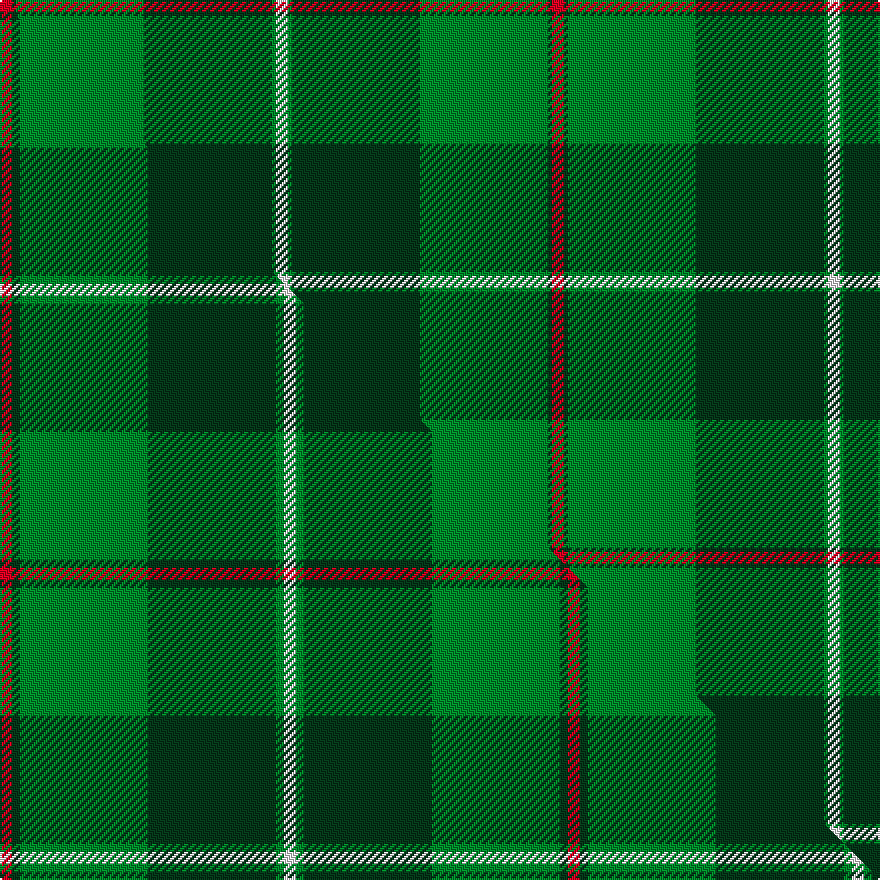

This is one **variant** — a specific cloth: this exact thread count and colourway, with its own
provenance below. It is one weaving of the [sett](/setts/r3dg1g32dg32g1w3/) (the scale-free proportion — the
same cloth at any scale or shade), whose colour order is pattern [RGGGGW](/stripes/rggggw/).

Part of the [Galloway Hunting](/tartans/g/ga/galloway-hunting/) tartan — the named design grouping this sett with its other cloths.

Sourced from weddslist.  It is a [6 stripe tartan](/stripes/stripes6/).

Original link [http://www.weddslist.com/cgi-bin/tartans/pg.pl?source=sts](http://www.weddslist.com/cgi-bin/tartans/pg.pl?source=sts)

Dataset <small>— provenance for this record, inherited from the source manifest</small>

<dl class="dataset-prov">
<dt>source</dt><dd><a href="/sources/weddslist/">Weddslist</a></dd>
<dt>data captured from</dt><dd><a href="https://github.com/thetartan/tartan-database/blob/master/data/weddslist/data.csv">https://github.com/thetartan/tartan-database/blob/master/data/weddslist/data.csv</a></dd>
<dt>data date</dt><dd>2016-11-17 <small>(dataset default)</small></dd>
<dt>licence</dt><dd><a href="https://creativecommons.org/licenses/by-nc-nd/4.0/">CC BY-NC-ND 4.0</a></dd>
</dl>

Capture chain <small>— the hands this data passed through, oldest first; each capture carries its own licence</small>

<ol class="capture-chain">
<li><a href="https://www.weddslist.com/tartans/">Weddslist</a> <small>the living privately compiled reference</small></li>
<li><a href="https://github.com/thetartan/tartan-database">thetartan/tartan-database</a> <small>2016-2017</small> · <a href="https://creativecommons.org/licenses/by-nc-nd/4.0/">CC BY-NC-ND 4.0</a> <small>Levko Kravets's frozen compilation — the capture we vendored, and where its CC licence text came from</small></li>
<li>this dictionary <small>captured 2026-06-10 · commit 5bf86c7566</small> <small>each re-capture is a git commit to data/sources</small></li>
</ol>

## Thread count
R/6 DG2 G64 DG64 G2 W/6

One full sett is **276 threads**.

## Palette
<table><thead><tr><th>Colour</th><th>Shade</th><th>OKLCh</th></tr></thead><tbody><tr><td>DG</td><td><code style="background-color:#053819;">#053819</code> <small style="color:#888">#053819</small></td><td><small style="color:#888">oklch(30.0% 0.075 151.3)</small></td></tr><tr><td>G</td><td><code style="background-color:#008B2A;">#008B2A</code> <small style="color:#888">#008B2A</small></td><td><small style="color:#888">oklch(55.4% 0.170 145.9)</small></td></tr><tr><td>W</td><td><code style="background-color:#F7F7F7;">#F7F7F7</code> <small style="color:#888">#F7F7F7</small></td><td><small style="color:#888">oklch(97.6% 0.000 89.9)</small></td></tr><tr><td>R</td><td><code style="background-color:#D60020;">#D60020</code> <small style="color:#888">#D60020</small></td><td><small style="color:#888">oklch(55.2% 0.224 25.5)</small></td></tr></tbody></table>

# Sample pattern

## Compared to the master

This cloth is one sett of its design; the master sett (the exemplar the design is anchored on) is below for comparison.

Its **ΔTartan distance** from the master is **0.49** — the same measure the nearest-tartans table ranks by (0 is identical; a re-scale of the same cloth is near 0, a recolour or a different proportion further).

<figure class="master-compare" style="margin:0">

this sett
master sett ★

<figcaption style="color:#888;font-size:smaller">One weave of this sett against the <a href="/setts/r3dg2g32dg32g2w3/">master sett ★</a>, split on the diagonal: a shared proportion runs seamlessly across it with only the shades shifting; a different proportion breaks on it.</figcaption>
</figure>

## Nearest tartan variants

The nearest existing variants by ΔTartan distance, with this cloth at the top so the swatches line up against it.

ΔTartan

Threads

Variant

Sett

—

276

<a href="/variants/s6/r3dg1g32dg32g1w3~x2/">Galloway, hunting</a>

<a href="/ttd/edit/#slug=r3dg1g32dg32g1y3~x2&amp;base=r3dg1g32dg32g1w3~x2" title="compare in the TTD">0.30</a>

276

<a href="/variants/s6/r3dg1g32dg32g1y3~x2/">Galloway</a>

<a href="/ttd/edit/#slug=r3dg2g32dg32g2w3~x2&amp;base=r3dg1g32dg32g1w3~x2" title="compare in the TTD">0.49</a>

284

<a href="/variants/s6/r3dg2g32dg32g2w3~x2/">Galloway Hunting</a>

<a href="/ttd/edit/#slug=dp4g4dg2w3g27dg30y1r3~x2&amp;base=r3dg1g32dg32g1w3~x2" title="compare in the TTD">1.50</a>

282

<a href="/variants/s8/dp4g4dg2w3g27dg30y1r3~x2/">Hannigan of Dirleton</a>

<a href="/ttd/edit/#slug=dy4r2dg40g39dg3r4~x2&amp;base=r3dg1g32dg32g1w3~x2" title="compare in the TTD">1.94</a>

352

<a href="/variants/s6/dy4r2dg40g39dg3r4~x2/">McGeorge (Personal)</a>

<a href="/ttd/edit/#slug=r2dg19g2dg2g19dg2y2~x2&amp;base=r3dg1g32dg32g1w3~x2" title="compare in the TTD">1.94</a>

184

<a href="/variants/s7/r2dg19g2dg2g19dg2y2~x2/">Hunting Kenmore</a>

<a href="/ttd/edit/#slug=dt16g4dt3g3lo2g24dr2~x2&amp;base=r3dg1g32dg32g1w3~x2" title="compare in the TTD">2.18</a>

180

<a href="/variants/s7/dt16g4dt3g3lo2g24dr2~x2/">St. Andrews Links (Corporate)</a>

<a href="/ttd/edit/#slug=r6dt4w2g27dt37y2~x2&amp;base=r3dg1g32dg32g1w3~x2" title="compare in the TTD">2.35</a>

296

<a href="/variants/s6/r6dt4w2g27dt37y2~x2/">Highlands of Durham (Corporate)</a>

<a href="/ttd/edit/#slug=dg2ly6g24r2dy2dg1dy6dg10g2~x2&amp;base=r3dg1g32dg32g1w3~x2" title="compare in the TTD">3.47</a>

212

<a href="/variants/s9/dg2ly6g24r2dy2dg1dy6dg10g2~x2/">Fitzgibbon (Name)</a>

<a href="/ttd/edit/#slug=dr8g19dg42ly3r1~x2&amp;base=r3dg1g32dg32g1w3~x2" title="compare in the TTD">3.48</a>

274

<a href="/variants/s5/dr8g19dg42ly3r1~x2/">Nolan (Personal)</a>

<a href="/ttd/edit/#slug=g38w2g6db24o6db2o3db2~x2&amp;base=r3dg1g32dg32g1w3~x2" title="compare in the TTD">3.54</a>

252

<a href="/variants/s8/g38w2g6db24o6db2o3db2~x2/">MacAuliffe/McAucliffe</a>

## Neighbour map

Every grey dot is one of 13656 variants placed by the first two principal components of the ΔTartan feature space (42% of its variance). Red is this tartan; blue dots are its nearest — click one to open its page. The map is a flat projection of a many-dimensional space — [how to read it](/posts/neighbourhood-maps/).

<svg viewBox="0 0 640 380" role="img" style="max-width:100%;height:auto;border:1px solid #e0e0e0;border-radius:4px;display:block" xmlns="http://www.w3.org/2000/svg"><image href="/nn/cloud.v1.png" width="640" height="380"/><a href="/variants/s6/r3dg1g32dg32g1y3~x2/"><circle cx="391.6" cy="176.5" r="4" fill="#3465a4"><title>Galloway</title></circle></a><a href="/variants/s6/r3dg2g32dg32g2w3~x2/"><circle cx="330.1" cy="192.2" r="4" fill="#3465a4"><title>Galloway Hunting</title></circle></a><a href="/variants/s8/dp4g4dg2w3g27dg30y1r3~x2/"><circle cx="282.6" cy="124.5" r="4" fill="#3465a4"><title>Hannigan of Dirleton</title></circle></a><a href="/variants/s6/dy4r2dg40g39dg3r4~x2/"><circle cx="363.4" cy="194.0" r="4" fill="#3465a4"><title>McGeorge (Personal)</title></circle></a><a href="/variants/s7/r2dg19g2dg2g19dg2y2~x2/"><circle cx="354.0" cy="217.9" r="4" fill="#3465a4"><title>Hunting Kenmore</title></circle></a><a href="/variants/s7/dt16g4dt3g3lo2g24dr2~x2/"><circle cx="400.6" cy="221.8" r="4" fill="#3465a4"><title>St. Andrews Links (Corporate)</title></circle></a><a href="/variants/s6/r6dt4w2g27dt37y2~x2/"><circle cx="326.7" cy="172.8" r="4" fill="#3465a4"><title>Highlands of Durham (Corporate)</title></circle></a><a href="/variants/s9/dg2ly6g24r2dy2dg1dy6dg10g2~x2/"><circle cx="286.4" cy="148.7" r="4" fill="#3465a4"><title>Fitzgibbon (Name)</title></circle></a><a href="/variants/s5/dr8g19dg42ly3r1~x2/"><circle cx="403.5" cy="162.6" r="4" fill="#3465a4"><title>Nolan (Personal)</title></circle></a><a href="/variants/s8/g38w2g6db24o6db2o3db2~x2/"><circle cx="335.4" cy="163.9" r="4" fill="#3465a4"><title>MacAuliffe/McAucliffe</title></circle></a><circle cx="352.1" cy="163.3" r="5" fill="#c00000"/><text x="320" y="376" text-anchor="middle" font-size="11" fill="#999">ground</text><text x="11" y="190" text-anchor="middle" font-size="11" fill="#999" transform="rotate(-90 11 190)">complexity</text></svg>

ID: /variants/s6/r3dg1g32dg32g1w3~x2/
