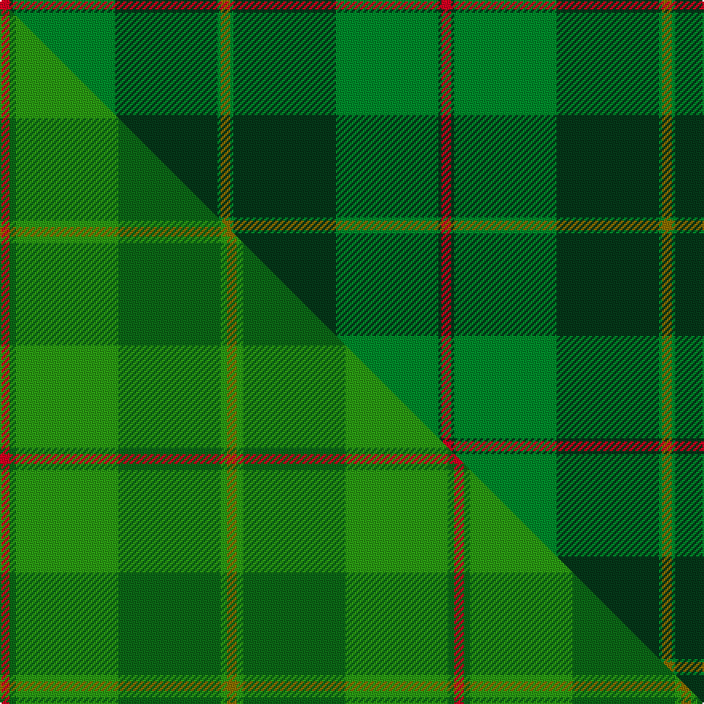

This page is one **sett** — a single exact thread-count. It belongs to the [tartan](/setts/r3dg1g32dg32g1y3/)
(the same proportion at any scale), whose colour order is pattern [GGGGGR](/stripes/gggggr/).

Part of the [Galloway](/tartans/galloway/) tartan — the named design grouping this sett with its other cloths.

Sourced from weddslist.  It is a [6 stripe tartan](/stripes/stripes6/).

Original link http://www.weddslist.com/cgi-bin/tartans/pg.pl?source=sts

## Thread count
R/6 DG2 G64 DG64 G2 Y/6

One full sett is **276 threads**.

## Palette
<table><thead><tr><th>Colour</th><th>Shade</th><th>OKLCh</th></tr></thead><tbody><tr><td>DG</td><td><code style="background-color:#053819;">#053819</code> <small style="color:#888">#053819</small></td><td><small style="color:#888">oklch(30.0% 0.075 151.3)</small></td></tr><tr><td>G</td><td><code style="background-color:#008B2A;">#008B2A</code> <small style="color:#888">#008B2A</small></td><td><small style="color:#888">oklch(55.4% 0.170 145.9)</small></td></tr><tr><td>R</td><td><code style="background-color:#D60020;">#D60020</code> <small style="color:#888">#D60020</small></td><td><small style="color:#888">oklch(55.2% 0.224 25.5)</small></td></tr><tr><td>Y</td><td><code style="background-color:#8B6E00;">#8B6E00</code> <small style="color:#888">#8B6E00</small></td><td><small style="color:#888">oklch(55.1% 0.113 90.4)</small></td></tr></tbody></table>

# Sample pattern

## Compared to the master

This cloth is one sett of its design; the master sett (the exemplar the design is anchored on) is below for comparison.

Its **ΔTartan distance** from the master is **0.57** — the same measure the nearest-tartans table ranks by (0 is identical; a re-scale of the same cloth is near 0, a recolour or a different proportion further).

<figure class="master-compare" style="margin:0">

this sett
master sett ★

<figcaption style="color:#888;font-size:smaller">One weave of this sett against the <a href="/setts/r3dg2g32dg32g2y3/">master sett ★</a>, split on the diagonal: a shared proportion runs seamlessly across it with only the shades shifting; a different proportion breaks on it.</figcaption>
</figure>

## Nearest tartan variants

The nearest existing variants by ΔTartan distance, with this cloth at the top so the swatches line up against it.

ΔTartan

Threads

Variant

Sett

—

276

<a href="/variants/s6/r3dg1g32dg32g1y3~x2/">Galloway</a>

<a href="/ttd/edit/#slug=r3dg1g32dg32g1w3~x2&amp;base=r3dg1g32dg32g1y3~x2" title="compare in the TTD">0.30</a>

276

<a href="/variants/s6/r3dg1g32dg32g1w3~x2/">Galloway, hunting</a>

<a href="/ttd/edit/#slug=r3dg2g32dg32g2w3~x2&amp;base=r3dg1g32dg32g1y3~x2" title="compare in the TTD">0.79</a>

284

<a href="/variants/s6/r3dg2g32dg32g2w3~x2/">Galloway Hunting</a>

<a href="/ttd/edit/#slug=dp4g4dg2w3g27dg30y1r3~x2&amp;base=r3dg1g32dg32g1y3~x2" title="compare in the TTD">1.50</a>

282

<a href="/variants/s8/dp4g4dg2w3g27dg30y1r3~x2/">Hannigan of Dirleton</a>

<a href="/ttd/edit/#slug=dy4r2dg40g39dg3r4~x2&amp;base=r3dg1g32dg32g1y3~x2" title="compare in the TTD">1.64</a>

352

<a href="/variants/s6/dy4r2dg40g39dg3r4~x2/">McGeorge (Personal)</a>

<a href="/ttd/edit/#slug=r2dg19g2dg2g19dg2y2~x2&amp;base=r3dg1g32dg32g1y3~x2" title="compare in the TTD">1.64</a>

184

<a href="/variants/s7/r2dg19g2dg2g19dg2y2~x2/">Hunting Kenmore</a>

<a href="/ttd/edit/#slug=dg30g13dg7g30dg2y4~x2&amp;base=r3dg1g32dg32g1y3~x2" title="compare in the TTD">1.95</a>

276

<a href="/variants/s6/dg30g13dg7g30dg2y4~x2/">MacSporran Rejected design</a>

<a href="/ttd/edit/#slug=r6dt4w2g27dt37y2~x2&amp;base=r3dg1g32dg32g1y3~x2" title="compare in the TTD">1.99</a>

296

<a href="/variants/s6/r6dt4w2g27dt37y2~x2/">Highlands of Durham (Corporate)</a>

<a href="/ttd/edit/#slug=dt16g4dt3g3lo2g24dr2~x2&amp;base=r3dg1g32dg32g1y3~x2" title="compare in the TTD">2.18</a>

180

<a href="/variants/s7/dt16g4dt3g3lo2g24dr2~x2/">St. Andrews Links (Corporate)</a>

<a href="/ttd/edit/#slug=dg30g1dg3dr30k1y3~x2~dg1806142-g2408144&amp;base=r3dg1g32dg32g1y3~x2" title="compare in the TTD">2.39</a>

206

<a href="/variants/s6/dg30g1dg3dr30k1y3~x2~dg1806142-g2408144/">Abadia Da Cova (Corporate)</a>

<a href="/ttd/edit/#slug=g1dr7g7n2dr1dg15lb1~x4&amp;base=r3dg1g32dg32g1y3~x2" title="compare in the TTD">3.01</a>

264

<a href="/variants/s7/g1dr7g7n2dr1dg15lb1~x4/">Ramsay (Green Fashion)</a>

## Neighbour map

Every grey dot is one of 13620 variants placed by the first two principal components of the ΔTartan feature space (42% of its variance). Red is this tartan; blue dots are its nearest — click one to open its page.

<svg viewBox="0 0 640 380" role="img" style="max-width:100%;height:auto;border:1px solid #e0e0e0;border-radius:4px;display:block" xmlns="http://www.w3.org/2000/svg"><image href="/nn/cloud.v1.png" width="640" height="380"/><a href="/variants/s6/r3dg1g32dg32g1w3~x2/"><circle cx="352.2" cy="163.4" r="4" fill="#3465a4"><title>Galloway, hunting</title></circle></a><a href="/variants/s6/r3dg2g32dg32g2w3~x2/"><circle cx="330.2" cy="192.3" r="4" fill="#3465a4"><title>Galloway Hunting</title></circle></a><a href="/variants/s8/dp4g4dg2w3g27dg30y1r3~x2/"><circle cx="282.7" cy="124.5" r="4" fill="#3465a4"><title>Hannigan of Dirleton</title></circle></a><a href="/variants/s6/dy4r2dg40g39dg3r4~x2/"><circle cx="363.5" cy="194.0" r="4" fill="#3465a4"><title>McGeorge (Personal)</title></circle></a><a href="/variants/s7/r2dg19g2dg2g19dg2y2~x2/"><circle cx="354.0" cy="217.9" r="4" fill="#3465a4"><title>Hunting Kenmore</title></circle></a><a href="/variants/s6/dg30g13dg7g30dg2y4~x2/"><circle cx="423.4" cy="264.4" r="4" fill="#3465a4"><title>MacSporran Rejected design</title></circle></a><a href="/variants/s6/r6dt4w2g27dt37y2~x2/"><circle cx="326.8" cy="172.9" r="4" fill="#3465a4"><title>Highlands of Durham (Corporate)</title></circle></a><a href="/variants/s7/dt16g4dt3g3lo2g24dr2~x2/"><circle cx="400.6" cy="221.8" r="4" fill="#3465a4"><title>St. Andrews Links (Corporate)</title></circle></a><a href="/variants/s6/dg30g1dg3dr30k1y3~x2~dg1806142-g2408144/"><circle cx="384.7" cy="151.0" r="4" fill="#3465a4"><title>Abadia Da Cova (Corporate)</title></circle></a><a href="/variants/s7/g1dr7g7n2dr1dg15lb1~x4/"><circle cx="321.0" cy="209.2" r="4" fill="#3465a4"><title>Ramsay (Green Fashion)</title></circle></a><circle cx="391.7" cy="176.5" r="5" fill="#c00000"/><text x="320" y="376" text-anchor="middle" font-size="11" fill="#999">ground</text><text x="11" y="190" text-anchor="middle" font-size="11" fill="#999" transform="rotate(-90 11 190)">complexity</text></svg>

ID: /variants/s6/r3dg1g32dg32g1y3~x2/
