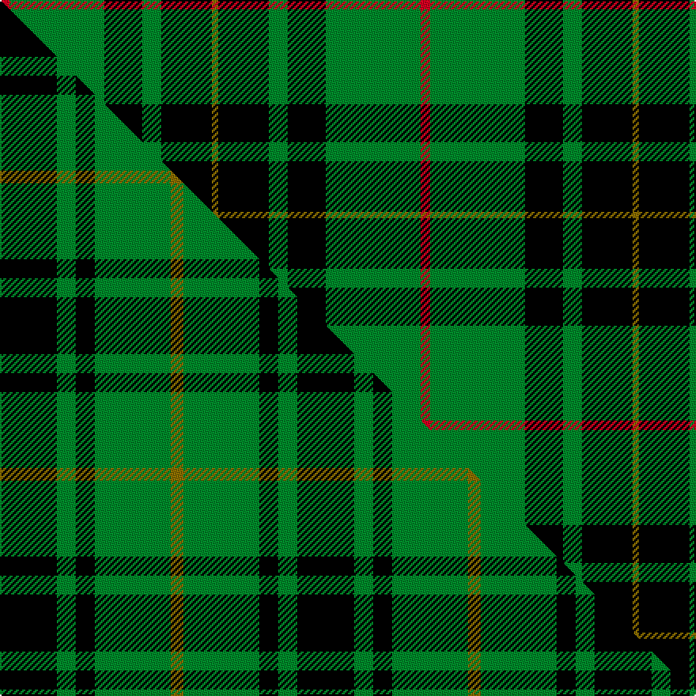

This is one **variant** — a specific cloth: this exact thread count and colourway, with its own
provenance below. It is one weaving of the [sett](/setts/r3g30k12g6k16y2/) (the scale-free proportion — the
same cloth at any scale or shade), whose colour order is pattern [GKGKGR](/stripes/gkgkgr/).

Part of the [MacArthur](/tartans/m/ma/macarthur-2/) tartan — the named design grouping this sett with its other cloths.

Sourced from register-of-tartans.  It is a [6 stripe tartan](/stripes/stripes6/).

Original link [https://www.tartanregister.gov.uk/tartanDetails.aspx?ref=2279](https://www.tartanregister.gov.uk/tartanDetails.aspx?ref=2279)

3 attestations — the source records this cloth was collapsed from (oldest owns this page)

<ul>
<li>01/01/2002 — MacArthur (Variant) (register-of-tartans, <a href="https://www.tartanregister.gov.uk/tartanDetails.aspx?ref=2279">record</a>)  <em>This is the standard MacArthur with the yellow stripe moved to the black and a red stripe introduced (illustrating a conventional method of adapting a clan tartan for an individual or branch of the name).</em></li>
<li>pre 2002 — MacArthur Variant (Personal) (tartans-authority, <a href="https://www.tartanregister.gov.uk/tartanDetails.aspx?ref=1492">record</a>)  <em>From STS records - no further details. This is the standard MacArthur (#1100) with the yellow stripe moved to the black and a red stripe introduced - the conventional method of adapting a clan tartan for an indivudal or branch of the name.</em></li>
<li>undated — MacArthur, ? (weddslist, <a href="http://www.weddslist.com/cgi-bin/tartans/pg.pl?source=sts">record</a>) </li>
</ul>

Dataset <small>— provenance for this record, inherited from the source manifest</small>

<dl class="dataset-prov">
<dt>source</dt><dd><a href="/sources/register-of-tartans/">Scottish Register of Tartans</a></dd>
<dt>data captured from</dt><dd><a href="https://github.com/thetartan/tartan-database/blob/master/data/register-of-tartans/data.csv">https://github.com/thetartan/tartan-database/blob/master/data/register-of-tartans/data.csv</a></dd>
<dt>data date</dt><dd>2002 <small>(this record)</small></dd>
<dt>licence</dt><dd><a href="https://www.tartanregister.gov.uk/copyright">Crown copyright</a></dd>
</dl>

Capture chain <small>— the hands this data passed through, oldest first; each capture carries its own licence</small>

<ol class="capture-chain">
<li><a href="https://www.tartanregister.gov.uk/">Scottish Register of Tartans</a> · <a href="https://www.tartanregister.gov.uk/copyright">Crown copyright</a> <small>the living register — still published by National Records of Scotland</small></li>
<li><a href="https://github.com/thetartan/tartan-database">thetartan/tartan-database</a> <small>2016-2017</small> · <a href="https://creativecommons.org/licenses/by-nc-nd/4.0/">CC BY-NC-ND 4.0</a> <small>Levko Kravets's frozen compilation — the capture we vendored, and where its CC licence text came from</small></li>
<li>this dictionary <small>captured 2026-06-10 · commit 5bf86c7566</small> <small>each re-capture is a git commit to data/sources</small></li>
</ol>

## Register references

External register numbers recorded for this tartan.

- Scottish Register of Tartans: [2279](https://www.tartanregister.gov.uk/tartanDetails.aspx?ref=2279)
- Scottish Tartans Authority (ITI): 1492
- Scottish Tartans World Register: 1492

## Thread count
R/6 G60 K24 G12 K32 Y/4

One full sett is **266 threads**.

## Palette
<table><thead><tr><th>Colour</th><th>Shade</th><th>OKLCh</th></tr></thead><tbody><tr><td>G</td><td><code style="background-color:#008B2A;">#008B2A</code> <small style="color:#888">#008B2A</small></td><td><small style="color:#888">oklch(55.4% 0.170 145.9)</small></td></tr><tr><td>K</td><td><code style="background-color:#000000;">#000000</code> <small style="color:#888">#000000</small></td><td><small style="color:#888">oklch(0.0% 0.000 0.0)</small></td></tr><tr><td>R</td><td><code style="background-color:#D60020;">#D60020</code> <small style="color:#888">#D60020</small></td><td><small style="color:#888">oklch(55.2% 0.224 25.5)</small></td></tr><tr><td>Y</td><td><code style="background-color:#8B6E00;">#8B6E00</code> <small style="color:#888">#8B6E00</small></td><td><small style="color:#888">oklch(55.1% 0.113 90.4)</small></td></tr></tbody></table>

# Sample pattern

## Compared to the master

This cloth is one sett of its design; the master sett (the exemplar the design is anchored on) is below for comparison.

Its **ΔTartan distance** from the master is **0.84** — the same measure the nearest-tartans table ranks by (0 is identical; a re-scale of the same cloth is near 0, a recolour or a different proportion further).

<figure class="master-compare" style="margin:0">

this sett
master sett ★

<figcaption style="color:#888;font-size:smaller">One weave of this sett against the <a href="/setts/k9g3k3g12y2/">master sett ★</a>, split on the diagonal: a shared proportion runs seamlessly across it with only the shades shifting; a different proportion breaks on it.</figcaption>
</figure>

## Nearest tartan variants

The nearest existing variants by ΔTartan distance, with this cloth at the top so the swatches line up against it.

ΔTartan

Threads

Variant

Sett

—

266

<a href="/variants/s6/r3g30k12g6k16y2~x2/">MacArthur (Variant)</a>

<a href="/ttd/edit/#slug=r1g16k8g3k4y1&amp;base=r3g30k12g6k16y2~x2" title="compare in the TTD">0.36</a>

64

<a href="/variants/s6/r1g16k8g3k4y1/">Forbes VS</a>

<a href="/ttd/edit/#slug=r1g16k8g3k4y1~x2&amp;base=r3g30k12g6k16y2~x2" title="compare in the TTD">0.36</a>

128

<a href="/variants/s6/r1g16k8g3k4y1~x2/">Forbes VS</a>

<a href="/ttd/edit/#slug=r1g16k8g4k4y1~x2&amp;base=r3g30k12g6k16y2~x2" title="compare in the TTD">0.41</a>

132

<a href="/variants/s6/r1g16k8g4k4y1~x2/">Forbes #6</a>

<a href="/ttd/edit/#slug=k19g8k10g31r3&amp;base=r3g30k12g6k16y2~x2" title="compare in the TTD">0.67</a>

120

<a href="/variants/s5/k19g8k10g31r3/">MacArthur-Fox Family Tartan</a>

<a href="/ttd/edit/#slug=dr3g30k12g1k16lo2~x2&amp;base=r3g30k12g6k16y2~x2" title="compare in the TTD">0.88</a>

246

<a href="/variants/s6/dr3g30k12g1k16lo2~x2/">MacArthur-Fox Htg (Personal)</a>

<a href="/ttd/edit/#slug=k32g6k12g30y3&amp;base=r3g30k12g6k16y2~x2" title="compare in the TTD">0.88</a>

131

<a href="/variants/s5/k32g6k12g30y3/">MacArthur Clan Tartan</a>

<a href="/ttd/edit/#slug=k32g6k12g30y3~x2&amp;base=r3g30k12g6k16y2~x2" title="compare in the TTD">0.88</a>

262

<a href="/variants/s5/k32g6k12g30y3~x2/">MacArthur</a>

<a href="/ttd/edit/#slug=k8g3k4g20dr4~x2&amp;base=r3g30k12g6k16y2~x2" title="compare in the TTD">1.04</a>

132

<a href="/variants/s5/k8g3k4g20dr4~x2/">MacArthur-Fox (Personal)</a>

<a href="/ttd/edit/#slug=r3g14k2b2g14k36y3~x2&amp;base=r3g30k12g6k16y2~x2" title="compare in the TTD">1.11</a>

284

<a href="/variants/s7/r3g14k2b2g14k36y3~x2/">Vipont</a>

<a href="/ttd/edit/#slug=dy3k36g14b2k2g14r3~x2&amp;base=r3g30k12g6k16y2~x2" title="compare in the TTD">1.11</a>

284

<a href="/variants/s7/dy3k36g14b2k2g14r3~x2/">Vipont (Yellow line)</a>

## Neighbour map

Every grey dot is one of 13621 variants placed by the first two principal components of the ΔTartan feature space (42% of its variance). Red is this tartan; blue dots are its nearest — click one to open its page.

<svg viewBox="0 0 640 380" role="img" style="max-width:100%;height:auto;border:1px solid #e0e0e0;border-radius:4px;display:block" xmlns="http://www.w3.org/2000/svg"><image href="/nn/cloud.v1.png" width="640" height="380"/><a href="/variants/s6/r1g16k8g3k4y1/"><circle cx="289.1" cy="165.8" r="4" fill="#3465a4"><title>Forbes VS</title></circle></a><a href="/variants/s6/r1g16k8g3k4y1~x2/"><circle cx="289.1" cy="165.8" r="4" fill="#3465a4"><title>Forbes VS</title></circle></a><a href="/variants/s6/r1g16k8g4k4y1~x2/"><circle cx="293.0" cy="168.9" r="4" fill="#3465a4"><title>Forbes #6</title></circle></a><a href="/variants/s5/k19g8k10g31r3/"><circle cx="268.5" cy="222.9" r="4" fill="#3465a4"><title>MacArthur-Fox Family Tartan</title></circle></a><a href="/variants/s6/dr3g30k12g1k16lo2~x2/"><circle cx="268.0" cy="142.0" r="4" fill="#3465a4"><title>MacArthur-Fox Htg (Personal)</title></circle></a><a href="/variants/s5/k32g6k12g30y3/"><circle cx="270.5" cy="219.1" r="4" fill="#3465a4"><title>MacArthur Clan Tartan</title></circle></a><a href="/variants/s5/k32g6k12g30y3~x2/"><circle cx="270.5" cy="219.1" r="4" fill="#3465a4"><title>MacArthur</title></circle></a><a href="/variants/s5/k8g3k4g20dr4~x2/"><circle cx="278.8" cy="231.3" r="4" fill="#3465a4"><title>MacArthur-Fox (Personal)</title></circle></a><a href="/variants/s7/r3g14k2b2g14k36y3~x2/"><circle cx="243.7" cy="129.8" r="4" fill="#3465a4"><title>Vipont</title></circle></a><a href="/variants/s7/dy3k36g14b2k2g14r3~x2/"><circle cx="245.4" cy="130.2" r="4" fill="#3465a4"><title>Vipont (Yellow line)</title></circle></a><circle cx="254.0" cy="177.4" r="5" fill="#c00000"/><text x="320" y="376" text-anchor="middle" font-size="11" fill="#999">ground</text><text x="11" y="190" text-anchor="middle" font-size="11" fill="#999" transform="rotate(-90 11 190)">complexity</text></svg>

ID: /variants/s6/r3g30k12g6k16y2~x2/
