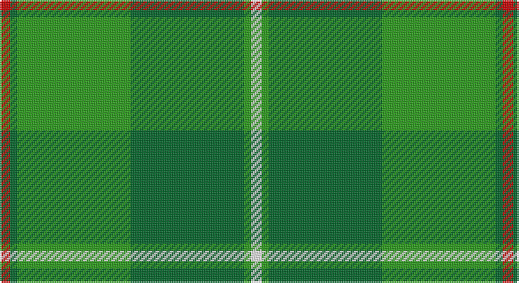

This page is one **sett** — a single exact thread-count. It belongs to the [tartan](/setts/r3gi2g32gi32g2w3/)
(the same proportion at any scale), whose colour order is pattern [RGGGGW](/stripes/rggggw/).

Part of the [Galloway Hunting](/tartans/galloway-hunting/) tartan — the named design grouping this sett with its other cloths.

Sourced from register-of-tartans.  It is a [6 stripe tartan](/stripes/stripes6/).

Original link https://www.tartanregister.gov.uk/tartanDetails.aspx?ref=1305

## Also known as

This cloth is also recorded under:

- Galloway, hunting

2 attestations — the source records this cloth was collapsed from (oldest owns this page)

<ul>
<li>01/01/1939 — Galloway Hunting (register-of-tartans, <a href="https://www.tartanregister.gov.uk/tartanDetails.aspx?ref=1305">record</a>)</li>
<li>pre 1939 — Galloway Hunting (District) (tartans-authority, <a href="http://www.tartansauthority.com/tartan-ferret/display/1467/">record</a>)</li>
</ul>

## Register references

External register numbers recorded for this tartan.

- Scottish Register of Tartans: [1305](https://www.tartanregister.gov.uk/tartanDetails.aspx?ref=1305)
- Scottish Tartans Authority (ITI): 1467
- Scottish Tartans World Register: 1467

## Thread count
R/6 G4 Ga64 G64 Ga4 W/6

One full sett is **284 threads**.

## Palette

Palette: <strong>Tartan Register</strong> <small style="color:#888">(3 of 4 colours)</small>
<table><thead><tr><th>Colour</th><th>Threads</th><th>Shade</th><th>Base</th><th>OKLCh</th></tr></thead><tbody><tr><td>R/</td><td style="text-align:right;font-variant-numeric:tabular-nums">6</td><td><code style="background-color:#C80000;">#C80000</code> <small style="color:#888">#C80000</small></td><td>R <code style="background-color:#CC0000;">#CC0000</code></td><td><small style="color:#888">oklch(52.3% 0.215 29.2)</small></td></tr><tr><td>G</td><td style="text-align:right;font-variant-numeric:tabular-nums">4</td><td><code style="background-color:#006428;">#006428</code> <small style="color:#888">#006428</small></td><td>G <code style="background-color:#006100;">#006100</code></td><td><small style="color:#888">oklch(43.9% 0.124 149.0)</small></td></tr><tr><td>Ga</td><td style="text-align:right;font-variant-numeric:tabular-nums">64</td><td><code style="background-color:#289C18;">#289C18</code> <small style="color:#888">#289C18</small></td><td>G <code style="background-color:#006100;">#006100</code></td><td><small style="color:#888">oklch(60.6% 0.191 141.6)</small></td></tr><tr><td>G</td><td style="text-align:right;font-variant-numeric:tabular-nums">64</td><td><code style="background-color:#006428;">#006428</code> <small style="color:#888">#006428</small></td><td>G <code style="background-color:#006100;">#006100</code></td><td><small style="color:#888">oklch(43.9% 0.124 149.0)</small></td></tr><tr><td>Ga</td><td style="text-align:right;font-variant-numeric:tabular-nums">4</td><td><code style="background-color:#289C18;">#289C18</code> <small style="color:#888">#289C18</small></td><td>G <code style="background-color:#006100;">#006100</code></td><td><small style="color:#888">oklch(60.6% 0.191 141.6)</small></td></tr><tr><td>W/</td><td style="text-align:right;font-variant-numeric:tabular-nums">6</td><td><code style="background-color:#FCFCFC;">#FCFCFC</code> <small style="color:#888">#FCFCFC</small></td><td>W <code style="background-color:#F7F7F7;">#F7F7F7</code></td><td><small style="color:#888">oklch(99.1% 0.000 89.9)</small></td></tr></tbody></table>

# Sample pattern

## Nearest tartans

The nearest existing variants by ΔTartan distance, with this tartan at the top so the swatches line up against it.

ΔTartan

Tartan

Sett

—

<a href="/ttd/edit/#slug=r3gi2g32gi32g2w3~x2">Galloway Hunting</a> <a class="nn-out" href="/variants/s6/r3gi2g32gi32g2w3~x2/" title="open its dictionary page">↗</a>

1.22

<a href="/ttd/edit/#slug=gi14db1gi1db1gi3db6g12r2~x2&amp;base=r3gi2g32gi32g2w3~x2">Cranstoun</a> <a class="nn-out" href="/variants/s8/gi14db1gi1db1gi3db6g12r2~x2/" title="open its dictionary page">↗</a>

1.22

<a href="/ttd/edit/#slug=r3gi2g32gi32g2ly3~x2&amp;base=r3gi2g32gi32g2w3~x2">Galloway Green (yellow line)</a> <a class="nn-out" href="/variants/s6/r3gi2g32gi32g2ly3~x2/" title="open its dictionary page">↗</a>

1.61

<a href="/ttd/edit/#slug=g14db1g1db1g3db6gi12r2~x2&amp;base=r3gi2g32gi32g2w3~x2">Cranstoun Clan Tartan</a> <a class="nn-out" href="/variants/s8/g14db1g1db1g3db6gi12r2~x2/" title="open its dictionary page">↗</a>

1.75

<a href="/ttd/edit/#slug=dt5lo5dy13g41r3~x2&amp;base=r3gi2g32gi32g2w3~x2">Clare, Richard (Personal)</a> <a class="nn-out" href="/variants/s5/dt5lo5dy13g41r3~x2/" title="open its dictionary page">↗</a>

1.83

<a href="/ttd/edit/#slug=r2dg19g2dg2g19dg2ly2~x2&amp;base=r3gi2g32gi32g2w3~x2">Hunting Kenmore</a> <a class="nn-out" href="/variants/s7/r2dg19g2dg2g19dg2ly2~x2/" title="open its dictionary page">↗</a>

1.89

<a href="/ttd/edit/#slug=r3dg1g32dg32g1ly3~x2&amp;base=r3gi2g32gi32g2w3~x2">Galloway</a> <a class="nn-out" href="/variants/s6/r3dg1g32dg32g1ly3~x2/" title="open its dictionary page">↗</a>

1.92

<a href="/ttd/edit/#slug=g12y6lo16gi10w6gi8g12gi70y9gi7&amp;base=r3gi2g32gi32g2w3~x2">Rams Timeless</a> <a class="nn-out" href="/variants/s10/g12y6lo16gi10w6gi8g12gi70y9gi7/" title="open its dictionary page">↗</a>

1.94

<a href="/ttd/edit/#slug=dg30g13dg7g30dg2ly4~x2&amp;base=r3gi2g32gi32g2w3~x2">MacSporran, Rejected design</a> <a class="nn-out" href="/variants/s6/dg30g13dg7g30dg2ly4~x2/" title="open its dictionary page">↗</a>

1.96

<a href="/ttd/edit/#slug=y36g19y4g31b2r3b2r3g12~x2&amp;base=r3gi2g32gi32g2w3~x2">O'Brien (Scotch Corner)</a> <a class="nn-out" href="/variants/s9/y36g19y4g31b2r3b2r3g12~x2/" title="open its dictionary page">↗</a>

1.98

<a href="/ttd/edit/#slug=g28r2g2r2g8db24y3r2~x2&amp;base=r3gi2g32gi32g2w3~x2">Leatherneck, U.S.Marine Corps</a> <a class="nn-out" href="/variants/s8/g28r2g2r2g8db24y3r2~x2/" title="open its dictionary page">↗</a>

## Neighbour map

Every grey dot is one of 14360 variants placed by the first two principal components of the ΔTartan feature space (44% of its variance). Red is this tartan; blue dots are its nearest — click one to open its page.

<svg viewBox="0 0 640 380" role="img" style="max-width:100%;height:auto;border:1px solid #e0e0e0;border-radius:4px;display:block" xmlns="http://www.w3.org/2000/svg"><image href="/nn/cloud.v1.png" width="640" height="380"/><a href="/variants/s8/gi14db1gi1db1gi3db6g12r2~x2/"><circle cx="280.9" cy="203.8" r="4" fill="#3465a4"><title>Cranstoun</title></circle></a><a href="/variants/s6/r3gi2g32gi32g2ly3~x2/"><circle cx="375.1" cy="224.1" r="4" fill="#3465a4"><title>Galloway Green (yellow line)</title></circle></a><a href="/variants/s8/g14db1g1db1g3db6gi12r2~x2/"><circle cx="265.8" cy="195.1" r="4" fill="#3465a4"><title>Cranstoun Clan Tartan</title></circle></a><a href="/variants/s5/dt5lo5dy13g41r3~x2/"><circle cx="359.4" cy="196.9" r="4" fill="#3465a4"><title>Clare, Richard (Personal)</title></circle></a><a href="/variants/s7/r2dg19g2dg2g19dg2ly2~x2/"><circle cx="305.9" cy="208.9" r="4" fill="#3465a4"><title>Hunting Kenmore</title></circle></a><a href="/variants/s6/r3dg1g32dg32g1ly3~x2/"><circle cx="350.3" cy="169.1" r="4" fill="#3465a4"><title>Galloway</title></circle></a><a href="/variants/s10/g12y6lo16gi10w6gi8g12gi70y9gi7/"><circle cx="353.1" cy="174.9" r="4" fill="#3465a4"><title>Rams Timeless</title></circle></a><a href="/variants/s6/dg30g13dg7g30dg2ly4~x2/"><circle cx="342.9" cy="242.7" r="4" fill="#3465a4"><title>MacSporran, Rejected design</title></circle></a><a href="/variants/s9/y36g19y4g31b2r3b2r3g12~x2/"><circle cx="410.4" cy="213.0" r="4" fill="#3465a4"><title>O'Brien (Scotch Corner)</title></circle></a><a href="/variants/s8/g28r2g2r2g8db24y3r2~x2/"><circle cx="340.8" cy="187.4" r="4" fill="#3465a4"><title>Leatherneck, U.S.Marine Corps</title></circle></a><circle cx="342.3" cy="206.4" r="5" fill="#c00000"/></svg>

ID: /variants/s6/r3gi2g32gi32g2w3~x2/
