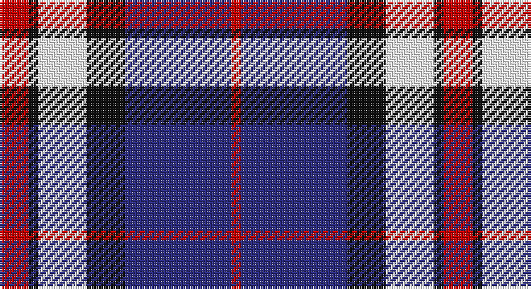

This page is one **sett** — a single exact thread-count. It belongs to the [tartan](/setts/r3k1w5k4db11r1/)
(the same proportion at any scale), whose colour order is pattern [RBKWKR](/stripes/rbkwkr/).

Part of the [Hydro-Electric](/tartans/hydro-electric/) tartan — the named design grouping this sett with its other cloths.

Sourced from tartans-authority.  It is a [6 stripe tartan](/stripes/stripes6/).

Original link http://www.tartansauthority.com/tartan-ferret/display/2300/

## Register references

External register numbers recorded for this tartan.

- Scottish Tartans Authority (ITI): 2300

## Thread count
R/12 K4 W20 K16 DB44 R/4

One full sett is **184 threads**.

## Palette

Palette: <strong>Tartan Register</strong>
<table><thead><tr><th>Colour</th><th>Threads</th><th>Shade</th><th>Base</th><th>OKLCh</th></tr></thead><tbody><tr><td>R/</td><td style="text-align:right;font-variant-numeric:tabular-nums">12</td><td><code style="background-color:#C80000;">#C80000</code> <small style="color:#888">#C80000</small></td><td>R <code style="background-color:#CC0000;">#CC0000</code></td><td><small style="color:#888">oklch(52.3% 0.215 29.2)</small></td></tr><tr><td>K</td><td style="text-align:right;font-variant-numeric:tabular-nums">4</td><td><code style="background-color:#101010;">#101010</code> <small style="color:#888">#101010</small></td><td>K <code style="background-color:#000000;">#000000</code></td><td><small style="color:#888">oklch(17.3% 0.000 89.9)</small></td></tr><tr><td>W</td><td style="text-align:right;font-variant-numeric:tabular-nums">20</td><td><code style="background-color:#FCFCFC;">#FCFCFC</code> <small style="color:#888">#FCFCFC</small></td><td>W <code style="background-color:#F7F7F7;">#F7F7F7</code></td><td><small style="color:#888">oklch(99.1% 0.000 89.9)</small></td></tr><tr><td>K</td><td style="text-align:right;font-variant-numeric:tabular-nums">16</td><td><code style="background-color:#101010;">#101010</code> <small style="color:#888">#101010</small></td><td>K <code style="background-color:#000000;">#000000</code></td><td><small style="color:#888">oklch(17.3% 0.000 89.9)</small></td></tr><tr><td>DB</td><td style="text-align:right;font-variant-numeric:tabular-nums">44</td><td><code style="background-color:#2C2C80;">#2C2C80</code> <small style="color:#888">#2C2C80</small></td><td>B <code style="background-color:#2A418A;">#2A418A</code></td><td><small style="color:#888">oklch(35.0% 0.138 276.6)</small></td></tr><tr><td>R/</td><td style="text-align:right;font-variant-numeric:tabular-nums">4</td><td><code style="background-color:#C80000;">#C80000</code> <small style="color:#888">#C80000</small></td><td>R <code style="background-color:#CC0000;">#CC0000</code></td><td><small style="color:#888">oklch(52.3% 0.215 29.2)</small></td></tr></tbody></table>

# Sample pattern

## Compared to the master

This cloth is one sett of its design; the master sett (the exemplar the design is anchored on) is below for comparison.

<figure style="margin:0"><figcaption style="color:#888;font-size:smaller">this sett</figcaption></figure>
<figure style="margin:0"><figcaption style="color:#888;font-size:smaller"><a href="/setts/db11k4w5k1r3k1w5k4db11r1/">master sett →</a></figcaption></figure>

## Nearest tartans

The nearest existing variants by ΔTartan distance, with this tartan at the top so the swatches line up against it.

ΔTartan

Tartan

Sett

—

<a href="/ttd/edit/#slug=r3k1w5k4db11r1~x4">Hydro-Electric (Corporate)</a> <a class="nn-out" href="/variants/s6/r3k1w5k4db11r1~x4/" title="open its dictionary page">↗</a>

0.87

<a href="/ttd/edit/#slug=r3db15w13o6db2o2r2~x2&amp;base=r3k1w5k4db11r1~x4">Thom(p)son, Navy</a> <a class="nn-out" href="/variants/s7/r3db15w13o6db2o2r2~x2/" title="open its dictionary page">↗</a>

0.94

<a href="/ttd/edit/#slug=m3db15w13dy6db2dy2m2~x2&amp;base=r3k1w5k4db11r1~x4">Thompson Navy Trade Tartan</a> <a class="nn-out" href="/variants/s7/m3db15w13dy6db2dy2m2~x2/" title="open its dictionary page">↗</a>

1.01

<a href="/ttd/edit/#slug=r12k3w14dt10k2dt24r2~x2&amp;base=r3k1w5k4db11r1~x4">Yusra Personal Tartan</a> <a class="nn-out" href="/variants/s7/r12k3w14dt10k2dt24r2~x2/" title="open its dictionary page">↗</a>

1.03

<a href="/ttd/edit/#slug=r15w10db48t32r6~x2&amp;base=r3k1w5k4db11r1~x4">Lands of Liberty (Fashion)</a> <a class="nn-out" href="/variants/s5/r15w10db48t32r6~x2/" title="open its dictionary page">↗</a>

1.14

<a href="/ttd/edit/#slug=w4db30g10r25w2~x2&amp;base=r3k1w5k4db11r1~x4">Highland Spring Dress (2004) (Corp)</a> <a class="nn-out" href="/variants/s5/w4db30g10r25w2~x2/" title="open its dictionary page">↗</a>

1.20

<a href="/ttd/edit/#slug=db11k4w5k1r3k1w5k4db11r1~x4&amp;base=r3k1w5k4db11r1~x4">Hydro-Electric</a> <a class="nn-out" href="/variants/s10/db11k4w5k1r3k1w5k4db11r1~x4/" title="open its dictionary page">↗</a>

1.20

<a href="/ttd/edit/#slug=w6db24k7o11k2ly6~x2&amp;base=r3k1w5k4db11r1~x4">Clunie (Name)</a> <a class="nn-out" href="/variants/s6/w6db24k7o11k2ly6~x2/" title="open its dictionary page">↗</a>

1.23

<a href="/ttd/edit/#slug=db12w4db1w4r8w2r1~x4&amp;base=r3k1w5k4db11r1~x4">Sunderland</a> <a class="nn-out" href="/variants/s7/db12w4db1w4r8w2r1~x4/" title="open its dictionary page">↗</a>

1.24

<a href="/ttd/edit/#slug=r2y20k5w10k10r2~x2&amp;base=r3k1w5k4db11r1~x4">Thom(p)son, Grey</a> <a class="nn-out" href="/variants/s6/r2y20k5w10k10r2~x2/" title="open its dictionary page">↗</a>

1.25

<a href="/ttd/edit/#slug=p19w2g12t3k4~x2&amp;base=r3k1w5k4db11r1~x4">Wilson's, No 111</a> <a class="nn-out" href="/variants/s5/p19w2g12t3k4~x2/" title="open its dictionary page">↗</a>

## Neighbour map

Every grey dot is one of 14360 variants placed by the first two principal components of the ΔTartan feature space (44% of its variance). Red is this tartan; blue dots are its nearest — click one to open its page.

<svg viewBox="0 0 640 380" role="img" style="max-width:100%;height:auto;border:1px solid #e0e0e0;border-radius:4px;display:block" xmlns="http://www.w3.org/2000/svg"><image href="/nn/cloud.v1.png" width="640" height="380"/><a href="/variants/s7/r3db15w13o6db2o2r2~x2/"><circle cx="151.2" cy="190.0" r="4" fill="#3465a4"><title>Thom(p)son, Navy</title></circle></a><a href="/variants/s7/m3db15w13dy6db2dy2m2~x2/"><circle cx="159.0" cy="190.3" r="4" fill="#3465a4"><title>Thompson Navy Trade Tartan</title></circle></a><a href="/variants/s7/r12k3w14dt10k2dt24r2~x2/"><circle cx="227.4" cy="183.8" r="4" fill="#3465a4"><title>Yusra Personal Tartan</title></circle></a><a href="/variants/s5/r15w10db48t32r6~x2/"><circle cx="185.6" cy="224.2" r="4" fill="#3465a4"><title>Lands of Liberty (Fashion)</title></circle></a><a href="/variants/s5/w4db30g10r25w2~x2/"><circle cx="227.2" cy="195.2" r="4" fill="#3465a4"><title>Highland Spring Dress (2004) (Corp)</title></circle></a><a href="/variants/s10/db11k4w5k1r3k1w5k4db11r1~x4/"><circle cx="193.4" cy="171.7" r="4" fill="#3465a4"><title>Hydro-Electric</title></circle></a><a href="/variants/s6/w6db24k7o11k2ly6~x2/"><circle cx="154.2" cy="177.4" r="4" fill="#3465a4"><title>Clunie (Name)</title></circle></a><a href="/variants/s7/db12w4db1w4r8w2r1~x4/"><circle cx="211.5" cy="188.3" r="4" fill="#3465a4"><title>Sunderland</title></circle></a><a href="/variants/s6/r2y20k5w10k10r2~x2/"><circle cx="164.2" cy="191.7" r="4" fill="#3465a4"><title>Thom(p)son, Grey</title></circle></a><a href="/variants/s5/p19w2g12t3k4~x2/"><circle cx="208.2" cy="192.3" r="4" fill="#3465a4"><title>Wilson's, No 111</title></circle></a><circle cx="186.7" cy="186.0" r="5" fill="#c00000"/></svg>

ID: /variants/s6/r3k1w5k4db11r1~x4/
