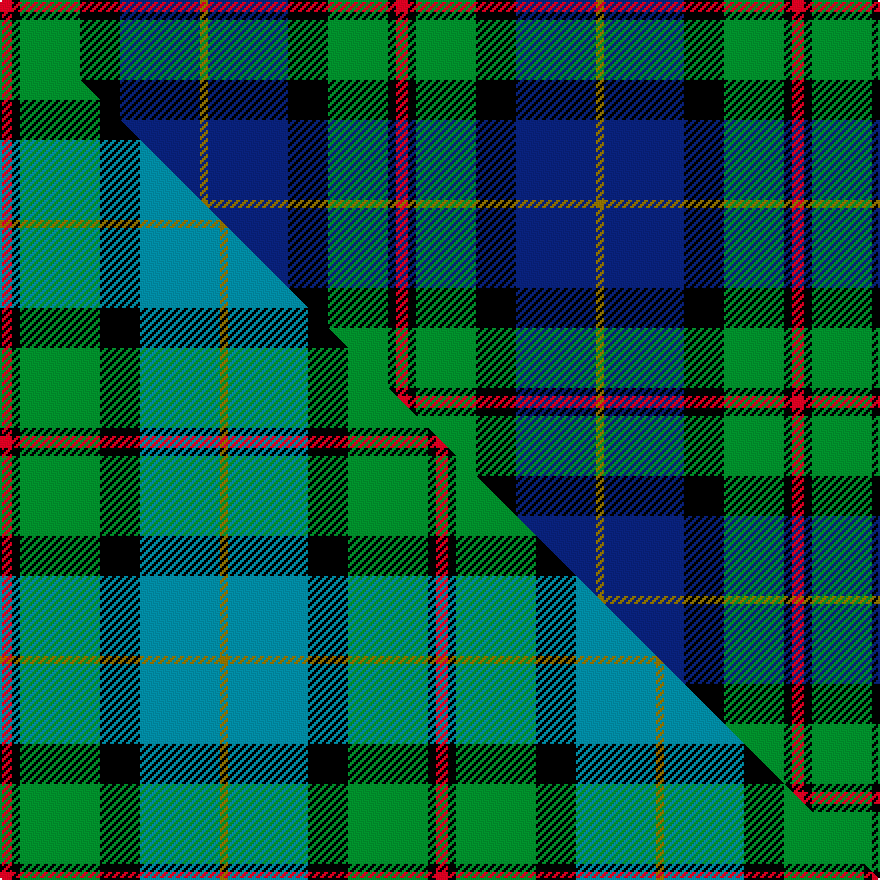

This page is one **sett** — a single exact thread-count. It belongs to the [tartan](/setts/r3k2g15k10db20y2/)
(the same proportion at any scale), whose colour order is pattern [GBKGKR](/stripes/gbkgkr/).

Part of the [MacLeod of Assynt](/tartans/macleod-of-assynt/) tartan — the named design grouping this sett with its other cloths.

Sourced from weddslist.  It is a [6 stripe tartan](/stripes/stripes6/).

Original link http://www.weddslist.com/cgi-bin/tartans/pg.pl?source=sts

## Provenance

Earliest known date: 1906 In a portrait of the 24th chief, John Norman, painted posthumously (perhaps by Julius Jacobson, born 1811) in 1835, John Norman is shown in the costume worn for the visit of George IV to Edinburgh in 1822. The snuff-box may be evidence that the Vestiarium 'loud' design, which is very similar to that of the snuff box, had particular significance for John Norman or his wife, Ann Stephenson. (Ruairidh MacLeod, Tartans of Clan MacLeod, 1990.)

2 attestations — the source records this cloth was collapsed from (oldest owns this page)

<ul>
<li>undated — MacLeod of Assynt (weddslist, <a href="http://www.weddslist.com/cgi-bin/tartans/pg.pl?source=sts">record</a>) </li>
<li>undated — MacLeod of Assynt Clan Tartan (house-of-tartan, <a href="http://www.house-of-tartan.scotland.net/house/TartanViewjs.asp?colr=Def&tnam=1582">record</a>) </li>
</ul>

Dataset <small>— provenance for this record, inherited from the source manifest</small>

<dl class="dataset-prov">
<dt>source</dt><dd><a href="/sources/weddslist/">Weddslist</a></dd>
<dt>data captured from</dt><dd><a href="https://github.com/thetartan/tartan-database/blob/master/data/weddslist/data.csv">https://github.com/thetartan/tartan-database/blob/master/data/weddslist/data.csv</a></dd>
<dt>data date</dt><dd>2016-11-17 <small>(dataset default)</small></dd>
<dt>licence</dt><dd><a href="https://creativecommons.org/licenses/by-nc-nd/4.0/">CC BY-NC-ND 4.0</a></dd>
</dl>

Capture chain <small>— the hands this data passed through, oldest first; each capture carries its own licence</small>

<ol class="capture-chain">
<li><a href="https://www.weddslist.com/tartans/">Weddslist</a> <small>the living privately compiled reference</small></li>
<li><a href="https://github.com/thetartan/tartan-database">thetartan/tartan-database</a> <small>2016-2017</small> · <a href="https://creativecommons.org/licenses/by-nc-nd/4.0/">CC BY-NC-ND 4.0</a> <small>Levko Kravets's frozen compilation — the capture we vendored, and where its CC licence text came from</small></li>
<li>this dictionary <small>captured 2026-06-10 · commit 5bf86c7566</small> <small>each re-capture is a git commit to data/sources</small></li>
</ol>

## Thread count
R/6 K4 G30 K20 DB40 Y/4

One full sett is **198 threads**.

## Palette
<table><thead><tr><th>Colour</th><th>Shade</th><th>OKLCh</th></tr></thead><tbody><tr><td>DB</td><td><code style="background-color:#082077;">#082077</code> <small style="color:#888">#082077</small></td><td><small style="color:#888">oklch(30.0% 0.149 265.1)</small></td></tr><tr><td>G</td><td><code style="background-color:#008B2A;">#008B2A</code> <small style="color:#888">#008B2A</small></td><td><small style="color:#888">oklch(55.4% 0.170 145.9)</small></td></tr><tr><td>K</td><td><code style="background-color:#000000;">#000000</code> <small style="color:#888">#000000</small></td><td><small style="color:#888">oklch(0.0% 0.000 0.0)</small></td></tr><tr><td>R</td><td><code style="background-color:#D60020;">#D60020</code> <small style="color:#888">#D60020</small></td><td><small style="color:#888">oklch(55.2% 0.224 25.5)</small></td></tr><tr><td>Y</td><td><code style="background-color:#8B6E00;">#8B6E00</code> <small style="color:#888">#8B6E00</small></td><td><small style="color:#888">oklch(55.1% 0.113 90.4)</small></td></tr></tbody></table>

# Sample pattern

## Compared to the master

This cloth is one sett of its design; the master sett (the exemplar the design is anchored on) is below for comparison.

Its **ΔTartan distance** from the master is **0.39** — the same measure the nearest-tartans table ranks by (0 is identical; a re-scale of the same cloth is near 0, a recolour or a different proportion further).

<figure class="master-compare" style="margin:0">

this sett
master sett ★

<figcaption style="color:#888;font-size:smaller">One weave of this sett against the <a href="/setts/r3k2g20k10t20y2/">master sett ★</a>, split on the diagonal: a shared proportion runs seamlessly across it with only the shades shifting; a different proportion breaks on it.</figcaption>
</figure>

## Nearest tartan variants

The nearest existing variants by ΔTartan distance, with this cloth at the top so the swatches line up against it.

ΔTartan

Threads

Variant

Sett

—

198

<a href="/variants/s6/r3k2g15k10db20y2~x2/">MacLeod of Assynt</a>

<a href="/ttd/edit/#slug=dr1k1g6k6db6lr1~x4&amp;base=r3k2g15k10db20y2~x2" title="compare in the TTD">0.80</a>

160

<a href="/variants/s6/dr1k1g6k6db6lr1~x4/">Gaines Center for the Humanities</a>

<a href="/ttd/edit/#slug=r2db23k14g16k2w2~x2&amp;base=r3k2g15k10db20y2~x2" title="compare in the TTD">0.85</a>

228

<a href="/variants/s6/r2db23k14g16k2w2~x2/">MacPhail Hunting</a>

<a href="/ttd/edit/#slug=r3k2g15k10db20k2y2~x2&amp;base=r3k2g15k10db20y2~x2" title="compare in the TTD">1.00</a>

206

<a href="/variants/s7/r3k2g15k10db20k2y2~x2/">MacLeod, Macleod of Harris</a>

<a href="/ttd/edit/#slug=r3k2g15k10db20k2y2&amp;base=r3k2g15k10db20y2~x2" title="compare in the TTD">1.00</a>

103

<a href="/variants/s7/r3k2g15k10db20k2y2/">MacLeod</a>

<a href="/ttd/edit/#slug=r4db24k12g14k4lb3~x2&amp;base=r3k2g15k10db20y2~x2" title="compare in the TTD">1.01</a>

230

<a href="/variants/s6/r4db24k12g14k4lb3~x2/">MacPhail Hunting #2</a>

<a href="/ttd/edit/#slug=k1g8w1k8db8r1~x4&amp;base=r3k2g15k10db20y2~x2" title="compare in the TTD">1.03</a>

208

<a href="/variants/s6/k1g8w1k8db8r1~x4/">Leslie Hunting</a>

<a href="/ttd/edit/#slug=k1g8w1k8db8r1~x4~db1004274&amp;base=r3k2g15k10db20y2~x2" title="compare in the TTD">1.03</a>

208

<a href="/variants/s6/k1g8w1k8db8r1~x4~db1004274/">Syme</a>

<a href="/ttd/edit/#slug=k2g11y1k8db9r2~x4&amp;base=r3k2g15k10db20y2~x2" title="compare in the TTD">1.08</a>

248

<a href="/variants/s6/k2g11y1k8db9r2~x4/">Forsyth</a>

<a href="/ttd/edit/#slug=r2db8k8w1g8k1&amp;base=r3k2g15k10db20y2~x2" title="compare in the TTD">1.09</a>

53

<a href="/variants/s6/r2db8k8w1g8k1/">Leslie Hunting</a>

<a href="/ttd/edit/#slug=r2db8k8w1g8k1~x2&amp;base=r3k2g15k10db20y2~x2" title="compare in the TTD">1.09</a>

106

<a href="/variants/s6/r2db8k8w1g8k1~x2/">Leslie, hunting</a>

## Neighbour map

Every grey dot is one of 13620 variants placed by the first two principal components of the ΔTartan feature space (42% of its variance). Red is this tartan; blue dots are its nearest — click one to open its page.

<svg viewBox="0 0 640 380" role="img" style="max-width:100%;height:auto;border:1px solid #e0e0e0;border-radius:4px;display:block" xmlns="http://www.w3.org/2000/svg"><image href="/nn/cloud.v1.png" width="640" height="380"/><a href="/variants/s6/dr1k1g6k6db6lr1~x4/"><circle cx="99.9" cy="212.9" r="4" fill="#3465a4"><title>Gaines Center for the Humanities</title></circle></a><a href="/variants/s6/r2db23k14g16k2w2~x2/"><circle cx="152.7" cy="176.0" r="4" fill="#3465a4"><title>MacPhail Hunting</title></circle></a><a href="/variants/s7/r3k2g15k10db20k2y2~x2/"><circle cx="142.2" cy="172.2" r="4" fill="#3465a4"><title>MacLeod, Macleod of Harris</title></circle></a><a href="/variants/s7/r3k2g15k10db20k2y2/"><circle cx="142.2" cy="172.2" r="4" fill="#3465a4"><title>MacLeod</title></circle></a><a href="/variants/s6/r4db24k12g14k4lb3~x2/"><circle cx="132.2" cy="198.5" r="4" fill="#3465a4"><title>MacPhail Hunting #2</title></circle></a><a href="/variants/s6/k1g8w1k8db8r1~x4/"><circle cx="109.3" cy="193.7" r="4" fill="#3465a4"><title>Leslie Hunting</title></circle></a><a href="/variants/s6/k1g8w1k8db8r1~x4~db1004274/"><circle cx="111.9" cy="193.4" r="4" fill="#3465a4"><title>Syme</title></circle></a><a href="/variants/s6/k2g11y1k8db9r2~x4/"><circle cx="118.8" cy="189.9" r="4" fill="#3465a4"><title>Forsyth</title></circle></a><a href="/variants/s6/r2db8k8w1g8k1/"><circle cx="95.6" cy="198.7" r="4" fill="#3465a4"><title>Leslie Hunting</title></circle></a><a href="/variants/s6/r2db8k8w1g8k1~x2/"><circle cx="95.6" cy="198.7" r="4" fill="#3465a4"><title>Leslie, hunting</title></circle></a><circle cx="146.8" cy="185.9" r="5" fill="#c00000"/><text x="320" y="376" text-anchor="middle" font-size="11" fill="#999">ground</text><text x="11" y="190" text-anchor="middle" font-size="11" fill="#999" transform="rotate(-90 11 190)">complexity</text></svg>

ID: /variants/s6/r3k2g15k10db20y2~x2/
