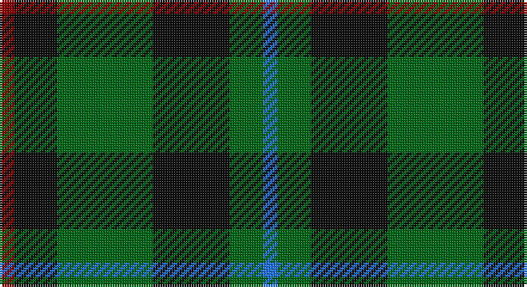

This page is one **sett** — a single exact thread-count. It belongs to the [tartan](/setts/r3k9g20k16g7b3/)
(the same proportion at any scale), whose colour order is pattern [BGKGKR](/stripes/bgkgkr/).

Part of the [Holman](/tartans/holman/) tartan — the named design grouping this sett with its other cloths.

Sourced from tartans-authority.  It is a [6 stripe tartan](/stripes/stripes6/).

Original link http://www.tartansauthority.com/tartan-ferret/display/2646/

## Register references

External register numbers recorded for this tartan.

- Scottish Tartans Authority (ITI): 2646

## Thread count
DR/6 K18 G40 K32 G14 B/6

One full sett is **220 threads**.

## Palette

Palette: <strong>Tartan Register</strong>
<table><thead><tr><th>Colour</th><th>Threads</th><th>Shade</th><th>Base</th><th>OKLCh</th></tr></thead><tbody><tr><td>DR/</td><td style="text-align:right;font-variant-numeric:tabular-nums">6</td><td><code style="background-color:#880000;">#880000</code> <small style="color:#888">#880000</small></td><td>R <code style="background-color:#CC0000;">#CC0000</code></td><td><small style="color:#888">oklch(39.4% 0.162 29.2)</small></td></tr><tr><td>K</td><td style="text-align:right;font-variant-numeric:tabular-nums">18</td><td><code style="background-color:#101010;">#101010</code> <small style="color:#888">#101010</small></td><td>K <code style="background-color:#000000;">#000000</code></td><td><small style="color:#888">oklch(17.3% 0.000 89.9)</small></td></tr><tr><td>G</td><td style="text-align:right;font-variant-numeric:tabular-nums">40</td><td><code style="background-color:#006818;">#006818</code> <small style="color:#888">#006818</small></td><td>G <code style="background-color:#006100;">#006100</code></td><td><small style="color:#888">oklch(45.0% 0.142 145.0)</small></td></tr><tr><td>K</td><td style="text-align:right;font-variant-numeric:tabular-nums">32</td><td><code style="background-color:#101010;">#101010</code> <small style="color:#888">#101010</small></td><td>K <code style="background-color:#000000;">#000000</code></td><td><small style="color:#888">oklch(17.3% 0.000 89.9)</small></td></tr><tr><td>G</td><td style="text-align:right;font-variant-numeric:tabular-nums">14</td><td><code style="background-color:#006818;">#006818</code> <small style="color:#888">#006818</small></td><td>G <code style="background-color:#006100;">#006100</code></td><td><small style="color:#888">oklch(45.0% 0.142 145.0)</small></td></tr><tr><td>B/</td><td style="text-align:right;font-variant-numeric:tabular-nums">6</td><td><code style="background-color:#2474E8;">#2474E8</code> <small style="color:#888">#2474E8</small></td><td>B <code style="background-color:#2A418A;">#2A418A</code></td><td><small style="color:#888">oklch(57.8% 0.192 258.7)</small></td></tr></tbody></table>

# Sample pattern

## Compared to the master

This cloth is one sett of its design; the master sett (the exemplar the design is anchored on) is below for comparison.

<figure style="margin:0"><figcaption style="color:#888;font-size:smaller">this sett</figcaption></figure>
<figure style="margin:0"><figcaption style="color:#888;font-size:smaller"><a href="/setts/g7k12g12k9r3k9g20k16g7b3/">master sett →</a></figcaption></figure>

## Nearest tartans

The nearest existing variants by ΔTartan distance, with this tartan at the top so the swatches line up against it.

ΔTartan

Tartan

Sett

—

<a href="/ttd/edit/#slug=r3k9g20k16g7b3~x2">Holman (Personal)</a> <a class="nn-out" href="/variants/s6/r3k9g20k16g7b3~x2/" title="open its dictionary page">↗</a>

0.96

<a href="/ttd/edit/#slug=dg6r2dg13k6w2k16r3~x2&amp;base=r3k9g20k16g7b3~x2">Sinclair Hunting</a> <a class="nn-out" href="/variants/s7/dg6r2dg13k6w2k16r3~x2/" title="open its dictionary page">↗</a>

0.96

<a href="/ttd/edit/#slug=db5dg8k1ly2k1dg8db4~x4&amp;base=r3k9g20k16g7b3~x2">Salvation Army Htg (Corporate)</a> <a class="nn-out" href="/variants/s7/db5dg8k1ly2k1dg8db4~x4/" title="open its dictionary page">↗</a>

1.00

<a href="/ttd/edit/#slug=g9lb1g6k7db7k1~x4&amp;base=r3k9g20k16g7b3~x2">Menteith</a> <a class="nn-out" href="/variants/s6/g9lb1g6k7db7k1~x4/" title="open its dictionary page">↗</a>

1.02

<a href="/ttd/edit/#slug=g3db1g8db7k3ly1~x2&amp;base=r3k9g20k16g7b3~x2">Trafalgar (Fashion)</a> <a class="nn-out" href="/variants/s6/g3db1g8db7k3ly1~x2/" title="open its dictionary page">↗</a>

1.03

<a href="/ttd/edit/#slug=r3dg10r3dg14db16dg3ly2~x2&amp;base=r3k9g20k16g7b3~x2">Cameron Hunting</a> <a class="nn-out" href="/variants/s7/r3dg10r3dg14db16dg3ly2~x2/" title="open its dictionary page">↗</a>

1.05

<a href="/ttd/edit/#slug=dg2n8dg2k3dg12r2~x2&amp;base=r3k9g20k16g7b3~x2">Wcwm 1045</a> <a class="nn-out" href="/variants/s6/dg2n8dg2k3dg12r2~x2/" title="open its dictionary page">↗</a>

1.11

<a href="/ttd/edit/#slug=r3dg10r3dg14db16dg3ly2&amp;base=r3k9g20k16g7b3~x2">Cameron Hunting</a> <a class="nn-out" href="/variants/s7/r3dg10r3dg14db16dg3ly2/" title="open its dictionary page">↗</a>

1.15

<a href="/ttd/edit/#slug=g5k15g5k15g19r2g13lb4~x2&amp;base=r3k9g20k16g7b3~x2">Strath Hallidale (Fashion)</a> <a class="nn-out" href="/variants/s8/g5k15g5k15g19r2g13lb4~x2/" title="open its dictionary page">↗</a>

1.18

<a href="/ttd/edit/#slug=k2dg9t1k6b4dg2~x2&amp;base=r3k9g20k16g7b3~x2">Unidentified #28</a> <a class="nn-out" href="/variants/s6/k2dg9t1k6b4dg2~x2/" title="open its dictionary page">↗</a>

1.19

<a href="/ttd/edit/#slug=g18t2g4k14dp12k3~x2&amp;base=r3k9g20k16g7b3~x2">Coburg</a> <a class="nn-out" href="/variants/s6/g18t2g4k14dp12k3~x2/" title="open its dictionary page">↗</a>

## Neighbour map

Every grey dot is one of 14360 variants placed by the first two principal components of the ΔTartan feature space (44% of its variance). Red is this tartan; blue dots are its nearest — click one to open its page.

<svg viewBox="0 0 640 380" role="img" style="max-width:100%;height:auto;border:1px solid #e0e0e0;border-radius:4px;display:block" xmlns="http://www.w3.org/2000/svg"><image href="/nn/cloud.v1.png" width="640" height="380"/><a href="/variants/s7/dg6r2dg13k6w2k16r3~x2/"><circle cx="253.8" cy="239.3" r="4" fill="#3465a4"><title>Sinclair Hunting</title></circle></a><a href="/variants/s7/db5dg8k1ly2k1dg8db4~x4/"><circle cx="295.3" cy="252.9" r="4" fill="#3465a4"><title>Salvation Army Htg (Corporate)</title></circle></a><a href="/variants/s6/g9lb1g6k7db7k1~x4/"><circle cx="232.8" cy="255.8" r="4" fill="#3465a4"><title>Menteith</title></circle></a><a href="/variants/s6/g3db1g8db7k3ly1~x2/"><circle cx="248.7" cy="248.4" r="4" fill="#3465a4"><title>Trafalgar (Fashion)</title></circle></a><a href="/variants/s7/r3dg10r3dg14db16dg3ly2~x2/"><circle cx="285.2" cy="242.4" r="4" fill="#3465a4"><title>Cameron Hunting</title></circle></a><a href="/variants/s6/dg2n8dg2k3dg12r2~x2/"><circle cx="294.2" cy="260.3" r="4" fill="#3465a4"><title>Wcwm 1045</title></circle></a><a href="/variants/s7/r3dg10r3dg14db16dg3ly2/"><circle cx="263.4" cy="230.7" r="4" fill="#3465a4"><title>Cameron Hunting</title></circle></a><a href="/variants/s8/g5k15g5k15g19r2g13lb4~x2/"><circle cx="279.2" cy="239.1" r="4" fill="#3465a4"><title>Strath Hallidale (Fashion)</title></circle></a><a href="/variants/s6/k2dg9t1k6b4dg2~x2/"><circle cx="229.2" cy="243.7" r="4" fill="#3465a4"><title>Unidentified #28</title></circle></a><a href="/variants/s6/g18t2g4k14dp12k3~x2/"><circle cx="229.4" cy="249.4" r="4" fill="#3465a4"><title>Coburg</title></circle></a><circle cx="252.1" cy="264.1" r="5" fill="#c00000"/></svg>

ID: /variants/s6/r3k9g20k16g7b3~x2/
