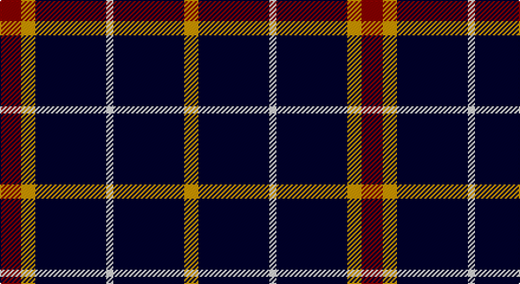

This page is one **sett** — a single exact thread-count. It belongs to the [tartan](/setts/r3lo2k10w1/)
(the same proportion at any scale), whose colour order is pattern [RYKWKY](/stripes/rykwky/).

Sourced from register-of-tartans.  It is a [6 stripe tartan](/stripes/stripes6/).

Original link https://www.tartanregister.gov.uk/tartanDetails.aspx?ref=3889

## Register references

External register numbers recorded for this tartan.

- Scottish Register of Tartans: [3889](https://www.tartanregister.gov.uk/tartanDetails.aspx?ref=3889)
- Scottish Tartans Authority (ITI): 5306

## Thread count
DR/18 DY12 DBa60 LN6 DBa60 DY/12

One full sett is **306 threads**.

## Palette

Palette: <strong>Tartan Register</strong> <small style="color:#888">(4 of 6 colours)</small>
<table><thead><tr><th>Colour</th><th>Threads</th><th>Shade</th><th>Base</th><th>OKLCh</th></tr></thead><tbody><tr><td>DR/</td><td style="text-align:right;font-variant-numeric:tabular-nums">18</td><td><code style="background-color:#880000;">#880000</code> <small style="color:#888">#880000</small></td><td>R <code style="background-color:#CC0000;">#CC0000</code></td><td><small style="color:#888">oklch(39.4% 0.162 29.2)</small></td></tr><tr><td>DY</td><td style="text-align:right;font-variant-numeric:tabular-nums">12</td><td><code style="background-color:#D09800;">#D09800</code> <small style="color:#888">#D09800</small></td><td>Y <code style="background-color:#F2BF00;">#F2BF00</code></td><td><small style="color:#888">oklch(71.4% 0.147 82.1)</small></td></tr><tr><td>DBa</td><td style="text-align:right;font-variant-numeric:tabular-nums">60</td><td><code style="background-color:#00002C;">#00002C</code> <small style="color:#888">#00002C</small></td><td>K <code style="background-color:#000000;">#000000</code></td><td><small style="color:#888">oklch(13.2% 0.092 264.1)</small></td></tr><tr><td>LN</td><td style="text-align:right;font-variant-numeric:tabular-nums">6</td><td><code style="background-color:#E0E0E0;">#E0E0E0</code> <small style="color:#888">#E0E0E0</small></td><td>W <code style="background-color:#F7F7F7;">#F7F7F7</code></td><td><small style="color:#888">oklch(90.7% 0.000 89.9)</small></td></tr><tr><td>DBa</td><td style="text-align:right;font-variant-numeric:tabular-nums">60</td><td><code style="background-color:#00002C;">#00002C</code> <small style="color:#888">#00002C</small></td><td>K <code style="background-color:#000000;">#000000</code></td><td><small style="color:#888">oklch(13.2% 0.092 264.1)</small></td></tr><tr><td>DY/</td><td style="text-align:right;font-variant-numeric:tabular-nums">12</td><td><code style="background-color:#D09800;">#D09800</code> <small style="color:#888">#D09800</small></td><td>Y <code style="background-color:#F2BF00;">#F2BF00</code></td><td><small style="color:#888">oklch(71.4% 0.147 82.1)</small></td></tr></tbody></table>

# Sample pattern

## Nearest tartans

The nearest existing variants by ΔTartan distance, with this tartan at the top so the swatches line up against it.

ΔTartan

Tartan

Sett

—

<a href="/ttd/edit/#slug=r3lo2k10w1~x6">St. Eloi</a> <a class="nn-out" href="/variants/s6/r3lo2k10w1~x6/" title="open its dictionary page">↗</a>

0.95

<a href="/ttd/edit/#slug=k8t3k32b14w3k25t3~x2&amp;base=r3lo2k10w1~x6">Cowe (Personal)</a> <a class="nn-out" href="/variants/s7/k8t3k32b14w3k25t3~x2/" title="open its dictionary page">↗</a>

1.15

<a href="/ttd/edit/#slug=k17r6k2w6k17lo2~x2&amp;base=r3lo2k10w1~x6">Black 1990 (Name)</a> <a class="nn-out" href="/variants/s6/k17r6k2w6k17lo2~x2/" title="open its dictionary page">↗</a>

1.18

<a href="/ttd/edit/#slug=k17r6k2lb6k17lo2~x2&amp;base=r3lo2k10w1~x6">Black (symmetrical)</a> <a class="nn-out" href="/variants/s6/k17r6k2lb6k17lo2~x2/" title="open its dictionary page">↗</a>

1.29

<a href="/ttd/edit/#slug=k21lb2k4lb4do2lb4k13g2~x4&amp;base=r3lo2k10w1~x6">Anzac (Fashion)</a> <a class="nn-out" href="/variants/s8/k21lb2k4lb4do2lb4k13g2~x4/" title="open its dictionary page">↗</a>

1.33

<a href="/ttd/edit/#slug=k16b2k8r3lr3r3k8~x2&amp;base=r3lo2k10w1~x6">Benson (New England)</a> <a class="nn-out" href="/variants/s7/k16b2k8r3lr3r3k8~x2/" title="open its dictionary page">↗</a>

1.39

<a href="/ttd/edit/#slug=lr3k3lr3k10r1~x6&amp;base=r3lo2k10w1~x6">Burberry Blue</a> <a class="nn-out" href="/variants/s5/lr3k3lr3k10r1~x6/" title="open its dictionary page">↗</a>

1.44

<a href="/ttd/edit/#slug=k62db15w6ly4~x2&amp;base=r3lo2k10w1~x6">C-Tec N.I. Ltd</a> <a class="nn-out" href="/variants/s4/k62db15w6ly4~x2/" title="open its dictionary page">↗</a>

1.47

<a href="/ttd/edit/#slug=k18t9k18lb2k2lb2k18lr9k18lb2&amp;base=r3lo2k10w1~x6">London Fog Black 2 (fashion)</a> <a class="nn-out" href="/variants/s10/k18t9k18lb2k2lb2k18lr9k18lb2/" title="open its dictionary page">↗</a>

1.50

<a href="/ttd/edit/#slug=r3lo2k10w1~x6">St. Eloi (Corporate)</a> <a class="nn-out" href="/variants/s4/r3lo2k10w1~x6/" title="open its dictionary page">↗</a>

1.52

<a href="/ttd/edit/#slug=db24w4db24lo4r5k4~x2&amp;base=r3lo2k10w1~x6">de Grussa (Personal)</a> <a class="nn-out" href="/variants/s6/db24w4db24lo4r5k4~x2/" title="open its dictionary page">↗</a>

## Neighbour map

Every grey dot is one of 14360 variants placed by the first two principal components of the ΔTartan feature space (44% of its variance). Red is this tartan; blue dots are its nearest — click one to open its page.

<svg viewBox="0 0 640 380" role="img" style="max-width:100%;height:auto;border:1px solid #e0e0e0;border-radius:4px;display:block" xmlns="http://www.w3.org/2000/svg"><image href="/nn/cloud.v1.png" width="640" height="380"/><a href="/variants/s7/k8t3k32b14w3k25t3~x2/"><circle cx="411.9" cy="213.6" r="4" fill="#3465a4"><title>Cowe (Personal)</title></circle></a><a href="/variants/s6/k17r6k2w6k17lo2~x2/"><circle cx="371.2" cy="223.5" r="4" fill="#3465a4"><title>Black 1990 (Name)</title></circle></a><a href="/variants/s6/k17r6k2lb6k17lo2~x2/"><circle cx="380.7" cy="228.4" r="4" fill="#3465a4"><title>Black (symmetrical)</title></circle></a><a href="/variants/s8/k21lb2k4lb4do2lb4k13g2~x4/"><circle cx="402.0" cy="189.4" r="4" fill="#3465a4"><title>Anzac (Fashion)</title></circle></a><a href="/variants/s7/k16b2k8r3lr3r3k8~x2/"><circle cx="402.8" cy="229.1" r="4" fill="#3465a4"><title>Benson (New England)</title></circle></a><a href="/variants/s5/lr3k3lr3k10r1~x6/"><circle cx="351.1" cy="237.5" r="4" fill="#3465a4"><title>Burberry Blue</title></circle></a><a href="/variants/s4/k62db15w6ly4~x2/"><circle cx="423.8" cy="200.2" r="4" fill="#3465a4"><title>C-Tec N.I. Ltd</title></circle></a><a href="/variants/s10/k18t9k18lb2k2lb2k18lr9k18lb2/"><circle cx="383.0" cy="207.3" r="4" fill="#3465a4"><title>London Fog Black 2 (fashion)</title></circle></a><a href="/variants/s4/r3lo2k10w1~x6/"><circle cx="321.9" cy="219.5" r="4" fill="#3465a4"><title>St. Eloi (Corporate)</title></circle></a><a href="/variants/s6/db24w4db24lo4r5k4~x2/"><circle cx="376.5" cy="221.6" r="4" fill="#3465a4"><title>de Grussa (Personal)</title></circle></a><circle cx="376.0" cy="216.7" r="5" fill="#c00000"/></svg>

ID: /variants/s6/r3lo2k10w1~x6/
