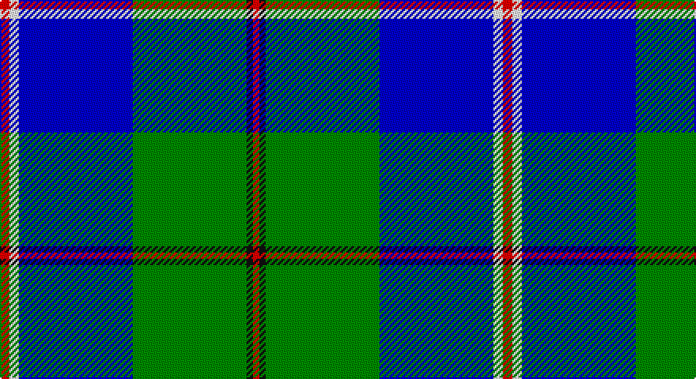

This page is one **sett** — a single exact thread-count. It belongs to the [tartan](/setts/r3w3db36g36k2r2/)
(the same proportion at any scale), whose colour order is pattern [RKGBWR](/stripes/rkgbwr/).

Sourced from register-of-tartans.  It is a [6 stripe tartan](/stripes/stripes6/).

Original link https://www.tartanregister.gov.uk/tartanDetails.aspx?ref=10309

## Also known as

This cloth is also recorded under:

- Militello, Massimiliano

2 attestations — the source records this cloth was collapsed from (oldest owns this page)

<ul>
<li>02/11/2010 — Militello (Palermo) Dress (Personal) (register-of-tartans, <a href="https://www.tartanregister.gov.uk/tartanDetails.aspx?ref=10309">record</a>)</li>
<li>2nd Nov.2010 — Militello, Massimiliano (Personal) (tartans-authority, <a href="http://www.tartansauthority.com/tartan-ferret/display/10309/">record</a>)</li>
</ul>

## Register references

External register numbers recorded for this tartan.

- Scottish Register of Tartans: [10309](https://www.tartanregister.gov.uk/tartanDetails?ref=10309)
- Scottish Tartans Authority (ITI): 10309

## Thread count
R/6 W6 B72 G72 K4 R/4

One full sett is **318 threads**.

## Palette

Palette: <strong>Tartan Register</strong>
<table><thead><tr><th>Colour</th><th>Threads</th><th>Shade</th><th>Base</th><th>OKLCh</th></tr></thead><tbody><tr><td>R/</td><td style="text-align:right;font-variant-numeric:tabular-nums">6</td><td><code style="background-color:#FF0000;">#FF0000</code> <small style="color:#888">#FF0000</small></td><td>R <code style="background-color:#CC0000;">#CC0000</code></td><td><small style="color:#888">oklch(62.8% 0.258 29.2)</small></td></tr><tr><td>W</td><td style="text-align:right;font-variant-numeric:tabular-nums">6</td><td><code style="background-color:#FFFFFF;">#FFFFFF</code> <small style="color:#888">#FFFFFF</small></td><td>W <code style="background-color:#F7F7F7;">#F7F7F7</code></td><td><small style="color:#888">oklch(100.0% 0.000 89.9)</small></td></tr><tr><td>B</td><td style="text-align:right;font-variant-numeric:tabular-nums">72</td><td><code style="background-color:#0000CD;">#0000CD</code> <small style="color:#888">#0000CD</small></td><td>B <code style="background-color:#2A418A;">#2A418A</code></td><td><small style="color:#888">oklch(38.3% 0.266 264.1)</small></td></tr><tr><td>G</td><td style="text-align:right;font-variant-numeric:tabular-nums">72</td><td><code style="background-color:#008B00;">#008B00</code> <small style="color:#888">#008B00</small></td><td>G <code style="background-color:#006100;">#006100</code></td><td><small style="color:#888">oklch(55.2% 0.188 142.5)</small></td></tr><tr><td>K</td><td style="text-align:right;font-variant-numeric:tabular-nums">4</td><td><code style="background-color:#101010;">#101010</code> <small style="color:#888">#101010</small></td><td>K <code style="background-color:#000000;">#000000</code></td><td><small style="color:#888">oklch(17.3% 0.000 89.9)</small></td></tr><tr><td>R/</td><td style="text-align:right;font-variant-numeric:tabular-nums">4</td><td><code style="background-color:#FF0000;">#FF0000</code> <small style="color:#888">#FF0000</small></td><td>R <code style="background-color:#CC0000;">#CC0000</code></td><td><small style="color:#888">oklch(62.8% 0.258 29.2)</small></td></tr></tbody></table>

# Sample pattern

## Nearest tartans

The nearest existing variants by ΔTartan distance, with this tartan at the top so the swatches line up against it.

ΔTartan

Tartan

Sett

—

<a href="/ttd/edit/#slug=r3w3db36g36k2r2~x2">Militello (Palermo) Dress (Personal)</a> <a class="nn-out" href="/variants/s6/r3w3db36g36k2r2~x2/" title="open its dictionary page">↗</a>

1.20

<a href="/ttd/edit/#slug=db3g4db20g24k2lb3r1~x2&amp;base=r3w3db36g36k2r2~x2">Nowell/Noel (Name)</a> <a class="nn-out" href="/variants/s7/db3g4db20g24k2lb3r1~x2/" title="open its dictionary page">↗</a>

1.23

<a href="/ttd/edit/#slug=r2w7b30dg36ly2~x2&amp;base=r3w3db36g36k2r2~x2">Centennial-King George Lodge No.171</a> <a class="nn-out" href="/variants/s5/r2w7b30dg36ly2~x2/" title="open its dictionary page">↗</a>

1.24

<a href="/ttd/edit/#slug=w15ly2k5lb3b40k10&amp;base=r3w3db36g36k2r2~x2">Herriot New Zealand</a> <a class="nn-out" href="/variants/s6/w15ly2k5lb3b40k10/" title="open its dictionary page">↗</a>

1.26

<a href="/variants/s6/k4t24k2g13t2ki3~x4/">Vance (Family Association) Corporate Family Tartan</a>

1.27

<a href="/ttd/edit/#slug=w3b12db1g15m3w1~x4&amp;base=r3w3db36g36k2r2~x2">Eeraerts, Laurent (Personal)</a> <a class="nn-out" href="/variants/s6/w3b12db1g15m3w1~x4/" title="open its dictionary page">↗</a>

1.33

<a href="/ttd/edit/#slug=g2db14lg6lr1g1lr6r1~x4&amp;base=r3w3db36g36k2r2~x2">Loch Ness in Scotland</a> <a class="nn-out" href="/variants/s7/g2db14lg6lr1g1lr6r1~x4/" title="open its dictionary page">↗</a>

1.38

<a href="/ttd/edit/#slug=b20r1w3db1w2db8g3w1~x4&amp;base=r3w3db36g36k2r2~x2">Kruenaegel and Schropp (Name)</a> <a class="nn-out" href="/variants/s8/b20r1w3db1w2db8g3w1~x4/" title="open its dictionary page">↗</a>

1.40

<a href="/ttd/edit/#slug=g4ly2g24w12db26r1~x2&amp;base=r3w3db36g36k2r2~x2">Vancouver Centennial</a> <a class="nn-out" href="/variants/s6/g4ly2g24w12db26r1~x2/" title="open its dictionary page">↗</a>

1.43

<a href="/ttd/edit/#slug=k4ly1g2ly1g32lt1g3db32lt3~x2&amp;base=r3w3db36g36k2r2~x2">McClurg</a> <a class="nn-out" href="/variants/s9/k4ly1g2ly1g32lt1g3db32lt3~x2/" title="open its dictionary page">↗</a>

1.45

<a href="/ttd/edit/#slug=dt42t2w2t2dt5k12w32db4~x2&amp;base=r3w3db36g36k2r2~x2">Comrie, Navy Blue (Dance)</a> <a class="nn-out" href="/variants/s8/dt42t2w2t2dt5k12w32db4~x2/" title="open its dictionary page">↗</a>

## Neighbour map

Every grey dot is one of 14360 variants placed by the first two principal components of the ΔTartan feature space (44% of its variance). Red is this tartan; blue dots are its nearest — click one to open its page.

<svg viewBox="0 0 640 380" role="img" style="max-width:100%;height:auto;border:1px solid #e0e0e0;border-radius:4px;display:block" xmlns="http://www.w3.org/2000/svg"><image href="/nn/cloud.v1.png" width="640" height="380"/><a href="/variants/s7/db3g4db20g24k2lb3r1~x2/"><circle cx="283.3" cy="146.8" r="4" fill="#3465a4"><title>Nowell/Noel (Name)</title></circle></a><a href="/variants/s5/r2w7b30dg36ly2~x2/"><circle cx="255.3" cy="174.2" r="4" fill="#3465a4"><title>Centennial-King George Lodge No.171</title></circle></a><a href="/variants/s6/w15ly2k5lb3b40k10/"><circle cx="251.6" cy="139.1" r="4" fill="#3465a4"><title>Herriot New Zealand</title></circle></a><a href="/variants/s6/k4t24k2g13t2ki3~x4/"><circle cx="260.6" cy="179.0" r="4" fill="#3465a4"><title>Vance (Family Association) Corporate Family Tartan</title></circle></a><a href="/variants/s6/w3b12db1g15m3w1~x4/"><circle cx="204.5" cy="165.5" r="4" fill="#3465a4"><title>Eeraerts, Laurent (Personal)</title></circle></a><a href="/variants/s7/g2db14lg6lr1g1lr6r1~x4/"><circle cx="199.8" cy="157.5" r="4" fill="#3465a4"><title>Loch Ness in Scotland</title></circle></a><a href="/variants/s8/b20r1w3db1w2db8g3w1~x4/"><circle cx="264.1" cy="123.8" r="4" fill="#3465a4"><title>Kruenaegel and Schropp (Name)</title></circle></a><a href="/variants/s6/g4ly2g24w12db26r1~x2/"><circle cx="193.7" cy="142.4" r="4" fill="#3465a4"><title>Vancouver Centennial</title></circle></a><a href="/variants/s9/k4ly1g2ly1g32lt1g3db32lt3~x2/"><circle cx="275.4" cy="99.8" r="4" fill="#3465a4"><title>McClurg</title></circle></a><a href="/variants/s8/dt42t2w2t2dt5k12w32db4~x2/"><circle cx="229.9" cy="116.0" r="4" fill="#3465a4"><title>Comrie, Navy Blue (Dance)</title></circle></a><circle cx="243.6" cy="148.9" r="5" fill="#c00000"/></svg>

ID: /variants/s6/r3w3db36g36k2r2~x2/
