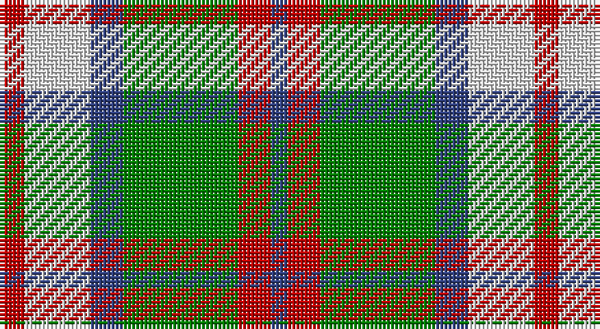

This page is one **sett** — a single exact thread-count. It belongs to the [tartan](/setts/r3w8db4g14r4db2/)
(the same proportion at any scale), whose colour order is pattern [BRGBWR](/stripes/brgbwr/).

Sourced from weddslist.  It is a [6 stripe tartan](/stripes/stripes6/).

Original link http://www.weddslist.com/cgi-bin/tartans/pg.pl?source=sts

## Provenance

Earliest known date: pre 2003 From an old pattern book in possesion of Messrs Scott Adie of London.

2 attestations — the source records this cloth was collapsed from (oldest owns this page)

<ul>
<li>undated — MacIntosh, dress (weddslist, <a href="http://www.weddslist.com/cgi-bin/tartans/pg.pl?source=sts">record</a>)</li>
<li>undated — MacIntosh Dress Clan Tartan (house-of-tartan, <a href="http://www.house-of-tartan.scotland.net/house/TartanViewjs.asp?colr=Def&tnam=538">record</a>)</li>
</ul>

## Thread count
R/6 LN16 B8 G28 R8 B/4

One full sett is **130 threads**.

## Palette

Palette: <strong>Tartan Dictionary</strong> <small style="color:#888">(1 of 4 colours)</small>
<table><thead><tr><th>Colour</th><th>Threads</th><th>Shade</th><th>Base</th><th>OKLCh</th></tr></thead><tbody><tr><td>R/</td><td style="text-align:right;font-variant-numeric:tabular-nums">6</td><td><code style="background-color:#C00000;">#C00000</code> <small style="color:#888">#C00000</small></td><td>R <code style="background-color:#CC0000;">#CC0000</code></td><td><small style="color:#888">oklch(50.7% 0.208 29.2)</small></td></tr><tr><td>LN</td><td style="text-align:right;font-variant-numeric:tabular-nums">16</td><td><code style="background-color:#E0E0E0;">#E0E0E0</code> <small style="color:#888">#E0E0E0</small></td><td>W <code style="background-color:#F7F7F7;">#F7F7F7</code></td><td><small style="color:#888">oklch(90.7% 0.000 89.9)</small></td></tr><tr><td>B</td><td style="text-align:right;font-variant-numeric:tabular-nums">8</td><td><code style="background-color:#304080;">#304080</code> <small style="color:#888">#304080</small></td><td>B <code style="background-color:#2A418A;">#2A418A</code></td><td><small style="color:#888">oklch(39.4% 0.109 270.2)</small></td></tr><tr><td>G</td><td style="text-align:right;font-variant-numeric:tabular-nums">28</td><td><code style="background-color:#008000;">#008000</code> <small style="color:#888">#008000</small></td><td>G <code style="background-color:#006100;">#006100</code></td><td><small style="color:#888">oklch(52.0% 0.177 142.5)</small></td></tr><tr><td>R</td><td style="text-align:right;font-variant-numeric:tabular-nums">8</td><td><code style="background-color:#C00000;">#C00000</code> <small style="color:#888">#C00000</small></td><td>R <code style="background-color:#CC0000;">#CC0000</code></td><td><small style="color:#888">oklch(50.7% 0.208 29.2)</small></td></tr><tr><td>B/</td><td style="text-align:right;font-variant-numeric:tabular-nums">4</td><td><code style="background-color:#304080;">#304080</code> <small style="color:#888">#304080</small></td><td>B <code style="background-color:#2A418A;">#2A418A</code></td><td><small style="color:#888">oklch(39.4% 0.109 270.2)</small></td></tr></tbody></table>

# Sample pattern

## Nearest tartans

The nearest existing variants by ΔTartan distance, with this tartan at the top so the swatches line up against it.

ΔTartan

Tartan

Sett

—

<a href="/ttd/edit/#slug=r3w8db4g14r4db2~x2">MacIntosh, dress</a> <a class="nn-out" href="/variants/s6/r3w8db4g14r4db2~x2/" title="open its dictionary page">↗</a>

0.75

<a href="/ttd/edit/#slug=r3w8db4dg14r4db2~x4&amp;base=r3w8db4g14r4db2~x2">MacKintosh Dress (Scott Adie)</a> <a class="nn-out" href="/variants/s6/r3w8db4dg14r4db2~x4/" title="open its dictionary page">↗</a>

0.99

<a href="/ttd/edit/#slug=k3g25o3k15lr24g3~x2&amp;base=r3w8db4g14r4db2~x2">Un-named (D C Dalgliesh) #3</a> <a class="nn-out" href="/variants/s6/k3g25o3k15lr24g3~x2/" title="open its dictionary page">↗</a>

1.02

<a href="/ttd/edit/#slug=ly5k5g17k6o24k6ly3~x2&amp;base=r3w8db4g14r4db2~x2">Cape Breton District Tartan</a> <a class="nn-out" href="/variants/s7/ly5k5g17k6o24k6ly3~x2/" title="open its dictionary page">↗</a>

1.03

<a href="/ttd/edit/#slug=k3w25g16w3n25w3~x2&amp;base=r3w8db4g14r4db2~x2">Birnham, Blue (Dance)</a> <a class="nn-out" href="/variants/s6/k3w25g16w3n25w3~x2/" title="open its dictionary page">↗</a>

1.07

<a href="/variants/s8/g6ly1r1t2r2~x4/">Wilson's No.179</a>

1.10

<a href="/ttd/edit/#slug=dg4g3dg24w15lo21gi3lo4~x2&amp;base=r3w8db4g14r4db2~x2">Bannockbane Dark Green</a> <a class="nn-out" href="/variants/s7/dg4g3dg24w15lo21gi3lo4~x2/" title="open its dictionary page">↗</a>

1.16

<a href="/ttd/edit/#slug=r2lo20k5w10k10w2~x2&amp;base=r3w8db4g14r4db2~x2">Thompson Camel Clan Tartan</a> <a class="nn-out" href="/variants/s6/r2lo20k5w10k10w2~x2/" title="open its dictionary page">↗</a>

1.19

<a href="/ttd/edit/#slug=r6k14r6dg14w27k4&amp;base=r3w8db4g14r4db2~x2">Fraser Dress</a> <a class="nn-out" href="/variants/s6/r6k14r6dg14w27k4/" title="open its dictionary page">↗</a>

1.20

<a href="/ttd/edit/#slug=r4lo30k6w13k13w3~x2&amp;base=r3w8db4g14r4db2~x2">Thomson Camel</a> <a class="nn-out" href="/variants/s6/r4lo30k6w13k13w3~x2/" title="open its dictionary page">↗</a>

1.20

<a href="/ttd/edit/#slug=dy17g5db2w12db2ly4g7~x4&amp;base=r3w8db4g14r4db2~x2">Northern Ontario</a> <a class="nn-out" href="/variants/s7/dy17g5db2w12db2ly4g7~x4/" title="open its dictionary page">↗</a>

## Neighbour map

Every grey dot is one of 14360 variants placed by the first two principal components of the ΔTartan feature space (44% of its variance). Red is this tartan; blue dots are its nearest — click one to open its page.

<svg viewBox="0 0 640 380" role="img" style="max-width:100%;height:auto;border:1px solid #e0e0e0;border-radius:4px;display:block" xmlns="http://www.w3.org/2000/svg"><image href="/nn/cloud.v1.png" width="640" height="380"/><a href="/variants/s6/r3w8db4dg14r4db2~x4/"><circle cx="150.0" cy="215.1" r="4" fill="#3465a4"><title>MacKintosh Dress (Scott Adie)</title></circle></a><a href="/variants/s6/k3g25o3k15lr24g3~x2/"><circle cx="179.5" cy="206.9" r="4" fill="#3465a4"><title>Un-named (D C Dalgliesh) #3</title></circle></a><a href="/variants/s7/ly5k5g17k6o24k6ly3~x2/"><circle cx="152.1" cy="208.8" r="4" fill="#3465a4"><title>Cape Breton District Tartan</title></circle></a><a href="/variants/s6/k3w25g16w3n25w3~x2/"><circle cx="179.9" cy="200.3" r="4" fill="#3465a4"><title>Birnham, Blue (Dance)</title></circle></a><a href="/variants/s8/g6ly1r1t2r2~x4/"><circle cx="161.7" cy="213.9" r="4" fill="#3465a4"><title>Wilson's No.179</title></circle></a><a href="/variants/s7/dg4g3dg24w15lo21gi3lo4~x2/"><circle cx="144.3" cy="185.4" r="4" fill="#3465a4"><title>Bannockbane Dark Green</title></circle></a><a href="/variants/s6/r2lo20k5w10k10w2~x2/"><circle cx="175.6" cy="191.0" r="4" fill="#3465a4"><title>Thompson Camel Clan Tartan</title></circle></a><a href="/variants/s6/r6k14r6dg14w27k4/"><circle cx="119.7" cy="209.0" r="4" fill="#3465a4"><title>Fraser Dress</title></circle></a><a href="/variants/s6/r4lo30k6w13k13w3~x2/"><circle cx="189.7" cy="187.9" r="4" fill="#3465a4"><title>Thomson Camel</title></circle></a><a href="/variants/s7/dy17g5db2w12db2ly4g7~x4/"><circle cx="102.8" cy="176.6" r="4" fill="#3465a4"><title>Northern Ontario</title></circle></a><circle cx="150.5" cy="217.2" r="5" fill="#c00000"/></svg>

ID: /variants/s6/r3w8db4g14r4db2~x2/
