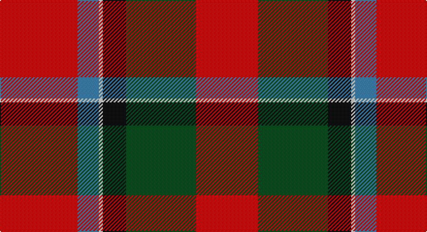

This page is one **sett** — a single exact thread-count. It belongs to the [tartan](/setts/r40t11w2k12dg36r32/)
(the same proportion at any scale), whose colour order is pattern [RBWKGR](/stripes/rbwkgr/).

Sourced from register-of-tartans.  It is a [6 stripe tartan](/stripes/stripes6/).

Original link https://www.tartanregister.gov.uk/tartanDetails.aspx?ref=4117

## Register references

External register numbers recorded for this tartan.

- Scottish Register of Tartans: [4117](https://www.tartanregister.gov.uk/tartanDetails.aspx?ref=4117)
- Scottish Tartans World Register: 1439

## Thread count
R/80 B22 LN4 K24 G72 R/64

One full sett is **388 threads**.

## Palette

Palette: <strong>Tartan Register</strong>
<table><thead><tr><th>Colour</th><th>Threads</th><th>Shade</th><th>Base</th><th>OKLCh</th></tr></thead><tbody><tr><td>R/</td><td style="text-align:right;font-variant-numeric:tabular-nums">80</td><td><code style="background-color:#DC0000;">#DC0000</code> <small style="color:#888">#DC0000</small></td><td>R <code style="background-color:#CC0000;">#CC0000</code></td><td><small style="color:#888">oklch(56.2% 0.230 29.2)</small></td></tr><tr><td>B</td><td style="text-align:right;font-variant-numeric:tabular-nums">22</td><td><code style="background-color:#3C82AF;">#3C82AF</code> <small style="color:#888">#3C82AF</small></td><td>B <code style="background-color:#2A418A;">#2A418A</code></td><td><small style="color:#888">oklch(58.1% 0.099 239.8)</small></td></tr><tr><td>LN</td><td style="text-align:right;font-variant-numeric:tabular-nums">4</td><td><code style="background-color:#E0E0E0;">#E0E0E0</code> <small style="color:#888">#E0E0E0</small></td><td>W <code style="background-color:#F7F7F7;">#F7F7F7</code></td><td><small style="color:#888">oklch(90.7% 0.000 89.9)</small></td></tr><tr><td>K</td><td style="text-align:right;font-variant-numeric:tabular-nums">24</td><td><code style="background-color:#101010;">#101010</code> <small style="color:#888">#101010</small></td><td>K <code style="background-color:#000000;">#000000</code></td><td><small style="color:#888">oklch(17.3% 0.000 89.9)</small></td></tr><tr><td>G</td><td style="text-align:right;font-variant-numeric:tabular-nums">72</td><td><code style="background-color:#005020;">#005020</code> <small style="color:#888">#005020</small></td><td>G <code style="background-color:#006100;">#006100</code></td><td><small style="color:#888">oklch(37.7% 0.105 149.6)</small></td></tr><tr><td>R/</td><td style="text-align:right;font-variant-numeric:tabular-nums">64</td><td><code style="background-color:#DC0000;">#DC0000</code> <small style="color:#888">#DC0000</small></td><td>R <code style="background-color:#CC0000;">#CC0000</code></td><td><small style="color:#888">oklch(56.2% 0.230 29.2)</small></td></tr></tbody></table>

# Sample pattern

## Nearest tartans

The nearest existing variants by ΔTartan distance, with this tartan at the top so the swatches line up against it.

ΔTartan

Tartan

Sett

—

<a href="/ttd/edit/#slug=r40t11w2k12dg36r32~x2">Thompson/Thomson/MacTavish (Mackinlay)</a> <a class="nn-out" href="/variants/s6/r40t11w2k12dg36r32~x2/" title="open its dictionary page">↗</a>

0.57

<a href="/ttd/edit/#slug=r40t11w2k12g36r32~x2&amp;base=r40t11w2k12dg36r32~x2">Caithness (1848) (District?)</a> <a class="nn-out" href="/variants/s6/r40t11w2k12g36r32~x2/" title="open its dictionary page">↗</a>

0.75

<a href="/ttd/edit/#slug=r52b16k16g22r16lo3r16~x2&amp;base=r40t11w2k12dg36r32~x2">Sturrock, Blue/Black (Clan)</a> <a class="nn-out" href="/variants/s7/r52b16k16g22r16lo3r16~x2/" title="open its dictionary page">↗</a>

0.83

<a href="/ttd/edit/#slug=r52db16k16g22r16ly3r16&amp;base=r40t11w2k12dg36r32~x2">Sturrock</a> <a class="nn-out" href="/variants/s7/r52db16k16g22r16ly3r16/" title="open its dictionary page">↗</a>

1.09

<a href="/ttd/edit/#slug=r96db16dg34dgi48r18k6r9&amp;base=r40t11w2k12dg36r32~x2">MacDuff</a> <a class="nn-out" href="/variants/s7/r96db16dg34dgi48r18k6r9/" title="open its dictionary page">↗</a>

1.22

<a href="/ttd/edit/#slug=y3r10g7db10r15k1w2~x2&amp;base=r40t11w2k12dg36r32~x2">East Kilbride</a> <a class="nn-out" href="/variants/s7/y3r10g7db10r15k1w2~x2/" title="open its dictionary page">↗</a>

1.23

<a href="/ttd/edit/#slug=r96db16dg34g48r18k6r9&amp;base=r40t11w2k12dg36r32~x2">MacDuff</a> <a class="nn-out" href="/variants/s7/r96db16dg34g48r18k6r9/" title="open its dictionary page">↗</a>

1.28

<a href="/ttd/edit/#slug=r36lt9k12g17r10k3r10~x2&amp;base=r40t11w2k12dg36r32~x2">MacDuff #6</a> <a class="nn-out" href="/variants/s7/r36lt9k12g17r10k3r10~x2/" title="open its dictionary page">↗</a>

1.28

<a href="/ttd/edit/#slug=r5w2r28k12dg16r3~x2&amp;base=r40t11w2k12dg36r32~x2">MacKintosh #4</a> <a class="nn-out" href="/variants/s6/r5w2r28k12dg16r3~x2/" title="open its dictionary page">↗</a>

1.29

<a href="/ttd/edit/#slug=r52k32dg22r16ly3r16&amp;base=r40t11w2k12dg36r32~x2">Sturrock</a> <a class="nn-out" href="/variants/s6/r52k32dg22r16ly3r16/" title="open its dictionary page">↗</a>

1.29

<a href="/ttd/edit/#slug=b4r1k11r20k20r20g4ly1~x2&amp;base=r40t11w2k12dg36r32~x2">Templeton (Name?)</a> <a class="nn-out" href="/variants/s8/b4r1k11r20k20r20g4ly1~x2/" title="open its dictionary page">↗</a>

## Neighbour map

Every grey dot is one of 14360 variants placed by the first two principal components of the ΔTartan feature space (44% of its variance). Red is this tartan; blue dots are its nearest — click one to open its page.

<svg viewBox="0 0 640 380" role="img" style="max-width:100%;height:auto;border:1px solid #e0e0e0;border-radius:4px;display:block" xmlns="http://www.w3.org/2000/svg"><image href="/nn/cloud.v1.png" width="640" height="380"/><a href="/variants/s6/r40t11w2k12g36r32~x2/"><circle cx="293.5" cy="180.3" r="4" fill="#3465a4"><title>Caithness (1848) (District?)</title></circle></a><a href="/variants/s7/r52b16k16g22r16lo3r16~x2/"><circle cx="315.9" cy="173.4" r="4" fill="#3465a4"><title>Sturrock, Blue/Black (Clan)</title></circle></a><a href="/variants/s7/r52db16k16g22r16ly3r16/"><circle cx="295.3" cy="164.7" r="4" fill="#3465a4"><title>Sturrock</title></circle></a><a href="/variants/s7/r96db16dg34dgi48r18k6r9/"><circle cx="293.0" cy="156.4" r="4" fill="#3465a4"><title>MacDuff</title></circle></a><a href="/variants/s7/y3r10g7db10r15k1w2~x2/"><circle cx="238.0" cy="160.3" r="4" fill="#3465a4"><title>East Kilbride</title></circle></a><a href="/variants/s7/r96db16dg34g48r18k6r9/"><circle cx="292.7" cy="160.0" r="4" fill="#3465a4"><title>MacDuff</title></circle></a><a href="/variants/s7/r36lt9k12g17r10k3r10~x2/"><circle cx="291.5" cy="190.9" r="4" fill="#3465a4"><title>MacDuff #6</title></circle></a><a href="/variants/s6/r5w2r28k12dg16r3~x2/"><circle cx="300.2" cy="181.9" r="4" fill="#3465a4"><title>MacKintosh #4</title></circle></a><a href="/variants/s6/r52k32dg22r16ly3r16/"><circle cx="327.4" cy="190.4" r="4" fill="#3465a4"><title>Sturrock</title></circle></a><a href="/variants/s8/b4r1k11r20k20r20g4ly1~x2/"><circle cx="285.4" cy="149.6" r="4" fill="#3465a4"><title>Templeton (Name?)</title></circle></a><circle cx="281.8" cy="174.3" r="5" fill="#c00000"/></svg>

ID: /variants/s6/r40t11w2k12dg36r32~x2/
